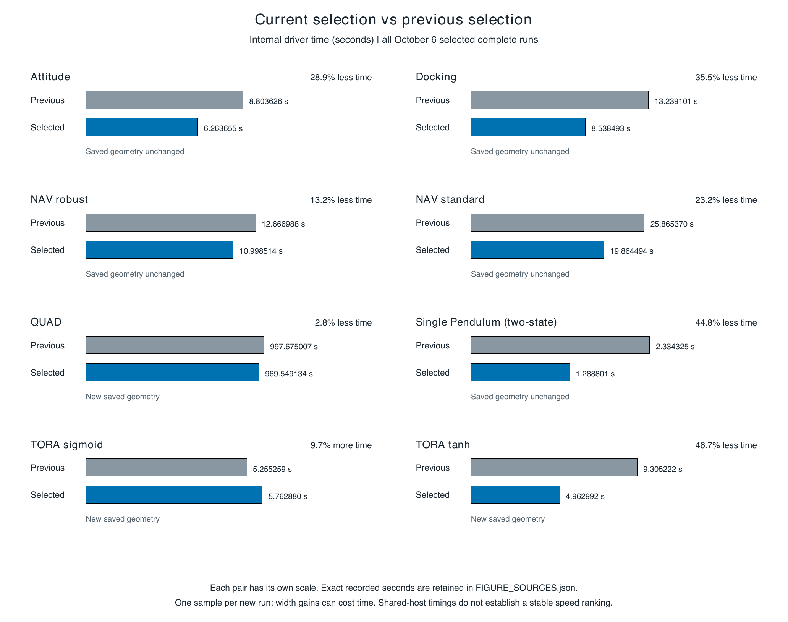
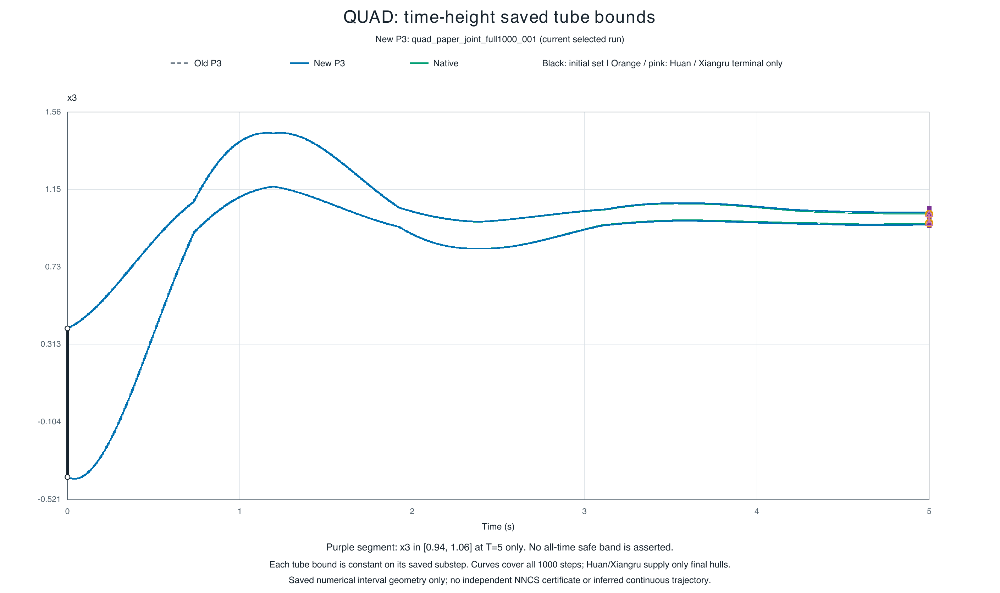
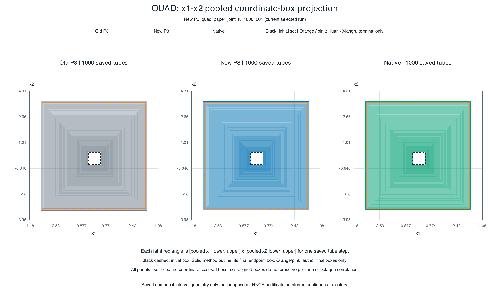
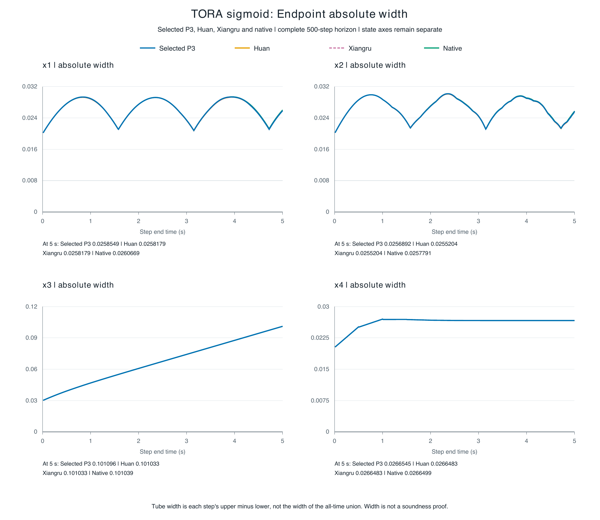
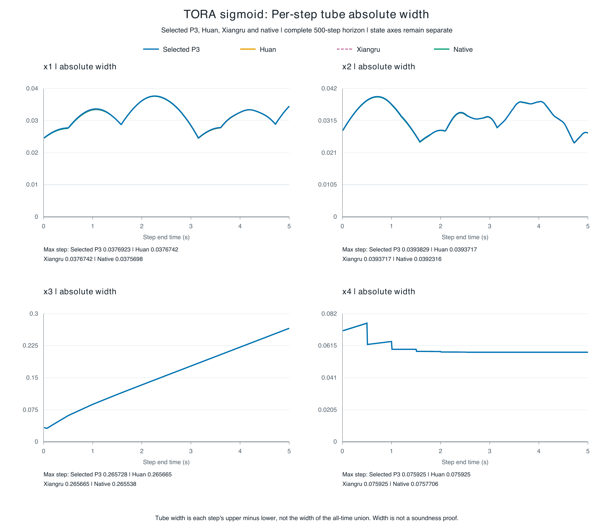
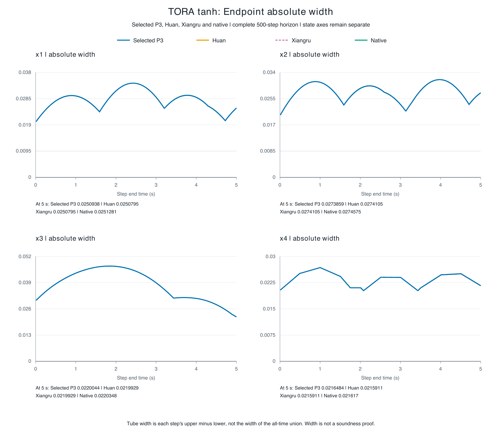
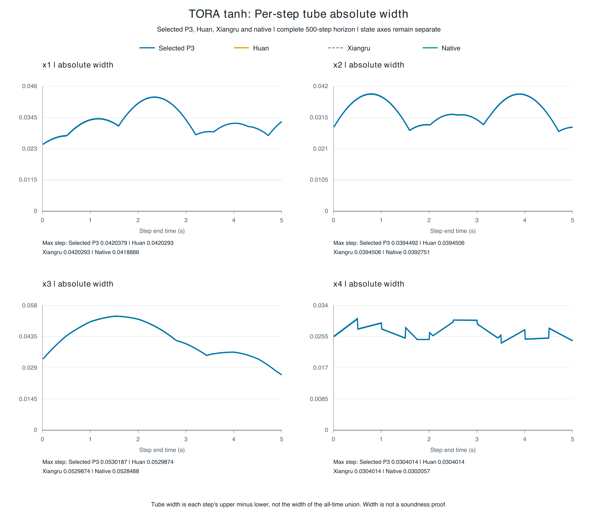

# ARCH COMP26 速度优化与逐状态宽度比较报告

2026 年 10 月 6 日北京时间更新　16 个 benchmark × 4 种方法　保存的完整时间和范围证据

本轮先减少重复计算，再测试区间收紧，已有多个完整实例的单次求解时间下降。QUAD 的联合方案在同一次完整 1024 盒 × 1000 步运行中，把 process 从 1004.197 秒降到 978.067 秒（少 2.60%），高度 x3 终点宽度缩小 2.54%，x11 缩小 4.76%；x9 仍有 8 条极小变宽，不能称全程处处改善。TORA 进一步收紧的收益较小，且比只提速的方案略慢。QUAD 仍未达到 Huan / Xiangru 的完整进程速度或高度终点紧度。

当前报告按实际采用的结果更新全部时间、逐状态 endpoint / tube 宽度、每个未完成方法的停点和原因。当前矩阵仍为 38 个项目内数值完整、8 个同合同历史完整、14 个无完整数值时域、4 个 Airplane discrete 合同阻塞，共 64 格。新候选改进已有格，不增加覆盖数；旧实验、旧资格检查器和原始 RESULT 未重跑或改写。图形仍全部由 Python 生成。

时间单位为秒，宽度为保存上界减下界，按物理状态原单位列出。宽度显示八位有效数字，完整可读 binary64、上下界、逐步范围和原始路径在 CSV / JSON。不同量纲不合成紧度总分。“—”是缺失或不适用，不表示零。数值完成、保存的性质观察、集合包含和独立端到端 NNCS 浮点证书分开报告。

表中 P3 是我方实现族的沿用列名，不代表所有实例阶数和注入路径相同。具名两态 Single Pendulum 保留 order2 / point1 / validation3、native-f64 和原参考注入，仅使用其已安装的严格 endpoint；其他 P3 合同按各自保存配置说明。

## 本轮完整候选的速度与紧度取舍

所选方案与上一版采用方案的内部 driver 计时见下表；每个新方案仅一次实际运行。旧分支的最快中位数使用不同合同、保留阶数或输出工作量，不能直接移入此表。共享服务器和不同时间的单次测量不能证明稳定加速比。

| 实例 | driver 上一版 → 本轮 | 单次时间下降 | 本轮 process | 宽度依据 |
| --- | --- | --- | --- | --- |
| Attitude Control avoid | 8.804 → 6.264 | 28.85% | 10.447 | 比较输出相同 |
| TORA reach-tanh | 9.305 → 4.963 | 46.66% | 9.242 | 新保存范围 |
| Docking constraint | 13.239 → 8.538 | 35.51% | 12.700 | 比较输出相同 |
| Single Pendulum reach | 2.334 → 1.289 | 44.79% | 5.180 | 比较输出相同 |
| NAV robust | 12.667 → 10.999 | 13.17% | 14.961 | 比较输出相同 |
| NAV standard | 25.865 → 19.864 | 23.20% | 24.031 | 比较输出相同 |
| TORA reach-sigmoid | 5.255 → 5.763 | -9.66% | 9.995 | 新保存范围 |
| QUAD reach | 997.675 → 969.549 | 2.82% | 978.067 | 新保存范围 |

TORA tanh 的速度优先版 process / driver 为 8.791 / 4.563 秒；收紧版为 9.242 / 4.963 秒。收紧版四态 500 步 endpoint 和 tube 的 4,000 项宽度均不增加，终点四态仅缩小约 0.023%–0.048%；部分终点区间位置变化，因此更窄不等于都被旧区间包含。

TORA sigmoid 的上一版速度优先结果为 9.392 / 5.255 秒。仅把 cutoff 从 1e-6 改到 1e-8 的完整结果为 9.995 / 5.763 秒，x1 / x2 终点缩小约 0.86% / 0.91%，全 4,000 项保存宽度均不增加且各区间包含于旧区间。高阶候选及其早期变宽项另列于附录，不能凭最后两态的改善声称全程更紧。

## 全部 benchmark 的完整进程时间

仅对覆盖具名全时域的方法填写明确保存的 process wall；历史复用注明“历史”。失败或短前缀耗时列入分节和完整时间索引，不参加全程速度比较。外层进程、wrapper、payload、driver 内部和 driver 调用分别计时，不互相代填。

| 实例 | P3 | Huan | Xiangru | 原生 |
| --- | --- | --- | --- | --- |
| ACC safe-distance | 8.037 | 8.237 | 7.987 | 7.787 |
| Airplane continuous | 未全程 | 未全程 | 未全程 | 未全程 |
| Airplane discrete | 合同缺失 | 合同缺失 | 合同缺失 | 合同缺失 |
| Attitude Control avoid | 10.447 | 6.884 | 6.884 | 6.182 |
| Balancing reach | 未全程 | 未全程 | 未全程 | 未全程 |
| Docking constraint | 12.700 | 12.699 | 12.668 | 9.139 |
| Double Pendulum less-robust | 74.274 | 9.539 | 8.388 | 1107.127 |
| Double Pendulum more-robust | 未全程 | 未全程 | 未全程 | 未全程 |
| NAV standard | 24.031 | — | — | 1478.866 |
| NAV robust | 14.961 | — | — | 68.094 历史 |
| QUAD reach | 978.067 | 94.583 | 108.018 | 47058.887 |
| Single Pendulum reach | 5.180 | 5.381 | 5.581 | 4.729 |
| TORA remain | 10.411 | 未全程 | 未全程 | 8.339 |
| TORA reach-sigmoid | 9.995 | 13.653 | 13.707 | 8.943 |
| TORA reach-tanh | 9.242 | — | — | 8.856 历史 |
| Unicycle reach | 11.698 | 9.594 | 9.895 | 10.397 |

NAV 与 TORA tanh 部分历史作者记录没有外层 process，只有 driver call 或内部 elapsed，故主表保留空缺。NAV standard 新方案 process 24.031 秒不能直接对比作者约 13 秒的内部计时；相同层级的完整数据在分节展开。

### 既有重复进程计时

下面是冻结 campaign 后五个独立进程的中位数 [最小值, 最大值]，每格 n=5，不包含首进程，也不混入本轮单次优化。新旧 campaign 不互相替代。

| 冻结 campaign | P3 | Huan | Xiangru | 原生 |
| --- | --- | --- | --- | --- |
| ACC safe-distance | 8.741 [8.638, 8.841] | 8.237 [8.138, 8.338] | 7.988 [7.938, 8.087] | 7.736 [7.637, 7.787] |
| Attitude Control avoid | 12.952 [12.851, 13.154] | 6.835 [6.834, 7.036] | 6.885 [6.783, 6.987] | 6.181 [5.983, 6.182] |
| Single Pendulum reach | 6.184 [6.134, 6.484] | 5.381 [5.281, 5.681] | 5.481 [5.381, 5.581] | 4.729 [4.729, 4.729] |
| TORA reach-sigmoid | 13.905 [13.757, 14.055] | 13.653 [13.507, 13.758] | 13.607 [13.507, 13.707] | 8.943 [8.942, 8.993] |

### 学到和采用的实现变化

旧 codex/progress-report-20260923 分支中的 engine_linear_leaf_v2 路径已经在现有引擎中，并没有丢失。它当时较快的结果包含不同控制定义、非同等级注入或不保存逐步几何的配置；不能取消现有严格路径和绘图输出来复现那个数字。上一版恢复了私有输出、Horner 绑定和按盒数分块，本轮把原来两轮加权映射放在同一 CUDA 图内，并保留完整条件检查、失败回退和首个真实输入的原实现直接比对。

分块不是越小越快。NAV robust 25 盒用 32 行融合图有收益；NAV standard 640 盒用 256 行分块变慢，512 行融合图才把内部时间降到 19.864 秒。QUAD 1024 盒的融合版没有胜过已选 256 行路径；相同输入 sin/cos 幂复用的全程结果为 process 975.862 / driver 968.516 秒，相比上一版 1004.197 / 997.675 秒分别少 2.82% / 2.92%。1000 条 pooled 观察直接相同。新 GPU 小门的 0.938 秒计入外层，不在 driver 内。最终主选把这个复用与控制余项收紧组合，process / driver 为 978.067 / 969.549 秒，分别比上一版少 2.60% / 2.82%；相比纯提速版付出约 2.205 秒 process，换取自身记录的终点收紧。新联合 GPU 小门为 0.934 秒，仍计在外层。

Huan / Xiangru 的 QUAD 使用 work / point / validation 阶 2/1/1 与 parity 路径，P3 原选方案为 3/2/4 且保存严格区间误差账本；双方工作量并不相同。本轮借鉴其减少重复工作和更高阶 TORA 配置，但没有移除严格验证。K=20 是每 20 步重算完整保留历史，不是截掉 20 步以前的历史。未做匹配消融，不能给这些差异编造因果百分比。

控制余项收紧借鉴作者的 hybrid / 双斜率仿射包络思路，同时保留我方原控制多项式与严格注入：把额外包络换算成相对于这个固定多项式的余项约束，再求交。QUAD 全程实际需要 50 次原 NN 调用加 50 次额外调用；原计数器的 50 不能冒充总数。附加浮点 CROWN 包络仍是条件性输入，不因此获得独立端到端证书。

## 宽度比较口径

每步先对相同方法的全部有效初盒取坐标并集，endpoint 是传播终点，tube 是整个小步。正文先列四方共同有效终点的宽度，再列截至该时刻每个单步 tube 宽度的最大值；后者不是全时间并集的宽度。辅助时钟、保持控制及常值扰动不加入物理态评分，原记录保留。只有实际保存过相关方向或逐盒数据才可分析该几何；pooled 坐标盒不能恢复相关八方向包络。

提前停止的共同数值时刻与安全观察时刻不同：Balancing raw4 为 0.415 秒；DP more 数值 0.32 秒、安全 0.30 秒；TORA remain h=0.1 数值 18.9 秒、安全 18.4 秒。各法自身最后完整初集范围另列，不能用不同时刻的宽度排名。QUAD 作者两法只存终点，全时 tube 缺失。

新数值参数的 TORA 宽度从它们自己的 ranges.bin 重算，QUAD 联合方案从自身逐步观察重算；仅在完整保存输出直接比较相同的实现候选上沿用原范围。时间来源与几何来源分别注明，不伪装为同一原始运行。逐态绝对差、相对差和终点包含关系见配套 pairwise_comparisons.csv。

## 1 ACC safe-distance

具名 participant-order profile 使用固定 2026 ONNX、单个完整初盒、50 个 0.1 秒控制期到 T=5。参与者源码的相对速度取 v_lead−v_ego；全时检查 x_lead−x_ego−1.4v_ego−10≥0。[合同审计](ARCHCOMP26_ACC_PARTICIPANT_CONTRACT_20261001.md)记录论文未定义该符号的差异。

### 数值范围与未完成原因

| 方法 | 数值状态 | 全初集步数 | 数值前缀 t | 保存安全前缀 t |
| --- | --- | --- | --- | --- |
| P3 | 完整 | 50 / 50 | 5 | 5 |
| Huan | 完整 | 50 / 50 | 5 | 5 |
| Xiangru | 完整 | 50 / 50 | 5 | 5 |
| 原生 Flow* | 完整 | 50 / 50 | 5 | 5 |

**P3 / Huan / Xiangru / 原生 Flow*：** 四方均能完成具名 participant-order 合同。保存 tube 的安全距离半空间下界均为正；这不是数值失败。论文未明确相对速度符号，当前按参与者源码使用 v_lead-v_ego。 若要求独立安全定理，仍需 NN 浮点包络、控制注入及 plant 运算的完整包含证明；已有保存盒检查不是该证明。

保存性质观察（P3 / Huan / Xiangru / 原生 Flow*）：全部 50 段保存 tube 满足安全半空间；完整 T=5。

原始结果：[P3](../research/p3_speed_tightness_20261005/results/acc_p3_fast1_20261005_001/run_001/RESULT.json)；[Huan](evidence/results/archcomp26_20261001/acc_fourway_campaign_001/steady05_huan/RESULT.json)；[Xiangru](evidence/results/archcomp26_20261001/acc_fourway_campaign_001/steady05_xiangru/RESULT.json)；[原生 Flow*](evidence/results/archcomp26_20261001/acc_fourway_campaign_001/steady05_native/RESULT.json)。

### 所选进程各层时间

下表为各方法所选单次；未全程方法的数值只是这次失败或早停的耗时，不能参与完整运行速度比较。缺失表示该层没有独立保存，不能从另一层代填。

| 计时层级 | P3 | Huan | Xiangru | 原生 |
| --- | --- | --- | --- | --- |
| 外层 process | 8.037 | 8.237 | 7.987 | 7.787 |
| 候选 wrapper | 7.221 | — | — | — |
| runner payload | 5.691 | 7.357 | 7.220 | — |
| 内部 driver | 3.982 | 4.016 | 4.041 | — |

保存资源：P3 CPU=10-13，GPU=2；Huan CPU=10-13，GPU=2；Xiangru CPU=10-13，GPU=2；原生 Flow* CPU=10-13，GPU=2。进程起止、同批并发窗口、字段路径详见时间索引。

### 全部物理状态宽度

四方共同数值终点 t=5 秒。若某一状态没有此共同终点，保持空白。

**共同终点 endpoint 绝对宽度**

| 状态 | P3 | Huan | Xiangru | 原生 |
| --- | --- | --- | --- | --- |
| x_lead | 20.997866 | 21.012041 | 21.012041 | 21.012051 |
| v_lead | 0.19848302 | 0.20175389 | 0.20175389 | 0.20175843 |
| a_lead | 0.00069872948 | 0.00074107635 | 0.00074107635 | 0.00074254443 |
| x_ego | 5.1630692 | 5.4979758 | 5.4979758 | 5.4979988 |
| v_ego | 1.8580463 | 2.0155107 | 2.0155107 | 2.0155283 |
| a_ego | 1.0968974 | 1.1811062 | 1.1811062 | 1.1811239 |

**截至共同数值时刻的最大单步 tube 绝对宽度**

| 状态 | P3 | Huan | Xiangru | 原生 |
| --- | --- | --- | --- | --- |
| x_lead | 23.331402 | 23.336823 | 23.336823 | 23.316537 |
| v_lead | 0.40288679 | 0.40608808 | 0.40608808 | 0.40604353 |
| a_lead | 0.45435947 | 0.45489481 | 0.45489481 | 0.41105639 |
| x_ego | 7.9907966 | 8.3251678 | 8.3251678 | 8.2228612 |
| v_ego | 1.910744 | 2.068506 | 2.068506 | 2.0202815 |
| a_ego | 1.1092374 | 1.1934503 | 1.1934503 | 1.1811991 |

共同终点 P3 对 Huan：较窄 x_lead, v_lead, a_lead, x_ego, v_ego, a_ego；逐态差值见配套 CSV。该比较不外推到其他时刻或未保存相关方向。

共同终点 P3 对 Xiangru：较窄 x_lead, v_lead, a_lead, x_ego, v_ego, a_ego；逐态差值见配套 CSV。该比较不外推到其他时刻或未保存相关方向。

共同终点 P3 对 原生 Flow*：较窄 x_lead, v_lead, a_lead, x_ego, v_ego, a_ego；逐态差值见配套 CSV。该比较不外推到其他时刻或未保存相关方向。

宽度来源编号：S033, S035, S037, S039；[来源路径与大小](evidence/results/archcomp26_report_20261006/widths/sources.json)、[上下界和全部逐步宽度](evidence/results/archcomp26_report_20261006/widths/widths_long.csv)、[缺失逐格说明](evidence/results/archcomp26_report_20261006/widths/missing_fields.csv)。

## 2 Airplane continuous

官方完整初集是一个未分割 12 物理态盒，六个速度/姿态分量各为 [0,1]，固定 12→6 控制器；连续方程与 0.1 秒采样到 T=2，全时要求 sy、phi、theta、psi∈[-1,1]。[来源审计](ARCHCOMP26_AIRPLANE_2026_ENTRY_AUDIT.md)将它与历史单点区分。

### 数值范围与未完成原因

| 方法 | 数值状态 | 全初集步数 | 数值前缀 t | 保存安全前缀 t |
| --- | --- | --- | --- | --- |
| P3 | 无全程 | 0 / 200 | 0 | — |
| Huan | 无全程 | 0 / 200 | 0 | — |
| Xiangru | 无全程 | 0 / 200 | 0 | — |
| 原生 Flow* | 无全程 | 0 / 200 | 0 | — |

**P3：** P4 验证表在首步前因 9^20 >= 2^63 编码溢出；同阶 P3 的首步 trace 为 x/y/z Picard 提议越出 ±0.01，四次重心化仍 FAILED_CONTRACTION。另扩大 xyz 余项到 ±0.1 后引擎接受，但五坐标 endpoint 超出 tube 1–2 ULP，observer 拒绝，0 个可用保存段。 需要能在完整初集覆盖上通过数值自包含与观察器一致性的明确方法；之后才可推进到 T=2 并逐段判性质。不能把分盒首步或无效候选界补成全程。

**Huan：** order6 建表资源阻断，RSS超过54,006,540 KiB后终止，未进ODE；order3全盒首步 accepted=false、0/10接受。后一拒绝未记录内部失败坐标，不能猜成控制器错误或真实越界。 需要能在完整初集覆盖上通过数值自包含与观察器一致性的明确方法；之后才可推进到 T=2 并逐段判性质。不能把分盒首步或无效候选界补成全程。

**Xiangru：** order3全盒首个 h=0.01 小步 accepted=false，0/10接受；内部失败分量未保存，不能猜成物理性质失败。Huan order6资源记录不能冒称为Xiangru实测。 需要能在完整初集覆盖上通过数值自包含与观察器一致性的明确方法；之后才可推进到 T=2 并逐段判性质。不能把分盒首步或无效候选界补成全程。

**原生 Flow*：** order6±0.01、order3±0.01、order3±1 三个全盒 profile 首步均 UNCOMPLETED_SAFE、0段。后续 Real 首拒追踪分别定位 x/y/z/phi/theta 或加宽后的 x/y/phi/theta/psi Picard 不自包含。空 safety 表上的 BOX_SAFE 1 是空集结论。 需要能在完整初集覆盖上通过数值自包含与观察器一致性的明确方法；之后才可推进到 T=2 并逐段判性质。不能把分盒首步或无效候选界补成全程。

保存性质观察（P3 / Huan / Xiangru / 原生 Flow*）：主全盒无有效接受段，性质未判定；数值拒绝不是真实轨迹反例。

原始结果：[P3](evidence/results/archcomp26_20261001/airplane_p3_xyz_rem0p1_observer_smoke1_001/RESULT.json)；[Huan](evidence/results/archcomp26_20261001/airplane_continuous_order3_huan_smoke1_001/RESULT.json)；[Xiangru](evidence/results/archcomp26_20261001/airplane_continuous_order3_xiangru_smoke1_001/RESULT.json)；[原生 Flow*](evidence/results/archcomp26_20261001/native_airplane_rem1_first_reject_trace_20261002_006/run/RESULT.json)。

### 所选进程各层时间

下表为各方法所选单次；未全程方法的数值只是这次失败或早停的耗时，不能参与完整运行速度比较。缺失表示该层没有独立保存，不能从另一层代填。

| 计时层级 | P3 | Huan | Xiangru | 原生 |
| --- | --- | --- | --- | --- |
| 外层 process | 11.651 | 6.785 | 6.985 | 3.626 |
| runner payload | 10.647 | 5.984 | 6.116 | — |

保存资源：P3 CPU=14-17，GPU=3；Huan CPU=10-13，GPU=2；Xiangru CPU=10-13，GPU=2；原生 Flow* CPU=10-13，GPU=2。进程起止、同批并发窗口、字段路径详见时间索引。

### 全部物理状态宽度

主合同不存在四方共同有效数值终点，以下空栏标明数据缺失，不借用其他合同或分盒短诊断。

全部 12 个状态 sx, sy, sz, vx, vy, vz, phi, theta, psi, r, p, q：四方法均无主合同有效 endpoint / tube 宽度，不能填终点或全时数值。逐状态缺失格仍全部列在 summary.csv 和 missing_fields.csv。

64 个二分子盒各完成首个 0.01 秒 plant 步，其中 8 盒保存安全、56 盒 Unknown；高角子盒随后只完成 4/10 小步到 0.04 秒，第 5 步 x/y 自包含失败。这是另列数值诊断，不填主合同的 T=2 格，也不是实际不安全轨迹。

宽度来源编号：无有效主合同范围；[来源路径与大小](evidence/results/archcomp26_report_20261006/widths/sources.json)、[上下界和全部逐步宽度](evidence/results/archcomp26_report_20261006/widths/widths_long.csv)、[缺失逐格说明](evidence/results/archcomp26_report_20261006/widths/missing_fields.csv)。

## 3 Airplane discrete

[2026 报告](https://easychair.org/publications/paper/GsKW/download)给出一般 forward Euler 规则、Airplane 的 Δt=0.1 秒与 20 次转移，在 k=0…20 检查 sy、phi、theta、psi∈[-1,1]。2026-10-03 复核的[固定官方 Airplane 目录](https://github.com/Kiguli/ARCH-COMP2026/tree/d55dcc39f6496720adbf8ffdb7ff8c6e04bb8f26/benchmarks/Airplane)只有控制器、连续 `dynamics.m` 与规格，没有离散执行程序；论文也未写参与者实际的 NN 取样及控制更新先后。初盒、网络和逐源检索见[离散执行门](ARCHCOMP26_AIRPLANE_DISCRETE_EXECUTION_GATE_20261002.md)。门内“旧状态先求 NN、同步更新 12 态”只是具名新比较约定，尚非参与者离散提交的权威顺序。

### 数值范围与未完成原因

| 方法 | 数值状态 | 全初集步数 | 数值前缀 t | 保存安全前缀 t |
| --- | --- | --- | --- | --- |
| P3 | 合同缺失 | — / 20 | — | — |
| Huan | 合同缺失 | — / 20 | — | — |
| Xiangru | 合同缺失 | — / 20 | — | — |
| 原生 Flow* | 合同缺失 | — / 20 | — | — |

**P3 / Huan / Xiangru / 原生 Flow*：** 四方法均因执行合同材料不足而未在权威离散合同下运行，非算法已经失败。论文给 Euler 规则、0.1 秒和 20 次转移，但固定官方目录只有连续 dynamics.m，缺参与者实际 NN 采样与状态更新顺序。 取得参与者离散转移及控制更新源码/等价权威执行记录，再建立四个离散入口并覆盖完整初盒 k=0…20；或用户明确另立 paper-Euler-controller-first 补充合同。

保存性质观察（P3 / Huan / Xiangru / 原生 Flow*）：无四方离散性质结果；独立 CPU 的 1/20 安全端点诊断不能填四方法格。

原始结果：P3未启动；Huan未启动；Xiangru未启动；原生 Flow*未启动。

### 所选进程各层时间

下表为各方法所选单次；未全程方法的数值只是这次失败或早停的耗时，不能参与完整运行速度比较。缺失表示该层没有独立保存，不能从另一层代填。

四方法均未在权威离散合同下启动，因此没有运行耗时或资源记录；另立的 CPU 诊断不填方法格。

### 全部物理状态宽度

主合同不存在四方共同有效数值终点，以下空栏标明数据缺失，不借用其他合同或分盒短诊断。

全部 12 个状态 sx, sy, sz, vx, vy, vz, phi, theta, psi, r, p, q：四方法均无主合同有效 endpoint / tube 宽度，不能填终点或全时数值。逐状态缺失格仍全部列在 summary.csv 和 missing_fields.csv。

宽度来源编号：无有效主合同范围；[来源路径与大小](evidence/results/archcomp26_report_20261006/widths/sources.json)、[上下界和全部逐步宽度](evidence/results/archcomp26_report_20261006/widths/widths_long.csv)、[缺失逐格说明](evidence/results/archcomp26_report_20261006/widths/missing_fields.csv)。

## 4 Attitude Control avoid

固定六态完整初盒、30 个 0.1 秒周期到 T=3；避免官方六维闭危险盒，其 x4 范围为 [-0.7,-0.6]。[合同审计](ARCHCOMP26_ATTITUDE_CONTROL_CONTRACT_20261001.md)记录历史 checker 把它误写成空集，旧 VERIFIED 不用于新性质。

### 数值范围与未完成原因

| 方法 | 数值状态 | 全初集步数 | 数值前缀 t | 保存安全前缀 t |
| --- | --- | --- | --- | --- |
| P3 | 完整 | 60 / 60 | 3 | 3 |
| Huan | 完整 | 60 / 60 | 3 | 3 |
| Xiangru | 完整 | 60 / 60 | 3 | 3 |
| 原生 Flow* | 完整 | 60 / 60 | 3 | 3 |

**P3 / Huan / Xiangru / 原生 Flow*：** 四方均能完成修正危险盒后的数值合同，六维保存 tube 与闭危险盒不相交。旧 checker 把 x4 危险区间写成空集，其旧 VERIFIED 不作为本轮证据。 已有六维保存盒判交可支持数值描述；独立 NNCS 证明仍须补浮点 NN、注入和 plant 包含链。单轴危险投影图不能代替六维判交。

保存性质观察（P3 / Huan / Xiangru / 原生 Flow*）：全部 60 段六维保存 tube 避开修正后的闭危险盒。

原始结果：[P3](../research/p3_speed_tightness_20261006/results/attitude_fused1_full60_001/RESULT.json)；[Huan](evidence/results/archcomp26_20261001/attitude_corrected_fourway_campaign_20261002_001/later05_huan/RESULT.json)；[Xiangru](evidence/results/archcomp26_20261001/attitude_corrected_fourway_campaign_20261002_001/later05_xiangru/RESULT.json)；[原生 Flow*](evidence/results/archcomp26_20261001/attitude_corrected_fourway_campaign_20261002_001/later05_native/RESULT.json)。

当前 P3 使用 [attitude_fused1_full60_001](../research/p3_speed_tightness_20261006/results/attitude_fused1_full60_001/RESULT.json)；宽度来自原保存参考，候选对完整保存对象有直接比较收据。

### 所选进程各层时间

下表为各方法所选单次；未全程方法的数值只是这次失败或早停的耗时，不能参与完整运行速度比较。缺失表示该层没有独立保存，不能从另一层代填。

| 计时层级 | P3 | Huan | Xiangru | 原生 |
| --- | --- | --- | --- | --- |
| 外层 process | 10.447 | 6.884 | 6.884 | 6.182 |
| 候选 wrapper | 9.643 | — | — | — |
| runner payload | 8.043 | 4.601 | 4.609 | — |
| 内部 driver | 6.264 | 2.826 | 2.829 | — |

保存资源：P3 CPU=[10, 11, 12, 13]，GPU=2；Huan CPU=10-13，GPU=2；Xiangru CPU=10-13，GPU=2；原生 Flow* CPU=10-13，GPU=2。进程起止、同批并发窗口、字段路径详见时间索引。

### 全部物理状态宽度

四方共同数值终点 t=3 秒。若某一状态没有此共同终点，保持空白。

**共同终点 endpoint 绝对宽度**

| 状态 | P3 | Huan | Xiangru | 原生 |
| --- | --- | --- | --- | --- |
| x1 | 0.0040788908 | 0.004174214 | 0.004174214 | 0.0041941345 |
| x2 | 0.0058003086 | 0.0059356588 | 0.0059356588 | 0.0059801537 |
| x3 | 0.0059925623 | 0.0061729133 | 0.0061729133 | 0.0061939769 |
| x4 | 0.031363064 | 0.032070326 | 0.032070326 | 0.032292131 |
| x5 | 0.017096771 | 0.017361516 | 0.017361516 | 0.017635943 |
| x6 | 0.018023016 | 0.018479364 | 0.018479364 | 0.018637404 |

**截至共同数值时刻的最大单步 tube 绝对宽度**

| 状态 | P3 | Huan | Xiangru | 原生 |
| --- | --- | --- | --- | --- |
| x1 | 0.04440757 | 0.044415065 | 0.044415065 | 0.043826029 |
| x2 | 0.048553713 | 0.04856765 | 0.04856765 | 0.046649174 |
| x3 | 0.031515365 | 0.031672694 | 0.031672694 | 0.030807531 |
| x4 | 0.034766246 | 0.034896547 | 0.034896547 | 0.033456038 |
| x5 | 0.033040735 | 0.033753544 | 0.033753544 | 0.033164941 |
| x6 | 0.040750882 | 0.041435257 | 0.041435257 | 0.040010416 |

共同终点 P3 对 Huan：较窄 x1, x2, x3, x4, x5, x6；逐态差值见配套 CSV。该比较不外推到其他时刻或未保存相关方向。

共同终点 P3 对 Xiangru：较窄 x1, x2, x3, x4, x5, x6；逐态差值见配套 CSV。该比较不外推到其他时刻或未保存相关方向。

共同终点 P3 对 原生 Flow*：较窄 x1, x2, x3, x4, x5, x6；逐态差值见配套 CSV。该比较不外推到其他时刻或未保存相关方向。

宽度来源编号：S001, S002, S003, S004；[来源路径与大小](evidence/results/archcomp26_report_20261006/widths/sources.json)、[上下界和全部逐步宽度](evidence/results/archcomp26_report_20261006/widths/widths_long.csv)、[缺失逐格说明](evidence/results/archcomp26_report_20261006/widths/missing_fields.csv)。

## 5 Balancing reach

论文五特征控制器缺对应模型或权威五到四映射；另名 fixed-repo-raw4 profile 使用官方仓库四原态网络、完整四态初盒、500 个 0.02 秒周期到 T=10，在固定规格 8<t≤10 检查 x1、x3、x4∈[-0.001,0.001]。[执行门](ARCHCOMP26_BALANCING_EXECUTION_GATE_20261002.md)另列论文闭窗 [8,10]。

### 数值范围与未完成原因

| 方法 | 数值状态 | 全初集步数 | 数值前缀 t | 保存安全前缀 t |
| --- | --- | --- | --- | --- |
| P3 | 无全程 | 86 / 2000 | 0.43 | — |
| Huan | 无全程 | 98 / 2000 | 0.49 | — |
| Xiangru | 无全程 | 98 / 2000 | 0.49 | — |
| 原生 Flow* | 无全程 | 83 / 2000 | 0.415 | — |

**P3：** raw4 第 87 小步数值拒绝；仅 86/2000 个有效小步，未到8秒性质窗；不是性质反例。论文 feature5 模型/权威映射另缺。 论文合同需五输入模型及尺度/顺序，或权威五特征到四输入映射。raw4 需明确的新数值方案通过拒绝并覆盖 T=10；不得把旧小初盒 T=1 或拒绝前缀代填。

**Huan / Xiangru：** raw4 第 99 小步数值拒绝；仅 98/2000 个有效小步，未到8秒性质窗；不是性质反例。论文 feature5 模型/权威映射另缺。 论文合同需五输入模型及尺度/顺序，或权威五特征到四输入映射。raw4 需明确的新数值方案通过拒绝并覆盖 T=10；不得把旧小初盒 T=1 或拒绝前缀代填。

**原生 Flow*：** raw4 第 84 小步数值拒绝；仅 83/2000 个有效小步，未到8秒性质窗；不是性质反例。论文 feature5 模型/权威映射另缺。 原生此前解析失败已修正；这里报告修正入口的数值首拒，不继续把旧语法错误当当前阻断。 论文合同需五输入模型及尺度/顺序，或权威五特征到四输入映射。raw4 需明确的新数值方案通过拒绝并覆盖 T=10；不得把旧小初盒 T=1 或拒绝前缀代填。

保存性质观察（P3 / Huan / Xiangru / 原生 Flow*）：性质窗尚未到达，0/400 个目标窗小步检查；UNKNOWN/incomplete。

原始结果：[P3](evidence/results/archcomp26_20261001/balancing_fixed_raw4_p3_full500_001/RESULT.json)；[Huan](evidence/results/archcomp26_20261001/balancing_fixed_raw4_huan/balancing_fixed_raw4_huan_full500_001/RESULT.json)；[Xiangru](evidence/results/archcomp26_20261001/balancing_fixed_raw4_xiangru_20261002/balancing_fixed_raw4_xiangru_full500_001/RESULT.json)；[原生 Flow*](evidence/results/archcomp26_20261001/native_balancing_raw4_20261002/native_balancing_raw4_full500_001/RESULT.json)。

### 所选进程各层时间

下表为各方法所选单次；未全程方法的数值只是这次失败或早停的耗时，不能参与完整运行速度比较。缺失表示该层没有独立保存，不能从另一层代填。

| 计时层级 | P3 | Huan | Xiangru | 原生 |
| --- | --- | --- | --- | --- |
| 外层 process | 13.807 | — | — | 5.732 |
| runner payload | 12.875 | 8.218 | 7.735 | — |
| 内部 driver | 9.638 | 4.189 | 3.894 | — |

保存资源：P3 CPU=14-17，GPU=3；Huan CPU=[10, 11, 12, 13]，GPU=2；Xiangru CPU=[24, 25, 26, 27]，GPU=1；原生 Flow* CPU=24-27，GPU=1。进程起止、同批并发窗口、字段路径详见时间索引。

### 全部物理状态宽度

四方共同数值终点 t=0.415 秒。若某一状态没有此共同终点，保持空白。

**共同终点 endpoint 绝对宽度**

| 状态 | P3 | Huan | Xiangru | 原生 |
| --- | --- | --- | --- | --- |
| x1 | 0.67617278 | 0.67554765 | 0.67554765 | 0.67971294 |
| x2 | 2.1826994 | 2.179091 | 2.179091 | 2.2047091 |
| x3 | 2.1255595 | 2.1176584 | 2.1176584 | 2.1845433 |
| x4 | 14.633784 | 14.555957 | 14.555957 | 16.092615 |

**截至共同数值时刻的最大单步 tube 绝对宽度**

| 状态 | P3 | Huan | Xiangru | 原生 |
| --- | --- | --- | --- | --- |
| x1 | 0.67621605 | 0.67559085 | 0.67559085 | 0.67971294 |
| x2 | 2.1828002 | 2.1791915 | 2.1791915 | 2.2047091 |
| x3 | 2.1258402 | 2.1179399 | 2.1179399 | 2.1845433 |
| x4 | 14.635335 | 14.557512 | 14.557512 | 16.092615 |

共同终点 P3 对 Huan：较宽 x1, x2, x3, x4；逐态差值见配套 CSV。该比较不外推到其他时刻或未保存相关方向。

共同终点 P3 对 Xiangru：较宽 x1, x2, x3, x4；逐态差值见配套 CSV。该比较不外推到其他时刻或未保存相关方向。

共同终点 P3 对 原生 Flow*：较窄 x1, x2, x3, x4；逐态差值见配套 CSV。该比较不外推到其他时刻或未保存相关方向。

**各法自身最后完整初集终点宽度**（时刻不同，仅记录，不横向排名）

| 状态 | P3 | Huan | Xiangru | 原生 |
| --- | --- | --- | --- | --- |
| x1 | 0.70933799 @0.43 | 0.85405257 @0.49 | 0.85405257 @0.49 | 0.67971294 @0.415 |
| x2 | 2.2667273 @0.43 | 2.614629 @0.49 | 2.614629 @0.49 | 2.2047091 @0.415 |
| x3 | 2.356281 @0.43 | 3.5934836 @0.49 | 3.5934836 @0.49 | 2.1845433 @0.415 |
| x4 | 16.346639 @0.43 | 26.704665 @0.49 | 26.704665 @0.49 | 16.092615 @0.415 |

宽度来源编号：S009, S010, S011, S012；[来源路径与大小](evidence/results/archcomp26_report_20261006/widths/sources.json)、[上下界和全部逐步宽度](evidence/results/archcomp26_report_20261006/widths/widths_long.csv)、[缺失逐格说明](evidence/results/archcomp26_report_20261006/widths/missing_fields.csv)。

## 6 Docking constraint

四态 (sx,sy,vx,vy)，完整初盒 [70,106]²×[-0.28,0.28]²，固定四输入两力输出，每秒更新到 T=40；全时要求 q=√(vx²+vy²)−0.2−0.002054√(sx²+sy²)≤0。[来源合同](ARCHCOMP26_DOCKING_BALANCING_SOURCE_CONTRACT_20261001.md)解释图内预/后处理。

### 数值范围与未完成原因

| 方法 | 数值状态 | 全初集步数 | 数值前缀 t | 保存安全前缀 t |
| --- | --- | --- | --- | --- |
| P3 | 完整 | 400 / 400 | 40 | — |
| Huan | 完整 | 400 / 400 | 40 | — |
| Xiangru | 完整 | 400 / 400 | 40 | — |
| 原生 Flow* | 完整 | 400 / 400 | 40 | — |

**P3 / Huan / Xiangru / 原生 Flow*：** 四方数值时域均完成，未解决的是性质：轴对齐 tube 对 q 的保守上界从首段就跨过 0，因此不能判全时 q<=0。原生外层 failed/exit2 对应 UNKNOWN，不能据此删除其完整 400 段。 需要更强的相关性/耦合性质判定、明示合法精化或可信反例来解决 UNKNOWN；不能由 q 上界为正断言真实轨迹违规。

保存性质观察（P3 / Huan / Xiangru / 原生 Flow*）：完整 T=40 数值流管；四方法性质 UNKNOWN。

原始结果：[P3](../research/p3_speed_tightness_20261006/results/docking_fused1_full400_001/RESULT.json)；[Huan](evidence/results/archcomp26_20261001/docking_huan_full40_001/RESULT.json)；[Xiangru](evidence/results/archcomp26_20261001/docking_xiangru_full40_001/RESULT.json)；[原生 Flow*](evidence/results/archcomp26_20261001/native_docking_full40_001/RESULT.json)。

当前 P3 使用 [docking_fused1_full400_001](../research/p3_speed_tightness_20261006/results/docking_fused1_full400_001/RESULT.json)；宽度来自原保存参考，候选对完整保存对象有直接比较收据。

### 所选进程各层时间

下表为各方法所选单次；未全程方法的数值只是这次失败或早停的耗时，不能参与完整运行速度比较。缺失表示该层没有独立保存，不能从另一层代填。

| 计时层级 | P3 | Huan | Xiangru | 原生 |
| --- | --- | --- | --- | --- |
| 外层 process | 12.700 | 12.699 | 12.668 | 9.139 |
| 候选 wrapper | 11.894 | — | — | — |
| runner payload | 10.343 | 11.852 | 11.858 | — |
| 内部 driver | 8.538 | 8.552 | 8.516 | — |

保存资源：P3 CPU=[14, 15, 16, 17]，GPU=3；Huan CPU=[14, 15, 16, 17]，GPU=3；Xiangru CPU=[14, 15, 16, 17]，GPU=3；原生 Flow* CPU=10-13，GPU=2。进程起止、同批并发窗口、字段路径详见时间索引。

### 全部物理状态宽度

四方共同数值终点 t=40 秒。若某一状态没有此共同终点，保持空白。

**共同终点 endpoint 绝对宽度**

| 状态 | P3 | Huan | Xiangru | 原生 |
| --- | --- | --- | --- | --- |
| sx | 256.23186 | 254.45771 | 254.45771 | 273.58368 |
| sy | 258.38246 | 256.94323 | 256.94323 | 273.85616 |
| vx | 11.835103 | 11.837248 | 11.837248 | 12.392946 |
| vy | 11.872969 | 11.874525 | 11.874525 | 12.389239 |

**截至共同数值时刻的最大单步 tube 绝对宽度**

| 状态 | P3 | Huan | Xiangru | 原生 |
| --- | --- | --- | --- | --- |
| sx | 256.28024 | 254.50616 | 254.50616 | 273.58368 |
| sy | 258.42228 | 256.98312 | 256.98312 | 273.85616 |
| vx | 11.835498 | 11.837645 | 11.837645 | 12.392946 |
| vy | 11.873187 | 11.874744 | 11.874744 | 12.389239 |

共同终点 P3 对 Huan：较窄 vx, vy；较宽 sx, sy；逐态差值见配套 CSV。该比较不外推到其他时刻或未保存相关方向。

共同终点 P3 对 Xiangru：较窄 vx, vy；较宽 sx, sy；逐态差值见配套 CSV。该比较不外推到其他时刻或未保存相关方向。

共同终点 P3 对 原生 Flow*：较窄 sx, sy, vx, vy；逐态差值见配套 CSV。该比较不外推到其他时刻或未保存相关方向。

宽度来源编号：S005, S006, S007, S008；[来源路径与大小](evidence/results/archcomp26_report_20261006/widths/sources.json)、[上下界和全部逐步宽度](evidence/results/archcomp26_report_20261006/widths/widths_long.csv)、[缺失逐格说明](evidence/results/archcomp26_report_20261006/widths/missing_fields.csv)。

## 7 Double Pendulum less-robust

官方 less-robust 控制器，完整 [1,1.3]^4 分为 225 盒，20 个 0.05 秒控制期、100 个 0.01 秒子步到 T=1；全时要求四态在 [-1.7,2]^4。[合同审计](ARCHCOMP26_DOUBLE_PENDULUM_LESS_CONTRACT_20261001.md)记录控制器和分区。

### 数值范围与未完成原因

| 方法 | 数值状态 | 全初集步数 | 数值前缀 t | 保存安全前缀 t |
| --- | --- | --- | --- | --- |
| P3 | 完整 | 100 / 100 | 1 | 1 |
| Huan | 完整 | 100 / 100 | 1 | 1 |
| Xiangru | 完整 | 100 / 100 | 1 | 1 |
| 原生 Flow* | 完整 | 100 / 100 | 1 | 1 |

**P3 / Huan / Xiangru / 原生 Flow*：** 四方能完成 225 盒×100 步。P3 主选是 affine-split4 控制残差入口；旧失败候选另存。保存 tube 都在安全盒内。 Huan/Xiangru 少量 endpoint 末位超出同段 tube，须继续区分两种界并保留原值；独立浮点 NNCS 包含链仍未闭合，不能凭窄界确认正确性。

保存性质观察（P3 / Huan / Xiangru / 原生 Flow*）：完整 T=1；保存 tube 全在 [-1.7,2]^4。

原始结果：[P3](evidence/results/archcomp26_20261001/dp_p3_affine_split4_v1/full225_smoke_001/attempt/RESULT.json)；[Huan](evidence/results/archcomp26_20261001/author_dp_less_v1/huan_full20_001/RESULT.json)；[Xiangru](evidence/results/archcomp26_20261001/author_dp_less_v1/xiangru_full20_001/RESULT.json)；[原生 Flow*](evidence/results/archcomp26_20261001/native_dp_less_full20_001/RESULT.json)。

### 所选进程各层时间

下表为各方法所选单次；未全程方法的数值只是这次失败或早停的耗时，不能参与完整运行速度比较。缺失表示该层没有独立保存，不能从另一层代填。

| 计时层级 | P3 | Huan | Xiangru | 原生 |
| --- | --- | --- | --- | --- |
| 外层 process | 74.274 | 9.539 | 8.388 | 1107.127 |
| runner payload | 73.304 | 8.669 | 7.488 | — |
| 内部 driver | 70.196 | 5.278 | 4.095 | — |
| 调用 driver | — | 8.669 | 7.488 | — |

保存资源：P3 CPU=14-17，GPU=3；Huan CPU=[10, 11, 12, 13]，GPU=2；Xiangru CPU=[10, 11, 12, 13]，GPU=2；原生 Flow* CPU=6-9，GPU=1。进程起止、同批并发窗口、字段路径详见时间索引。

### 全部物理状态宽度

四方共同数值终点 t=1 秒。若某一状态没有此共同终点，保持空白。

**共同终点 endpoint 绝对宽度**

| 状态 | P3 | Huan | Xiangru | 原生 |
| --- | --- | --- | --- | --- |
| theta1 | 0.49858988 | 0.48603065 | 0.48603065 | 0.48400035 |
| theta2 | 0.56888338 | 0.56868338 | 0.56868338 | 0.56651597 |
| theta1_dot | 0.67144259 | 0.85297937 | 0.85297937 | 0.7960341 |
| theta2_dot | 0.79909001 | 1.1097879 | 1.1097879 | 1.0165849 |

**截至共同数值时刻的最大单步 tube 绝对宽度**

| 状态 | P3 | Huan | Xiangru | 原生 |
| --- | --- | --- | --- | --- |
| theta1 | 0.50446369 | 0.49164758 | 0.49164758 | 0.48872689 |
| theta2 | 0.57978884 | 0.5796163 | 0.5796163 | 0.5729646 |
| theta1_dot | 0.69972068 | 0.86002343 | 0.86002343 | 0.79603411 |
| theta2_dot | 0.93967424 | 1.113475 | 1.113475 | 1.0165849 |

共同终点 P3 对 Huan：较窄 theta1_dot, theta2_dot；较宽 theta1, theta2；逐态差值见配套 CSV。该比较不外推到其他时刻或未保存相关方向。

共同终点 P3 对 Xiangru：较窄 theta1_dot, theta2_dot；较宽 theta1, theta2；逐态差值见配套 CSV。该比较不外推到其他时刻或未保存相关方向。

共同终点 P3 对 原生 Flow*：较窄 theta1_dot, theta2_dot；较宽 theta1, theta2；逐态差值见配套 CSV。该比较不外推到其他时刻或未保存相关方向。

宽度来源编号：S041, S044, S047, S050；[来源路径与大小](evidence/results/archcomp26_report_20261006/widths/sources.json)、[上下界和全部逐步宽度](evidence/results/archcomp26_report_20261006/widths/widths_long.csv)、[缺失逐格说明](evidence/results/archcomp26_report_20261006/widths/missing_fields.csv)。

## 8 Double Pendulum more-robust

官方独立 more-robust 网络、完整 [1,1.3]^4、225 盒、20 个 0.02 秒控制期到 T=0.4，全时安全盒 [-1.5,1.5]^4。历史入口误用 less-robust 网络且只取角点，不能迁入本格。[来源合同](ARCHCOMP26_NEXT_CONTRACT_SOURCE_AUDIT_20261001.md)列模型与变量次序。

### 数值范围与未完成原因

| 方法 | 数值状态 | 全初集步数 | 数值前缀 t | 保存安全前缀 t |
| --- | --- | --- | --- | --- |
| P3 | 无全程 | 72 / 80 | 0.36 | 0.3 |
| Huan | 无全程 | 72 / 80 | 0.36 | 0.3 |
| Xiangru | 无全程 | 72 / 80 | 0.36 | 0.3 |
| 原生 Flow* | 无全程 | 64 / 80 | 0.32 | 0.3 |

**P3：** 全部225盒在已保存 72/80 步数值接受，作者 Unsafe. 后停止；保存安全前缀仅60步。第61步开始跨带；第72步发生作者 Unsafe.，不是数值拒绝。 P3外层也completed/exit0而payload为incomplete；旧interval残差入口的第9步FAILED_CONTRACTION另存。 需要独立可核的反例或更强性质分析以解释早停；若另做不因性质停止的数值诊断须单独命名，不追认现有前缀为完整结果。旧 P3 第9步数值拒绝与新主选应分开。 当前P3未保存单独 lane→initial-subbox ledger；配置分区/225条观察与pooled首步覆盖不等于独立重建该映射。

**Huan / Xiangru：** 全部225盒在已保存 72/80 步数值接受，作者 Unsafe. 后停止；保存安全前缀仅60步。第61步开始跨带；第72步发生作者 Unsafe.，不是数值拒绝。 需要独立可核的反例或更强性质分析以解释早停；若另做不因性质停止的数值诊断须单独命名，不追认现有前缀为完整结果。旧 P3 第9步数值拒绝与新主选应分开。

**原生 Flow*：** 全部225盒在已保存 64/80 步数值接受，作者 UNKNOWN 后停止；保存安全前缀仅60步。原生外层 completed/exit0 只表示进程结束。 需要独立可核的反例或更强性质分析以解释早停；若另做不因性质停止的数值诊断须单独命名，不追认现有前缀为完整结果。旧 P3 第9步数值拒绝与新主选应分开。

保存性质观察（P3 / Huan / Xiangru / 原生 Flow*）：共同数值保存前缀 64 步到 t=0.32；共同保存 Safe 前缀仅 60 步到 t=0.30。作者 Unsafe. 不升级为独立真实轨迹反例。

原始结果：[P3](evidence/results/archcomp26_20261001/dp_more_p3_affine_split4_full20_20261003_001/attempt/RESULT.json)；[Huan](evidence/results/archcomp26_20261001/author_dp_more_v1/huan_full20_001/RESULT.json)；[Xiangru](evidence/results/archcomp26_20261001/author_dp_more_v1/xiangru_full20_001/RESULT.json)；[原生 Flow*](evidence/results/archcomp26_20261001/native_dp_more_full20_001/RESULT.json)。

### 所选进程各层时间

下表为各方法所选单次；未全程方法的数值只是这次失败或早停的耗时，不能参与完整运行速度比较。缺失表示该层没有独立保存，不能从另一层代填。

| 计时层级 | P3 | Huan | Xiangru | 原生 |
| --- | --- | --- | --- | --- |
| 外层 process | 62.360 | 11.686 | 11.724 | 715.978 |
| runner payload | 61.331 | 10.524 | 10.833 | — |
| 内部 driver | 58.336 | 4.958 | 4.911 | — |
| 调用 driver | — | 10.524 | 10.833 | — |

保存资源：P3 CPU=14-17，GPU=3；Huan CPU=[10, 11, 12, 13]，GPU=2；Xiangru CPU=[10, 11, 12, 13]，GPU=2；原生 Flow* CPU=6-9，GPU=1。进程起止、同批并发窗口、字段路径详见时间索引。

### 全部物理状态宽度

四方共同数值终点 t=0.32 秒。若某一状态没有此共同终点，保持空白。

**共同终点 endpoint 绝对宽度**

| 状态 | P3 | Huan | Xiangru | 原生 |
| --- | --- | --- | --- | --- |
| theta1 | 0.30037111 | 0.29873519 | 0.29873519 | 0.29928302 |
| theta2 | 0.27191634 | 0.27064073 | 0.27064073 | 0.27108436 |
| theta1_dot | 0.46118531 | 0.45249037 | 0.45249037 | 0.45677816 |
| theta2_dot | 0.46141535 | 0.4654023 | 0.4654023 | 0.46958845 |

**截至共同数值时刻的最大单步 tube 绝对宽度**

| 状态 | P3 | Huan | Xiangru | 原生 |
| --- | --- | --- | --- | --- |
| theta1 | 0.33297553 | 0.33226025 | 0.33226025 | 0.33199565 |
| theta2 | 0.31297832 | 0.31272801 | 0.31272801 | 0.31214626 |
| theta1_dot | 0.8072575 | 0.80659999 | 0.80659999 | 0.79452532 |
| theta2_dot | 1.0129153 | 1.011245 | 1.011245 | 0.99415962 |

共同终点 P3 对 Huan：较窄 theta2_dot；较宽 theta1, theta2, theta1_dot；逐态差值见配套 CSV。该比较不外推到其他时刻或未保存相关方向。

共同终点 P3 对 Xiangru：较窄 theta2_dot；较宽 theta1, theta2, theta1_dot；逐态差值见配套 CSV。该比较不外推到其他时刻或未保存相关方向。

共同终点 P3 对 原生 Flow*：较窄 theta2_dot；较宽 theta1, theta2, theta1_dot；逐态差值见配套 CSV。该比较不外推到其他时刻或未保存相关方向。

**各法自身最后完整初集终点宽度**（时刻不同，仅记录，不横向排名）

| 状态 | P3 | Huan | Xiangru | 原生 |
| --- | --- | --- | --- | --- |
| theta1 | 0.28830014 @0.36 | 0.28636806 @0.36 | 0.28636806 @0.36 | 0.29928302 @0.32 |
| theta2 | 0.2649206 @0.36 | 0.26336273 @0.36 | 0.26336273 @0.36 | 0.27108436 @0.32 |
| theta1_dot | 0.45966961 @0.36 | 0.45398218 @0.36 | 0.45398218 @0.36 | 0.45677816 @0.32 |
| theta2_dot | 0.42804178 @0.36 | 0.41904608 @0.36 | 0.41904608 @0.36 | 0.46958845 @0.32 |

宽度来源编号：S013, S014, S015, S016；[来源路径与大小](evidence/results/archcomp26_report_20261006/widths/sources.json)、[上下界和全部逐步宽度](evidence/results/archcomp26_report_20261006/widths/widths_long.csv)、[缺失逐格说明](evidence/results/archcomp26_report_20261006/widths/missing_fields.csv)。

## 9 NAV standard

固定官方 point ONNX，作者可执行顺序 [x,y,speed,heading]→[speed_rate,heading_rate]；640 初盒、0.2 秒×30 到 T=6，全时避开 [1,2]²，终点进入 [-0.5,0.5]²。[执行合同](ARCHCOMP26_NAV_AUTHOR_EXECUTION_CONTRACT_20261002.md)保留论文文字和网络层宽冲突。

### 数值范围与未完成原因

| 方法 | 数值状态 | 全初集步数 | 数值前缀 t | 保存安全前缀 t |
| --- | --- | --- | --- | --- |
| P3 | 完整 | 600 / 600 | 6 | 6 |
| Huan | 完整 | 600 / 600 | 6 | 6 |
| Xiangru | 完整 | 600 / 600 | 6 | 6 |
| 原生 Flow* | 完整 | 600 / 600 | 6 | 6 |

**P3 / Huan / Xiangru / 原生 Flow*：** 新 P3/原生和经合同审计的历史 Huan/Xiangru 均有完整 640×600 盒步；不是未完成实例。固定官方 point 模型有同合同记录，另一作者 Git LFS 仓库的模型身份尚未建立。 如需声称复现另一 Git LFS 提交，需其可读取模型及明确映射；当前官方模型具名结果不因此作废。新旧混合时间不可拼为同资源 campaign，独立 NNCS 证明另缺。

保存性质观察（P3 / Huan / Xiangru / 原生 Flow*）：保存逐盒二维 tube 避开闭障碍，T=6 所有终点盒进入目标；x/y 单轴图本身不能证明二维避障。

原始结果：[P3](../research/p3_speed_tightness_20261006/results/nav_standard_fused512_full600_001/RESULT.json)；[Huan](../../../../results/archcomp_review_20260923/evidence_v1/suite_v1/nav_standard_huan/result.json)；[Xiangru](../../../../results/archcomp_review_20260923/evidence_v1/suite_v1/nav_standard_xiangru/result.json)；[原生 Flow*](evidence/results/archcomp26_20261001/nav_author_standard_native_full30_001/RESULT.json)。

当前 P3 使用 [nav_standard_fused512_full600_001](../research/p3_speed_tightness_20261006/results/nav_standard_fused512_full600_001/RESULT.json)；宽度来自原保存参考，候选对完整保存对象有直接比较收据。

### 所选进程各层时间

下表为各方法所选单次；未全程方法的数值只是这次失败或早停的耗时，不能参与完整运行速度比较。缺失表示该层没有独立保存，不能从另一层代填。

| 计时层级 | P3 | Huan | Xiangru | 原生 |
| --- | --- | --- | --- | --- |
| 外层 process | 24.031 | — | — | 1478.866 |
| 候选 wrapper | 23.168 | — | — | — |
| runner payload | 21.603 | — | — | — |
| 内部 driver | 19.864 | 13.174 | 13.072 | — |
| 调用 driver | — | 14.719 | 14.506 | — |

保存资源：P3 CPU=[6, 7, 8, 9]，GPU=1；Huan CPU=[14, 15, 16, 17]，GPU=3；Xiangru CPU=[14, 15, 16, 17]，GPU=3；原生 Flow* CPU=6-9，GPU=1。进程起止、同批并发窗口、字段路径详见时间索引。

### 全部物理状态宽度

四方共同数值终点 t=6 秒。若某一状态没有此共同终点，保持空白。

**共同终点 endpoint 绝对宽度**

| 状态 | P3 | Huan | Xiangru | 原生 |
| --- | --- | --- | --- | --- |
| x | 0.085346529 | 0.080323302 | 0.080323302 | 0.087289983 |
| y | 0.26580414 | 0.26447327 | 0.26447327 | 0.26618116 |
| speed | 0.15935377 | 0.14613811 | 0.14613811 | 0.16700954 |
| heading | 0.70883874 | 0.70726806 | 0.70726806 | 0.70894587 |

**截至共同数值时刻的最大单步 tube 绝对宽度**

| 状态 | P3 | Huan | Xiangru | 原生 |
| --- | --- | --- | --- | --- |
| x | 0.8250249 | 0.82482726 | 0.82482726 | 0.82495641 |
| y | 0.91553567 | 0.91529213 | 0.91529213 | 0.9154349 |
| speed | 0.64319428 | 0.64287949 | 0.64287949 | 0.64299555 |
| heading | 1.1005418 | 1.099379 | 1.099379 | 1.1002279 |

共同终点 P3 对 Huan：较宽 x, y, speed, heading；逐态差值见配套 CSV。该比较不外推到其他时刻或未保存相关方向。

共同终点 P3 对 Xiangru：较宽 x, y, speed, heading；逐态差值见配套 CSV。该比较不外推到其他时刻或未保存相关方向。

共同终点 P3 对 原生 Flow*：较窄 x, y, speed, heading；逐态差值见配套 CSV。该比较不外推到其他时刻或未保存相关方向。

宽度来源编号：S017, S018, S019, S020；[来源路径与大小](evidence/results/archcomp26_report_20261006/widths/sources.json)、[上下界和全部逐步宽度](evidence/results/archcomp26_report_20261006/widths/widths_long.csv)、[缺失逐格说明](evidence/results/archcomp26_report_20261006/widths/missing_fields.csv)。

## 10 NAV robust

同一官方可执行方程，用 set ONNX 和 25 初盒，0.2 秒×30 到 T=6；全时避开 [1,2]²、终点进入 [-0.5,0.5]²。robust 指控制器训练方式，plant 不另加训练噪声。[执行合同](ARCHCOMP26_NAV_AUTHOR_EXECUTION_CONTRACT_20261002.md)给出接口。

### 数值范围与未完成原因

| 方法 | 数值状态 | 全初集步数 | 数值前缀 t | 保存安全前缀 t |
| --- | --- | --- | --- | --- |
| P3 | 完整 | 600 / 600 | 6 | 6 |
| Huan | 完整 | 600 / 600 | 6 | 6 |
| Xiangru | 完整 | 600 / 600 | 6 | 6 |
| 原生 Flow* | 完整 | 600 / 600 | 6 | 6 |

**P3 / Huan / Xiangru / 原生 Flow*：** 新 P3 和经合同审计的历史 Huan/Xiangru/原生均有完整 25×600 盒步。robust 是控制器训练方式，不向当前 plant 擅加训练噪声。 另一 Git LFS 模型身份仍需外部材料；历史结果保留历史身份。四态保存统计已经补齐，不能再写成四态宽度缺失；独立 NNCS 证明及同资源重复比较另缺。

保存性质观察（P3 / Huan / Xiangru / 原生 Flow*）：保存逐盒二维 tube 避障且 T=6 终点入目标。

原始结果：[P3](../research/p3_speed_tightness_20261006/results/nav_robust_fused32_full600_001/RESULT.json)；[Huan](../../../../results/archcomp_review_20260923/evidence_v2/timing_v1/nav_robust_r2_huan/result.json)；[Xiangru](../../../../results/archcomp_review_20260923/evidence_v1/suite_v1/nav_robust_xiangru/result.json)；[原生 Flow*](evidence/results/archcomp26_20261001/nav_robust_native_historical_20260923/result.json)。

当前 P3 使用 [nav_robust_fused32_full600_001](../research/p3_speed_tightness_20261006/results/nav_robust_fused32_full600_001/RESULT.json)；宽度来自原保存参考，候选对完整保存对象有直接比较收据。

### 所选进程各层时间

下表为各方法所选单次；未全程方法的数值只是这次失败或早停的耗时，不能参与完整运行速度比较。缺失表示该层没有独立保存，不能从另一层代填。

| 计时层级 | P3 | Huan | Xiangru | 原生 |
| --- | --- | --- | --- | --- |
| 外层 process | 14.961 | — | — | 68.094 |
| 候选 wrapper | 14.097 | — | — | — |
| runner payload | 12.617 | — | — | — |
| 内部 driver | 10.999 | — | 11.217 | — |
| 调用 driver | — | 11.656 | 12.583 | — |
| 原生子进程 | — | — | — | 64.868 |
| 控制器启动 | — | — | — | 3.011 |

保存资源：P3 CPU=[6, 7, 8, 9]，GPU=1；Huan CPU=[14, 15, 16, 17]，GPU=3；Xiangru CPU=[14, 15, 16, 17]，GPU=3；原生 Flow* CPU=[14, 15, 16, 17]，GPU=3。进程起止、同批并发窗口、字段路径详见时间索引。

### 全部物理状态宽度

四方共同数值终点 t=6 秒。若某一状态没有此共同终点，保持空白。

**共同终点 endpoint 绝对宽度**

| 状态 | P3 | Huan | Xiangru | 原生 |
| --- | --- | --- | --- | --- |
| x | 0.091131563 | 0.090303023 | 0.090303023 | 0.090998498 |
| y | 0.015096886 | 0.014802987 | 0.014802987 | 0.01507649 |
| speed | 0.024915824 | 0.024614578 | 0.024614578 | 0.02489178 |
| heading | 0.29458177 | 0.29241407 | 0.29241407 | 0.29410886 |

**截至共同数值时刻的最大单步 tube 绝对宽度**

| 状态 | P3 | Huan | Xiangru | 原生 |
| --- | --- | --- | --- | --- |
| x | 0.26244224 | 0.26225113 | 0.26225113 | 0.2623359 |
| y | 0.24640913 | 0.24594773 | 0.24594773 | 0.24612907 |
| speed | 0.1318157 | 0.13153219 | 0.13153219 | 0.13176269 |
| heading | 0.34652673 | 0.34526296 | 0.34526296 | 0.34615908 |

共同终点 P3 对 Huan：较宽 x, y, speed, heading；逐态差值见配套 CSV。该比较不外推到其他时刻或未保存相关方向。

共同终点 P3 对 Xiangru：较宽 x, y, speed, heading；逐态差值见配套 CSV。该比较不外推到其他时刻或未保存相关方向。

共同终点 P3 对 原生 Flow*：较宽 x, y, speed, heading；逐态差值见配套 CSV。该比较不外推到其他时刻或未保存相关方向。

宽度来源编号：S021, S022, S023, S024；[来源路径与大小](evidence/results/archcomp26_report_20261006/widths/sources.json)、[上下界和全部逐步宽度](evidence/results/archcomp26_report_20261006/widths/widths_long.csv)、[缺失逐格说明](evidence/results/archcomp26_report_20261006/widths/missing_fields.csv)。

## 11 QUAD reach

新主表按用户指定的 2026 论文十二态方程；约 80 秒研究仍按作者旧合同。[逐式对照](ARCHCOMP26_QUAD_PAPER_CONTRACT_DECISION_20261001.md)列 x2、x4、x5 差异。新运行覆盖 1024 初盒、50 个 0.1 秒期、1000 个 0.005 秒子步到 T=5；[0.94,1.06] 是 x3 目标高度带，图中在 T=5 标出其终点几何；这不替代尚缺的全时 reach-and-remain checker。

### 数值范围与未完成原因

| 方法 | 数值状态 | 全初集步数 | 数值前缀 t | 保存安全前缀 t |
| --- | --- | --- | --- | --- |
| P3 | 完整 | 1000 / 1000 | 5 | 不适用 |
| Huan | 完整 | 1000 / 1000 | 5 | 不适用 |
| Xiangru | 完整 | 1000 / 1000 | 5 | 不适用 |
| 原生 Flow* | 完整 | 1000 / 1000 | 5 | 不适用 |

**P3：** 四方均完成论文 ODE 的 1024×1000 盒步；T=5 x3 并集均入 [0.94,1.06]。尚未完成的是权威 reach-and-remain 全时间窗语义/检查、独立 NNCS 证明及 native octagon 生产资格。 取得参与者 reach-and-remain checker 或等价权威记录；Huan/Xiangru 若要画全时曲线需新的逐步坐标记录。原生须在控制构造修正后重新建立 plant、多期与全时包含资格，不能由条件性首批构造门外推。 当前论文P3每步逐盒计算tube/endpoint后保存pooled投影、accepted_count及状态；没有逐盒范围档案，不能从pooled并集恢复逐盒mean/max或声称全逐盒等值。

**Huan / Xiangru / 原生 Flow*：** 四方均完成论文 ODE 的 1024×1000 盒步；T=5 x3 并集均入 [0.94,1.06]。尚未完成的是权威 reach-and-remain 全时间窗语义/检查、独立 NNCS 证明及 native octagon 生产资格。 取得参与者 reach-and-remain checker 或等价权威记录；Huan/Xiangru 若要画全时曲线需新的逐步坐标记录。原生须在控制构造修正后重新建立 plant、多期与全时包含资格，不能由条件性首批构造门外推。

保存性质观察（P3）：当前run自己的 pooled x3 tube∪endpoint 保存入[0.94,1.06]后缀从第790步、名义段起点3.945秒开始；driver终点与pooled观察器为不同对象，逐态差值另存。此为保存数值观察，不是完整reach-remain checker或独立证书。 当前payload的T=5终点目标字段为true；没有逐盒全程几何。

保存性质观察（Huan / Xiangru / 原生 Flow*）：四方仅有共同终点入带观察。P3/原生保存包络分别约自 3.95/3.87 秒持续入带；Huan/Xiangru 未保存逐步坐标，无法同样扫描。

原始结果：[P3](../research/p3_speed_tightness_20261006/results/quad_paper_joint_full1000_001/RESULT.json)；[Huan](evidence/results/archcomp26_20261001/quad_paper_huan_full50_001/supervisor/RESULT.json)；[Xiangru](evidence/results/archcomp26_20261001/quad_paper_xiangru_v1/full50_001/RESULT.json)；[原生 Flow*](evidence/results/archcomp26_20261001/native_quad_paper_full50_001/RESULT.json)。

当前 P3 使用 [quad_paper_joint_full1000_001](../research/p3_speed_tightness_20261006/results/quad_paper_joint_full1000_001/RESULT.json)；宽度来自此候选的新保存范围。

### 所选进程各层时间

下表为各方法所选单次；未全程方法的数值只是这次失败或早停的耗时，不能参与完整运行速度比较。缺失表示该层没有独立保存，不能从另一层代填。

| 计时层级 | P3 | Huan | Xiangru | 原生 |
| --- | --- | --- | --- | --- |
| 外层 process | 978.067 | 94.583 | 108.018 | 47058.887 |
| 候选 wrapper | 976.924 | — | — | — |
| runner payload | 975.966 | — | 107.221 | — |
| 内部 driver | 969.549 | 90.471 | 103.686 | — |
| 调用 driver | — | 91.841 | — | — |

保存资源：P3 CPU=[14, 15, 16, 17]，GPU=3；Huan CPU=10-13，GPU=2；Xiangru CPU=14-17，GPU=3；原生 Flow* CPU=6-9，GPU=1。进程起止、同批并发窗口、字段路径详见时间索引。

### 全部物理状态宽度

四方共同数值终点 t=5 秒。若某一状态没有此共同终点，保持空白。

**共同终点 endpoint 绝对宽度**

| 状态 | P3 | Huan | Xiangru | 原生 |
| --- | --- | --- | --- | --- |
| x1 | 6.7951693 | 6.6448508 | 6.6448508 | 6.7357008 |
| x2 | 6.9843128 | 6.8063304 | 6.8063304 | 6.9001884 |
| x3 | 0.065515819 | 0.047741817 | 0.047741817 | 0.050976637 |
| x4 | 1.5623984 | 1.4706231 | 1.4706231 | 1.5035763 |
| x5 | 1.6513811 | 1.5462885 | 1.5462885 | 1.5799757 |
| x6 | 0.16748536 | 0.12013578 | 0.12013578 | 0.12869737 |
| x7 | 0.010886882 | 0.0075654838 | 0.0075654838 | 0.0081613657 |
| x8 | 0.009170359 | 0.0059472759 | 0.0059472759 | 0.0065107337 |
| x9 | 0.0060551231 | 0.004464788 | 0.004464788 | 0.0046944377 |
| x10 | 0.14630497 | 0.084982699 | 0.084982699 | 0.094184143 |
| x11 | 0.1225235 | 0.070101346 | 0.070101346 | 0.077992662 |
| x12 | 4.4501477e-308 | 0 | 0 | 0 |

**截至共同数值时刻的最大单步 tube 绝对宽度**

| 状态 | P3 | Huan | Xiangru | 原生 |
| --- | --- | --- | --- | --- |
| x1 | 6.7951694 | — | — | 6.7357009 |
| x2 | 6.9846904 | — | — | 6.9001886 |
| x3 | 0.84963598 | — | — | 0.84953307 |
| x4 | 1.5624439 | — | — | 1.5035763 |
| x5 | 1.6514668 | — | — | 1.5799757 |
| x6 | 1.5946309 | — | — | 1.5888224 |
| x7 | 0.022914217 | — | — | 0.0228027 |
| x8 | 0.022072739 | — | — | 0.02194992 |
| x9 | 0.0060551231 | — | — | 0.0046944377 |
| x10 | 0.41961677 | — | — | 0.41310917 |
| x11 | 0.38555037 | — | — | 0.3811292 |
| x12 | 4.4501477e-308 | — | — | 0 |

共同终点 P3 对 Huan：较宽 x1, x2, x3, x4, x5, x6, x7, x8, x9, x10, x11, x12；逐态差值见配套 CSV。该比较不外推到其他时刻或未保存相关方向。

共同终点 P3 对 Xiangru：较宽 x1, x2, x3, x4, x5, x6, x7, x8, x9, x10, x11, x12；逐态差值见配套 CSV。该比较不外推到其他时刻或未保存相关方向。

共同终点 P3 对 原生 Flow*：较宽 x1, x2, x3, x4, x5, x6, x7, x8, x9, x10, x11, x12；逐态差值见配套 CSV。该比较不外推到其他时刻或未保存相关方向。

P3 主表使用观察器最后 endpoint；driver final_hull 是另一个保存对象，其坐标宽度不可互换。Huan / Xiangru 只有 driver 终态坐标范围，逐步 tube 未保存，因此不能比较其全时紧度。原生 SCAN.json 保存了完整 1000 步 × 12 态 pooled 界，本版直接读取已保存扫描，没有重新扫描远端大文件。

本版纠正一处旧文字口径：旧报告约 5.69e-6 指 x5 的单侧界差，实际 driver 与 pooled 宽度差约 −1.1272e-5。新数值候选的差值另从自身两个保存对象计算，逐态列在 geometry_observations.json；原上下界记录不改。

原生历史终点 VERIFIED 不是参与者 reach-and-remain 全时 checker。高度带后缀只作为保存几何观察，需联合 tube 与 endpoint；它不补齐 Huan / Xiangru 的逐步数据或独立全时证书。当前 P3 的相关数值应从其自身新保存范围读取，不能继承旧轨迹的进入时刻。

当前保存的 x3 tube 与 endpoint 联合范围，从第 790 步（名义段起点 3.945 秒）开始，后续全部处于 [0.94,1.06]；这是数据观察，不升级为全时性质证明。[逐态保存对象差异及后缀来源](evidence/results/archcomp26_report_20261006/widths/quad_paper_joint_full1000_001_geometry_observations.json)。

本次主选在同一次完整运行中记录当前时间与新宽度；高度 x3 终点从 0.06722575 缩到 0.065515819，比上一版窄 2.5436%。各态全程细节、微小反向变化及速度优先备选见附录，不声称所有状态每一时刻都严格改善。

全部 12 态逐步宽度图提供可缩放 PDF：[endpoint](evidence/results/archcomp26_report_20261006/figures/quad_endpoint_widths.pdf)；[tube](evidence/results/archcomp26_report_20261006/figures/quad_tube_widths.pdf)。Huan / Xiangru 仅画真实保存的终态，缺失时段留空；坐标盒投影不代表相关八方向包络。

原生八方向生产门仍关闭。已保存的修补版全 1024 盒首个 h=0.005 plant 条件性门覆盖 20,480 个合成物理态界；lane 0 第二步门只涉及一盒。10 月 4 日控制余项构造回放已检查 1024 盒、3072 输出、196608 个精确仿射顶点，四个阶段 exit 0，但依赖原实数 CROWN 包络有效，未调用 NN/CROWN 或 ODE。它不认证后续控制或整个时域。[已完成回放与限制](evidence/results/archcomp26_20261001/native_quad_allbox_adaptive_remainder_replay_20261004_001/README.md)。

宽度来源编号：OCT6_quad_paper_joint_full1000_001, S054, S055, S058；[来源路径与大小](evidence/results/archcomp26_report_20261006/widths/sources.json)、[上下界和全部逐步宽度](evidence/results/archcomp26_report_20261006/widths/widths_long.csv)、[缺失逐格说明](evidence/results/archcomp26_report_20261006/widths/missing_fields.csv)。

## 12 Single Pendulum reach

当前具名两物理态 profile 用官方前两条 ODE 和固定控制器，完整初盒 [1,1.175]×[0,0.2]，20 个 0.05 秒期到 T=1；在全部 t∈[0.5,1] 检查 x1∈[0,1]。辅助时钟不进入网络。[来源审计](ARCHCOMP26_NEXT_CONTRACT_SOURCE_AUDIT_20261001.md)解释固定 MATLAB 第三导数缺初值。

### 数值范围与未完成原因

| 方法 | 数值状态 | 全初集步数 | 数值前缀 t | 保存安全前缀 t |
| --- | --- | --- | --- | --- |
| P3 | 完整 | 100 / 100 | 1 | 性质窗见正文 |
| Huan | 完整 | 100 / 100 | 1 | 性质窗见正文 |
| Xiangru | 完整 | 100 / 100 | 1 | 性质窗见正文 |
| 原生 Flow* | 完整 | 100 / 100 | 1 | 性质窗见正文 |

**P3 / Huan / Xiangru / 原生 Flow*：** 具名两物理态合同四方均完成且保存性质窗安全。它不能冒名为官方 MATLAB 三返回量执行：dynamics_sp.m 另有 dx3=1，却未给第三态初值、重置和该 MATLAB 闭环/checker 入口。 若要复现官方三返回量 MATLAB 提交，需第三态初始化/重置语义及实际闭环检查源码；不得擅自把该态当当前辅助时钟。具名两态数值结论可保留，独立证明另缺。

保存性质观察（P3 / Huan / Xiangru / 原生 Flow*）：具名两态 T=1 完整，t∈[0.5,1] 的保存 x1 tube 在 [0,1] 内；不覆盖未定义的三态执行身份。

原始结果：[P3](../research/p3_speed_tightness_20261006/results/sp_two_state_fused1_full100_001/RESULT.json)；[Huan](evidence/results/archcomp26_20261001/sp_two_state_fourway_campaign_20261002_001/later05_huan/RESULT.json)；[Xiangru](evidence/results/archcomp26_20261001/sp_two_state_fourway_campaign_20261002_001/later05_xiangru/RESULT.json)；[原生 Flow*](evidence/results/archcomp26_20261001/sp_two_state_fourway_campaign_20261002_001/later05_native/RESULT.json)。

当前 P3 使用 [sp_two_state_fused1_full100_001](../research/p3_speed_tightness_20261006/results/sp_two_state_fused1_full100_001/RESULT.json)；宽度来自原保存参考，候选对完整保存对象有直接比较收据。

### 所选进程各层时间

下表为各方法所选单次；未全程方法的数值只是这次失败或早停的耗时，不能参与完整运行速度比较。缺失表示该层没有独立保存，不能从另一层代填。

| 计时层级 | P3 | Huan | Xiangru | 原生 |
| --- | --- | --- | --- | --- |
| 外层 process | 5.180 | 5.381 | 5.581 | 4.729 |
| 候选 wrapper | 4.410 | — | — | — |
| runner payload | 2.862 | 4.570 | 4.622 | — |
| 内部 driver | 1.289 | 1.475 | 1.469 | — |

保存资源：P3 CPU=[10, 11, 12, 13]，GPU=2；Huan CPU=10-13，GPU=2；Xiangru CPU=10-13，GPU=2；原生 Flow* CPU=10-13，GPU=2。进程起止、同批并发窗口、字段路径详见时间索引。

### 全部物理状态宽度

四方共同数值终点 t=1 秒。若某一状态没有此共同终点，保持空白。

**共同终点 endpoint 绝对宽度**

| 状态 | P3 | Huan | Xiangru | 原生 |
| --- | --- | --- | --- | --- |
| x1 | 0.14167187 | 0.13913935 | 0.13913935 | 0.13913935 |
| x2 | 0.14697364 | 0.14443555 | 0.14443555 | 0.14443555 |
| x3 | — | — | — | — |

**截至共同数值时刻的最大单步 tube 绝对宽度**

| 状态 | P3 | Huan | Xiangru | 原生 |
| --- | --- | --- | --- | --- |
| x1 | 0.19759502 | 0.19618219 | 0.19618219 | 0.19545083 |
| x2 | 0.25441889 | 0.2544075 | 0.2544075 | 0.24460204 |
| x3 | — | — | — | — |

共同终点 P3 对 Huan：较宽 x1, x2；逐态差值见配套 CSV。该比较不外推到其他时刻或未保存相关方向。

共同终点 P3 对 Xiangru：较宽 x1, x2；逐态差值见配套 CSV。该比较不外推到其他时刻或未保存相关方向。

共同终点 P3 对 原生 Flow*：较宽 x1, x2；逐态差值见配套 CSV。该比较不外推到其他时刻或未保存相关方向。

x3 空栏专门保留固定 MATLAB 第三返回量的来源缺口；论文的两个物理态结果仅为具名两态 profile，不能凭 dx3=1 自行补第三初值和执行入口。

宽度来源编号：S029, S030, S031, S032；[来源路径与大小](evidence/results/archcomp26_report_20261006/widths/sources.json)、[上下界和全部逐步宽度](evidence/results/archcomp26_report_20261006/widths/widths_long.csv)、[缺失逐格说明](evidence/results/archcomp26_report_20261006/widths/missing_fields.csv)。

## 13 TORA remain

完整初盒切成 12 盒，控制输出只减一次 10；20 个 1 秒期、200 个 0.1 秒子步到 T=20，全时安全盒 [-2,2]^4。[共享合同](ARCHCOMP26_TORA_REMAIN_CONTRACT_20261001.md)记录初盒与注入。

### 数值范围与未完成原因

| 方法 | 数值状态 | 全初集步数 | 数值前缀 t | 保存安全前缀 t |
| --- | --- | --- | --- | --- |
| P3 | 完整 | 200 / 200 | 20 | 20 |
| Huan | 无全程 | 189 / 200 | 18.9 | 18.4 |
| Xiangru | 无全程 | 189 / 200 | 18.9 | 18.4 |
| 原生 Flow* | 完整 | 200 / 200 | 20 | 20 |

**P3 / 原生 Flow*：** 固定 h=0.1 全部12盒×200步完整，保存 tube 全在安全盒内；不是未完成方法。 固定 h=0.1 两作者需明确通过自包含的新方法/参数资格；原源码没有可直接启用的自映射重试开关。另列 h=0.05 已四方完整，但不能暗换冻结 h=0.1 主格。

**Huan / Xiangru：** 固定h=0.1第190步首次拒绝初盒；全盒接受前缀189步、安全前缀184步。仍观察200步，但总计2357/2400盒步接受、末步仅6/12，不能给全初集T=20终点。Huan首拒trace是盒2的x2 Picard提议越出±0.01；Xiangru未独立记录该内部坐标，不能冒称已逐内部trace验证。 固定 h=0.1 两作者需明确通过自包含的新方法/参数资格；原源码没有可直接启用的自映射重试开关。另列 h=0.05 已四方完整，但不能暗换冻结 h=0.1 主格。

保存性质观察（P3 / Huan / Xiangru / 原生 Flow*）：h=0.1 共同全盒接受且保存安全前缀为184步；H/X第185步跨带，第190步首拒，第200步仅6/12盒接受。

原始结果：[P3](evidence/results/archcomp26_20261001/p3_tora_remain_v1/full20_001/RESULT.json)；[Huan](evidence/results/archcomp26_20261001/author_tora_remain_v1/huan_full20_001/RESULT.json)；[Xiangru](evidence/results/archcomp26_20261001/author_tora_remain_v1/xiangru_full20_001/RESULT.json)；[原生 Flow*](evidence/results/archcomp26_20261001/native_tora_remain_full20_001/RESULT.json)。

### 所选进程各层时间

下表为各方法所选单次；未全程方法的数值只是这次失败或早停的耗时，不能参与完整运行速度比较。缺失表示该层没有独立保存，不能从另一层代填。

| 计时层级 | P3 | Huan | Xiangru | 原生 |
| --- | --- | --- | --- | --- |
| 外层 process | 10.411 | 8.372 | 8.270 | 8.339 |
| runner payload | 9.544 | 5.980 | 5.908 | — |
| 内部 driver | 6.217 | 4.239 | 4.197 | — |

保存资源：P3 CPU=[14, 15, 16, 17]，GPU=3；Huan CPU=[10, 11, 12, 13]，GPU=2；Xiangru CPU=[10, 11, 12, 13]，GPU=2；原生 Flow* CPU=10-13，GPU=2。进程起止、同批并发窗口、字段路径详见时间索引。

### 全部物理状态宽度

四方共同数值终点 t=18.9 秒。若某一状态没有此共同终点，保持空白。

**共同终点 endpoint 绝对宽度**

| 状态 | P3 | Huan | Xiangru | 原生 |
| --- | --- | --- | --- | --- |
| x1 | 0.14919817 | 0.28700196 | 0.28700196 | 0.14165345 |
| x2 | 0.14388631 | 0.37149161 | 0.37149161 | 0.13587583 |
| x3 | 0.67223731 | 3.1240875 | 3.1240875 | 0.5933792 |
| x4 | 0.68993092 | 4.148935 | 4.148935 | 0.59063563 |

**截至共同数值时刻的最大单步 tube 绝对宽度**

| 状态 | P3 | Huan | Xiangru | 原生 |
| --- | --- | --- | --- | --- |
| x1 | 0.24383752 | 0.30330679 | 0.30330679 | 0.23992615 |
| x2 | 0.24483658 | 0.38627965 | 0.38627965 | 0.23973424 |
| x3 | 0.71558714 | 3.1643231 | 3.1643231 | 0.6064219 |
| x4 | 0.7286286 | 4.1873047 | 4.1873047 | 0.66809373 |

共同终点 P3 对 Huan：较窄 x1, x2, x3, x4；逐态差值见配套 CSV。该比较不外推到其他时刻或未保存相关方向。

共同终点 P3 对 Xiangru：较窄 x1, x2, x3, x4；逐态差值见配套 CSV。该比较不外推到其他时刻或未保存相关方向。

共同终点 P3 对 原生 Flow*：较宽 x1, x2, x3, x4；逐态差值见配套 CSV。该比较不外推到其他时刻或未保存相关方向。

**各法自身最后完整初集终点宽度**（时刻不同，仅记录，不横向排名）

| 状态 | P3 | Huan | Xiangru | 原生 |
| --- | --- | --- | --- | --- |
| x1 | 0.13735614 @20 | 0.28700196 @18.9 | 0.28700196 @18.9 | 0.12225587 @20 |
| x2 | 0.17675735 @20 | 0.37149161 @18.9 | 0.37149161 @18.9 | 0.1633144 @20 |
| x3 | 1.0986593 @20 | 3.1240875 @18.9 | 3.1240875 @18.9 | 0.878857 @20 |
| x4 | 1.2332049 @20 | 4.148935 @18.9 | 4.148935 @18.9 | 0.96018538 @20 |

另有 h=0.05 四方全程补充合同，4800/4800 盒步均保存；T=20 的 x4 endpoint 并集宽度 P3/H/X/原生为 0.354314/0.408728/0.408728/0.346793。该步长变体不替换 h=0.1 主格。[独立合同完整四态宽度与时间来源](evidence/results/archcomp26_20261001/tora_remain_h005_fourway_saved_20261002/SUMMARY.md)。

宽度来源编号：S043, S046, S049, S052；[来源路径与大小](evidence/results/archcomp26_report_20261006/widths/sources.json)、[上下界和全部逐步宽度](evidence/results/archcomp26_report_20261006/widths/widths_long.csv)、[缺失逐格说明](evidence/results/archcomp26_report_20261006/widths/missing_fields.csv)。

## 14 TORA reach-sigmoid

用户选定官方 2026 四层 sigmoid 模型及 u=11f；四态完整初盒、0.5 秒×10 到 T=5，目标 x1∈[-0.1,0.2]、x2∈[-0.9,-0.6]。[执行门](ARCHCOMP26_TORA_REACH_EXECUTION_GATE_20261002.md)区分旧 u=22(f−0.5)；终点包含仅是“五秒内到达”的充分条件。

### 数值范围与未完成原因

| 方法 | 数值状态 | 全初集步数 | 数值前缀 t | 保存安全前缀 t |
| --- | --- | --- | --- | --- |
| P3 | 完整 | 500 / 500 | 5 | 不适用 |
| Huan | 完整 | 500 / 500 | 5 | 不适用 |
| Xiangru | 完整 | 500 / 500 | 5 | 不适用 |
| 原生 Flow* | 完整 | 500 / 500 | 5 | 不适用 |

**P3 / Huan / Xiangru / 原生 Flow*：** 四方均完成官方 sigmoid、u=11f 的 500 步，保存 T=5 目标坐标入目标。三 GPU 明确没有执行性质 checker；不能给它们补写作者 VERIFIED。 若需作者性质标签，需与选定到达语义一致的 checker；终点包含是五秒内到达的充分数值观察。原生终点 VERIFIED 仍不是独立端到端证明。

保存性质观察（P3）：新候选自己的 T=5 保存 x1/x2 终点全盒入目标；property_evaluated=false，未执行性质checker，也不是独立NNCS证书。

保存性质观察（Huan / Xiangru / 原生 Flow*）：T=5 保存 x1/x2 终点全盒入目标；三 GPU property_evaluated=false，原生仅终点 VERIFIED。

原始结果：[P3](../research/p3_speed_tightness_20261006/results/tora_sigmoid_cutoff1e8_full500_001/RESULT.json)；[Huan](evidence/results/archcomp26_20261001/tora_reach_sigmoid_official2026_u11_fourway_campaign_20261003_002/later05_huan/outer/RESULT.json)；[Xiangru](evidence/results/archcomp26_20261001/tora_reach_sigmoid_official2026_u11_fourway_campaign_20261003_002/later05_xiangru/outer/RESULT.json)；[原生 Flow*](evidence/results/archcomp26_20261001/tora_reach_sigmoid_official2026_u11_fourway_campaign_20261003_002/later05_native/RESULT.json)。

当前 P3 使用 [tora_sigmoid_cutoff1e8_full500_001](../research/p3_speed_tightness_20261006/results/tora_sigmoid_cutoff1e8_full500_001/RESULT.json)；宽度来自此候选的新保存范围。

### 所选进程各层时间

下表为各方法所选单次；未全程方法的数值只是这次失败或早停的耗时，不能参与完整运行速度比较。缺失表示该层没有独立保存，不能从另一层代填。

| 计时层级 | P3 | Huan | Xiangru | 原生 |
| --- | --- | --- | --- | --- |
| 外层 process | 9.995 | 13.653 | 13.707 | 8.943 |
| 候选 wrapper | 9.088 | — | — | — |
| runner payload | 7.498 | 11.159 | 11.393 | — |
| 内部 driver | 5.763 | 8.845 | 8.973 | — |

保存资源：P3 CPU=[10, 11, 12, 13]，GPU=2；Huan CPU=10-13，GPU=2；Xiangru CPU=10-13，GPU=2；原生 Flow* CPU=10-13，GPU=2。进程起止、同批并发窗口、字段路径详见时间索引。

### 全部物理状态宽度

四方共同数值终点 t=5 秒。若某一状态没有此共同终点，保持空白。

**共同终点 endpoint 绝对宽度**

| 状态 | P3 | Huan | Xiangru | 原生 |
| --- | --- | --- | --- | --- |
| x1 | 0.025854877 | 0.025817904 | 0.025817904 | 0.026066941 |
| x2 | 0.025689184 | 0.025520417 | 0.025520417 | 0.025779106 |
| x3 | 0.1010963 | 0.10103302 | 0.10103302 | 0.10103932 |
| x4 | 0.026654454 | 0.026648277 | 0.026648277 | 0.026649947 |

**截至共同数值时刻的最大单步 tube 绝对宽度**

| 状态 | P3 | Huan | Xiangru | 原生 |
| --- | --- | --- | --- | --- |
| x1 | 0.037692302 | 0.037674169 | 0.037674169 | 0.037569798 |
| x2 | 0.039382909 | 0.039371718 | 0.039371718 | 0.039231633 |
| x3 | 0.26572842 | 0.26566514 | 0.26566514 | 0.26553819 |
| x4 | 0.075925002 | 0.075925002 | 0.075925002 | 0.075770625 |

共同终点 P3 对 Huan：较宽 x1, x2, x3, x4；逐态差值见配套 CSV。该比较不外推到其他时刻或未保存相关方向。

共同终点 P3 对 Xiangru：较宽 x1, x2, x3, x4；逐态差值见配套 CSV。该比较不外推到其他时刻或未保存相关方向。

共同终点 P3 对 原生 Flow*：较窄 x1, x2；较宽 x3, x4；逐态差值见配套 CSV。该比较不外推到其他时刻或未保存相关方向。

宽度来源编号：OCT6_tora_sigmoid_cutoff1e8_full500_001, S036, S038, S040；[来源路径与大小](evidence/results/archcomp26_report_20261006/widths/sources.json)、[上下界和全部逐步宽度](evidence/results/archcomp26_report_20261006/widths/widths_long.csv)、[缺失逐格说明](evidence/results/archcomp26_report_20261006/widths/missing_fields.csv)。

## 15 TORA reach-tanh

固定官方 ReLU³/tanh 网络及 u=11f；和 sigmoid 共用四态 ODE、初盒、0.5 秒×10 与终点目标。[执行门](ARCHCOMP26_TORA_REACH_EXECUTION_GATE_20261002.md)列激活和缩放。

### 数值范围与未完成原因

| 方法 | 数值状态 | 全初集步数 | 数值前缀 t | 保存安全前缀 t |
| --- | --- | --- | --- | --- |
| P3 | 完整 | 500 / 500 | 5 | 不适用 |
| Huan | 完整 | 500 / 500 | 5 | 不适用 |
| Xiangru | 完整 | 500 / 500 | 5 | 不适用 |
| 原生 Flow* | 完整 | 500 / 500 | 5 | 不适用 |

**P3 / Huan / Xiangru / 原生 Flow*：** 新 working P3 与三历史作者方法均完成同合同500步，目标终点入带。旧 engine_linear_leaf_v2 我方记录另列，不能当最新 P3。 当前 P3 与历史 GPU 无作者性质 verdict；需按选定到达语义补相应判定才可声称作者检查通过。历史原生仅终点 VERIFIED；混代不作稳定速度排名。

保存性质观察（P3）：新候选自己的 T=5 保存 x1/x2 终点全盒入目标；property_evaluated=false，未执行性质checker，也不是独立NNCS证书。

保存性质观察（Huan / Xiangru / 原生 Flow*）：保存 T=5 x1/x2 终点入目标，是五秒内到达的充分数值观察；非独立证书。

原始结果：[P3](../research/p3_speed_tightness_20261006/results/tora_tanh_cutoff1e8_full500_001/RESULT.json)；[Huan](../../../../results/archcomp_review_20260923/evidence_v1/suite_v1/tora_relu_tanh_huan/result.json)；[Xiangru](../../../../results/archcomp_review_20260923/evidence_v1/suite_v1/tora_relu_tanh_xiangru/result.json)；[原生 Flow*](../../../../results/archcomp_review_20260923/evidence_v2/native_matched/tora_relu_tanh/result.json)。

当前 P3 使用 [tora_tanh_cutoff1e8_full500_001](../research/p3_speed_tightness_20261006/results/tora_tanh_cutoff1e8_full500_001/RESULT.json)；宽度来自此候选的新保存范围。

### 所选进程各层时间

下表为各方法所选单次；未全程方法的数值只是这次失败或早停的耗时，不能参与完整运行速度比较。缺失表示该层没有独立保存，不能从另一层代填。

| 计时层级 | P3 | Huan | Xiangru | 原生 |
| --- | --- | --- | --- | --- |
| 外层 process | 9.242 | — | — | 8.856 |
| 候选 wrapper | 8.342 | — | — | — |
| runner payload | 6.684 | — | — | — |
| 内部 driver | 4.963 | 8.656 | 8.700 | — |
| 调用 driver | — | 10.536 | 10.582 | — |
| 原生子进程 | — | — | — | 5.580 |
| 控制器启动 | — | — | — | 3.112 |

保存资源：P3 CPU=[18, 19]，GPU=3；Huan CPU=[14, 15, 16, 17]，GPU=3；Xiangru CPU=[14, 15, 16, 17]，GPU=3；原生 Flow* CPU=[14, 15, 16, 17]，GPU=3。进程起止、同批并发窗口、字段路径详见时间索引。

### 全部物理状态宽度

四方共同数值终点 t=5 秒。若某一状态没有此共同终点，保持空白。

**共同终点 endpoint 绝对宽度**

| 状态 | P3 | Huan | Xiangru | 原生 |
| --- | --- | --- | --- | --- |
| x1 | 0.025093803 | 0.025079509 | 0.025079509 | 0.025128069 |
| x2 | 0.027385937 | 0.02741052 | 0.02741052 | 0.027457535 |
| x3 | 0.022004428 | 0.021992924 | 0.021992924 | 0.022034824 |
| x4 | 0.021648419 | 0.021591111 | 0.021591111 | 0.02161695 |

**截至共同数值时刻的最大单步 tube 绝对宽度**

| 状态 | P3 | Huan | Xiangru | 原生 |
| --- | --- | --- | --- | --- |
| x1 | 0.042037876 | 0.042029268 | 0.042029268 | 0.04188865 |
| x2 | 0.039449242 | 0.039450551 | 0.039450551 | 0.039275053 |
| x3 | 0.053018742 | 0.052987402 | 0.052987402 | 0.052848802 |
| x4 | 0.030401402 | 0.030401402 | 0.030401402 | 0.030205694 |

共同终点 P3 对 Huan：较窄 x2；较宽 x1, x3, x4；逐态差值见配套 CSV。该比较不外推到其他时刻或未保存相关方向。

共同终点 P3 对 Xiangru：较窄 x2；较宽 x1, x3, x4；逐态差值见配套 CSV。该比较不外推到其他时刻或未保存相关方向。

共同终点 P3 对 原生 Flow*：较窄 x1, x2, x3；较宽 x4；逐态差值见配套 CSV。该比较不外推到其他时刻或未保存相关方向。

宽度来源编号：OCT6_tora_tanh_cutoff1e8_full500_001, S026, S027, S028；[来源路径与大小](evidence/results/archcomp26_report_20261006/widths/sources.json)、[上下界和全部逐步宽度](evidence/results/archcomp26_report_20261006/widths/widths_long.csv)、[缺失逐格说明](evidence/results/archcomp26_report_20261006/widths/missing_fields.csv)。

## 16 Unicycle reach

用户指定论文方程：常值 w∈[-10⁻⁴,10⁻⁴] 只加速度导数，完整四态初盒、0.2 秒×50 到 T=10；目标 [-0.6,0.6]×[-0.2,0.2]×[-0.06,0.06]×[-0.3,0.3]。[执行门](ARCHCOMP26_UNICYCLE_EXECUTION_GATE_20261002.md)说明论文未给 w 的时间量词，旧两导数加扰动和官方 MATLAB 无扰动均单列；终点入目标仅作十秒内到达的充分证据。

### 数值范围与未完成原因

| 方法 | 数值状态 | 全初集步数 | 数值前缀 t | 保存安全前缀 t |
| --- | --- | --- | --- | --- |
| P3 | 完整 | 500 / 500 | 10 | 不适用 |
| Huan | 完整 | 500 / 500 | 10 | 不适用 |
| Xiangru | 完整 | 500 / 500 | 10 | 不适用 |
| 原生 Flow* | 完整 | 500 / 500 | 10 | 不适用 |

**P3 / Huan / Xiangru / 原生 Flow*：** 四方均完成用户选定的论文速度导数加常值扰动合同。P3/原生保存终点入目标；Huan/Xiangru 的保存 endpoint 不能整体落入目标，性质仍 UNKNOWN。 H/X 需更强到达性分析或可信反例；500个保存 endpoint 都未全入目标不能推出连续窗口不可达。常值 w 是具名选择，不覆盖论文未明确的任意时变扰动。

保存性质观察（P3 / Huan / Xiangru / 原生 Flow*）：P3/原生最早保存全盒 endpoint 入目标分别约 t=9.72/9.80；H/X 的全部500保存 endpoint 无一次四态同时全入目标。

原始结果：[P3](../research/p3_speed_tightness_20261005/results/unicycle_p3_fused1_20261005_001/run_001/RESULT.json)；[Huan](evidence/results/archcomp26_20261001/unicycle_paper_speed_w_constant_v1/huan_full50_001/RESULT.json)；[Xiangru](evidence/results/archcomp26_20261001/unicycle_paper_speed_w_constant_v1/xiangru_full50_001/RESULT.json)；[原生 Flow*](evidence/results/archcomp26_20261001/native_unicycle_paper_speed_full50_001/RESULT.json)。

### 所选进程各层时间

下表为各方法所选单次；未全程方法的数值只是这次失败或早停的耗时，不能参与完整运行速度比较。缺失表示该层没有独立保存，不能从另一层代填。

| 计时层级 | P3 | Huan | Xiangru | 原生 |
| --- | --- | --- | --- | --- |
| 外层 process | 11.698 | 9.594 | 9.895 | 10.397 |
| 候选 wrapper | 10.820 | — | — | — |
| runner payload | 9.329 | 8.757 | 8.991 | — |
| 内部 driver | 7.652 | 5.532 | 5.725 | — |

保存资源：P3 CPU=32-35，GPU=3；Huan CPU=24-27，GPU=1；Xiangru CPU=24-27，GPU=1；原生 Flow* CPU=36-39，GPU=2。进程起止、同批并发窗口、字段路径详见时间索引。

### 全部物理状态宽度

四方共同数值终点 t=10 秒。若某一状态没有此共同终点，保持空白。

**共同终点 endpoint 绝对宽度**

| 状态 | P3 | Huan | Xiangru | 原生 |
| --- | --- | --- | --- | --- |
| x1 | 0.027683264 | 0.091241968 | 0.091241968 | 0.03933946 |
| x2 | 0.033982995 | 0.13515685 | 0.13515685 | 0.058586694 |
| x3 | 0.019887128 | 0.12249729 | 0.12249729 | 0.039264218 |
| x4 | 0.020601368 | 0.11389631 | 0.11389631 | 0.03374137 |

**截至共同数值时刻的最大单步 tube 绝对宽度**

| 状态 | P3 | Huan | Xiangru | 原生 |
| --- | --- | --- | --- | --- |
| x1 | 0.12954947 | 0.1841501 | 0.1841501 | 0.14913215 |
| x2 | 0.085385784 | 0.13538548 | 0.13538548 | 0.086126136 |
| x3 | 0.26087352 | 0.29103847 | 0.29103847 | 0.26809375 |
| x4 | 0.093651508 | 0.1216046 | 0.1216046 | 0.10164549 |

共同终点 P3 对 Huan：较窄 x1, x2, x3, x4；逐态差值见配套 CSV。该比较不外推到其他时刻或未保存相关方向。

共同终点 P3 对 Xiangru：较窄 x1, x2, x3, x4；逐态差值见配套 CSV。该比较不外推到其他时刻或未保存相关方向。

共同终点 P3 对 原生 Flow*：较窄 x1, x2, x3, x4；逐态差值见配套 CSV。该比较不外推到其他时刻或未保存相关方向。

宽度来源编号：S042, S045, S048, S051；[来源路径与大小](evidence/results/archcomp26_report_20261006/widths/sources.json)、[上下界和全部逐步宽度](evidence/results/archcomp26_report_20261006/widths/widths_long.csv)、[缺失逐格说明](evidence/results/archcomp26_report_20261006/widths/missing_fields.csv)。

## 附录 A 本轮候选和未采用原因

下表保留本轮全部独立尝试。小步完成数与包装资格结果分开：数值算完不代表通过实现门；短试验不外推为完整时域。下表不是不同合同的速度排行榜。

| 候选及原始 RESULT | 完成小步 | driver | process | 状态 |
| --- | --- | --- | --- | --- |
| [Attitude fused1 60](../research/p3_speed_tightness_20261006/results/attitude_fused1_full60_001/RESULT.json) | 60 | 6.264 | 10.447 | 完整 |
| [Docking fused1 400](../research/p3_speed_tightness_20261006/results/docking_fused1_full400_001/RESULT.json) | 400 | 8.538 | 12.700 | 完整 |
| [NAV robust fused32 600](../research/p3_speed_tightness_20261006/results/nav_robust_fused32_full600_001/RESULT.json) | 600 | 10.999 | 14.961 | 完整 |
| [NAV standard fused512 600](../research/p3_speed_tightness_20261006/results/nav_standard_fused512_full600_001/RESULT.json) | 600 | 19.864 | 24.031 | 完整 |
| [NAV standard private256 600](../research/p3_speed_tightness_20261006/results/nav_standard_private256_full600_001/RESULT.json) | 600 | 30.022 | 34.221 | 完整 |
| [QUAD anchored control40](../research/p3_speed_tightness_20261006/results/quad_paper_anchored_control40_001/RESULT.json) | 0 | — | 6.886 | 首步前错误 |
| [QUAD anchored controlv2 40](../research/p3_speed_tightness_20261006/results/quad_paper_anchored_controlv2_40_001/RESULT.json) | 40 | 39.576 | 46.209 | 短测通过 |
| [QUAD anchored controlv2 1000](../research/p3_speed_tightness_20261006/results/quad_paper_anchored_controlv2_full1000_001/RESULT.json) | 1000 | 1001.431 | 1008.895 | 完整 |
| [QUAD fused256 40](../research/p3_speed_tightness_20261006/results/quad_paper_fused256_40_001/RESULT.json) | 0 | — | 2.371 | 首步前错误 |
| [QUAD fused256v2 40](../research/p3_speed_tightness_20261006/results/quad_paper_fused256v2_40_001/RESULT.json) | 40 | 43.136 | 49.669 | 资格未过 |
| [QUAD joint40](../research/p3_speed_tightness_20261006/results/quad_paper_joint40_001/RESULT.json) | 40 | 38.273 | 45.707 | 短测通过 |
| [QUAD joint 1000](../research/p3_speed_tightness_20261006/results/quad_paper_joint_full1000_001/RESULT.json) | 1000 | 969.549 | 978.067 | 完整 |
| [QUAD trigpower40](../research/p3_speed_tightness_20261006/results/quad_paper_trigpower40_001/RESULT.json) | 40 | 38.149 | 45.555 | 短测通过 |
| [QUAD trigpower 1000](../research/p3_speed_tightness_20261006/results/quad_paper_trigpower_full1000_001/RESULT.json) | 1000 | 968.516 | 975.862 | 完整 |
| [SP fused1 100](../research/p3_speed_tightness_20261006/results/sp_two_state_fused1_full100_001/RESULT.json) | 100 | 1.289 | 5.180 | 完整 |
| [TORA sigmoid cutoff1e8 500](../research/p3_speed_tightness_20261006/results/tora_sigmoid_cutoff1e8_full500_001/RESULT.json) | 500 | 5.763 | 9.995 | 完整 |
| [TORA sigmoid order4 cutoff1e8 500](../research/p3_speed_tightness_20261006/results/tora_sigmoid_order4_cutoff1e8_full500_001/RESULT.json) | 500 | 6.237 | 10.497 | 完整 |
| [TORA sigmoid order6 cutoff1e8 500](../research/p3_speed_tightness_20261006/results/tora_sigmoid_order6_cutoff1e8_full500_001/RESULT.json) | 500 | 10.696 | 15.511 | 完整 |
| [TORA tanh cutoff1e8 500](../research/p3_speed_tightness_20261006/results/tora_tanh_cutoff1e8_full500_001/RESULT.json) | 500 | 4.963 | 9.242 | 完整 |
| [TORA tanh fused1 500](../research/p3_speed_tightness_20261006/results/tora_tanh_fused1_full500_001/RESULT.json) | 500 | 4.563 | 8.791 | 完整 |

实现候选与数值方法候选分开。以下时间均按 process / driver 秒列示，每项仅一次；保存输出相同不代表隐藏TM/SR逐字节相同，短测和失败耗时不参加全程速度排名。

- **已采用实现候选**：Attitude fused1完整60步、Docking fused1完整400步、具名两态SP fused1完整100步、NAV robust fused32完整25×600盒步、NAV standard fused512完整640×600盒步，保存范围和科学观察均直接比较相同。Docking保留UNKNOWN；SP仍order2和原参考注入，不是统一order3或官方三返回量执行。
- **NAV standard private256**：完整范围同，但driver30.022慢于旧25.865；补行少并不保证更快。新fused512为24.031/19.864，故选后者。没有旧外层process时，不用payload补成比较对象。
- **TORA tanh**：fused1为8.791/4.563，保留速度优先备选；cutoff1e-8为9.242/4.963，4000项宽度不增，当前折中采用。部分区间移动，不能把较窄说成都包含。
- **TORA sigmoid**：cutoff1e-8为9.995/5.763，4000项宽度不增，当前采用；上版不变宽度的速度优先版9.392/5.255仍保留。order4为10.497/6.237，order6为15.511/10.696，各完整500步。两高阶各3800项窄、4项等、196项宽；宽项是x3/x4的tube/endpoint在第2–50步，最大绝对增加仅约6.57e-14/1.54e-13，属末位尺度，非实质恶化；全部最终四态更窄。不推广主要因为相较cut多约0.502/5.516秒process、额外收益有限。order4的x1终点可略窄于Huan，x2仍较宽，不能称全面优胜。
- **QUAD fused256 v1**：prepare的pristine函数守卫误拒绝已有合格metadata包装，0步，2.371秒，不是数值失败。v2数值完成40步，38快路/2合法回退、异常0、首live参考检查1；旧包装门要求全快而失败，原记录保留。事后只读比较保存输出相同，但49.669/43.136比旧private256短测45.708/39.289更慢，不推广。
- **QUAD trig power**：40步45.555/38.149，短测process改善很小。另立full1000已于2026-10-05 18:04:33.750 UTC完成，975.862/968.516；较上一版完整1004.197/997.675分别下降2.82%/2.92%，仅单样本。1000行、1,216,787字节pooled tube/endpoint观察与原full50直接相同；1024000盒步全部接受，NN刷新50次，最后观察SR1000/0而末尾正常重置0/1000。新GPU门与三项恢复通过。它保留原宽度，不声称逐盒隐藏TM/SR恒等或稳定胜过作者。
- **QUAD anchored control**：v1误用不存在的SparseEngine.exponents，0步、6.886秒。v2的40步46.209/39.576，878项窄、82等、0宽，实际4次NN。另立full1000完整通过，1008.895/1001.431，略慢于原private256的1004.197/997.675，故作为收紧备选。24000项为21990窄、2002等、8宽；8项仅x9第43–46步的tube/endpoint，最大绝对增加1.1101261e-10、相对0.0007664052%。终点x1–x11窄、x12等，12态均包含于参考；x3/x11终点分别缩小2.543565%/4.756848%。全程有23956项包含，不能称全部时刻更紧或全部包含。实际100次NN、50次注入，完整接受与SR重置均核对。
- **QUAD joint，当前采用**：40步45.707/38.273，保存同control短测。另立full1000实际978.067/969.549，相较上一版private256的1004.197/997.675，单次process/driver下降2.60%/2.82%；联合自身完整观察、config、宽度CSV与control full直接相同，final_hull同。因此终点收紧和这一时间属于同一次运行，而非拼接。较trig-only process慢2.205秒（0.226%），后者保留为速度优先备选；仍有上述8项早期微小增宽，不称全时全态更紧或稳定胜过作者。1000步全接受、actual100NN、50注入、SR满1000后正常重置、四项恢复、tinyGPUgate及双门均通过，独立外部只读审计已保存。

本轮20项均有终态：14项完整时域通过、3项短测通过、1项数值完成但包装门失败、2项首步前失败；所有旧/负候选保留。旧快分支没有丢失，其不同合同和输出工作量不混入当前排名；严格余项、SR历史及绘图输出均未为提速删除。联合只声明保存pooled投影和字段，不声明逐盒隐藏TM/SR身份；独立端到端浮点NNCS证明仍未闭合。

10 月 5 日 QUAD two-slope 短试验也保留：40 步中 x5 较窄，但 x9 在大多数步更宽，未作为默认。完整历史候选见 [上一版速度研究](../research/p3_speed_tightness_20261005/README.md)，没有重跑。

## 附录 B 图形功能与尚缺证据

Python 绘图 CLI 继续支持现有 ranges.bin 和兼容几何、初盒、tube / endpoint、按时间定义的 Safe / Target、同轴多方法 PNG / PDF、JSON / CSV。实现提速保留原逐步输出，新 TORA / QUAD 图使用各自新候选范围。当前绘图入口不生成 MATLAB 文件；已有归档保持原样，Python 图、数据和原有输入功能均保留。

独立 NNCS 浮点端到端证明和原生八方向生产门仍未闭合。TORA endpoint 落入所选目标只是保存几何观察，原 GPU property_evaluated=false 不会变成正式 reach 证书。Docking 完整数值但 UNKNOWN；SP 官方第三态、Balancing 五特征模型、Airplane discrete 权威转换合同仍缺件。其他数值拒绝原因和完整前缀均在对应分节逐方法说明。

## 附录 C 当前报告与原始来源

当前正文与 10 月 6 日报告包同步；[上一版正文快照](ARCHCOMP26_REPORT_HISTORY_20261005.md)和旧日期 Word / PDF 作为历史保留。原 289 条尝试、10 月 5 日 13 个优化资格阶段、本轮新候选分别列账。报告重建只读取已保存证据，不启动求解器、旧检查器或摘要计算。

- [Word PDF 和全部数据入口](evidence/results/archcomp26_report_20261006/README.md)

- [64 格具体状态与未完成原因](evidence/results/archcomp26_report_20261006/blockers/README.zh.md)

- [逐进程全部时间层](evidence/results/archcomp26_report_20261006/timing/runs.csv)；[完整时间索引](evidence/results/archcomp26_report_20261006/timing/timing_index.json)

- [逐态宽度概要](evidence/results/archcomp26_report_20261006/widths/summary.csv)；[全部逐步范围](evidence/results/archcomp26_report_20261006/widths/widths_long.csv)；[逐态差值与包含](evidence/results/archcomp26_report_20261006/widths/pairwise_comparisons.csv)
