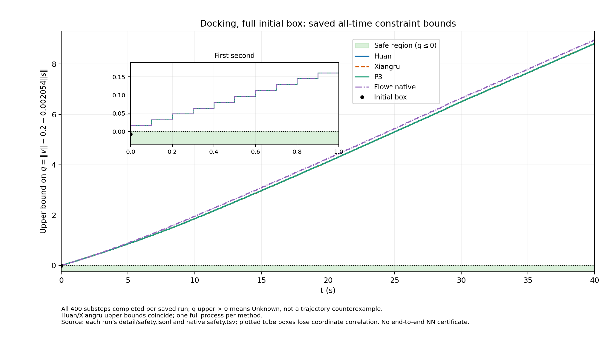
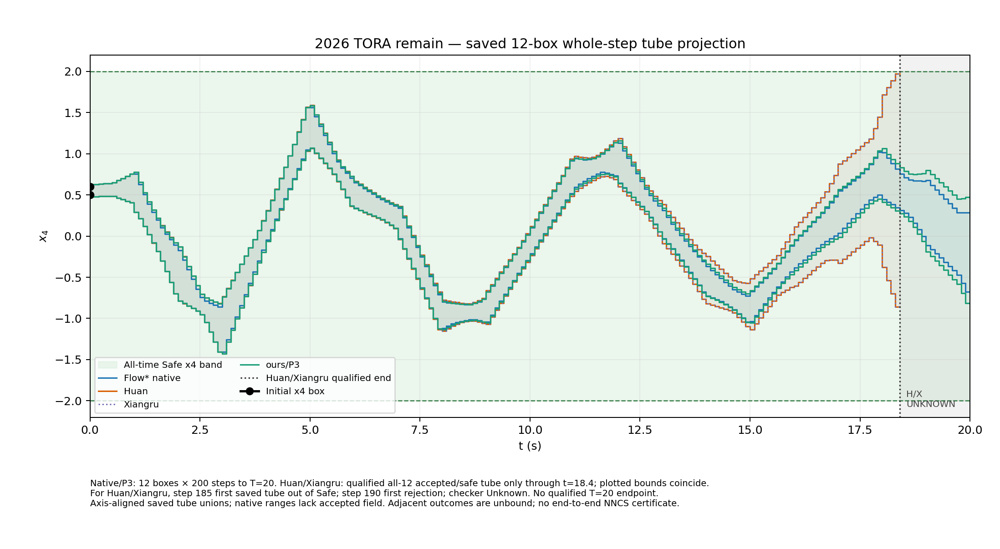
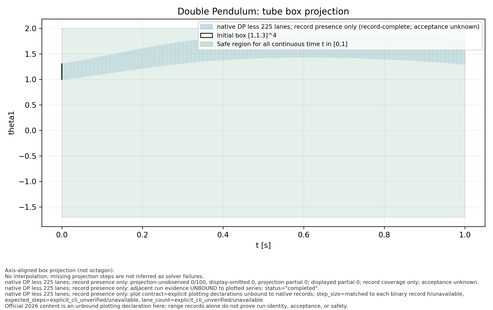
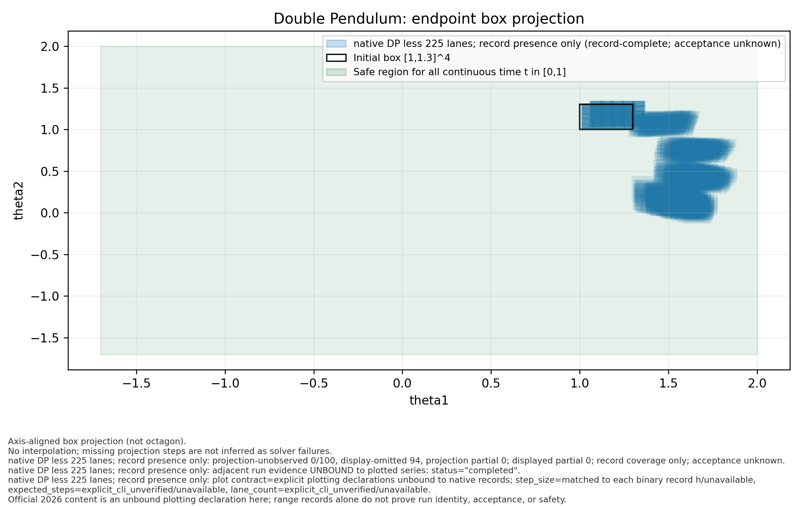
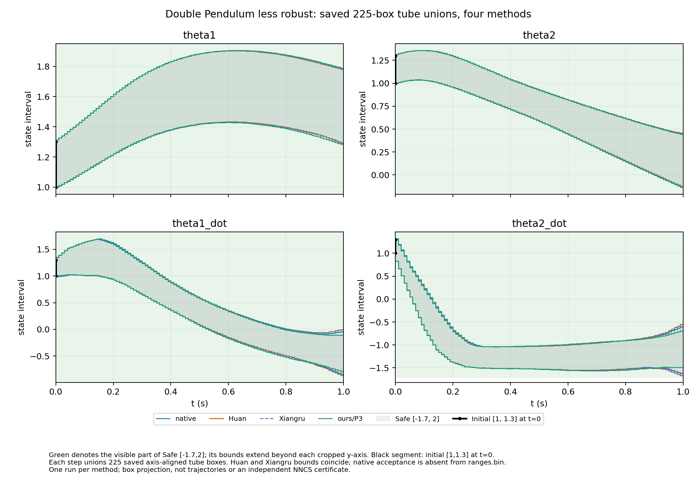
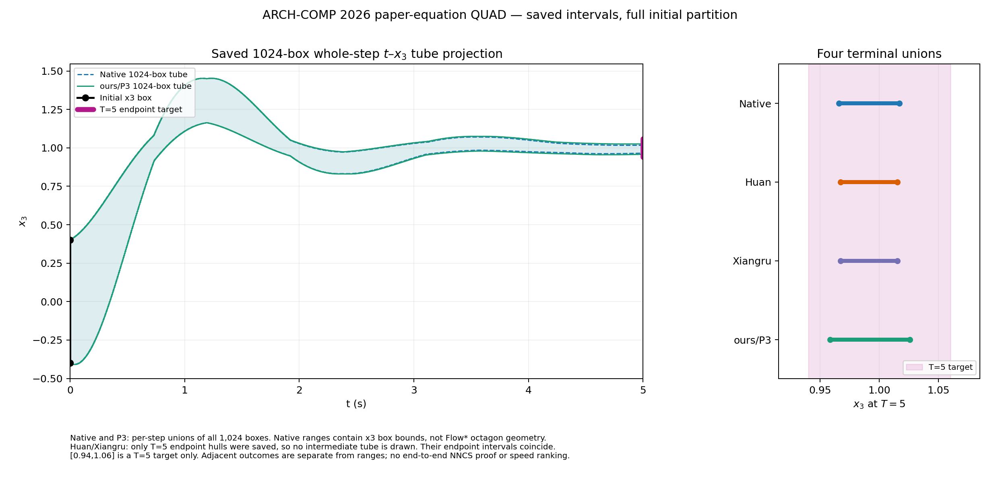

# ARCH-COMP26 非 VCAS 四方实验报告：可审阅草稿（不可作为最终成绩）

> 2026-10-02 接续修订。本文件保留恢复执行前生成的 16×4 **哈希绑定基线矩阵**，它的 `not_started=64` 只描述旧矩阵记录，不能用来否认本轮新尝试。新尝试列在下方独立索引与[无哈希工作矩阵](evidence/archcomp26_nohash_work_matrix_20261001.md)，以各自原始运行目录为准；ACC 已有四方重复进程计时，但仍不具备跨方法稳定排名所需的全部资格。实时接续状态见 [执行进度](GOAL_EXECUTION_PROGRESS_20261001.md)。

> 本轮按用户要求**没有计算或校验任何内容摘要**。旧冻结证据只按既存记录陈述，不重新验证身份；新 DP 原生结果保留无哈希路径、配置、日志、范围记录与图，尚未注入旧矩阵的资格字段。旧 Huan、旧 PyTorch 与旧 Flow* 数字也不冒充 2026 新合同结果。

## 摘要与边界

目标是在同一冻结 benchmark 合同下比较 PyTorch/GPU、Huan、Xiangru 和 Flow* native 的完整性、进程时间与绝对 flowpipe 宽度。共享驱动仅用于控制变量，不等同于三套独立 NNCS 产品。

- 报告状态：**可审阅、不可发布为完整四方成绩**。
- 执行状态：2026-10-01 已恢复；新工作索引中 DP less 四方、论文方程 QUAD 四方、Single Pendulum 两物理态四方、TORA remain P3/原生、ACC participant-order 四方、修正 unsafe 后 Attitude 四方，以及 Docking 四方，共 **26 个方法单元**有完整数值时域记录。Docking 四方性质均为 `Unknown`，Airplane 连续版完整初盒的 P3/Huan/Xiangru/Flow* native 新入口均失败且未得可接受全时流管；DP more 四方均未完成 T=0.4，其中 P3 只有全盒首周期，TORA remain Huan/Xiangru 全程尝试有拒绝盒与 `Unknown.`；大量其余实例仍未尝试。
- 覆盖：16 个实例 × 4 个方法 = 64 个 cell。
- 旧基线矩阵计数：`not_started=64`；它不是本轮实际 attempt 计数。新 attempt 见[无哈希索引](evidence/archcomp26_nohash_attempts_20261001.json)。
- 当前可写的实测结论：新原生 DP less 225×100、修正危险集的 Attitude 四方 1×60、论文方程 QUAD 四方 1024×1000、Single Pendulum 两物理态四方 1×100、TORA remain P3/原生 12×200、ACC participant-order 四方 1×50、Docking 四方 1×400 均有完整数值运行；DP less P3 分区仿射版本与 Huan/Xiangru 225×100 也完整；P3 仍无端到端严格证书。Docking 四方的非线性安全性质未决；原生外层 `failed/exit 2` 因 checker `UNKNOWN`，原始状态未改写。ACC 另有四方各 5 次后续独立进程计时；这些完成时间不能仅凭当前数据做稳定速度排名或声称独立端到端浮点 NNCS 证明。失败前缀时间不外推为完成时间。

## 2026-10-01 新尝试与旧冻结证据的分界

| 范围 | 已知状态 | 结果资格 |
|---|---|---|
| 新 2026 连续 Double Pendulum less-robust，Flow* native | 全 `[1,1.3]^4` 分为 225 盒；20 个控制期、100 个 `h=0.01` 子步；22,500 条唯一范围记录；作者 checker `VERIFIED`；单次全进程 1107.127423 s。见[本地原始副本与摘要](evidence/results/archcomp26_20261001/native_dp_less_full20_001/SUMMARY.md)。 | **单方法全程结果**。可报告绝对区间和单次时间；不能形成四方排名，范围记录不含 accepted/status。 |
| 新 DP less Huan / Xiangru | 与原生共用 225 盒 × 100 小步合同，各接受 22,500/22,500；进程 wall 分别 9.539174 s / 8.387790 s，保存 tube 各在全时安全带内。见[两方摘要](evidence/results/archcomp26_20261001/author_dp_less_v1/SUMMARY.md)。 | **两方单次全程数值结果**；共享控制驱动与主要数值源码，范围相同不是独立证明；没有四方排名资格。 |
| 新 DP less PyTorch/GPU P3 有向仿射分区 | 保持完整 225 初盒与 20×0.05 s 合同；同一全局控制仿射图 `T` 下，16 子盒诊断仍在第 75 步性质未决、第 84 步首拒。256 子盒新运行完成 100/100 小步、22,500/22,500 盒步接受，保存全时四态 tube 均在 `[-1.7,2]` 内，最小盒裕量 +0.093919848；外层 wall 74.274085 s。见[分区审计与原始镜像](ARCHCOMP26_DP_P3_PARTITION_DIAGNOSTIC_20261002.md)。 | **第四方完整数值时域结果**，但 `end_to_end_strict_certificate=false`；诊断时间包含逐盒观察写盘，不能与其它方法据单次 wall 排名。 |
| 新 DP more 四方前缀 | 原生保存 225×64/80 小步，checker `UNKNOWN`；Huan/Xiangru 各保存 225×72/80 小步后 checker `Unsafe.` 早停，安全带内共同前缀仅到 `T=0.3`。新 P3 全 225 盒首周期 900/900 盒步接受，但第 3/4 小步的部分保存区间超过 `θ̇₁≤1.5`，作者驱动打印 `Unknown.`。另有严格内点 `(1.299)^4` 的独立数值轨迹，在约 `t=0.324865` 越过 `θ̇₁=-1.5`。见[原生摘要](evidence/results/archcomp26_20261001/native_dp_more_full20_001/SUMMARY.md)、[两方摘要](evidence/results/archcomp26_20261001/author_dp_more_v1/SUMMARY.md)、[P3 首周期](evidence/results/archcomp26_20261001/dp_more_p3_firstperiod_interval_20261002_001/SUMMARY.md)及[严格内点数值诊断](evidence/results/archcomp26_20261001/dp_more_interior_point_candidate_20261002/SUMMARY.md)。 | **四方均无 T=0.4 完整流管**；区间越界和数值点轨迹均不构成独立严格反例或端到端证明。点诊断不是第五种 flowpipe 方法。 |
| 新 Airplane continuous 完整初盒 Huan/Xiangru 入口 | 官方初盒是一个未分割 12 物理态盒，其中 `u,v,w,phi,theta,psi∈[0,1]`；旧点初盒不能复用。order-6 Huan 一周期入口在任何 ODE 步前建 19 变量六阶单项式对表，观测 RSS 超过 54,006,540 KiB 后终止该子进程组，wall 252.247 s。另立 order-3 诊断 profile，Huan/Xiangru 分别 wall 6.785/6.985 s，但唯一全初盒均在首个 `0.01 s` 小步被拒绝，0 个接受步；均未启动完整 `T=2`。见[三次原始尝试摘要](evidence/results/archcomp26_20261001/airplane_continuous_order3_fullbox_20261002/SUMMARY.md)和[入口来源审计](ARCHCOMP26_AIRPLANE_2026_ENTRY_AUDIT.md)。 | **数值入口/资源失败，无完整结果或性质结论**。Taylor 阶数不是官方强制字段，但两 profile 是不同数值配置；首步拒绝的内部细分原因未记录，不能猜成轨迹越界。P3 和原生完整初盒的独立 smoke 见下两行。 |
| 新 Airplane continuous 完整初盒 P3 入口 | 固定同一官方单盒、12→6 控制与 10×0.01 s 一周期 smoke。CPU 六输出严格注入预检通过且未初始化 GPU。第一次工作 P3/验证 P4 在首步构造表时因 `9^20 >= 2^63` 退出，wall 13.758 s、0 段；第二次另立严格 `solution_order` 工作/验证均 P3，越过表构造但首个 0.01 s 段唯一全盒 `accepted=false`，wall 12.500 s、0/10 接受。两次原始 `RESULT`、空范围和当时源码见[P3 摘要](evidence/results/archcomp26_20261001/AIRPLANE_P3_FULLBOX_SMOKES_20261002.md)。 | **入口/首步数值失败**；未启动 T=2 full，无可用 tube 或性质结论。第二次内部拒绝子类未记录，不能猜成轨迹越界；两种验证策略不得合并排名。 |
| 新 Airplane continuous 完整初盒 Flow* native 入口 | 同一单个完整 12 物理态盒、固定 2026 12→6 ONNX，隔离一期 smoke 三次：历史 order 6、order 3、以及 order 3 加宽余项 `[-1,1]`。各完成一次控制 RPC，首个 0.01 s Flow* 步均返回状态 4 `UNCOMPLETED_SAFE`、0/10 段接受；原始外层均为 `failed/exit2`，wall 依次 4.877421/3.925546/3.925656 s。`BOX_SAFE 1` 对零 tube 是空真，非性质结论；见[三次原始摘要和源码级停止条件](evidence/results/archcomp26_20261001/native_airplane_fullbox_smokes_20261002/SUMMARY.md)。 | **三次均首步数值不完成**；未启动 T=2 full，无可用性质样本。加宽余项是独立参数诊断；首步失败坐标和具体 Picard 余项值未记录，不能据此猜测轨迹越界或排序。 |
| 新 2026 论文方程 QUAD，P3 / Huan / Xiangru / Flow* native | 四方均覆盖全 1024 初盒、50 控制期、1000 个 `h=0.005` 小步。单次外层 wall 分别为 1357.555 / 94.583 / 108.018 / 47058.887 s。各方 `T=5` 的 `x3` endpoint union 分别为 `[0.9584732146312492,1.0256989633476477]`、`[0.967434441417146,1.015176258384569]`、同 Huan、`[0.965771839016746,1.0167484756616678]`。原生 `ranges.bin` 独立重扫有 1,024,000/1,024,000 条唯一有序盒步，均有限、有序、endpoint 含于 tube；作者日志打印 `VERIFIED`。见[P3 摘要](evidence/results/archcomp26_20261001/quad_paper_p3_nohash_v1/SUMMARY.md)、[Huan 摘要](evidence/results/archcomp26_20261001/quad_paper_huan_full50_001/SUMMARY.md)、[Xiangru 摘要](evidence/results/archcomp26_20261001/quad_paper_xiangru_v1/SUMMARY.md)、[原生扫描及原始收据](evidence/results/archcomp26_20261001/native_quad_paper_full50_001/SUMMARY.md)与[合同决策](ARCHCOMP26_QUAD_PAPER_CONTRACT_DECISION_20261001.md)。 | **四方各一次完整数值时域记录**。四条 `x3` 终点并集均在论文 `[0.94,1.06]` 目标内；P3 `end_to_end_strict_certificate=false`，其它三方亦无独立端到端浮点 NNCS 证明。原生单次进程占 GPU 1/CPU 6–9 长时运行，方法资源、阶数及观察器不同，不能据四条单次 wall 排名；作者 `VERIFIED` 不是独立证书。 |
| 新 Single Pendulum 两物理态，P3 / Huan / Xiangru / 原生 | 全初盒、20 期、100 小步均完成；单次 wall 依次为 6.583305 / 5.430762 / 5.528731 / 4.726027 s。安全性质只要求闭时间窗 `t∈[0.5,1]` 的 `x1∈[0,1]`；P3 在 50 个窗口安全事件下的保存 tube union 为 `[0.5645452654370386,0.9932406822927875]`，其它三方对应保存 tube 也在带内。见[合同与两 GPU 摘要](evidence/results/archcomp26_20261001/single_pendulum_prep_001/SUMMARY.md)、[P3 摘要](evidence/results/archcomp26_20261001/single_pendulum_two_state_p3_full20_001/SUMMARY.md)及[原生摘要](evidence/results/archcomp26_20261001/native_sp_two_state_full20_001/SUMMARY.md)。 | **四方单次全程数值结果**；配置明确把额外 `t` 当辅助时钟，不能冒充尚缺初值/执行源码的官方三态 MATLAB 运行，也不能按四条冷进程时间排名。 |
| 新 TORA remain，P3 / 原生 / Huan / Xiangru | 全初盒 12 分区、20 期、200 小步。P3 新适配 2400/2400 盒步接受、保存的全时四态 tube 在 `[-2,2]^4`，进程 wall 10.411001 s；原生 2400/2400 条范围、checker `VERIFIED`、wall 8.339151 s。Huan/Xiangru 各观察到 200 小步但仅接受 2357/2400 盒步，首次保存 tube 出安全带为步185、首次拒绝步190，checker 均 `Unknown.`，各自进程 wall 8.371523 s / 8.270158 s。见[共享合同](ARCHCOMP26_TORA_REMAIN_CONTRACT_20261001.md)、[P3 完整结果](evidence/results/archcomp26_20261001/p3_tora_remain_v1/SUMMARY.md)、[原生完整结果](evidence/results/archcomp26_20261001/native_tora_remain_full20_001/SUMMARY.md)及[两方失败尝试](evidence/results/archcomp26_20261001/author_tora_remain_v1/SUMMARY.md)。 | **P3/原生各有单次全程数值结果；两作者只有全部盒接受且保存 tube 安全的 `t≤18.4` 前缀**。Huan/Xiangru 的约 8 s 是失败进程，不能和完整时间排名；区间出带不是独立实际轨迹反例。P3/原生的保存盒安全亦非独立端到端浮点 NN 证明。 |
| 新 ACC participant-order，P3 / Huan / Xiangru / 原生 | 两份保存的参与者 C++ 源码指定 `v_rel=v_lead-v_ego`，而论文没有定义其符号；故按此明确命名的 profile 比较。四方均用完整单盒、固定 2026 ONNX、50 个 0.1 s 控制期，保存 tube 的安全半空间 `x_lead-x_ego-1.4*v_ego-10` 下界最小分别为 16.434859 / 16.165035 / 16.165035 / 16.254754，全部严格为正。最初各一次单独进程 wall 分别为 7.934 / 7.260 / 7.312 / 7.930 s；随后另开四方各 1 首轮+5 后续独立进程的轮换 campaign，均走完 50/50，详见下表。见[ACC 合同](ARCHCOMP26_ACC_PARTICIPANT_CONTRACT_20261001.md)、[四方证据汇总](evidence/results/archcomp26_20261001/ACC_PARTICIPANT_PROFILE_20261001.md)、[24 次 campaign](evidence/results/archcomp26_20261001/acc_fourway_campaign_001/SUMMARY.md)和[六态绝对端点/全时 tube CSV](evidence/results/archcomp26_20261001/acc_fourway_saved_ranges_20261001/README.md)。 | **四方全程数值结果及完整 5 次后续进程计时**；Huan/Xiangru 使用共享驱动且保存区间相同，VAR 修复只做了针对性单步验证。轮换同 GPU/CPU 的时间可描述，但另一块 GPU 同时跑 QUAD，冷定义并非重启主机，四方均缺独立端到端浮点 NN 证明，因此不宣称稳定速度排名。 |
| 新 Attitude Control P3 / Huan / Xiangru / 原生，修正 unsafe | 固定 2026 规格的 unsafe 盒要求 `-0.7≤x4≤-0.6`；旧 checker 误写成 `x4≥-0.4` 与 `x4≤-0.6`，实际是空集。四个新隔离 profile 各完成 30/30 控制期、60/60 小段。单次 wall 依次为 13.017036 / 7.094217 / 6.933376 / 6.281498 s。原生显式打印 `VERIFIED`；三 GPU 入口的修正 checker 均未打印 Unsafe/Unknown。四方各自保存的全部 60 个六维 tube 盒均与官方危险集不相交；原生 `x4` 全时上界为 `-0.710800050132425`，低于危险下界 `-0.7`。见[合同与旧错误](ARCHCOMP26_ATTITUDE_CONTROL_CONTRACT_20261001.md)、[原生扫描](evidence/results/archcomp26_20261001/native_attitude_avoid_full30_001/SCAN.json)、[P3 全程记录](evidence/results/archcomp26_20261001/p3_attitude_avoid_v1/full30_001/payload/RESULT.json)和[Huan 全程记录](evidence/results/archcomp26_20261001/author_attitude_avoid_v1/huan_full30_001/payload/RESULT.json)。 | **修正后四方单次全程数值结果**。旧 `VERIFIED` 不能证明官方性质；Huan/Xiangru 共享驱动且保存区间相同，安全结论依赖作者边界与保存盒扫描；仍缺独立端到端证明与稳定计时。 |
| 新 Docking P3 / Huan / Xiangru / Flow* native | 官方完整初盒 `[70,106]²×[-0.28,0.28]²`、原始四态输入/两力输出、40 个 1 s 控制期，四方各完成 400 个 0.1 s 数值小步；单次外层 wall 分别 17.412 / 12.699 / 12.668 / 9.139 s。非线性全时安全裕量 `q=√(vx²+vy²)-0.2-0.002054√(sx²+sy²)≤0` 的首个小步保守上界四方均约 `+0.016083`，全程 checker 均为 `UNKNOWN`。原生外层 `RESULT` 如实记录 `failed/exit 2`，同时保存 40/40 周期、400 tubes、40 RPC；末时绝对区间、原始记录和接口核对见[三方 GPU 摘要](evidence/results/archcomp26_20261001/DOCKING_FULLBOX_3METHODS_SUMMARY.md)与[原生摘要](evidence/results/archcomp26_20261001/native_docking_full40_001/SUMMARY.md)。 | **四方完整数值时域，性质未决**；q 盒与不安全侧相交不是实际轨迹反例，四条单次 wall 不能排名。原生退出码因性质未知，不能改写为作者 `VERIFIED`；没有独立端到端浮点 NNCS 证明。 |
| 新 NAV standard / robust Huan 首盒首周期 | 固定官方 point/set ONNX、作者可执行状态顺序 `[x,y,speed,heading]` 与输出顺序 `[speed_rate,heading_rate]`；分别取 640/25 初始分块的首盒，仅运行 30 期中的首个 `0.2 s` 周期。两个新 ID 各 20/20 小步接受，保存 tube 均与障碍盒分离，进程 wall 4.142439 / 4.417727 s。见[NAV 执行合同与短程证据](ARCHCOMP26_NAV_AUTHOR_EXECUTION_CONTRACT_20261002.md)。 | **仅短前缀**；未覆盖其余分块、`t=6` 终点到达或全程性质，不能给完整时间与四方宽度。论文状态文字和网络层宽与官方可执行材料仍须作为来源冲突注明。 |
| 旧 NAV standard / robust Huan 完整运行的合同复核 | [逐项比对](ARCHCOMP26_NAV_AUTHOR_EXECUTION_CONTRACT_20261002.md#旧-huan-全程记录与当前可执行合同逐项比对)确认旧 point/set 模型与固定官方 2026 副本直接字节相同，旧方程、接口、初集 640/25 分区、0.2×30 时域与两项性质均与作者可执行 profile 相同。旧结果各 600/600 小步、384,000/15,000 盒步接受、exit 0；原始作者输出均 `VERIFIED`，driver wall 14.718815 / 11.655595 s。 | **可按原始资格引用的历史同合同全程证据**，不计为本轮新尝试索引，不重复运行。robust 本地镜像缺逐步范围，旧两条均无独立端到端浮点 NNCS 证书；历史 wall 不能当本轮同资源排名。 |
| 新 Balancing 固定仓库四输入 Huan 入口 | 单列 `balancing-fixed-repo-raw4`，使用完整初盒、原四态 ONNX、500 个 0.02 s 控制期和全时窗性质。CPU 模型预检通过；一期新 smoke 4/4 小步接受。全时域独立尝试只接受 98/2000 个计划小步，第 99 步在 `[0.49,0.495] s` 拒绝，外层 wall 8.218304 s，0 次 8–10 s 性质检查。见[原始结果与标签勘误](evidence/results/archcomp26_20261001/balancing_fixed_raw4_huan/AUDIT.md)。 | **早停，性质 UNKNOWN**；内部拒绝子因未被原始记录捕获，不猜测。此 profile 与论文五特征控制器不同，亦不提供四方时间排名。 |
| Balancing/CartPole 来源审计 | Balancing 论文写五特征控制器而固定 ONNX/MATLAB 是四原态，论文闭窗 `[8,10]` 与实例规格 `8<t≤10` 不同。见[逐项审计](ARCHCOMP26_DOCKING_BALANCING_SOURCE_CONTRACT_20261001.md)。 | **未启动新数值**；仓库四原态 profile 需单独命名，不能冒充未解决的论文五特征执行。 |
| 旧 QUAD 作者合同 | Huan parity 5 次完整运行、旧 P3 完整一次、native 6 小时超时仅到 600 步；另有 40 步 parity/strict 新诊断，但使用旧模型。见[速度与模式分析](HUAN_QUAD_SPEED_AND_MODES.md)。 | **历史机制/回归证据**；合同与数值保证不同，不构成 2026 四方同合同对比。 |
| 其余 2026 cell | 除上述新尝试外，更多共同合同和方法支持仍需逐项落实；旧 14 项成绩不能平移。 | **待运行或待预检**；保留全部行和变体，不用空白代替失败记录。 |

这张[四方 Docking 图及几何数据](evidence/results/archcomp26_20261001/plots/nohash_saved_20261001/docking_fullbox_4method_q_upper.geometry.json)按相同 0.1 s 网格显示各方法保存 tube 轴对齐盒的保守 `q` 上界；首秒另有局部放大。绿色只代表 `q≤0` 的安全区域，不代表四方已证明性质。三 GPU 方法共用驱动，原生与 GPU 的 observer/包络不同；曲线重合或接近不是独立正确性证明。

各项 smoke 单独计为短程入口检查，不是全程性能样本。旧 DP native 300 s 超时记录的二进制 RPC 端口与服务端口不一致，也不作为新结果。保存区间读回确认了对应运行记录的边界、接受与性质前缀；这种读回检查和较窄区间本身不证明控制器浮点包络或完整 NNCS 链路的可靠性。

### ACC 四方绝对宽度（参与者输入顺序，单次 T=5）

下表只列第 50 期已保存的六物理态 endpoint 宽度；每个方法的绝对 `lo/hi`、全时 tube `lo/hi`、观察函数和原始来源均在[逐方法 CSV](evidence/results/archcomp26_20261001/acc_fourway_saved_ranges_20261001/acc_t5_endpoint_and_full_tube_long.csv)与[口径说明](evidence/results/archcomp26_20261001/acc_fourway_saved_ranges_20261001/README.md)。原生观察器与 GPU 观察器不同，Huan/Xiangru 共用观察代码；此表仅作保存数值描述。

| 状态 | P3 | Huan | Xiangru | Flow* native |
|---|---:|---:|---:|---:|
| `x_lead` | 20.997866 | 21.012041 | 21.012041 | 21.012051 |
| `v_lead` | 0.198483 | 0.201754 | 0.201754 | 0.201758 |
| `a_lead` | 0.000699 | 0.000741 | 0.000741 | 0.000743 |
| `x_ego` | 5.163069 | 5.497976 | 5.497976 | 5.497999 |
| `v_ego` | 1.858046 | 2.015511 | 2.015511 | 2.015528 |
| `a_ego` | 1.096897 | 1.181106 | 1.181106 | 1.181124 |

### ACC 四方重复进程时间（同一 participant-order 合同）

[24 次新运行的逐次原始表](evidence/results/archcomp26_20261001/acc_fourway_campaign_001/SUMMARY.md)按方法轮换顺序，四方各有 campaign 首个新进程 1 次和后续独立新进程 5 次；全都完成单盒 50 期，保存 tube 半空间下界均严格为正。统一外层 wall 从 `Popen` 前计到子进程回收，native 包含 RPC 服务启动；下表后五次中位数排除首轮。它们在同一物理 GPU 2 与 CPU 10–13 顺序执行，同时 GPU 1 的论文 QUAD 长作业仍占用主机，且“cold”并非重启机器后的冷机。

| 方法 | 首轮 wall (s) | 后五次 median (s) | 后五次 min–max (s) | 有效后续次数 |
|---|---:|---:|---:|---:|
| P3 | 8.589842 | 8.740510 | 8.637965–8.840520 | 5/5 |
| Huan | 8.087964 | 8.237208 | 8.138279–8.337823 | 5/5 |
| Xiangru | 7.887486 | 7.987532 | 7.937743–8.086614 | 5/5 |
| Flow* native | 7.686284 | 7.736304 | 7.636556–7.786681 | 5/5 |

这些是当前运行条件下的描述性完整进程时间。Huan 与 Xiangru 共享数值驱动，native 与 GPU 观察器不同，四方均没有独立端到端浮点 NN 证明；时间先后不升级为正式稳定速度排名。最初的四次单独运行是另一组诊断，未混进上表中位数。

论文方程 QUAD 的四方十二个物理态 T=5 endpoint `lo/hi/width` 见[48 行无哈希 CSV](evidence/archcomp26_quad_paper_endpoint_4methods_20261002.csv)。原生一列还给出 1,024 个终点盒的宽度均值与最大值；其余三方原始 metrics 只提供并集边界，该两栏保持空白，不从并集宽度臆造逐盒统计。旧[36 行三方 CSV](evidence/archcomp26_quad_paper_endpoint_3methods_20261001.csv)保留为原生结束前快照。

| T=5 `x3` endpoint | P3 | Huan | Xiangru | Flow* native |
|---|---:|---:|---:|---:|
| 下界 | 0.958473215 | 0.967434441 | 0.967434441 | 0.965771839 |
| 上界 | 1.025698963 | 1.015176258 | 1.015176258 | 1.016748476 |
| 并集宽 | 0.067225749 | 0.047741817 | 0.047741817 | 0.050976637 |

四方终点并集均位于 `[0.94,1.06]`。表中的 P3 值取其 driver `final_hull`；下方图取逐步 observer 原始保存行，末行上界约高 `1.05×10⁻⁹`，来源和差异见[出图说明](evidence/results/archcomp26_20261001/quad_paper_fourway_saved_20261002/SUMMARY.md)。阶数、包络与资源路径不同，宽度差异不等于严格性或算法优劣排序。

### Attitude Control 四方绝对宽度（修正 unsafe，单次 T=3）

下表列第 60 个已保存小段的六物理态 endpoint 宽度。每个方法的 endpoint 和全时 tube 绝对 `lo/hi/width` 均在[24 行 CSV](evidence/archcomp26_attitude_avoid_4methods_abs_bounds_20261001.csv)；原始盒、正确危险集判交及观察器差异见[四方摘要](evidence/results/archcomp26_20261001/ATTITUDE_AVOID_4METHODS_SUMMARY.md)。此处数字是保存边界描述，不能独自构成浮点 NNCS 证书。

| 状态 | P3 | Huan | Xiangru | Flow* native |
|---|---:|---:|---:|---:|
| `omega1` | 0.004079 | 0.004174 | 0.004174 | 0.004194 |
| `omega2` | 0.005800 | 0.005936 | 0.005936 | 0.005980 |
| `omega3` | 0.005993 | 0.006173 | 0.006173 | 0.006194 |
| `psi1` (`x4`) | 0.031363 | 0.032070 | 0.032070 | 0.032292 |
| `psi2` | 0.017097 | 0.017362 | 0.017362 | 0.017636 |
| `psi3` | 0.018023 | 0.018479 | 0.018479 | 0.018637 |

### TORA remain 四方共同有效前缀

四方共同满足 **12 盒均接受且保存 tube 在 `[-2,2]^4`** 的最长前缀为 184/200 小步，即 `t≤18.4`；Huan/Xiangru 从第 185 步开始不能证明保存 tube 安全，第 190 步首次拒绝盒。下表只示论文图关注的 `x4` 终点，全部四态的共同前缀与完整时域 `lo/hi/union width`、每盒 endpoint mean/max、未完成值的空值见[四方 32 行 CSV](evidence/results/archcomp26_20261001/tora_remain_fourway_common_prefix_20261002/RANGES.csv)与[逐项解释](evidence/results/archcomp26_20261001/tora_remain_fourway_common_prefix_20261002/SUMMARY.md)。

| 方法 | `t=18.4` 的 `x4` endpoint union | 宽度 | 完整 `T=20` 的 `x4` endpoint union | 完整时域资格 |
|---|---|---:|---|---|
| P3 | `[0.308899115, 0.838149984]` | 0.529250869 | `[-0.815527594, 0.417677322]` | 2400/2400 接受，保存 tube 安全 |
| Huan | `[-0.859772472, 1.933073336]` | 2.792845808 | — | 2357/2400 接受，`Unknown.` |
| Xiangru | `[-0.859772472, 1.933073336]` | 2.792845808 | — | 2357/2400 接受，`Unknown.` |
| Flow* native | `[0.347754942, 0.806234558]` | 0.458479616 | `[-0.676217170, 0.283968209]` | 2400/2400 范围，`VERIFIED` |

Huan/Xiangru 完整终点保持空值，不能以第 200 步幸存盒取代全初集；区间越界不是物理轨迹反例。各方设备与观察器不同，表中宽度仅描述已保存结果，不构成独立端到端浮点 NNCS 证明。

这张[图及 MATLAB/PDF/几何数据说明](evidence/results/archcomp26_20261001/tora_remain_fourway_common_prefix_20261002/plots/SUMMARY.md)仅从保存区间重画；绿色 Safe 是全时 `x4∈[-2,2]` 投影，Huan/Xiangru 在第 185 步以后没有合格全初集流管，图中以未知标识。

## 比较规则

- 正式目标为 1 次冷启动和 5 次独立进程 steady；冷启动不进入 steady 中位数。长任务可预先声明较少 steady 次数并写明原因，但不得据此取得稳定排名资格。
- 只报告完整请求时域且明确允许性能测量的时间；失败前缀不外推完成时间。
- 宽度始终给绝对上下界、union width 和每分区 mean/max；本报告不计算宽度比。
- 四方共同前缀由合同采样网格上的逐时刻宽度序列交集派生；不同 domain、变量顺序或单位不会合并。
- 排名资格由四方 campaign、轮换、运行资源、完整分区覆盖和证书共同派生，结果 cell 不能自行声明。
- `failed`、`timeout`、`interrupted` 与有证据的 `unsupported/skipped` 都保留。
- Campaign：`{"active_run_receipt":{"path":null,"sha256":null},"campaign_id":null,"cpu_thread_budget":null,"gpu_device_budget":null,"hardware_identity":null,"host_identity":null,"launch_guard":{"hold_scope":"fresh_audit_through_terminal_fsync_v1","lock_identity":{"device":null,"inode":null,"mode":384,"nlink":1,"owner_uid":null},"lock_path":"<fixed-server-lock>","protocol":"posix-flock-exclusive-nonblocking-v1","schema_version":"archcomp26-atomic-launch-guard-v2","wrapper_module":"torch_tm_flowpipe.archcomp26_launch","wrapper_path":"src/torch_tm_flowpipe/archcomp26_launch.py","wrapper_sha256":null},"prelaunch_audit":{"path":null,"sha256":null},"resource_limits":null,"rotation":{"policy":"balanced_round_robin_by_instance_and_steady_round_v1","schedule_artifact":{"path":null,"sha256":null},"steady_rounds":5},"schema_version":"archcomp26-comparison-campaign-v1","timeout_s":null,"timing_boundary":{"phase_fields":["driver_total","compile","controller_nn","solver_core","validation","observer","output","plot_report"],"start_event":"immediately_before_fresh_process_spawn","stop_event":"after_result_and_width_artifacts_are_durable","version":"total_configuration_v2"}}`。

## 全部非 VCAS 配置覆盖矩阵（恢复执行前的哈希绑定基线快照）

下表尚未接纳 2026-10-01 的无哈希尝试；此处的 `not_started` 是该旧矩阵字段。实际新尝试及失败诊断见上节，不能把新 native DP 自动提升为已完成的四方 cell。

| 实例 | PyTorch/GPU | Huan | Xiangru | Flow* native |
|---|---|---|---|---|
| `acc-safe-distance` | `not_started` | `not_started` | `not_started` | `not_started` |
| `airplane-continuous` | `not_started` | `not_started` | `not_started` | `not_started` |
| `airplane-discrete` | `not_started` | `not_started` | `not_started` | `not_started` |
| `attitude-control-avoid` | `not_started` | `not_started` | `not_started` | `not_started` |
| `balancing-reach` | `not_started` | `not_started` | `not_started` | `not_started` |
| `docking-constraint` | `not_started` | `not_started` | `not_started` | `not_started` |
| `double-pendulum-less-robust` | `not_started` | `not_started` | `not_started` | `not_started` |
| `double-pendulum-more-robust` | `not_started` | `not_started` | `not_started` | `not_started` |
| `nav-standard` | `not_started` | `not_started` | `not_started` | `not_started` |
| `nav-robust` | `not_started` | `not_started` | `not_started` | `not_started` |
| `quad-reach` | `not_started` | `not_started` | `not_started` | `not_started` |
| `single-pendulum-reach` | `not_started` | `not_started` | `not_started` | `not_started` |
| `tora-remain` | `not_started` | `not_started` | `not_started` | `not_started` |
| `tora-reach-sigmoid` | `not_started` | `not_started` | `not_started` | `not_started` |
| `tora-reach-tanh` | `not_started` | `not_started` | `not_started` | `not_started` |
| `unicycle-reach` | `not_started` | `not_started` | `not_started` | `not_started` |

## 旧 14 项到 2026 manifest 的差异索引

旧结果仅作回归线索；下表不会把旧完成状态或时间提升为 2026 重跑成绩。

| 2026 实例 | 旧配置候选 | 映射状态 | 合同状态 | 已知差异/阻断数 |
|---|---|---|---|---:|
| `acc-safe-distance` | `acc` | `candidate_only` | `unresolved` | 3 |
| `airplane-continuous` | `airplane` | `candidate_only` | `unresolved` | 1 |
| `airplane-discrete` | `—` | `missing_from_legacy_14` | `unresolved` | 1 |
| `attitude-control-avoid` | `attitude_control` | `candidate_only` | `unresolved` | 3 |
| `balancing-reach` | `cartpole` | `candidate_name_mapping_only` | `unresolved` | 3 |
| `docking-constraint` | `—` | `missing_from_legacy_14` | `unresolved` | 3 |
| `double-pendulum-less-robust` | `double_pendulum_less_robust` | `candidate_only` | `unresolved` | 1 |
| `double-pendulum-more-robust` | `double_pendulum_more_robust` | `wrong_controller_and_initial_set` | `unresolved` | 1 |
| `nav-standard` | `nav_standard` | `candidate_only` | `unresolved` | 2 |
| `nav-robust` | `nav_robust` | `candidate_only` | `unresolved` | 2 |
| `quad-reach` | `quad` | `dynamics_mismatch_unresolved` | `unresolved` | 2 |
| `single-pendulum-reach` | `single_pendulum` | `candidate_only` | `unresolved` | 1 |
| `tora-remain` | `tora_homogeneous` | `candidate_name_mapping_only` | `unresolved` | 1 |
| `tora-reach-sigmoid` | `tora_sigmoid` | `candidate_only` | `unresolved` | 1 |
| `tora-reach-tanh` | `tora_relu_tanh` | `candidate_name_mapping_only` | `unresolved` | 2 |
| `unicycle-reach` | `unicycle` | `candidate_only` | `unresolved` | 2 |

## 1. ACC — safe-distance (`acc-safe-distance`)

### 模型、控制器、初始集合与性质

- 执行合同：**未冻结**；本节不得据此启动作业或填入成绩。
- 待解决字段配置：`full_execution_contract_v1`。
- 计划可视化：distance over time。

### 完整配置、状态与复现入口

| 方法 | support / run | h / work / point / validation | cutoff / cap / SR | updates / NN | arithmetic | hardware / runtime | checker / early-stop | measurement plan | 命令 / cwd | source / binary identity | 结果记录 |
|---|---|---|---|---|---|---|---|---|---|---|---|
| PyTorch/GPU | `unassessed` / `not_started` | `h=unresolved; work=unresolved; point=unresolved; validation=unresolved; semantics=—` | `cutoff=unresolved; cap=unresolved; SR=unresolved; semantics=—` | `updates=—; NN=unresolved; semantics=—` | `{"controller_domain":null,"dtype":null,"mode":null,"relaxation":null,"transport":null}` | `{"cpu_threads":null,"gpu":null,"hardware":null,"resource_limits":null,"timeout_s":null}` | `mode=unresolved; id=—; early-stop=—; semantics=—; certificate=—` | `{"cold_runs":1,"fresh_process_per_run":true,"shortfall_reason":null,"steady_runs":5,"target_steady_runs":5,"timing_boundary_version":"total_configuration_v2"}` | — / `—` | `{"binary":{"path":null,"sha256":null},"source":{"kind":null,"locator":null,"revision":null,"sha256":null}}` | `—` |
| Huan | `unassessed` / `not_started` | `h=unresolved; work=unresolved; point=unresolved; validation=unresolved; semantics=—` | `cutoff=unresolved; cap=unresolved; SR=unresolved; semantics=—` | `updates=—; NN=unresolved; semantics=—` | `{"controller_domain":null,"dtype":null,"mode":null,"relaxation":null,"transport":null}` | `{"cpu_threads":null,"gpu":null,"hardware":null,"resource_limits":null,"timeout_s":null}` | `mode=unresolved; id=—; early-stop=—; semantics=—; certificate=—` | `{"cold_runs":1,"fresh_process_per_run":true,"shortfall_reason":null,"steady_runs":5,"target_steady_runs":5,"timing_boundary_version":"total_configuration_v2"}` | — / `—` | `{"binary":{"path":null,"sha256":null},"source":{"kind":null,"locator":null,"revision":null,"sha256":null}}` | `—` |
| Xiangru | `unassessed` / `not_started` | `h=unresolved; work=unresolved; point=unresolved; validation=unresolved; semantics=—` | `cutoff=unresolved; cap=unresolved; SR=unresolved; semantics=—` | `updates=—; NN=unresolved; semantics=—` | `{"controller_domain":null,"dtype":null,"mode":null,"relaxation":null,"transport":null}` | `{"cpu_threads":null,"gpu":null,"hardware":null,"resource_limits":null,"timeout_s":null}` | `mode=unresolved; id=—; early-stop=—; semantics=—; certificate=—` | `{"cold_runs":1,"fresh_process_per_run":true,"shortfall_reason":null,"steady_runs":5,"target_steady_runs":5,"timing_boundary_version":"total_configuration_v2"}` | — / `—` | `{"binary":{"path":null,"sha256":null},"source":{"kind":null,"locator":null,"revision":null,"sha256":null}}` | `—` |
| Flow* native | `unassessed` / `not_started` | `h=unresolved; work=unresolved; point=unresolved; validation=unresolved; semantics=—` | `cutoff=unresolved; cap=unresolved; SR=unresolved; semantics=—` | `updates=—; NN=unresolved; semantics=—` | `{"controller_domain":null,"dtype":null,"mode":null,"relaxation":null,"transport":null}` | `{"cpu_threads":null,"gpu":null,"hardware":null,"resource_limits":null,"timeout_s":null}` | `mode=unresolved; id=—; early-stop=—; semantics=—; certificate=—` | `{"cold_runs":1,"fresh_process_per_run":true,"shortfall_reason":null,"steady_runs":5,"target_steady_runs":5,"timing_boundary_version":"total_configuration_v2"}` | — / `—` | `{"binary":{"path":null,"sha256":null},"source":{"kind":null,"locator":null,"revision":null,"sha256":null}}` | `—` |

### 完整性、性质与结果资格

| 方法 | requested / validated | 完整时域 | accepted / rejected / updates / NN | 分区 completed / requested / failed / unattempted | 性质 / 证书 | soundness / scope | formal / performance / cell-prereq |
|---|---|---|---:|---:|---|---|---|
| PyTorch/GPU | — | — | — | — | — | — | 无结果记录 |
| Huan | — | — | — | — | — | — | 无结果记录 |
| Xiangru | — | — | — | — | — | — | 无结果记录 |
| Flow* native | — | — | — | — | — | — | 无结果记录 |

### 派生的四方可比性（非 cell 自报）

- 时间可比：`false`。
- 宽度可比：`false`；四方共同前缀：`—`。
- 四方排名资格：`false`。
- 原因：`missing_results=pytorch_gpu,huan,xiangru,flowstar_native, runtime_or_resource_budget_mismatch, timing_boundary_mismatch, width_order_units_or_aggregation_mismatch`。

### 时间

| 方法 | boundary / shortfall | 冷启动 process (s) | steady n | process median/min/max (s) | driver / compile / NN / solver / validation / observer / output / plot median (s) | peak host / device bytes | 四方排名资格 |
|---|---|---:|---:|---:|---:|---:|---|
| — | — | — | — | — | — | — | 当前无合格的完整时域时间样本 |

#### 全部原始 attempt（失败不删除、不外推）

| 方法 | role/index/attempt | timing | outcome | raw process (s) | validated | peak host/device bytes | reason | invocation | artifact |
|---|---|---|---|---:|---|---:|---|---|---|
| — | — | — | — | — | — | — | — | — | 当前无 attempt 记录 |

### 绝对宽度与共同前缀

- 宽度记录状态：PyTorch/GPU=`missing`; Huan=`missing`; Xiangru=`missing`; Flow* native=`missing`。

| 方法 | view | domain | 坐标 | 单位 | lo | hi | union width | partition mean | partition max | 排名资格 |
|---|---|---|---|---|---:|---:|---:|---:|---:|---|
| — | — | — | — | — | — | — | — | — | — | 当前无可用宽度记录 |

### Flowpipe 图、失败与未决项

- 目标图：distance over time；只接受结果记录中哈希绑定的图/轨迹；最终门仅认可实际解码通过的 `plot_png` 或 `plot_pdf`；`plot_svg` 仅作补充，不能单独开门。
- 当前无哈希绑定的图或轨迹记录。
- 未决：Historical native result required the VAR-tail correction; old completion/width cannot be promoted without the corrected latest contract.
- 未决：The report names v_rel as a controller input but does not define its sign convention; the input transform must be frozen from authoritative execution code.
- 未决：The safety property is a linear halfspace, not an axis-aligned box.

## 2. Airplane — continuous (`airplane-continuous`)

**本轮合同与新尝试：** 固定 2026 官方 ONNX 已取得并读图，12 输入/6 输出；旧同名模型在检查时逐字节相同，但旧参与者和我方配置只使用一个单点。连续格要求完整 `[0,1]^6` 初盒、周期起点控制更新和全时 tube 检查。新 P3/Huan/Xiangru/Flow* native 均已按完整盒做隔离入口 smoke，尚无任何可接受的完整 2 秒运行或性质结论；见[合同与初盒](ARCHCOMP26_AIRPLANE_2026_ENTRY_AUDIT.md)、[Huan/Xiangru 尝试](evidence/results/archcomp26_20261001/airplane_continuous_order3_fullbox_20261002/SUMMARY.md)、[P3 两次尝试](evidence/results/archcomp26_20261001/AIRPLANE_P3_FULLBOX_SMOKES_20261002.md)与[原生三次尝试](evidence/results/archcomp26_20261001/native_airplane_fullbox_smokes_20261002/SUMMARY.md)。下方表格是旧冻结模板，空项不能解释为本轮未尝试。

### 模型、控制器、初始集合与性质

- 执行合同：**未冻结**；本节不得据此启动作业或填入成绩。
- 待解决字段配置：`full_execution_contract_v1`。
- 计划可视化：states 2 and 7。

### 完整配置、状态与复现入口

| 方法 | support / run | h / work / point / validation | cutoff / cap / SR | updates / NN | arithmetic | hardware / runtime | checker / early-stop | measurement plan | 命令 / cwd | source / binary identity | 结果记录 |
|---|---|---|---|---|---|---|---|---|---|---|---|
| PyTorch/GPU | `unassessed` / `not_started` | `h=unresolved; work=unresolved; point=unresolved; validation=unresolved; semantics=—` | `cutoff=unresolved; cap=unresolved; SR=unresolved; semantics=—` | `updates=—; NN=unresolved; semantics=—` | `{"controller_domain":null,"dtype":null,"mode":null,"relaxation":null,"transport":null}` | `{"cpu_threads":null,"gpu":null,"hardware":null,"resource_limits":null,"timeout_s":null}` | `mode=unresolved; id=—; early-stop=—; semantics=—; certificate=—` | `{"cold_runs":1,"fresh_process_per_run":true,"shortfall_reason":null,"steady_runs":5,"target_steady_runs":5,"timing_boundary_version":"total_configuration_v2"}` | — / `—` | `{"binary":{"path":null,"sha256":null},"source":{"kind":null,"locator":null,"revision":null,"sha256":null}}` | `—` |
| Huan | `unassessed` / `not_started` | `h=unresolved; work=unresolved; point=unresolved; validation=unresolved; semantics=—` | `cutoff=unresolved; cap=unresolved; SR=unresolved; semantics=—` | `updates=—; NN=unresolved; semantics=—` | `{"controller_domain":null,"dtype":null,"mode":null,"relaxation":null,"transport":null}` | `{"cpu_threads":null,"gpu":null,"hardware":null,"resource_limits":null,"timeout_s":null}` | `mode=unresolved; id=—; early-stop=—; semantics=—; certificate=—` | `{"cold_runs":1,"fresh_process_per_run":true,"shortfall_reason":null,"steady_runs":5,"target_steady_runs":5,"timing_boundary_version":"total_configuration_v2"}` | — / `—` | `{"binary":{"path":null,"sha256":null},"source":{"kind":null,"locator":null,"revision":null,"sha256":null}}` | `—` |
| Xiangru | `unassessed` / `not_started` | `h=unresolved; work=unresolved; point=unresolved; validation=unresolved; semantics=—` | `cutoff=unresolved; cap=unresolved; SR=unresolved; semantics=—` | `updates=—; NN=unresolved; semantics=—` | `{"controller_domain":null,"dtype":null,"mode":null,"relaxation":null,"transport":null}` | `{"cpu_threads":null,"gpu":null,"hardware":null,"resource_limits":null,"timeout_s":null}` | `mode=unresolved; id=—; early-stop=—; semantics=—; certificate=—` | `{"cold_runs":1,"fresh_process_per_run":true,"shortfall_reason":null,"steady_runs":5,"target_steady_runs":5,"timing_boundary_version":"total_configuration_v2"}` | — / `—` | `{"binary":{"path":null,"sha256":null},"source":{"kind":null,"locator":null,"revision":null,"sha256":null}}` | `—` |
| Flow* native | `unassessed` / `not_started` | `h=unresolved; work=unresolved; point=unresolved; validation=unresolved; semantics=—` | `cutoff=unresolved; cap=unresolved; SR=unresolved; semantics=—` | `updates=—; NN=unresolved; semantics=—` | `{"controller_domain":null,"dtype":null,"mode":null,"relaxation":null,"transport":null}` | `{"cpu_threads":null,"gpu":null,"hardware":null,"resource_limits":null,"timeout_s":null}` | `mode=unresolved; id=—; early-stop=—; semantics=—; certificate=—` | `{"cold_runs":1,"fresh_process_per_run":true,"shortfall_reason":null,"steady_runs":5,"target_steady_runs":5,"timing_boundary_version":"total_configuration_v2"}` | — / `—` | `{"binary":{"path":null,"sha256":null},"source":{"kind":null,"locator":null,"revision":null,"sha256":null}}` | `—` |

### 完整性、性质与结果资格

| 方法 | requested / validated | 完整时域 | accepted / rejected / updates / NN | 分区 completed / requested / failed / unattempted | 性质 / 证书 | soundness / scope | formal / performance / cell-prereq |
|---|---|---|---:|---:|---|---|---|
| PyTorch/GPU | — | — | — | — | — | — | 无结果记录 |
| Huan | — | — | — | — | — | — | 无结果记录 |
| Xiangru | — | — | — | — | — | — | 无结果记录 |
| Flow* native | — | — | — | — | — | — | 无结果记录 |

### 派生的四方可比性（非 cell 自报）

- 时间可比：`false`。
- 宽度可比：`false`；四方共同前缀：`—`。
- 四方排名资格：`false`。
- 原因：`missing_results=pytorch_gpu,huan,xiangru,flowstar_native, runtime_or_resource_budget_mismatch, timing_boundary_mismatch, width_order_units_or_aggregation_mismatch`。

### 时间

| 方法 | boundary / shortfall | 冷启动 process (s) | steady n | process median/min/max (s) | driver / compile / NN / solver / validation / observer / output / plot median (s) | peak host / device bytes | 四方排名资格 |
|---|---|---:|---:|---:|---:|---:|---|
| — | — | — | — | — | — | — | 当前无合格的完整时域时间样本 |

#### 全部原始 attempt（失败不删除、不外推）

| 方法 | role/index/attempt | timing | outcome | raw process (s) | validated | peak host/device bytes | reason | invocation | artifact |
|---|---|---|---|---:|---|---:|---|---|---|
| — | — | — | — | — | — | — | — | — | 当前无 attempt 记录 |

### 绝对宽度与共同前缀

- 宽度记录状态：PyTorch/GPU=`missing`; Huan=`missing`; Xiangru=`missing`; Flow* native=`missing`。

| 方法 | view | domain | 坐标 | 单位 | lo | hi | union width | partition mean | partition max | 排名资格 |
|---|---|---|---|---|---:|---:|---:|---:|---:|---|
| — | — | — | — | — | — | — | — | — | — | 当前无可用宽度记录 |

### Flowpipe 图、失败与未决项

- 目标图：states 2 and 7；只接受结果记录中哈希绑定的图/轨迹；最终门仅认可实际解码通过的 `plot_png` 或 `plot_pdf`；`plot_svg` 仅作补充，不能单独开门。
- 当前无哈希绑定的图或轨迹记录。
- 未决：The repository top-level table says continuous [0,20], but the report and instance specification agree on a 2-second continuous horizon. Method-specific integration settings remain unresolved.

## 3. Airplane — discrete (`airplane-discrete`)

**本轮合同审计与独立诊断：** 论文给出 forward Euler 总规则、20 次转移及 `k=0..20` 共 21 个性质检查索引；固定官方 Airplane 目录没有离散转移程序，旧参与者 C++ 是连续积分入口。[离散执行门](ARCHCOMP26_AIRPLANE_DISCRETE_EXECUTION_GATE_20261002.md)逐项列出完整初盒、12 态同步更新和四方现有入口。`NN(X_k)` 在 Euler 更新前执行可以作为显式命名的新四方比较约定，尚不能称为已核实的官方 2026 离散提交顺序；若要求忠实复现，具体缺参与者离散执行源码或等价的控制应用顺序记录。

按该新命名约定，使用固定 12→6 ONNX 和完整 12 维单盒做了一次[CPU directed 区间一步入口](evidence/results/archcomp26_20261001/airplane_discrete_paper_euler_interval_smoke1_001/AUDIT.md)。初态 `r=p=q=0` 令首步三个角度导数在实数代数上恰为零；通用外舍入运算仍把角度 `[0,1]` 的上下端各扩大一个浮点格，原始 checker 因而在 `k=1` 为 `Unknown`。保留该原始结果后，[精确零恒等式独立新诊断](evidence/results/archcomp26_20261001/airplane_discrete_paper_euler_exactzero_prefix_001/AUDIT.md)仅在这三个旧态角速度分量确为零时应用 `x+0=x`：`k=1` 四个性质坐标均在闭安全带，**安全端点前缀为 1/20 次转移**；`k=2` 的 `sy∈[-6.656618,7.305040]`、`phi∈[-0.709067,1.809969]` 等外包络实质性越带，首次 `Unknown` 即停。该宽盒未构成实际轨迹反例，且这两个 CPU 区间诊断均不属于 P3/Huan/Xiangru/native 四方方法成绩；四格仍未尝试。下方表格仍是旧冻结模板。

### 模型、控制器、初始集合与性质

- 执行合同：**未冻结**；本节不得据此启动作业或填入成绩。
- 待解决字段配置：`discrete_execution_contract_v1`。
- 计划可视化：states 2 and 7。

### 完整配置、状态与复现入口

| 方法 | support / run | h / work / point / validation | cutoff / cap / SR | updates / NN | arithmetic | hardware / runtime | checker / early-stop | measurement plan | 命令 / cwd | source / binary identity | 结果记录 |
|---|---|---|---|---|---|---|---|---|---|---|---|
| PyTorch/GPU | `unassessed` / `not_started` | `h=unresolved; work=unresolved; point=unresolved; validation=unresolved; semantics=—` | `cutoff=unresolved; cap=unresolved; SR=unresolved; semantics=—` | `updates=—; NN=unresolved; semantics=—` | `{"controller_domain":null,"dtype":null,"mode":null,"relaxation":null,"transport":null}` | `{"cpu_threads":null,"gpu":null,"hardware":null,"resource_limits":null,"timeout_s":null}` | `mode=unresolved; id=—; early-stop=—; semantics=—; certificate=—` | `{"cold_runs":1,"fresh_process_per_run":true,"shortfall_reason":null,"steady_runs":5,"target_steady_runs":5,"timing_boundary_version":"total_configuration_v2"}` | — / `—` | `{"binary":{"path":null,"sha256":null},"source":{"kind":null,"locator":null,"revision":null,"sha256":null}}` | `—` |
| Huan | `unassessed` / `not_started` | `h=unresolved; work=unresolved; point=unresolved; validation=unresolved; semantics=—` | `cutoff=unresolved; cap=unresolved; SR=unresolved; semantics=—` | `updates=—; NN=unresolved; semantics=—` | `{"controller_domain":null,"dtype":null,"mode":null,"relaxation":null,"transport":null}` | `{"cpu_threads":null,"gpu":null,"hardware":null,"resource_limits":null,"timeout_s":null}` | `mode=unresolved; id=—; early-stop=—; semantics=—; certificate=—` | `{"cold_runs":1,"fresh_process_per_run":true,"shortfall_reason":null,"steady_runs":5,"target_steady_runs":5,"timing_boundary_version":"total_configuration_v2"}` | — / `—` | `{"binary":{"path":null,"sha256":null},"source":{"kind":null,"locator":null,"revision":null,"sha256":null}}` | `—` |
| Xiangru | `unassessed` / `not_started` | `h=unresolved; work=unresolved; point=unresolved; validation=unresolved; semantics=—` | `cutoff=unresolved; cap=unresolved; SR=unresolved; semantics=—` | `updates=—; NN=unresolved; semantics=—` | `{"controller_domain":null,"dtype":null,"mode":null,"relaxation":null,"transport":null}` | `{"cpu_threads":null,"gpu":null,"hardware":null,"resource_limits":null,"timeout_s":null}` | `mode=unresolved; id=—; early-stop=—; semantics=—; certificate=—` | `{"cold_runs":1,"fresh_process_per_run":true,"shortfall_reason":null,"steady_runs":5,"target_steady_runs":5,"timing_boundary_version":"total_configuration_v2"}` | — / `—` | `{"binary":{"path":null,"sha256":null},"source":{"kind":null,"locator":null,"revision":null,"sha256":null}}` | `—` |
| Flow* native | `unassessed` / `not_started` | `h=unresolved; work=unresolved; point=unresolved; validation=unresolved; semantics=—` | `cutoff=unresolved; cap=unresolved; SR=unresolved; semantics=—` | `updates=—; NN=unresolved; semantics=—` | `{"controller_domain":null,"dtype":null,"mode":null,"relaxation":null,"transport":null}` | `{"cpu_threads":null,"gpu":null,"hardware":null,"resource_limits":null,"timeout_s":null}` | `mode=unresolved; id=—; early-stop=—; semantics=—; certificate=—` | `{"cold_runs":1,"fresh_process_per_run":true,"shortfall_reason":null,"steady_runs":5,"target_steady_runs":5,"timing_boundary_version":"total_configuration_v2"}` | — / `—` | `{"binary":{"path":null,"sha256":null},"source":{"kind":null,"locator":null,"revision":null,"sha256":null}}` | `—` |

### 完整性、性质与结果资格

| 方法 | requested / validated | 完整时域 | accepted / rejected / updates / NN | 分区 completed / requested / failed / unattempted | 性质 / 证书 | soundness / scope | formal / performance / cell-prereq |
|---|---|---|---:|---:|---|---|---|
| PyTorch/GPU | — | — | — | — | — | — | 无结果记录 |
| Huan | — | — | — | — | — | — | 无结果记录 |
| Xiangru | — | — | — | — | — | — | 无结果记录 |
| Flow* native | — | — | — | — | — | — | 无结果记录 |

### 派生的四方可比性（非 cell 自报）

- 时间可比：`false`。
- 宽度可比：`false`；四方共同前缀：`—`。
- 四方排名资格：`false`。
- 原因：`missing_results=pytorch_gpu,huan,xiangru,flowstar_native, runtime_or_resource_budget_mismatch, timing_boundary_mismatch, width_order_units_or_aggregation_mismatch`。

### 时间

| 方法 | boundary / shortfall | 冷启动 process (s) | steady n | process median/min/max (s) | driver / compile / NN / solver / validation / observer / output / plot median (s) | peak host / device bytes | 四方排名资格 |
|---|---|---:|---:|---:|---:|---:|---|
| — | — | — | — | — | — | — | 当前无合格的完整时域时间样本 |

#### 全部原始 attempt（失败不删除、不外推）

| 方法 | role/index/attempt | timing | outcome | raw process (s) | validated | peak host/device bytes | reason | invocation | artifact |
|---|---|---|---|---:|---|---:|---|---|---|
| — | — | — | — | — | — | — | — | — | 当前无 attempt 记录 |

### 绝对宽度与共同前缀

- 宽度记录状态：PyTorch/GPU=`missing`; Huan=`missing`; Xiangru=`missing`; Flow* native=`missing`。

| 方法 | view | domain | 坐标 | 单位 | lo | hi | union width | partition mean | partition max | 排名资格 |
|---|---|---|---|---|---:|---:|---:|---:|---:|---|
| — | — | — | — | — | — | — | — | — | — | 当前无可用宽度记录 |

### Flowpipe 图、失败与未决项

- 目标图：states 2 and 7；只接受结果记录中哈希绑定的图/轨迹；最终门仅认可实际解码通过的 `plot_png` 或 `plot_pdf`；`plot_svg` 仅作补充，不能单独开门。
- 当前无哈希绑定的图或轨迹记录。
- 未决：The report defines forward Euler with delta_t=0.1 and k=0..20, but the pinned repository has no selected executable discrete transition or exact control-application ordering. A continuous ODE result is not a substitute.

## 4. Attitude Control — avoid (`attitude-control-avoid`)

### 模型、控制器、初始集合与性质

- 执行合同：**未冻结**；本节不得据此启动作业或填入成绩。
- 待解决字段配置：`full_execution_contract_v1`。
- 计划可视化：states 1 and 2。

### 完整配置、状态与复现入口

| 方法 | support / run | h / work / point / validation | cutoff / cap / SR | updates / NN | arithmetic | hardware / runtime | checker / early-stop | measurement plan | 命令 / cwd | source / binary identity | 结果记录 |
|---|---|---|---|---|---|---|---|---|---|---|---|
| PyTorch/GPU | `unassessed` / `not_started` | `h=unresolved; work=unresolved; point=unresolved; validation=unresolved; semantics=—` | `cutoff=unresolved; cap=unresolved; SR=unresolved; semantics=—` | `updates=—; NN=unresolved; semantics=—` | `{"controller_domain":null,"dtype":null,"mode":null,"relaxation":null,"transport":null}` | `{"cpu_threads":null,"gpu":null,"hardware":null,"resource_limits":null,"timeout_s":null}` | `mode=unresolved; id=—; early-stop=—; semantics=—; certificate=—` | `{"cold_runs":1,"fresh_process_per_run":true,"shortfall_reason":null,"steady_runs":5,"target_steady_runs":5,"timing_boundary_version":"total_configuration_v2"}` | — / `—` | `{"binary":{"path":null,"sha256":null},"source":{"kind":null,"locator":null,"revision":null,"sha256":null}}` | `—` |
| Huan | `unassessed` / `not_started` | `h=unresolved; work=unresolved; point=unresolved; validation=unresolved; semantics=—` | `cutoff=unresolved; cap=unresolved; SR=unresolved; semantics=—` | `updates=—; NN=unresolved; semantics=—` | `{"controller_domain":null,"dtype":null,"mode":null,"relaxation":null,"transport":null}` | `{"cpu_threads":null,"gpu":null,"hardware":null,"resource_limits":null,"timeout_s":null}` | `mode=unresolved; id=—; early-stop=—; semantics=—; certificate=—` | `{"cold_runs":1,"fresh_process_per_run":true,"shortfall_reason":null,"steady_runs":5,"target_steady_runs":5,"timing_boundary_version":"total_configuration_v2"}` | — / `—` | `{"binary":{"path":null,"sha256":null},"source":{"kind":null,"locator":null,"revision":null,"sha256":null}}` | `—` |
| Xiangru | `unassessed` / `not_started` | `h=unresolved; work=unresolved; point=unresolved; validation=unresolved; semantics=—` | `cutoff=unresolved; cap=unresolved; SR=unresolved; semantics=—` | `updates=—; NN=unresolved; semantics=—` | `{"controller_domain":null,"dtype":null,"mode":null,"relaxation":null,"transport":null}` | `{"cpu_threads":null,"gpu":null,"hardware":null,"resource_limits":null,"timeout_s":null}` | `mode=unresolved; id=—; early-stop=—; semantics=—; certificate=—` | `{"cold_runs":1,"fresh_process_per_run":true,"shortfall_reason":null,"steady_runs":5,"target_steady_runs":5,"timing_boundary_version":"total_configuration_v2"}` | — / `—` | `{"binary":{"path":null,"sha256":null},"source":{"kind":null,"locator":null,"revision":null,"sha256":null}}` | `—` |
| Flow* native | `unassessed` / `not_started` | `h=unresolved; work=unresolved; point=unresolved; validation=unresolved; semantics=—` | `cutoff=unresolved; cap=unresolved; SR=unresolved; semantics=—` | `updates=—; NN=unresolved; semantics=—` | `{"controller_domain":null,"dtype":null,"mode":null,"relaxation":null,"transport":null}` | `{"cpu_threads":null,"gpu":null,"hardware":null,"resource_limits":null,"timeout_s":null}` | `mode=unresolved; id=—; early-stop=—; semantics=—; certificate=—` | `{"cold_runs":1,"fresh_process_per_run":true,"shortfall_reason":null,"steady_runs":5,"target_steady_runs":5,"timing_boundary_version":"total_configuration_v2"}` | — / `—` | `{"binary":{"path":null,"sha256":null},"source":{"kind":null,"locator":null,"revision":null,"sha256":null}}` | `—` |

### 完整性、性质与结果资格

| 方法 | requested / validated | 完整时域 | accepted / rejected / updates / NN | 分区 completed / requested / failed / unattempted | 性质 / 证书 | soundness / scope | formal / performance / cell-prereq |
|---|---|---|---:|---:|---|---|---|
| PyTorch/GPU | — | — | — | — | — | — | 无结果记录 |
| Huan | — | — | — | — | — | — | 无结果记录 |
| Xiangru | — | — | — | — | — | — | 无结果记录 |
| Flow* native | — | — | — | — | — | — | 无结果记录 |

### 派生的四方可比性（非 cell 自报）

- 时间可比：`false`。
- 宽度可比：`false`；四方共同前缀：`—`。
- 四方排名资格：`false`。
- 原因：`missing_results=pytorch_gpu,huan,xiangru,flowstar_native, runtime_or_resource_budget_mismatch, timing_boundary_mismatch, width_order_units_or_aggregation_mismatch`。

### 时间

| 方法 | boundary / shortfall | 冷启动 process (s) | steady n | process median/min/max (s) | driver / compile / NN / solver / validation / observer / output / plot median (s) | peak host / device bytes | 四方排名资格 |
|---|---|---:|---:|---:|---:|---:|---|
| — | — | — | — | — | — | — | 当前无合格的完整时域时间样本 |

#### 全部原始 attempt（失败不删除、不外推）

| 方法 | role/index/attempt | timing | outcome | raw process (s) | validated | peak host/device bytes | reason | invocation | artifact |
|---|---|---|---|---:|---|---:|---|---|---|
| — | — | — | — | — | — | — | — | — | 当前无 attempt 记录 |

### 绝对宽度与共同前缀

- 宽度记录状态：PyTorch/GPU=`missing`; Huan=`missing`; Xiangru=`missing`; Flow* native=`missing`。

| 方法 | view | domain | 坐标 | 单位 | lo | hi | union width | partition mean | partition max | 排名资格 |
|---|---|---|---|---|---:|---:|---:|---:|---:|---|
| — | — | — | — | — | — | — | — | — | — | 当前无可用宽度记录 |

### Flowpipe 图、失败与未决项

- 目标图：states 1 and 2；只接受结果记录中哈希绑定的图/轨迹；最终门仅认可实际解码通过的 `plot_png` 或 `plot_pdf`；`plot_svg` 仅作补充，不能单独开门。
- 当前无哈希绑定的图或轨迹记录。
- 未决：The legacy property verdict was not independently audited.
- 未决：Two distinct official ONNX candidates are present without a repository-level selection.
- 未决：The report says both that the unsafe set should be avoided and that the goal is to show the specification does not hold; freeze checker polarity before execution.

## 5. Balancing — reach (`balancing-reach`)

**本轮来源冲突：** [执行门](ARCHCOMP26_BALANCING_EXECUTION_GATE_20261002.md)区分论文 `f(x1,x2,sin(x3),cos(x3),x4)` 五特征控制器与固定官方 ONNX 的四原态输入。论文忠实主合同仍缺五输入模型，或作者给出的五到四映射与执行源码。固定仓库四原态版本可单列为 `balancing-fixed-repo-raw4` 新比较 profile，需全初盒、500 个 `0.02 s` 控制期和 `[8,10]`/`(8,10]` 全时窗 checker；旧一秒小盒记录不能代用。下方表格仍是旧冻结模板。

**新命名 profile 的实际尝试：** Huan 的完整初盒一期 smoke 接受 4/4 小步；全 500 期作业在第 99 个内步拒绝，之前 98 个接受，保存有效前缀到 `t=0.49 s`。报告目标时间窗尚未开始，性质 `UNKNOWN`。第一次 smoke 因性质窗与短前缀不相交在推进前失败，第二次 smoke 的原始 `VERIFIED_BY_SAVED_BOX_CHECKS` 标签在零次检查时是空量词错误，已在[审计](evidence/results/archcomp26_20261001/balancing_fixed_raw4_huan/AUDIT.md)更正而未改原记录。此 profile 不可填为论文五特征主合同的完整成绩；下方旧模板不随它自动升级。

### 模型、控制器、初始集合与性质

- 执行合同：**未冻结**；本节不得据此启动作业或填入成绩。
- 待解决字段配置：`full_execution_contract_v1`。
- 计划可视化：states 1 and 3。

### 完整配置、状态与复现入口

| 方法 | support / run | h / work / point / validation | cutoff / cap / SR | updates / NN | arithmetic | hardware / runtime | checker / early-stop | measurement plan | 命令 / cwd | source / binary identity | 结果记录 |
|---|---|---|---|---|---|---|---|---|---|---|---|
| PyTorch/GPU | `unassessed` / `not_started` | `h=unresolved; work=unresolved; point=unresolved; validation=unresolved; semantics=—` | `cutoff=unresolved; cap=unresolved; SR=unresolved; semantics=—` | `updates=—; NN=unresolved; semantics=—` | `{"controller_domain":null,"dtype":null,"mode":null,"relaxation":null,"transport":null}` | `{"cpu_threads":null,"gpu":null,"hardware":null,"resource_limits":null,"timeout_s":null}` | `mode=unresolved; id=—; early-stop=—; semantics=—; certificate=—` | `{"cold_runs":1,"fresh_process_per_run":true,"shortfall_reason":null,"steady_runs":5,"target_steady_runs":5,"timing_boundary_version":"total_configuration_v2"}` | — / `—` | `{"binary":{"path":null,"sha256":null},"source":{"kind":null,"locator":null,"revision":null,"sha256":null}}` | `—` |
| Huan | `unassessed` / `not_started` | `h=unresolved; work=unresolved; point=unresolved; validation=unresolved; semantics=—` | `cutoff=unresolved; cap=unresolved; SR=unresolved; semantics=—` | `updates=—; NN=unresolved; semantics=—` | `{"controller_domain":null,"dtype":null,"mode":null,"relaxation":null,"transport":null}` | `{"cpu_threads":null,"gpu":null,"hardware":null,"resource_limits":null,"timeout_s":null}` | `mode=unresolved; id=—; early-stop=—; semantics=—; certificate=—` | `{"cold_runs":1,"fresh_process_per_run":true,"shortfall_reason":null,"steady_runs":5,"target_steady_runs":5,"timing_boundary_version":"total_configuration_v2"}` | — / `—` | `{"binary":{"path":null,"sha256":null},"source":{"kind":null,"locator":null,"revision":null,"sha256":null}}` | `—` |
| Xiangru | `unassessed` / `not_started` | `h=unresolved; work=unresolved; point=unresolved; validation=unresolved; semantics=—` | `cutoff=unresolved; cap=unresolved; SR=unresolved; semantics=—` | `updates=—; NN=unresolved; semantics=—` | `{"controller_domain":null,"dtype":null,"mode":null,"relaxation":null,"transport":null}` | `{"cpu_threads":null,"gpu":null,"hardware":null,"resource_limits":null,"timeout_s":null}` | `mode=unresolved; id=—; early-stop=—; semantics=—; certificate=—` | `{"cold_runs":1,"fresh_process_per_run":true,"shortfall_reason":null,"steady_runs":5,"target_steady_runs":5,"timing_boundary_version":"total_configuration_v2"}` | — / `—` | `{"binary":{"path":null,"sha256":null},"source":{"kind":null,"locator":null,"revision":null,"sha256":null}}` | `—` |
| Flow* native | `unassessed` / `not_started` | `h=unresolved; work=unresolved; point=unresolved; validation=unresolved; semantics=—` | `cutoff=unresolved; cap=unresolved; SR=unresolved; semantics=—` | `updates=—; NN=unresolved; semantics=—` | `{"controller_domain":null,"dtype":null,"mode":null,"relaxation":null,"transport":null}` | `{"cpu_threads":null,"gpu":null,"hardware":null,"resource_limits":null,"timeout_s":null}` | `mode=unresolved; id=—; early-stop=—; semantics=—; certificate=—` | `{"cold_runs":1,"fresh_process_per_run":true,"shortfall_reason":null,"steady_runs":5,"target_steady_runs":5,"timing_boundary_version":"total_configuration_v2"}` | — / `—` | `{"binary":{"path":null,"sha256":null},"source":{"kind":null,"locator":null,"revision":null,"sha256":null}}` | `—` |

### 完整性、性质与结果资格

| 方法 | requested / validated | 完整时域 | accepted / rejected / updates / NN | 分区 completed / requested / failed / unattempted | 性质 / 证书 | soundness / scope | formal / performance / cell-prereq |
|---|---|---|---:|---:|---|---|---|
| PyTorch/GPU | — | — | — | — | — | — | 无结果记录 |
| Huan | — | — | — | — | — | — | 无结果记录 |
| Xiangru | — | — | — | — | — | — | 无结果记录 |
| Flow* native | — | — | — | — | — | — | 无结果记录 |

### 派生的四方可比性（非 cell 自报）

- 时间可比：`false`。
- 宽度可比：`false`；四方共同前缀：`—`。
- 四方排名资格：`false`。
- 原因：`missing_results=pytorch_gpu,huan,xiangru,flowstar_native, runtime_or_resource_budget_mismatch, timing_boundary_mismatch, width_order_units_or_aggregation_mismatch`。

### 时间

| 方法 | boundary / shortfall | 冷启动 process (s) | steady n | process median/min/max (s) | driver / compile / NN / solver / validation / observer / output / plot median (s) | peak host / device bytes | 四方排名资格 |
|---|---|---:|---:|---:|---:|---:|---|
| — | — | — | — | — | — | — | 当前无合格的完整时域时间样本 |

#### 全部原始 attempt（失败不删除、不外推）

| 方法 | role/index/attempt | timing | outcome | raw process (s) | validated | peak host/device bytes | reason | invocation | artifact |
|---|---|---|---|---:|---|---:|---|---|---|
| — | — | — | — | — | — | — | — | — | 当前无 attempt 记录 |

### 绝对宽度与共同前缀

- 宽度记录状态：PyTorch/GPU=`missing`; Huan=`missing`; Xiangru=`missing`; Flow* native=`missing`。

| 方法 | view | domain | 坐标 | 单位 | lo | hi | union width | partition mean | partition max | 排名资格 |
|---|---|---|---|---|---:|---:|---:|---:|---:|---|
| — | — | — | — | — | — | — | — | — | — | 当前无可用宽度记录 |

### Flowpipe 图、失败与未决项

- 目标图：states 1 and 3；只接受结果记录中哈希绑定的图/轨迹；最终门仅认可实际解码通过的 `plot_png` 或 `plot_pdf`；`plot_svg` 仅作补充，不能单独开门。
- 当前无哈希绑定的图或轨迹记录。
- 未决：Balancing is the top-level name for the CartPole folder.
- 未决：The report writes a five-feature controller expression using sin/cos of the pole angle, while the repository dynamics comment and ONNX graph use four raw state inputs.
- 未决：The report uses the closed property interval [8,10], while the repository specification says t > 8.

## 6. Docking — constraint (`docking-constraint`)

### 模型、控制器、初始集合与性质

- 执行合同：**未冻结**；本节不得据此启动作业或填入成绩。
- 待解决字段配置：`full_execution_contract_v1`。
- 计划可视化：state 1 over time。

### 完整配置、状态与复现入口

| 方法 | support / run | h / work / point / validation | cutoff / cap / SR | updates / NN | arithmetic | hardware / runtime | checker / early-stop | measurement plan | 命令 / cwd | source / binary identity | 结果记录 |
|---|---|---|---|---|---|---|---|---|---|---|---|
| PyTorch/GPU | `unassessed` / `not_started` | `h=unresolved; work=unresolved; point=unresolved; validation=unresolved; semantics=—` | `cutoff=unresolved; cap=unresolved; SR=unresolved; semantics=—` | `updates=—; NN=unresolved; semantics=—` | `{"controller_domain":null,"dtype":null,"mode":null,"relaxation":null,"transport":null}` | `{"cpu_threads":null,"gpu":null,"hardware":null,"resource_limits":null,"timeout_s":null}` | `mode=unresolved; id=—; early-stop=—; semantics=—; certificate=—` | `{"cold_runs":1,"fresh_process_per_run":true,"shortfall_reason":null,"steady_runs":5,"target_steady_runs":5,"timing_boundary_version":"total_configuration_v2"}` | — / `—` | `{"binary":{"path":null,"sha256":null},"source":{"kind":null,"locator":null,"revision":null,"sha256":null}}` | `—` |
| Huan | `unassessed` / `not_started` | `h=unresolved; work=unresolved; point=unresolved; validation=unresolved; semantics=—` | `cutoff=unresolved; cap=unresolved; SR=unresolved; semantics=—` | `updates=—; NN=unresolved; semantics=—` | `{"controller_domain":null,"dtype":null,"mode":null,"relaxation":null,"transport":null}` | `{"cpu_threads":null,"gpu":null,"hardware":null,"resource_limits":null,"timeout_s":null}` | `mode=unresolved; id=—; early-stop=—; semantics=—; certificate=—` | `{"cold_runs":1,"fresh_process_per_run":true,"shortfall_reason":null,"steady_runs":5,"target_steady_runs":5,"timing_boundary_version":"total_configuration_v2"}` | — / `—` | `{"binary":{"path":null,"sha256":null},"source":{"kind":null,"locator":null,"revision":null,"sha256":null}}` | `—` |
| Xiangru | `unassessed` / `not_started` | `h=unresolved; work=unresolved; point=unresolved; validation=unresolved; semantics=—` | `cutoff=unresolved; cap=unresolved; SR=unresolved; semantics=—` | `updates=—; NN=unresolved; semantics=—` | `{"controller_domain":null,"dtype":null,"mode":null,"relaxation":null,"transport":null}` | `{"cpu_threads":null,"gpu":null,"hardware":null,"resource_limits":null,"timeout_s":null}` | `mode=unresolved; id=—; early-stop=—; semantics=—; certificate=—` | `{"cold_runs":1,"fresh_process_per_run":true,"shortfall_reason":null,"steady_runs":5,"target_steady_runs":5,"timing_boundary_version":"total_configuration_v2"}` | — / `—` | `{"binary":{"path":null,"sha256":null},"source":{"kind":null,"locator":null,"revision":null,"sha256":null}}` | `—` |
| Flow* native | `unassessed` / `not_started` | `h=unresolved; work=unresolved; point=unresolved; validation=unresolved; semantics=—` | `cutoff=unresolved; cap=unresolved; SR=unresolved; semantics=—` | `updates=—; NN=unresolved; semantics=—` | `{"controller_domain":null,"dtype":null,"mode":null,"relaxation":null,"transport":null}` | `{"cpu_threads":null,"gpu":null,"hardware":null,"resource_limits":null,"timeout_s":null}` | `mode=unresolved; id=—; early-stop=—; semantics=—; certificate=—` | `{"cold_runs":1,"fresh_process_per_run":true,"shortfall_reason":null,"steady_runs":5,"target_steady_runs":5,"timing_boundary_version":"total_configuration_v2"}` | — / `—` | `{"binary":{"path":null,"sha256":null},"source":{"kind":null,"locator":null,"revision":null,"sha256":null}}` | `—` |

### 完整性、性质与结果资格

| 方法 | requested / validated | 完整时域 | accepted / rejected / updates / NN | 分区 completed / requested / failed / unattempted | 性质 / 证书 | soundness / scope | formal / performance / cell-prereq |
|---|---|---|---:|---:|---|---|---|
| PyTorch/GPU | — | — | — | — | — | — | 无结果记录 |
| Huan | — | — | — | — | — | — | 无结果记录 |
| Xiangru | — | — | — | — | — | — | 无结果记录 |
| Flow* native | — | — | — | — | — | — | 无结果记录 |

### 派生的四方可比性（非 cell 自报）

- 时间可比：`false`。
- 宽度可比：`false`；四方共同前缀：`—`。
- 四方排名资格：`false`。
- 原因：`missing_results=pytorch_gpu,huan,xiangru,flowstar_native, runtime_or_resource_budget_mismatch, timing_boundary_mismatch, width_order_units_or_aggregation_mismatch`。

### 时间

| 方法 | boundary / shortfall | 冷启动 process (s) | steady n | process median/min/max (s) | driver / compile / NN / solver / validation / observer / output / plot median (s) | peak host / device bytes | 四方排名资格 |
|---|---|---:|---:|---:|---:|---:|---|
| — | — | — | — | — | — | — | 当前无合格的完整时域时间样本 |

#### 全部原始 attempt（失败不删除、不外推）

| 方法 | role/index/attempt | timing | outcome | raw process (s) | validated | peak host/device bytes | reason | invocation | artifact |
|---|---|---|---|---:|---|---:|---|---|---|
| — | — | — | — | — | — | — | — | — | 当前无 attempt 记录 |

### 绝对宽度与共同前缀

- 宽度记录状态：PyTorch/GPU=`missing`; Huan=`missing`; Xiangru=`missing`; Flow* native=`missing`。

| 方法 | view | domain | 坐标 | 单位 | lo | hi | union width | partition mean | partition max | 排名资格 |
|---|---|---|---|---|---:|---:|---:|---:|---:|---|
| — | — | — | — | — | — | — | — | — | — | 当前无可用宽度记录 |

### Flowpipe 图、失败与未决项

- 目标图：state 1 over time；只接受结果记录中哈希绑定的图/轨迹；最终门仅认可实际解码通过的 `plot_png` 或 `plot_pdf`；`plot_svg` 仅作补充，不能单独开门。
- 当前无哈希绑定的图或轨迹记录。
- 未决：No legacy four-way configuration is present.
- 未决：The instance file omits the 40-second horizon supplied by the report.
- 未决：The coupled nonlinear safety inequality cannot be represented as an axis-aligned property box.

## 7. Double Pendulum — less-robust (`double-pendulum-less-robust`)

**本轮新证据（不写入下方旧冻结模板表）：** 原生、Huan、Xiangru 与 P3 split4 均在新 225 盒 × 100 小步合同中有单次完整数值记录。P3 先前未完成的区间、整盒仿射与 split2 尝试仍独立保留；256 子盒的控制器局部包络使新 P3 完成全部盒步。见[原生摘要](evidence/results/archcomp26_20261001/native_dp_less_full20_001/SUMMARY.md)、[两方摘要](evidence/results/archcomp26_20261001/author_dp_less_v1/SUMMARY.md)与[P3 分区审计](ARCHCOMP26_DP_P3_PARTITION_DIAGNOSTIC_20261002.md)。四方排名与端到端 NNCS 证明均未成立。

### 模型、控制器、初始集合与性质

- 新版连续数学合同已核明：物理状态顺序 `[θ₁, θ₂, θ̇₁, θ̇₂]`，全初盒 `[1,1.3]^4`，共同比较选择 `5×5×3×3=225` 子盒，少鲁棒性控制器先求界再保持 0.05 s，20 个控制期到 `T=1`。性质是四个物理状态对**所有连续时间**均在 `[-1.7,2]`，见[逐项合同](ARCHCOMP26_DOUBLE_PENDULUM_LESS_CONTRACT_20261001.md)。
- 下方自动生成的旧矩阵表格仍显示 `not_started`，没有被本轮无哈希尝试改写；读者应使用本节接续记录判断实际进度。

### 本轮新 native 全程运行（独立于旧矩阵）

新原生入口使用已保存的 `matched_threads4` 与同端口 5100 的 RPC server；[START 配置](evidence/results/archcomp26_20261001/native_dp_less_full20_001/START.json)记录 GPU 1、CPU 6–9、3600 s 上限及实际命令。`h=0.01`，Taylor 阶数 4，100 个 ODE 子步覆盖 20 个控制期。单次[RESULT](evidence/results/archcomp26_20261001/native_dp_less_full20_001/RESULT.json)为 `completed`、退出码 0、未超时，全进程 wall 1107.127423 s；求解器日志自报 1100.101000 s。20 次控制器 RPC 各含 225 个四态输入盒。这个样本尚无相同资源预算、相同合同的其它三方全程样本，也没有五次 steady 中位数。

本地[数据副本与来源记录](evidence/results/archcomp26_20261001/native_dp_less_full20_001/COPY.json)包含 `START.json`、`RESULT.json`、native/server/RPC 日志及 3,420,000 字节的 `ranges.bin`，记录远端与本地路径、列出的字节数和复制时间；本轮没有做内容摘要或源/二进制重新身份校验。读回检查得到 225 盒 × 100 步的 22,500 个唯一 `(lane,step)` 记录，`h` 均为 0.01，无非有限、逆序或 endpoint 超出 tube；所有保存 tube 坐标均落在全时安全带。作者 checker 的 `VERIFIED` 是该方法的运行 verdict，读回检查只核保存区间，不独立证明控制器浮点包络或端到端 NNCS 定理。原生 `ranges.bin` 不带 accepted/status 字段，图中的 `complete` 只代表每步 225 条记录齐全。

| 物理态 | 全时 tube union `[lo,hi]` | `T=1` endpoint union `[lo,hi]` | endpoint union width | 225 盒 endpoint width mean / max |
|---|---|---|---:|---:|
| θ₁ | `[0.9999996919513104, 1.9046282475863074]` | `[1.2931267868053968, 1.7771271322473556]` | 0.4840003454419588 | 0.19436106403259815 / 0.32901199826617344 |
| θ₂ | `[-0.12483376545118097, 1.3577873248942236]` | `[-0.12483376474059484, 0.44168221003359853]` | 0.5665159747741934 | 0.19434017388097222 / 0.32931871755154307 |
| θ̇₁ | `[-0.8405067547489368, 1.6969121773641698]` | `[-0.8405067511825203, -0.044472647141243334]` | 0.796034104041277 | 0.23414675502031784 / 0.743550142361634 |
| θ̇₂ | `[-1.618490164931325, 1.3000427612783]` | `[-1.618490164931325, -0.6019052691880047]` | 1.0165848957433203 | 0.3158350652162677 / 1.0165848957433203 |

这些是保存区间的绝对范围，不是采样轨迹。全时 tube union 扫描全部 22,500 条记录；`T=1` endpoint 和每盒宽度只取第 100 步的 225 条记录。[完整原值与计时边界](evidence/results/archcomp26_20261001/native_dp_less_full20_001/SUMMARY.md)可复查。

上图使用全部 100 个保存步骤；[对应 PDF](evidence/results/archcomp26_20261001/native_dp_less_full20_001/plots/dp_less_native_225x100_t_theta1_tube.pdf)、[MATLAB `.m`](evidence/results/archcomp26_20261001/native_dp_less_full20_001/plots/dp_less_native_225x100_t_theta1_tube.m)及[几何/回执](evidence/results/archcomp26_20261001/native_dp_less_full20_001/plots/dp_less_native_225x100_t_theta1_tube.geometry.json)保留了来源和显示语义。另有 [`t,θ₁` endpoint PNG](evidence/results/archcomp26_20261001/native_dp_less_full20_001/plots/dp_less_native_225x100_t_theta1_endpoint.png)、[其 MATLAB `.m`](evidence/results/archcomp26_20261001/native_dp_less_full20_001/plots/dp_less_native_225x100_t_theta1_endpoint.m)。

状态图仅显示步 `1,5,25,50,75,100`，每步保留 225 个单独的轴对齐盒；解析器仍检查了全部 100 步。[对应 PDF](evidence/results/archcomp26_20261001/native_dp_less_full20_001/plots/dp_less_native_225x100_theta1_theta2_endpoint.pdf)、[MATLAB `.m`](evidence/results/archcomp26_20261001/native_dp_less_full20_001/plots/dp_less_native_225x100_theta1_theta2_endpoint.m)和[几何 JSON](evidence/results/archcomp26_20261001/native_dp_less_full20_001/plots/dp_less_native_225x100_theta1_theta2_endpoint.geometry.json)可重画。两图均为 box 投影，不恢复 Flow* octagon 的坐标相关性；Safe 绿色区域是性质范围，不是已经认证的子盒。MATLAB 脚本尚未在 MATLAB/Octave 中运行。

### P3 有向仿射分区与四方完成状态

P3 早期控制器预检发现 auto_LiRPA 原始仿射偏置有单个 binary64 ULP 的 `L>U`；独立有向区间 residual 虽消除注入逆序，但其宽度使第 6 步收缩失败。较紧的整盒有向仿射 residual 到第 48 步性质未决、第 56 步首拒；同一控制器输入盒按各轴二分的 split2 到第 75/84 步才出现相应问题。各轴四分的 split4 使用 256 个闭子盒完整覆盖每个输入盒，对**同一**全局 `T` 的子盒 residual 取区间并集、再与整盒包络相交；它完成 20 期、100 步、22,500 个盒步，独立读回的全部有效 tube 位于安全盒内，最小裕量 +0.093919848。原始尝试、控制器局部包含论证与 74.274085 s 外层时间见[专项审计](ARCHCOMP26_DP_P3_PARTITION_DIAGNOSTIC_20261002.md)。此时间含逐盒 tube/endpoint JSONL 写盘，不能作为干净速度样本；P3 七变量 plant、倒数、三角、余项和端点的端到端浮点保证仍未审计，因此四方只达到**完整数值时域覆盖**，并无稳定时间排名或独立严格证书。

四方保存结果均覆盖 225 盒 × 100 小步。[逐维绝对上下界、全时 tube union 与每盒 endpoint 宽度均值/最大值](evidence/results/archcomp26_20261001/dp_less_fourway_split4_20261002/SUMMARY.md)由各自保存文件直接读出；下表仅摘录 `T=1` 的 endpoint union **宽度**，单位是对应物理态的原单位。四方数值路线、资源与观察开销不同，宽度不是可信度或稳定性能排名。

| 方法 | θ₁ | θ₂ | θ̇₁ | θ̇₂ |
| --- | ---: | ---: | ---: | ---: |
| Flow* native | 0.484000345 | 0.566515975 | 0.796034104 | 1.016584896 |
| Huan | 0.486030651 | 0.568683375 | 0.852979372 | 1.109787875 |
| Xiangru | 0.486030651 | 0.568683375 | 0.852979372 | 1.109787875 |
| 我方 P3 split4 | 0.498589879 | 0.568883381 | 0.671442586 | 0.799090015 |

图的每一时刻是该方法 225 个保存 tube 盒的逐坐标 union；Huan/Xiangru 的曲线重合。[原值 CSV 与 PDF/MATLAB 图](evidence/results/archcomp26_20261001/dp_less_fourway_split4_20261002/SUMMARY.md)保留全部 100 步，并标明初集和安全带。MATLAB `.m` 尚未实跑；原生范围文件缺接受位，原生 `VERIFIED` 来自独立作者日志。Huan/Xiangru 的保存 endpoint 有约 `5.55e-15` 的个别越出对应 tube，四方安全带扫描使用有效保存 tube；这些数据仍不能替代端到端浮点 NNCS 证明。

### 完整配置、状态与复现入口

| 方法 | support / run | h / work / point / validation | cutoff / cap / SR | updates / NN | arithmetic | hardware / runtime | checker / early-stop | measurement plan | 命令 / cwd | source / binary identity | 结果记录 |
|---|---|---|---|---|---|---|---|---|---|---|---|
| PyTorch/GPU | `unassessed` / `not_started` | `h=unresolved; work=unresolved; point=unresolved; validation=unresolved; semantics=—` | `cutoff=unresolved; cap=unresolved; SR=unresolved; semantics=—` | `updates=—; NN=unresolved; semantics=—` | `{"controller_domain":null,"dtype":null,"mode":null,"relaxation":null,"transport":null}` | `{"cpu_threads":null,"gpu":null,"hardware":null,"resource_limits":null,"timeout_s":null}` | `mode=unresolved; id=—; early-stop=—; semantics=—; certificate=—` | `{"cold_runs":1,"fresh_process_per_run":true,"shortfall_reason":null,"steady_runs":5,"target_steady_runs":5,"timing_boundary_version":"total_configuration_v2"}` | — / `—` | `{"binary":{"path":null,"sha256":null},"source":{"kind":null,"locator":null,"revision":null,"sha256":null}}` | `—` |
| Huan | `unassessed` / `not_started` | `h=unresolved; work=unresolved; point=unresolved; validation=unresolved; semantics=—` | `cutoff=unresolved; cap=unresolved; SR=unresolved; semantics=—` | `updates=—; NN=unresolved; semantics=—` | `{"controller_domain":null,"dtype":null,"mode":null,"relaxation":null,"transport":null}` | `{"cpu_threads":null,"gpu":null,"hardware":null,"resource_limits":null,"timeout_s":null}` | `mode=unresolved; id=—; early-stop=—; semantics=—; certificate=—` | `{"cold_runs":1,"fresh_process_per_run":true,"shortfall_reason":null,"steady_runs":5,"target_steady_runs":5,"timing_boundary_version":"total_configuration_v2"}` | — / `—` | `{"binary":{"path":null,"sha256":null},"source":{"kind":null,"locator":null,"revision":null,"sha256":null}}` | `—` |
| Xiangru | `unassessed` / `not_started` | `h=unresolved; work=unresolved; point=unresolved; validation=unresolved; semantics=—` | `cutoff=unresolved; cap=unresolved; SR=unresolved; semantics=—` | `updates=—; NN=unresolved; semantics=—` | `{"controller_domain":null,"dtype":null,"mode":null,"relaxation":null,"transport":null}` | `{"cpu_threads":null,"gpu":null,"hardware":null,"resource_limits":null,"timeout_s":null}` | `mode=unresolved; id=—; early-stop=—; semantics=—; certificate=—` | `{"cold_runs":1,"fresh_process_per_run":true,"shortfall_reason":null,"steady_runs":5,"target_steady_runs":5,"timing_boundary_version":"total_configuration_v2"}` | — / `—` | `{"binary":{"path":null,"sha256":null},"source":{"kind":null,"locator":null,"revision":null,"sha256":null}}` | `—` |
| Flow* native | `unassessed` / `not_started` | `h=unresolved; work=unresolved; point=unresolved; validation=unresolved; semantics=—` | `cutoff=unresolved; cap=unresolved; SR=unresolved; semantics=—` | `updates=—; NN=unresolved; semantics=—` | `{"controller_domain":null,"dtype":null,"mode":null,"relaxation":null,"transport":null}` | `{"cpu_threads":null,"gpu":null,"hardware":null,"resource_limits":null,"timeout_s":null}` | `mode=unresolved; id=—; early-stop=—; semantics=—; certificate=—` | `{"cold_runs":1,"fresh_process_per_run":true,"shortfall_reason":null,"steady_runs":5,"target_steady_runs":5,"timing_boundary_version":"total_configuration_v2"}` | — / `—` | `{"binary":{"path":null,"sha256":null},"source":{"kind":null,"locator":null,"revision":null,"sha256":null}}` | `—` |

### 完整性、性质与结果资格

| 方法 | requested / validated | 完整时域 | accepted / rejected / updates / NN | 分区 completed / requested / failed / unattempted | 性质 / 证书 | soundness / scope | formal / performance / cell-prereq |
|---|---|---|---:|---:|---|---|---|
| PyTorch/GPU | — | — | — | — | — | — | 无结果记录 |
| Huan | — | — | — | — | — | — | 无结果记录 |
| Xiangru | — | — | — | — | — | — | 无结果记录 |
| Flow* native | — | — | — | — | — | — | 无结果记录 |

### 派生的四方可比性（非 cell 自报）

- 时间可比：`false`。
- 宽度可比：`false`；四方共同前缀：`—`。
- 四方排名资格：`false`。
- 原因：`missing_results=pytorch_gpu,huan,xiangru,flowstar_native, runtime_or_resource_budget_mismatch, timing_boundary_mismatch, width_order_units_or_aggregation_mismatch`。

### 时间

| 方法 | boundary / shortfall | 冷启动 process (s) | steady n | process median/min/max (s) | driver / compile / NN / solver / validation / observer / output / plot median (s) | peak host / device bytes | 四方排名资格 |
|---|---|---:|---:|---:|---:|---:|---|
| — | — | — | — | — | — | — | 当前无合格的完整时域时间样本 |

#### 全部原始 attempt（失败不删除、不外推）

| 方法 | role/index/attempt | timing | outcome | raw process (s) | validated | peak host/device bytes | reason | invocation | artifact |
|---|---|---|---|---:|---|---:|---|---|---|
| — | — | — | — | — | — | — | — | — | 当前无 attempt 记录 |

### 绝对宽度与共同前缀

- 宽度记录状态：PyTorch/GPU=`missing`; Huan=`missing`; Xiangru=`missing`; Flow* native=`missing`。

| 方法 | view | domain | 坐标 | 单位 | lo | hi | union width | partition mean | partition max | 排名资格 |
|---|---|---|---|---|---:|---:|---:|---:|---:|---|
| — | — | — | — | — | — | — | — | — | — | 当前无可用宽度记录 |

### Flowpipe 图、失败与未决项

- 目标图：states 3 and 4；只接受结果记录中哈希绑定的图/轨迹；最终门仅认可实际解码通过的 `plot_png` 或 `plot_pdf`；`plot_svg` 仅作补充，不能单独开门。
- 当前无哈希绑定的图或轨迹记录。
- 未决：The old native run timed out; timeout is not a complete runtime.

## 8. Double Pendulum — more-robust (`double-pendulum-more-robust`)

**本轮新证据（不写入下方旧冻结模板表）：** 原生止于 64/80 小步并报 `UNKNOWN`；Huan/Xiangru 在 72/80 小步后 checker `Unsafe.` 早停。新 P3 仅尝试完整 225 初盒的首个 0.02 s 控制期，四个 0.005 s 小步、900/900 盒步数值接受，作者驱动打印 `Step 0`、`Unknown.`。独立重扫保存 JSONL：四步分别有 225、225、181、120 个安全盒，第 3 步首次有 44 盒的 `θ̇₁` 上界越过 1.5，第 4 步有 105 盒；首例 lane 6 的第 3 步区间为 `[0.9912745512752368,1.5106057605641459]`。这只是区间性质未决，非实际轨迹反例。P3 全时域 `T=0.4` 没有启动，四方均无完整时间或宽度。见[原生摘要](evidence/results/archcomp26_20261001/native_dp_more_full20_001/SUMMARY.md)、[两方摘要](evidence/results/archcomp26_20261001/author_dp_more_v1/SUMMARY.md)和[P3 原始首周期记录](evidence/results/archcomp26_20261001/dp_more_p3_firstperiod_interval_20261002_001/SUMMARY.md)。

先前固定官方 more-robust ONNX 的[名义角点 `(1.3)^4` 数值重放](evidence/results/archcomp26_20261001/dp_more_point_candidate_20261002/SUMMARY.md)显示越界，但 binary64 `1.3` 比精确初盒上界 `13/10` 大约 `4.44e-17`；这条记录单独不能充当精确初盒内的反例候选。随后只对严格内点 `(1.299)^4` 作了一次[独立数值重放](evidence/results/archcomp26_20261001/dp_more_interior_point_candidate_20261002/SUMMARY.md)：每 0.02 s 以 NumPy float32 逐算子求固定 ONNX 控制并持值，DOP853 估计 `θ̇₁=-1.5` 的下穿时间 `t=0.3248652630`，在 0.005 s 网格上首次出带为 `t=0.325`、`θ̇₁=-1.5004299419`。`t=0.36` 点值 `-1.6071729076` 位于 Huan lane 224 保存 endpoint `[-1.6351055823,-1.5172577882]` 内；两档 RK4 与 DOP853 的保存期末值差不超过 `1.05e-14`。这是合同内初点的**数值反例候选**，一致性不是严格误差界，也未端到端约束控制器浮点语义，不能称为严格反例或证书；两条独立点诊断均不属于 64 个四方法单元。

### 模型、控制器、初始集合与性质

- 执行合同：**未冻结**；本节不得据此启动作业或填入成绩。
- 待解决字段配置：`full_execution_contract_v1`。
- 计划可视化：states 3 and 4。

### 完整配置、状态与复现入口

| 方法 | support / run | h / work / point / validation | cutoff / cap / SR | updates / NN | arithmetic | hardware / runtime | checker / early-stop | measurement plan | 命令 / cwd | source / binary identity | 结果记录 |
|---|---|---|---|---|---|---|---|---|---|---|---|
| PyTorch/GPU | `unassessed` / `not_started` | `h=unresolved; work=unresolved; point=unresolved; validation=unresolved; semantics=—` | `cutoff=unresolved; cap=unresolved; SR=unresolved; semantics=—` | `updates=—; NN=unresolved; semantics=—` | `{"controller_domain":null,"dtype":null,"mode":null,"relaxation":null,"transport":null}` | `{"cpu_threads":null,"gpu":null,"hardware":null,"resource_limits":null,"timeout_s":null}` | `mode=unresolved; id=—; early-stop=—; semantics=—; certificate=—` | `{"cold_runs":1,"fresh_process_per_run":true,"shortfall_reason":null,"steady_runs":5,"target_steady_runs":5,"timing_boundary_version":"total_configuration_v2"}` | — / `—` | `{"binary":{"path":null,"sha256":null},"source":{"kind":null,"locator":null,"revision":null,"sha256":null}}` | `—` |
| Huan | `unassessed` / `not_started` | `h=unresolved; work=unresolved; point=unresolved; validation=unresolved; semantics=—` | `cutoff=unresolved; cap=unresolved; SR=unresolved; semantics=—` | `updates=—; NN=unresolved; semantics=—` | `{"controller_domain":null,"dtype":null,"mode":null,"relaxation":null,"transport":null}` | `{"cpu_threads":null,"gpu":null,"hardware":null,"resource_limits":null,"timeout_s":null}` | `mode=unresolved; id=—; early-stop=—; semantics=—; certificate=—` | `{"cold_runs":1,"fresh_process_per_run":true,"shortfall_reason":null,"steady_runs":5,"target_steady_runs":5,"timing_boundary_version":"total_configuration_v2"}` | — / `—` | `{"binary":{"path":null,"sha256":null},"source":{"kind":null,"locator":null,"revision":null,"sha256":null}}` | `—` |
| Xiangru | `unassessed` / `not_started` | `h=unresolved; work=unresolved; point=unresolved; validation=unresolved; semantics=—` | `cutoff=unresolved; cap=unresolved; SR=unresolved; semantics=—` | `updates=—; NN=unresolved; semantics=—` | `{"controller_domain":null,"dtype":null,"mode":null,"relaxation":null,"transport":null}` | `{"cpu_threads":null,"gpu":null,"hardware":null,"resource_limits":null,"timeout_s":null}` | `mode=unresolved; id=—; early-stop=—; semantics=—; certificate=—` | `{"cold_runs":1,"fresh_process_per_run":true,"shortfall_reason":null,"steady_runs":5,"target_steady_runs":5,"timing_boundary_version":"total_configuration_v2"}` | — / `—` | `{"binary":{"path":null,"sha256":null},"source":{"kind":null,"locator":null,"revision":null,"sha256":null}}` | `—` |
| Flow* native | `unassessed` / `not_started` | `h=unresolved; work=unresolved; point=unresolved; validation=unresolved; semantics=—` | `cutoff=unresolved; cap=unresolved; SR=unresolved; semantics=—` | `updates=—; NN=unresolved; semantics=—` | `{"controller_domain":null,"dtype":null,"mode":null,"relaxation":null,"transport":null}` | `{"cpu_threads":null,"gpu":null,"hardware":null,"resource_limits":null,"timeout_s":null}` | `mode=unresolved; id=—; early-stop=—; semantics=—; certificate=—` | `{"cold_runs":1,"fresh_process_per_run":true,"shortfall_reason":null,"steady_runs":5,"target_steady_runs":5,"timing_boundary_version":"total_configuration_v2"}` | — / `—` | `{"binary":{"path":null,"sha256":null},"source":{"kind":null,"locator":null,"revision":null,"sha256":null}}` | `—` |

### 完整性、性质与结果资格

| 方法 | requested / validated | 完整时域 | accepted / rejected / updates / NN | 分区 completed / requested / failed / unattempted | 性质 / 证书 | soundness / scope | formal / performance / cell-prereq |
|---|---|---|---:|---:|---|---|---|
| PyTorch/GPU | — | — | — | — | — | — | 无结果记录 |
| Huan | — | — | — | — | — | — | 无结果记录 |
| Xiangru | — | — | — | — | — | — | 无结果记录 |
| Flow* native | — | — | — | — | — | — | 无结果记录 |

### 派生的四方可比性（非 cell 自报）

- 时间可比：`false`。
- 宽度可比：`false`；四方共同前缀：`—`。
- 四方排名资格：`false`。
- 原因：`missing_results=pytorch_gpu,huan,xiangru,flowstar_native, runtime_or_resource_budget_mismatch, timing_boundary_mismatch, width_order_units_or_aggregation_mismatch`。

### 时间

| 方法 | boundary / shortfall | 冷启动 process (s) | steady n | process median/min/max (s) | driver / compile / NN / solver / validation / observer / output / plot median (s) | peak host / device bytes | 四方排名资格 |
|---|---|---:|---:|---:|---:|---:|---|
| — | — | — | — | — | — | — | 当前无合格的完整时域时间样本 |

#### 全部原始 attempt（失败不删除、不外推）

| 方法 | role/index/attempt | timing | outcome | raw process (s) | validated | peak host/device bytes | reason | invocation | artifact |
|---|---|---|---|---:|---|---:|---|---|---|
| — | — | — | — | — | — | — | — | — | 当前无 attempt 记录 |

### 绝对宽度与共同前缀

- 宽度记录状态：PyTorch/GPU=`missing`; Huan=`missing`; Xiangru=`missing`; Flow* native=`missing`。

| 方法 | view | domain | 坐标 | 单位 | lo | hi | union width | partition mean | partition max | 排名资格 |
|---|---|---|---|---|---:|---:|---:|---:|---:|---|
| — | — | — | — | — | — | — | — | — | — | 当前无可用宽度记录 |

### Flowpipe 图、失败与未决项

- 目标图：states 3 and 4；只接受结果记录中哈希绑定的图/轨迹；最终门仅认可实际解码通过的 `plot_png` 或 `plot_pdf`；`plot_svg` 仅作补充，不能单独开门。
- 当前无哈希绑定的图或轨迹记录。
- 未决：The legacy more-robust config uses the official less-robust controller SHA and the singleton corner {1.3}^4 instead of the official more-robust controller and full [1,1.3]^4 initial set; its time, widths, and verdict are not promotable.

## 9. NAV — standard (`nav-standard`)

**本轮新增、独立于下方旧冻结模板：** [作者执行合同审计](ARCHCOMP26_NAV_AUTHOR_EXECUTION_CONTRACT_20261002.md)确定固定官方 point ONNX 的可执行输入 `[x,y,speed,heading]`；新 Huan 首盒首周期 [RESULT](evidence/results/archcomp26_20261001/nav_author_standard_huan_smoke1_001/RESULT.json) 为 20/20 小步接受、保存 tube 避开障碍。完整合同是 640 初盒 × 30 周期 × 20 小步；此短程结果没有检查 `t=6` 终点，也不填下方基线 cell。论文文字的状态顺序和 `64/64` 层宽与固定官方可执行材料冲突。

### 模型、控制器、初始集合与性质

- 执行合同：**未冻结**；本节不得据此启动作业或填入成绩。
- 待解决字段配置：`full_execution_contract_v1`。
- 计划可视化：states 1 and 2。

### 完整配置、状态与复现入口

| 方法 | support / run | h / work / point / validation | cutoff / cap / SR | updates / NN | arithmetic | hardware / runtime | checker / early-stop | measurement plan | 命令 / cwd | source / binary identity | 结果记录 |
|---|---|---|---|---|---|---|---|---|---|---|---|
| PyTorch/GPU | `unassessed` / `not_started` | `h=unresolved; work=unresolved; point=unresolved; validation=unresolved; semantics=—` | `cutoff=unresolved; cap=unresolved; SR=unresolved; semantics=—` | `updates=—; NN=unresolved; semantics=—` | `{"controller_domain":null,"dtype":null,"mode":null,"relaxation":null,"transport":null}` | `{"cpu_threads":null,"gpu":null,"hardware":null,"resource_limits":null,"timeout_s":null}` | `mode=unresolved; id=—; early-stop=—; semantics=—; certificate=—` | `{"cold_runs":1,"fresh_process_per_run":true,"shortfall_reason":null,"steady_runs":5,"target_steady_runs":5,"timing_boundary_version":"total_configuration_v2"}` | — / `—` | `{"binary":{"path":null,"sha256":null},"source":{"kind":null,"locator":null,"revision":null,"sha256":null}}` | `—` |
| Huan | `unassessed` / `not_started` | `h=unresolved; work=unresolved; point=unresolved; validation=unresolved; semantics=—` | `cutoff=unresolved; cap=unresolved; SR=unresolved; semantics=—` | `updates=—; NN=unresolved; semantics=—` | `{"controller_domain":null,"dtype":null,"mode":null,"relaxation":null,"transport":null}` | `{"cpu_threads":null,"gpu":null,"hardware":null,"resource_limits":null,"timeout_s":null}` | `mode=unresolved; id=—; early-stop=—; semantics=—; certificate=—` | `{"cold_runs":1,"fresh_process_per_run":true,"shortfall_reason":null,"steady_runs":5,"target_steady_runs":5,"timing_boundary_version":"total_configuration_v2"}` | — / `—` | `{"binary":{"path":null,"sha256":null},"source":{"kind":null,"locator":null,"revision":null,"sha256":null}}` | `—` |
| Xiangru | `unassessed` / `not_started` | `h=unresolved; work=unresolved; point=unresolved; validation=unresolved; semantics=—` | `cutoff=unresolved; cap=unresolved; SR=unresolved; semantics=—` | `updates=—; NN=unresolved; semantics=—` | `{"controller_domain":null,"dtype":null,"mode":null,"relaxation":null,"transport":null}` | `{"cpu_threads":null,"gpu":null,"hardware":null,"resource_limits":null,"timeout_s":null}` | `mode=unresolved; id=—; early-stop=—; semantics=—; certificate=—` | `{"cold_runs":1,"fresh_process_per_run":true,"shortfall_reason":null,"steady_runs":5,"target_steady_runs":5,"timing_boundary_version":"total_configuration_v2"}` | — / `—` | `{"binary":{"path":null,"sha256":null},"source":{"kind":null,"locator":null,"revision":null,"sha256":null}}` | `—` |
| Flow* native | `unassessed` / `not_started` | `h=unresolved; work=unresolved; point=unresolved; validation=unresolved; semantics=—` | `cutoff=unresolved; cap=unresolved; SR=unresolved; semantics=—` | `updates=—; NN=unresolved; semantics=—` | `{"controller_domain":null,"dtype":null,"mode":null,"relaxation":null,"transport":null}` | `{"cpu_threads":null,"gpu":null,"hardware":null,"resource_limits":null,"timeout_s":null}` | `mode=unresolved; id=—; early-stop=—; semantics=—; certificate=—` | `{"cold_runs":1,"fresh_process_per_run":true,"shortfall_reason":null,"steady_runs":5,"target_steady_runs":5,"timing_boundary_version":"total_configuration_v2"}` | — / `—` | `{"binary":{"path":null,"sha256":null},"source":{"kind":null,"locator":null,"revision":null,"sha256":null}}` | `—` |

### 完整性、性质与结果资格

| 方法 | requested / validated | 完整时域 | accepted / rejected / updates / NN | 分区 completed / requested / failed / unattempted | 性质 / 证书 | soundness / scope | formal / performance / cell-prereq |
|---|---|---|---:|---:|---|---|---|
| PyTorch/GPU | — | — | — | — | — | — | 无结果记录 |
| Huan | — | — | — | — | — | — | 无结果记录 |
| Xiangru | — | — | — | — | — | — | 无结果记录 |
| Flow* native | — | — | — | — | — | — | 无结果记录 |

### 派生的四方可比性（非 cell 自报）

- 时间可比：`false`。
- 宽度可比：`false`；四方共同前缀：`—`。
- 四方排名资格：`false`。
- 原因：`missing_results=pytorch_gpu,huan,xiangru,flowstar_native, runtime_or_resource_budget_mismatch, timing_boundary_mismatch, width_order_units_or_aggregation_mismatch`。

### 时间

| 方法 | boundary / shortfall | 冷启动 process (s) | steady n | process median/min/max (s) | driver / compile / NN / solver / validation / observer / output / plot median (s) | peak host / device bytes | 四方排名资格 |
|---|---|---:|---:|---:|---:|---:|---|
| — | — | — | — | — | — | — | 当前无合格的完整时域时间样本 |

#### 全部原始 attempt（失败不删除、不外推）

| 方法 | role/index/attempt | timing | outcome | raw process (s) | validated | peak host/device bytes | reason | invocation | artifact |
|---|---|---|---|---:|---|---:|---|---|---|
| — | — | — | — | — | — | — | — | — | 当前无 attempt 记录 |

### 绝对宽度与共同前缀

- 宽度记录状态：PyTorch/GPU=`missing`; Huan=`missing`; Xiangru=`missing`; Flow* native=`missing`。

| 方法 | view | domain | 坐标 | 单位 | lo | hi | union width | partition mean | partition max | 排名资格 |
|---|---|---|---|---|---:|---:|---:|---:|---:|---|
| — | — | — | — | — | — | — | — | — | — | 当前无可用宽度记录 |

### Flowpipe 图、失败与未决项

- 目标图：states 1 and 2；只接受结果记录中哈希绑定的图/轨迹；最终门仅认可实际解码通过的 `plot_png` 或 `plot_pdf`；`plot_svg` 仅作补充，不能单独开门。
- 当前无哈希绑定的图或轨迹记录。
- 未决：The old native run timed out; small-denominator width ratios require absolute widths.
- 未决：The report orders the physical state as [x,y,theta,nu], while the pinned repository dynamics evaluates x3*cos(x4) and x3*sin(x4), implying [x,y,nu,theta] and swapped control-output semantics. Resolve the controller input/output order before execution.

## 10. NAV — robust (`nav-robust`)

**本轮新增、独立于下方旧冻结模板：** 同一[作者执行合同审计](ARCHCOMP26_NAV_AUTHOR_EXECUTION_CONTRACT_20261002.md)确定固定官方 set ONNX 与原序状态接口；新 Huan 首盒首周期 [RESULT](evidence/results/archcomp26_20261001/nav_author_robust_huan_smoke1_001/RESULT.json) 为 20/20 小步接受、保存 tube 避开障碍。完整合同是 25 初盒 × 30 周期 × 20 小步；短程结果不检查 `t=6` 终点，也不填下方基线 cell。robust 指集合训练控制器，固定官方 plant 没有外加扰动。

### 模型、控制器、初始集合与性质

- 执行合同：**未冻结**；本节不得据此启动作业或填入成绩。
- 待解决字段配置：`full_execution_contract_v1`。
- 计划可视化：states 1 and 2。

### 完整配置、状态与复现入口

| 方法 | support / run | h / work / point / validation | cutoff / cap / SR | updates / NN | arithmetic | hardware / runtime | checker / early-stop | measurement plan | 命令 / cwd | source / binary identity | 结果记录 |
|---|---|---|---|---|---|---|---|---|---|---|---|
| PyTorch/GPU | `unassessed` / `not_started` | `h=unresolved; work=unresolved; point=unresolved; validation=unresolved; semantics=—` | `cutoff=unresolved; cap=unresolved; SR=unresolved; semantics=—` | `updates=—; NN=unresolved; semantics=—` | `{"controller_domain":null,"dtype":null,"mode":null,"relaxation":null,"transport":null}` | `{"cpu_threads":null,"gpu":null,"hardware":null,"resource_limits":null,"timeout_s":null}` | `mode=unresolved; id=—; early-stop=—; semantics=—; certificate=—` | `{"cold_runs":1,"fresh_process_per_run":true,"shortfall_reason":null,"steady_runs":5,"target_steady_runs":5,"timing_boundary_version":"total_configuration_v2"}` | — / `—` | `{"binary":{"path":null,"sha256":null},"source":{"kind":null,"locator":null,"revision":null,"sha256":null}}` | `—` |
| Huan | `unassessed` / `not_started` | `h=unresolved; work=unresolved; point=unresolved; validation=unresolved; semantics=—` | `cutoff=unresolved; cap=unresolved; SR=unresolved; semantics=—` | `updates=—; NN=unresolved; semantics=—` | `{"controller_domain":null,"dtype":null,"mode":null,"relaxation":null,"transport":null}` | `{"cpu_threads":null,"gpu":null,"hardware":null,"resource_limits":null,"timeout_s":null}` | `mode=unresolved; id=—; early-stop=—; semantics=—; certificate=—` | `{"cold_runs":1,"fresh_process_per_run":true,"shortfall_reason":null,"steady_runs":5,"target_steady_runs":5,"timing_boundary_version":"total_configuration_v2"}` | — / `—` | `{"binary":{"path":null,"sha256":null},"source":{"kind":null,"locator":null,"revision":null,"sha256":null}}` | `—` |
| Xiangru | `unassessed` / `not_started` | `h=unresolved; work=unresolved; point=unresolved; validation=unresolved; semantics=—` | `cutoff=unresolved; cap=unresolved; SR=unresolved; semantics=—` | `updates=—; NN=unresolved; semantics=—` | `{"controller_domain":null,"dtype":null,"mode":null,"relaxation":null,"transport":null}` | `{"cpu_threads":null,"gpu":null,"hardware":null,"resource_limits":null,"timeout_s":null}` | `mode=unresolved; id=—; early-stop=—; semantics=—; certificate=—` | `{"cold_runs":1,"fresh_process_per_run":true,"shortfall_reason":null,"steady_runs":5,"target_steady_runs":5,"timing_boundary_version":"total_configuration_v2"}` | — / `—` | `{"binary":{"path":null,"sha256":null},"source":{"kind":null,"locator":null,"revision":null,"sha256":null}}` | `—` |
| Flow* native | `unassessed` / `not_started` | `h=unresolved; work=unresolved; point=unresolved; validation=unresolved; semantics=—` | `cutoff=unresolved; cap=unresolved; SR=unresolved; semantics=—` | `updates=—; NN=unresolved; semantics=—` | `{"controller_domain":null,"dtype":null,"mode":null,"relaxation":null,"transport":null}` | `{"cpu_threads":null,"gpu":null,"hardware":null,"resource_limits":null,"timeout_s":null}` | `mode=unresolved; id=—; early-stop=—; semantics=—; certificate=—` | `{"cold_runs":1,"fresh_process_per_run":true,"shortfall_reason":null,"steady_runs":5,"target_steady_runs":5,"timing_boundary_version":"total_configuration_v2"}` | — / `—` | `{"binary":{"path":null,"sha256":null},"source":{"kind":null,"locator":null,"revision":null,"sha256":null}}` | `—` |

### 完整性、性质与结果资格

| 方法 | requested / validated | 完整时域 | accepted / rejected / updates / NN | 分区 completed / requested / failed / unattempted | 性质 / 证书 | soundness / scope | formal / performance / cell-prereq |
|---|---|---|---:|---:|---|---|---|
| PyTorch/GPU | — | — | — | — | — | — | 无结果记录 |
| Huan | — | — | — | — | — | — | 无结果记录 |
| Xiangru | — | — | — | — | — | — | 无结果记录 |
| Flow* native | — | — | — | — | — | — | 无结果记录 |

### 派生的四方可比性（非 cell 自报）

- 时间可比：`false`。
- 宽度可比：`false`；四方共同前缀：`—`。
- 四方排名资格：`false`。
- 原因：`missing_results=pytorch_gpu,huan,xiangru,flowstar_native, runtime_or_resource_budget_mismatch, timing_boundary_mismatch, width_order_units_or_aggregation_mismatch`。

### 时间

| 方法 | boundary / shortfall | 冷启动 process (s) | steady n | process median/min/max (s) | driver / compile / NN / solver / validation / observer / output / plot median (s) | peak host / device bytes | 四方排名资格 |
|---|---|---:|---:|---:|---:|---:|---|
| — | — | — | — | — | — | — | 当前无合格的完整时域时间样本 |

#### 全部原始 attempt（失败不删除、不外推）

| 方法 | role/index/attempt | timing | outcome | raw process (s) | validated | peak host/device bytes | reason | invocation | artifact |
|---|---|---|---|---:|---|---:|---|---|---|
| — | — | — | — | — | — | — | — | — | 当前无 attempt 记录 |

### 绝对宽度与共同前缀

- 宽度记录状态：PyTorch/GPU=`missing`; Huan=`missing`; Xiangru=`missing`; Flow* native=`missing`。

| 方法 | view | domain | 坐标 | 单位 | lo | hi | union width | partition mean | partition max | 排名资格 |
|---|---|---|---|---|---:|---:|---:|---:|---:|---|
| — | — | — | — | — | — | — | — | — | — | 当前无可用宽度记录 |

### Flowpipe 图、失败与未决项

- 目标图：states 1 and 2；只接受结果记录中哈希绑定的图/轨迹；最终门仅认可实际解码通过的 `plot_png` 或 `plot_pdf`；`plot_svg` 仅作补充，不能单独开门。
- 当前无哈希绑定的图或轨迹记录。
- 未决：Legacy acceleration results are regression references only, not latest-version reruns.
- 未决：The report orders the physical state as [x,y,theta,nu], while the pinned repository dynamics evaluates x3*cos(x4) and x3*sin(x4), implying [x,y,nu,theta] and swapped control-output semantics. Resolve the controller input/output order before execution.

## 11. QUAD — reach (`quad-reach`)

**本轮新证据（不写入下方旧冻结模板表）：** P3、Huan、Xiangru、Flow* native 在选定 2026 论文方程上各完整运行一次 1024×1000。P3 1,024,000/1,024,000 盒步接受、wall 1357.555 s，`T=5` 的 `x3` endpoint union 为 `[0.9584732146312492,1.0256989633476477]`，驱动打印 `VERIFIED`，但 `end_to_end_strict_certificate=false`；见[P3 摘要](evidence/results/archcomp26_20261001/quad_paper_p3_nohash_v1/SUMMARY.md)。Huan/Xiangru `T=5` 的 `x3` endpoint union 同为 `[0.967434441417146,1.015176258384569]`，作者 checker 报 `VERIFIED`，单次进程 wall 为 94.583 s / 108.018 s；见[Huan 摘要](evidence/results/archcomp26_20261001/quad_paper_huan_full50_001/SUMMARY.md)与[Xiangru 摘要](evidence/results/archcomp26_20261001/quad_paper_xiangru_v1/SUMMARY.md)。原生原作业自然结束，进程 wall 47058.886571 s、无超时；原始 1,024,000 条范围独立重扫完整有序，`T=5` 的 `x3` endpoint union `[0.965771839016746,1.0167484756616678]`，作者日志也打印 `VERIFIED`；见[原生原始收据与扫描](evidence/results/archcomp26_20261001/native_quad_paper_full50_001/SUMMARY.md)。四方均为单次完整数值时域，尚无独立端到端浮点 NNCS 证书或稳定速度排名。

### 模型、控制器、初始集合与性质

- 本轮四方主合同选择 2026 论文方程，不沿用旧作者 QUAD 动力学；`x2'`、`x4'`、`x5'` 三处表达式差异及控制器映射见[合同决策](ARCHCOMP26_QUAD_PAPER_CONTRACT_DECISION_20261001.md)。初盒是 `[-0.4,0.4]^6×{0}^6`，分为 1024 盒；`x3∈[0.94,1.06]` 是 **`T=5` 的终点目标**，不能画成全时 Safe 带。
- 下方自动生成的旧矩阵表格仍显示 `not_started`，未接纳本轮无哈希运行；旧 Huan 约 75–80 s、旧 P3 与旧 native 超时属于另一动力学合同。

### 本轮新论文方程 Huan P2 parity 全程运行

新运行目录为远端 `.../runs/archcomp26_20261001/quad_paper_huan_full50_001/`，本地小证据包与[摘要](evidence/results/archcomp26_20261001/quad_paper_huan_full50_001/SUMMARY.md)分开保存。所选官方 Torch ONNX、论文方程新 YAML、已有 Huan sparse/box/same-slope/parity 引擎、order 2、`h=0.005`、GPU 2、CPU 10–13、三个预载 CUDA 扩展与禁止 JIT 的配置均有原始记录；本轮未计算摘要或重核二进制身份。

一次全程进程从 2026-10-01 09:43:24 UTC 运行至 09:44:58 UTC，supervisor wall **94.583 s**，driver elapsed **90.471 s**，退出码 0，无超时。50 个控制期各有 1024 活跃盒，共 1000 个 ODE 小步，`broken=0`。`T=5` 的 `x3` endpoint union 为 `[0.967434441417146,1.015176258384569]`，位于终点目标 `[0.94,1.06]`；原 driver 输出 `VERIFIED`。这是一条 parity 模式的单次运行；Xiangru、P3 和 native 随后也完成同合同单次全程，见[各自摘要](evidence/results/archcomp26_20261001/quad_paper_xiangru_v1/SUMMARY.md)、[P3 摘要](evidence/results/archcomp26_20261001/quad_paper_p3_nohash_v1/SUMMARY.md)与[原生摘要](evidence/results/archcomp26_20261001/native_quad_paper_full50_001/SUMMARY.md)；仍无四方重复 steady 计时。作者的终点 verdict 与区间包含关系不等于独立浮点控制器证明。

最新 P3 全程严格数值路线完成 1024×1000 且全部盒步接受，单次外层 wall **1357.555 s**；`T=5` 的 `x3` endpoint union 为 `[0.9584732146312492,1.0256989633476477]`，宽 0.06722574871639841，位于终点目标内。它比两方 P2 parity 单次区间宽 0.04774181696742297 更宽；`end_to_end_strict_certificate=false`，所以驱动 `VERIFIED` 只按作者 checker 输出记录，不称端到端严格证书或四方速度结论。四方每个物理坐标 `x1..x12` 的终点 union 绝对下/上界与宽度见[48 行无哈希 CSV](evidence/archcomp26_quad_paper_endpoint_4methods_20261002.csv)；Huan 与 Xiangru 的 12 个区间逐值相同。原生逐盒宽度均值/最大值由原始 `ranges.bin` 重扫，其它三方 CSV 栏位留空；不能据 union 代替逐盒宽度。

原生 `START`、`RESULT`、50 次 RPC、原生日志和隔离构建源码均随[本地小证据包](evidence/results/archcomp26_20261001/native_quad_paper_full50_001/SUMMARY.md)保存；417,792,000 字节原始范围仍在服务器原目录。独立读取确认 1,024,000 条盒步精确覆盖 `1024×1000`，每条 `h=0.005`，非有限、区间逆序、endpoint 越出同小步 tube 与缺步计数均为零；范围文件本身没有 solver accepted 字段。终点 `x3` endpoint `[0.965771839016746,1.0167484756616678]` 宽 0.0509766366449218；最后一步 tube 宽 0.05097738677735586，全时 `x3` tube 则跨 `[-0.40817151558335585,1.452252535346294]`，不得误作终点宽。保存 tube 从 step 775 到 1000 连续落于目标带，对应名义 `t∈[3.87,5]`；源码 checker 调用每盒 `fp_end_of_time.isInTarget`，只核终点。该连续保存带是观察诊断，不能代替论文 reach-and-remain 的独立时间语义或端到端证明。

[四方 QUAD 图、PDF、MATLAB 与几何数据](evidence/results/archcomp26_20261001/quad_paper_fourway_saved_20261002/SUMMARY.md)以原生/P3 的逐小步 1024 盒并集画全时 tube；Huan/Xiangru 只保存终点 metrics，因此图中仅给 T=5 终点，不连接成不存在的中间流管。`[0.94,1.06]` 只标作 T=5 终点目标；图中轴对齐区间不能恢复原生 Flow* octagon 相关性。MATLAB `.m` 为导出脚本，尚无 MATLAB/Octave 实跑证据。

短程单盒、一个控制期 smoke 曾在 `T=0.1` 输出 `FALSIFIED`，那是把原终点检查提前到短时域的入口诊断，**不是** `T=5` 目标失败。旧作者合同的 Huan 40 步 parity/strict 诊断同样不得混入这一论文方程结果。新论文方程的时间—状态图须注明每方真实保存粒度；不能把旧 native root1 B2 的图改名作为本图。

### 完整配置、状态与复现入口

| 方法 | support / run | h / work / point / validation | cutoff / cap / SR | updates / NN | arithmetic | hardware / runtime | checker / early-stop | measurement plan | 命令 / cwd | source / binary identity | 结果记录 |
|---|---|---|---|---|---|---|---|---|---|---|---|
| PyTorch/GPU | `unassessed` / `not_started` | `h=unresolved; work=unresolved; point=unresolved; validation=unresolved; semantics=—` | `cutoff=unresolved; cap=unresolved; SR=unresolved; semantics=—` | `updates=—; NN=unresolved; semantics=—` | `{"controller_domain":null,"dtype":null,"mode":null,"relaxation":null,"transport":null}` | `{"cpu_threads":null,"gpu":null,"hardware":null,"resource_limits":null,"timeout_s":null}` | `mode=unresolved; id=—; early-stop=—; semantics=—; certificate=—` | `{"cold_runs":1,"fresh_process_per_run":true,"shortfall_reason":null,"steady_runs":5,"target_steady_runs":5,"timing_boundary_version":"total_configuration_v2"}` | — / `—` | `{"binary":{"path":null,"sha256":null},"source":{"kind":null,"locator":null,"revision":null,"sha256":null}}` | `—` |
| Huan | `unassessed` / `not_started` | `h=unresolved; work=unresolved; point=unresolved; validation=unresolved; semantics=—` | `cutoff=unresolved; cap=unresolved; SR=unresolved; semantics=—` | `updates=—; NN=unresolved; semantics=—` | `{"controller_domain":null,"dtype":null,"mode":null,"relaxation":null,"transport":null}` | `{"cpu_threads":null,"gpu":null,"hardware":null,"resource_limits":null,"timeout_s":null}` | `mode=unresolved; id=—; early-stop=—; semantics=—; certificate=—` | `{"cold_runs":1,"fresh_process_per_run":true,"shortfall_reason":null,"steady_runs":5,"target_steady_runs":5,"timing_boundary_version":"total_configuration_v2"}` | — / `—` | `{"binary":{"path":null,"sha256":null},"source":{"kind":null,"locator":null,"revision":null,"sha256":null}}` | `—` |
| Xiangru | `unassessed` / `not_started` | `h=unresolved; work=unresolved; point=unresolved; validation=unresolved; semantics=—` | `cutoff=unresolved; cap=unresolved; SR=unresolved; semantics=—` | `updates=—; NN=unresolved; semantics=—` | `{"controller_domain":null,"dtype":null,"mode":null,"relaxation":null,"transport":null}` | `{"cpu_threads":null,"gpu":null,"hardware":null,"resource_limits":null,"timeout_s":null}` | `mode=unresolved; id=—; early-stop=—; semantics=—; certificate=—` | `{"cold_runs":1,"fresh_process_per_run":true,"shortfall_reason":null,"steady_runs":5,"target_steady_runs":5,"timing_boundary_version":"total_configuration_v2"}` | — / `—` | `{"binary":{"path":null,"sha256":null},"source":{"kind":null,"locator":null,"revision":null,"sha256":null}}` | `—` |
| Flow* native | `unassessed` / `not_started` | `h=unresolved; work=unresolved; point=unresolved; validation=unresolved; semantics=—` | `cutoff=unresolved; cap=unresolved; SR=unresolved; semantics=—` | `updates=—; NN=unresolved; semantics=—` | `{"controller_domain":null,"dtype":null,"mode":null,"relaxation":null,"transport":null}` | `{"cpu_threads":null,"gpu":null,"hardware":null,"resource_limits":null,"timeout_s":null}` | `mode=unresolved; id=—; early-stop=—; semantics=—; certificate=—` | `{"cold_runs":1,"fresh_process_per_run":true,"shortfall_reason":null,"steady_runs":5,"target_steady_runs":5,"timing_boundary_version":"total_configuration_v2"}` | — / `—` | `{"binary":{"path":null,"sha256":null},"source":{"kind":null,"locator":null,"revision":null,"sha256":null}}` | `—` |

### 完整性、性质与结果资格

| 方法 | requested / validated | 完整时域 | accepted / rejected / updates / NN | 分区 completed / requested / failed / unattempted | 性质 / 证书 | soundness / scope | formal / performance / cell-prereq |
|---|---|---|---:|---:|---|---|---|
| PyTorch/GPU | — | — | — | — | — | — | 无结果记录 |
| Huan | — | — | — | — | — | — | 无结果记录 |
| Xiangru | — | — | — | — | — | — | 无结果记录 |
| Flow* native | — | — | — | — | — | — | 无结果记录 |

### 派生的四方可比性（非 cell 自报）

- 时间可比：`false`。
- 宽度可比：`false`；四方共同前缀：`—`。
- 四方排名资格：`false`。
- 原因：`missing_results=pytorch_gpu,huan,xiangru,flowstar_native, runtime_or_resource_budget_mismatch, timing_boundary_mismatch, width_order_units_or_aggregation_mismatch`。

### 时间

| 方法 | boundary / shortfall | 冷启动 process (s) | steady n | process median/min/max (s) | driver / compile / NN / solver / validation / observer / output / plot median (s) | peak host / device bytes | 四方排名资格 |
|---|---|---:|---:|---:|---:|---:|---|
| — | — | — | — | — | — | — | 当前无合格的完整时域时间样本 |

#### 全部原始 attempt（失败不删除、不外推）

| 方法 | role/index/attempt | timing | outcome | raw process (s) | validated | peak host/device bytes | reason | invocation | artifact |
|---|---|---|---|---:|---|---:|---|---|---|
| — | — | — | — | — | — | — | — | — | 当前无 attempt 记录 |

### 绝对宽度与共同前缀

- 宽度记录状态：PyTorch/GPU=`missing`; Huan=`missing`; Xiangru=`missing`; Flow* native=`missing`。

| 方法 | view | domain | 坐标 | 单位 | lo | hi | union width | partition mean | partition max | 排名资格 |
|---|---|---|---|---|---:|---:|---:|---:|---:|---|
| — | — | — | — | — | — | — | — | — | — | 当前无可用宽度记录 |

### Flowpipe 图、失败与未决项

- 目标图：state 3 over time；只接受结果记录中哈希绑定的图/轨迹；最终门仅认可实际解码通过的 `plot_png` 或 `plot_pdf`；`plot_svg` 仅作补充，不能单独开门。
- 当前无哈希绑定的图或轨迹记录。
- 未决：The 2026 report equations and the saved CROWN-Reach quad.cpp differ in x2 signs, x4 multiplication versus subtraction, and the x5 formula.
- 未决：The original native 1024-lane job ended by six-hour timeout after 600 complete steps; it has no T=5 time or width.

## 12. Single Pendulum — reach (`single-pendulum-reach`)

**本轮新证据（不写入下方旧冻结模板表）：** 在明确的“两物理态 + 辅助时钟”合同下，原生、Huan、Xiangru 均完成 1×100 小步；`[0.5,1]` 的 `x1` 保存 tube 在 `[0,1]` 内。见[合同与 GPU 摘要](evidence/results/archcomp26_20261001/single_pendulum_prep_001/SUMMARY.md)及[原生摘要](evidence/results/archcomp26_20261001/native_sp_two_state_full20_001/SUMMARY.md)。

### 模型、控制器、初始集合与性质

- 执行合同：**未冻结**；本节不得据此启动作业或填入成绩。
- 待解决字段配置：`full_execution_contract_v1`。
- 计划可视化：state 1 over time。

### 完整配置、状态与复现入口

| 方法 | support / run | h / work / point / validation | cutoff / cap / SR | updates / NN | arithmetic | hardware / runtime | checker / early-stop | measurement plan | 命令 / cwd | source / binary identity | 结果记录 |
|---|---|---|---|---|---|---|---|---|---|---|---|
| PyTorch/GPU | `unassessed` / `not_started` | `h=unresolved; work=unresolved; point=unresolved; validation=unresolved; semantics=—` | `cutoff=unresolved; cap=unresolved; SR=unresolved; semantics=—` | `updates=—; NN=unresolved; semantics=—` | `{"controller_domain":null,"dtype":null,"mode":null,"relaxation":null,"transport":null}` | `{"cpu_threads":null,"gpu":null,"hardware":null,"resource_limits":null,"timeout_s":null}` | `mode=unresolved; id=—; early-stop=—; semantics=—; certificate=—` | `{"cold_runs":1,"fresh_process_per_run":true,"shortfall_reason":null,"steady_runs":5,"target_steady_runs":5,"timing_boundary_version":"total_configuration_v2"}` | — / `—` | `{"binary":{"path":null,"sha256":null},"source":{"kind":null,"locator":null,"revision":null,"sha256":null}}` | `—` |
| Huan | `unassessed` / `not_started` | `h=unresolved; work=unresolved; point=unresolved; validation=unresolved; semantics=—` | `cutoff=unresolved; cap=unresolved; SR=unresolved; semantics=—` | `updates=—; NN=unresolved; semantics=—` | `{"controller_domain":null,"dtype":null,"mode":null,"relaxation":null,"transport":null}` | `{"cpu_threads":null,"gpu":null,"hardware":null,"resource_limits":null,"timeout_s":null}` | `mode=unresolved; id=—; early-stop=—; semantics=—; certificate=—` | `{"cold_runs":1,"fresh_process_per_run":true,"shortfall_reason":null,"steady_runs":5,"target_steady_runs":5,"timing_boundary_version":"total_configuration_v2"}` | — / `—` | `{"binary":{"path":null,"sha256":null},"source":{"kind":null,"locator":null,"revision":null,"sha256":null}}` | `—` |
| Xiangru | `unassessed` / `not_started` | `h=unresolved; work=unresolved; point=unresolved; validation=unresolved; semantics=—` | `cutoff=unresolved; cap=unresolved; SR=unresolved; semantics=—` | `updates=—; NN=unresolved; semantics=—` | `{"controller_domain":null,"dtype":null,"mode":null,"relaxation":null,"transport":null}` | `{"cpu_threads":null,"gpu":null,"hardware":null,"resource_limits":null,"timeout_s":null}` | `mode=unresolved; id=—; early-stop=—; semantics=—; certificate=—` | `{"cold_runs":1,"fresh_process_per_run":true,"shortfall_reason":null,"steady_runs":5,"target_steady_runs":5,"timing_boundary_version":"total_configuration_v2"}` | — / `—` | `{"binary":{"path":null,"sha256":null},"source":{"kind":null,"locator":null,"revision":null,"sha256":null}}` | `—` |
| Flow* native | `unassessed` / `not_started` | `h=unresolved; work=unresolved; point=unresolved; validation=unresolved; semantics=—` | `cutoff=unresolved; cap=unresolved; SR=unresolved; semantics=—` | `updates=—; NN=unresolved; semantics=—` | `{"controller_domain":null,"dtype":null,"mode":null,"relaxation":null,"transport":null}` | `{"cpu_threads":null,"gpu":null,"hardware":null,"resource_limits":null,"timeout_s":null}` | `mode=unresolved; id=—; early-stop=—; semantics=—; certificate=—` | `{"cold_runs":1,"fresh_process_per_run":true,"shortfall_reason":null,"steady_runs":5,"target_steady_runs":5,"timing_boundary_version":"total_configuration_v2"}` | — / `—` | `{"binary":{"path":null,"sha256":null},"source":{"kind":null,"locator":null,"revision":null,"sha256":null}}` | `—` |

### 完整性、性质与结果资格

| 方法 | requested / validated | 完整时域 | accepted / rejected / updates / NN | 分区 completed / requested / failed / unattempted | 性质 / 证书 | soundness / scope | formal / performance / cell-prereq |
|---|---|---|---:|---:|---|---|---|
| PyTorch/GPU | — | — | — | — | — | — | 无结果记录 |
| Huan | — | — | — | — | — | — | 无结果记录 |
| Xiangru | — | — | — | — | — | — | 无结果记录 |
| Flow* native | — | — | — | — | — | — | 无结果记录 |

### 派生的四方可比性（非 cell 自报）

- 时间可比：`false`。
- 宽度可比：`false`；四方共同前缀：`—`。
- 四方排名资格：`false`。
- 原因：`missing_results=pytorch_gpu,huan,xiangru,flowstar_native, runtime_or_resource_budget_mismatch, timing_boundary_mismatch, width_order_units_or_aggregation_mismatch`。

### 时间

| 方法 | boundary / shortfall | 冷启动 process (s) | steady n | process median/min/max (s) | driver / compile / NN / solver / validation / observer / output / plot median (s) | peak host / device bytes | 四方排名资格 |
|---|---|---:|---:|---:|---:|---:|---|
| — | — | — | — | — | — | — | 当前无合格的完整时域时间样本 |

#### 全部原始 attempt（失败不删除、不外推）

| 方法 | role/index/attempt | timing | outcome | raw process (s) | validated | peak host/device bytes | reason | invocation | artifact |
|---|---|---|---|---:|---|---:|---|---|---|
| — | — | — | — | — | — | — | — | — | 当前无 attempt 记录 |

### 绝对宽度与共同前缀

- 宽度记录状态：PyTorch/GPU=`missing`; Huan=`missing`; Xiangru=`missing`; Flow* native=`missing`。

| 方法 | view | domain | 坐标 | 单位 | lo | hi | union width | partition mean | partition max | 排名资格 |
|---|---|---|---|---|---:|---:|---:|---:|---:|---|
| — | — | — | — | — | — | — | — | — | — | 当前无可用宽度记录 |

### Flowpipe 图、失败与未决项

- 目标图：state 1 over time；只接受结果记录中哈希绑定的图/轨迹；最终门仅认可实际解码通过的 `plot_png` 或 `plot_pdf`；`plot_svg` 仅作补充，不能单独开门。
- 当前无哈希绑定的图或轨迹记录。
- 未决：The report and specification define two physical states, but the repository dynamics also returns dx(3)=1 without defining that clock state's initial value or controller/property role.

## 13. TORA — remain (`tora-remain`)

**本轮新证据（不写入下方旧冻结模板表）：** 新原生 12×200 全程运行的 checker 报 `VERIFIED`，保存 tube 全程在 `[-2,2]^4`；Huan/Xiangru full 尝试虽然各观察到 200 小步，但只接受 2357/2400 盒步，首次保存 tube 出带为步185、首次拒绝为步190，checker 均 `Unknown.`。两方共同合格前缀仅至 `t=18.4`，其约 8 s 失败进程不能用于完整时域速度排名。见[共享合同](ARCHCOMP26_TORA_REMAIN_CONTRACT_20261001.md)、[原生摘要](evidence/results/archcomp26_20261001/native_tora_remain_full20_001/SUMMARY.md)与[两方摘要](evidence/results/archcomp26_20261001/author_tora_remain_v1/SUMMARY.md)。

### 模型、控制器、初始集合与性质

- 执行合同：**未冻结**；本节不得据此启动作业或填入成绩。
- 待解决字段配置：`full_execution_contract_v1`。
- 计划可视化：states 1 and 2; states 3 and 4。

### 完整配置、状态与复现入口

| 方法 | support / run | h / work / point / validation | cutoff / cap / SR | updates / NN | arithmetic | hardware / runtime | checker / early-stop | measurement plan | 命令 / cwd | source / binary identity | 结果记录 |
|---|---|---|---|---|---|---|---|---|---|---|---|
| PyTorch/GPU | `unassessed` / `not_started` | `h=unresolved; work=unresolved; point=unresolved; validation=unresolved; semantics=—` | `cutoff=unresolved; cap=unresolved; SR=unresolved; semantics=—` | `updates=—; NN=unresolved; semantics=—` | `{"controller_domain":null,"dtype":null,"mode":null,"relaxation":null,"transport":null}` | `{"cpu_threads":null,"gpu":null,"hardware":null,"resource_limits":null,"timeout_s":null}` | `mode=unresolved; id=—; early-stop=—; semantics=—; certificate=—` | `{"cold_runs":1,"fresh_process_per_run":true,"shortfall_reason":null,"steady_runs":5,"target_steady_runs":5,"timing_boundary_version":"total_configuration_v2"}` | — / `—` | `{"binary":{"path":null,"sha256":null},"source":{"kind":null,"locator":null,"revision":null,"sha256":null}}` | `—` |
| Huan | `unassessed` / `not_started` | `h=unresolved; work=unresolved; point=unresolved; validation=unresolved; semantics=—` | `cutoff=unresolved; cap=unresolved; SR=unresolved; semantics=—` | `updates=—; NN=unresolved; semantics=—` | `{"controller_domain":null,"dtype":null,"mode":null,"relaxation":null,"transport":null}` | `{"cpu_threads":null,"gpu":null,"hardware":null,"resource_limits":null,"timeout_s":null}` | `mode=unresolved; id=—; early-stop=—; semantics=—; certificate=—` | `{"cold_runs":1,"fresh_process_per_run":true,"shortfall_reason":null,"steady_runs":5,"target_steady_runs":5,"timing_boundary_version":"total_configuration_v2"}` | — / `—` | `{"binary":{"path":null,"sha256":null},"source":{"kind":null,"locator":null,"revision":null,"sha256":null}}` | `—` |
| Xiangru | `unassessed` / `not_started` | `h=unresolved; work=unresolved; point=unresolved; validation=unresolved; semantics=—` | `cutoff=unresolved; cap=unresolved; SR=unresolved; semantics=—` | `updates=—; NN=unresolved; semantics=—` | `{"controller_domain":null,"dtype":null,"mode":null,"relaxation":null,"transport":null}` | `{"cpu_threads":null,"gpu":null,"hardware":null,"resource_limits":null,"timeout_s":null}` | `mode=unresolved; id=—; early-stop=—; semantics=—; certificate=—` | `{"cold_runs":1,"fresh_process_per_run":true,"shortfall_reason":null,"steady_runs":5,"target_steady_runs":5,"timing_boundary_version":"total_configuration_v2"}` | — / `—` | `{"binary":{"path":null,"sha256":null},"source":{"kind":null,"locator":null,"revision":null,"sha256":null}}` | `—` |
| Flow* native | `unassessed` / `not_started` | `h=unresolved; work=unresolved; point=unresolved; validation=unresolved; semantics=—` | `cutoff=unresolved; cap=unresolved; SR=unresolved; semantics=—` | `updates=—; NN=unresolved; semantics=—` | `{"controller_domain":null,"dtype":null,"mode":null,"relaxation":null,"transport":null}` | `{"cpu_threads":null,"gpu":null,"hardware":null,"resource_limits":null,"timeout_s":null}` | `mode=unresolved; id=—; early-stop=—; semantics=—; certificate=—` | `{"cold_runs":1,"fresh_process_per_run":true,"shortfall_reason":null,"steady_runs":5,"target_steady_runs":5,"timing_boundary_version":"total_configuration_v2"}` | — / `—` | `{"binary":{"path":null,"sha256":null},"source":{"kind":null,"locator":null,"revision":null,"sha256":null}}` | `—` |

### 完整性、性质与结果资格

| 方法 | requested / validated | 完整时域 | accepted / rejected / updates / NN | 分区 completed / requested / failed / unattempted | 性质 / 证书 | soundness / scope | formal / performance / cell-prereq |
|---|---|---|---:|---:|---|---|---|
| PyTorch/GPU | — | — | — | — | — | — | 无结果记录 |
| Huan | — | — | — | — | — | — | 无结果记录 |
| Xiangru | — | — | — | — | — | — | 无结果记录 |
| Flow* native | — | — | — | — | — | — | 无结果记录 |

### 派生的四方可比性（非 cell 自报）

- 时间可比：`false`。
- 宽度可比：`false`；四方共同前缀：`—`。
- 四方排名资格：`false`。
- 原因：`missing_results=pytorch_gpu,huan,xiangru,flowstar_native, runtime_or_resource_budget_mismatch, timing_boundary_mismatch, width_order_units_or_aggregation_mismatch`。

### 时间

| 方法 | boundary / shortfall | 冷启动 process (s) | steady n | process median/min/max (s) | driver / compile / NN / solver / validation / observer / output / plot median (s) | peak host / device bytes | 四方排名资格 |
|---|---|---:|---:|---:|---:|---:|---|
| — | — | — | — | — | — | — | 当前无合格的完整时域时间样本 |

#### 全部原始 attempt（失败不删除、不外推）

| 方法 | role/index/attempt | timing | outcome | raw process (s) | validated | peak host/device bytes | reason | invocation | artifact |
|---|---|---|---|---:|---|---:|---|---|---|
| — | — | — | — | — | — | — | — | — | 当前无 attempt 记录 |

### 绝对宽度与共同前缀

- 宽度记录状态：PyTorch/GPU=`missing`; Huan=`missing`; Xiangru=`missing`; Flow* native=`missing`。

| 方法 | view | domain | 坐标 | 单位 | lo | hi | union width | partition mean | partition max | 排名资格 |
|---|---|---|---|---|---:|---:|---:|---:|---:|---|
| — | — | — | — | — | — | — | — | — | — | 当前无可用宽度记录 |

### Flowpipe 图、失败与未决项

- 目标图：states 1 and 2; states 3 and 4；只接受结果记录中哈希绑定的图/轨迹；最终门仅认可实际解码通过的 `plot_png` 或 `plot_pdf`；`plot_svg` 仅作补充，不能单独开门。
- 当前无哈希绑定的图或轨迹记录。
- 未决：The report places u=f(x)-10 at the controller boundary, while the repository dynamics subtracts 10 inside dx4. Freeze whether the plant function receives raw or post-processed controller output so the offset is applied exactly once.

## 14. TORA — reach-sigmoid (`tora-reach-sigmoid`)

**本轮来源冲突与短程结果：** [reach 执行门](ARCHCOMP26_TORA_REACH_EXECUTION_GATE_20261002.md)已逐元素核对官方 `.txt` 与 `.mat` 参数，也确认旧 ONNX 的对应关系。sigmoid 仍有论文三层 sigmoid 加 tanh 输出、官方四层 sigmoid、旧四层 sigmoid 三种控制合同；旧 `22(f−0.5)` 与官方 `11f` 对同一初点产生不同输入。用户尚未选定主合同和“5 秒内到达”的判定口径，旧 500 步不可代作新结果。

单列的[官方文件 `u=11f` Huan 一期诊断](evidence/results/archcomp26_20261001/tora_reach_sigmoid_official2026_mat_u11_firstperiod_diag/SUMMARY.md)由固定官方 `.mat` 构造四层 sigmoid ONNX，把 `×11` 放在图内，驱动外部 `scale=1,offset=0`，完整单初盒的 50/50 个 0.01 s 小步均接受。保存范围独立扫描为 50 条有限有序记录，`T=0.5` 的 `(x1,x2)` 为 `[-0.8850144075,-0.8573825037] × [-0.0066841850,0.0219011293]`；一次外层 wall 5.345883 s。该作业没有检查 `T=5` 目标，不是论文主合同或完整性能样本，不能据此宣称可达。四方法主表仍缺完整时域。下方表格仍是旧冻结模板。

### 模型、控制器、初始集合与性质

- 执行合同：**未冻结**；本节不得据此启动作业或填入成绩。
- 待解决字段配置：`full_execution_contract_v1`。
- 计划可视化：states 1 and 2。

### 完整配置、状态与复现入口

| 方法 | support / run | h / work / point / validation | cutoff / cap / SR | updates / NN | arithmetic | hardware / runtime | checker / early-stop | measurement plan | 命令 / cwd | source / binary identity | 结果记录 |
|---|---|---|---|---|---|---|---|---|---|---|---|
| PyTorch/GPU | `unassessed` / `not_started` | `h=unresolved; work=unresolved; point=unresolved; validation=unresolved; semantics=—` | `cutoff=unresolved; cap=unresolved; SR=unresolved; semantics=—` | `updates=—; NN=unresolved; semantics=—` | `{"controller_domain":null,"dtype":null,"mode":null,"relaxation":null,"transport":null}` | `{"cpu_threads":null,"gpu":null,"hardware":null,"resource_limits":null,"timeout_s":null}` | `mode=unresolved; id=—; early-stop=—; semantics=—; certificate=—` | `{"cold_runs":1,"fresh_process_per_run":true,"shortfall_reason":null,"steady_runs":5,"target_steady_runs":5,"timing_boundary_version":"total_configuration_v2"}` | — / `—` | `{"binary":{"path":null,"sha256":null},"source":{"kind":null,"locator":null,"revision":null,"sha256":null}}` | `—` |
| Huan | `unassessed` / `not_started` | `h=unresolved; work=unresolved; point=unresolved; validation=unresolved; semantics=—` | `cutoff=unresolved; cap=unresolved; SR=unresolved; semantics=—` | `updates=—; NN=unresolved; semantics=—` | `{"controller_domain":null,"dtype":null,"mode":null,"relaxation":null,"transport":null}` | `{"cpu_threads":null,"gpu":null,"hardware":null,"resource_limits":null,"timeout_s":null}` | `mode=unresolved; id=—; early-stop=—; semantics=—; certificate=—` | `{"cold_runs":1,"fresh_process_per_run":true,"shortfall_reason":null,"steady_runs":5,"target_steady_runs":5,"timing_boundary_version":"total_configuration_v2"}` | — / `—` | `{"binary":{"path":null,"sha256":null},"source":{"kind":null,"locator":null,"revision":null,"sha256":null}}` | `—` |
| Xiangru | `unassessed` / `not_started` | `h=unresolved; work=unresolved; point=unresolved; validation=unresolved; semantics=—` | `cutoff=unresolved; cap=unresolved; SR=unresolved; semantics=—` | `updates=—; NN=unresolved; semantics=—` | `{"controller_domain":null,"dtype":null,"mode":null,"relaxation":null,"transport":null}` | `{"cpu_threads":null,"gpu":null,"hardware":null,"resource_limits":null,"timeout_s":null}` | `mode=unresolved; id=—; early-stop=—; semantics=—; certificate=—` | `{"cold_runs":1,"fresh_process_per_run":true,"shortfall_reason":null,"steady_runs":5,"target_steady_runs":5,"timing_boundary_version":"total_configuration_v2"}` | — / `—` | `{"binary":{"path":null,"sha256":null},"source":{"kind":null,"locator":null,"revision":null,"sha256":null}}` | `—` |
| Flow* native | `unassessed` / `not_started` | `h=unresolved; work=unresolved; point=unresolved; validation=unresolved; semantics=—` | `cutoff=unresolved; cap=unresolved; SR=unresolved; semantics=—` | `updates=—; NN=unresolved; semantics=—` | `{"controller_domain":null,"dtype":null,"mode":null,"relaxation":null,"transport":null}` | `{"cpu_threads":null,"gpu":null,"hardware":null,"resource_limits":null,"timeout_s":null}` | `mode=unresolved; id=—; early-stop=—; semantics=—; certificate=—` | `{"cold_runs":1,"fresh_process_per_run":true,"shortfall_reason":null,"steady_runs":5,"target_steady_runs":5,"timing_boundary_version":"total_configuration_v2"}` | — / `—` | `{"binary":{"path":null,"sha256":null},"source":{"kind":null,"locator":null,"revision":null,"sha256":null}}` | `—` |

### 完整性、性质与结果资格

| 方法 | requested / validated | 完整时域 | accepted / rejected / updates / NN | 分区 completed / requested / failed / unattempted | 性质 / 证书 | soundness / scope | formal / performance / cell-prereq |
|---|---|---|---:|---:|---|---|---|
| PyTorch/GPU | — | — | — | — | — | — | 无结果记录 |
| Huan | — | — | — | — | — | — | 无结果记录 |
| Xiangru | — | — | — | — | — | — | 无结果记录 |
| Flow* native | — | — | — | — | — | — | 无结果记录 |

### 派生的四方可比性（非 cell 自报）

- 时间可比：`false`。
- 宽度可比：`false`；四方共同前缀：`—`。
- 四方排名资格：`false`。
- 原因：`missing_results=pytorch_gpu,huan,xiangru,flowstar_native, runtime_or_resource_budget_mismatch, timing_boundary_mismatch, width_order_units_or_aggregation_mismatch`。

### 时间

| 方法 | boundary / shortfall | 冷启动 process (s) | steady n | process median/min/max (s) | driver / compile / NN / solver / validation / observer / output / plot median (s) | peak host / device bytes | 四方排名资格 |
|---|---|---:|---:|---:|---:|---:|---|
| — | — | — | — | — | — | — | 当前无合格的完整时域时间样本 |

#### 全部原始 attempt（失败不删除、不外推）

| 方法 | role/index/attempt | timing | outcome | raw process (s) | validated | peak host/device bytes | reason | invocation | artifact |
|---|---|---|---|---:|---|---:|---|---|---|
| — | — | — | — | — | — | — | — | — | 当前无 attempt 记录 |

### 绝对宽度与共同前缀

- 宽度记录状态：PyTorch/GPU=`missing`; Huan=`missing`; Xiangru=`missing`; Flow* native=`missing`。

| 方法 | view | domain | 坐标 | 单位 | lo | hi | union width | partition mean | partition max | 排名资格 |
|---|---|---|---|---|---:|---:|---:|---:|---:|---|
| — | — | — | — | — | — | — | — | — | — | 当前无可用宽度记录 |

### Flowpipe 图、失败与未决项

- 目标图：states 1 and 2；只接受结果记录中哈希绑定的图/轨迹；最终门仅认可实际解码通过的 `plot_png` 或 `plot_pdf`；`plot_svg` 仅作补充，不能单独开门。
- 当前无哈希绑定的图或轨迹记录。
- 未决：The report's grouped activation prose conflicts with the pinned sigmoid MAT metadata, and 'within 5 s' does not by itself freeze the reach-property checker semantics.

## 15. TORA — reach-tanh (`tora-reach-tanh`)

**本轮来源冲突：** 该格尚未尝试；[reach 执行门](ARCHCOMP26_TORA_REACH_EXECUTION_GATE_20261002.md)已逐元素核对官方 `.txt` 与 `.mat` 参数，也确认旧 ONNX 的对应关系。tanh 实例在论文字面“三层 sigmoid 加 tanh 输出”和官方/旧可执行“三层 ReLU 加 tanh 输出”之间仍有控制器差异；二者都用 `11f`。用户尚未选定主合同和“5 秒内到达”的判定口径，旧 500 步不可代作新结果。下方表格仍是旧冻结模板。

### 模型、控制器、初始集合与性质

- 执行合同：**未冻结**；本节不得据此启动作业或填入成绩。
- 待解决字段配置：`full_execution_contract_v1`。
- 计划可视化：states 1 and 2。

### 完整配置、状态与复现入口

| 方法 | support / run | h / work / point / validation | cutoff / cap / SR | updates / NN | arithmetic | hardware / runtime | checker / early-stop | measurement plan | 命令 / cwd | source / binary identity | 结果记录 |
|---|---|---|---|---|---|---|---|---|---|---|---|
| PyTorch/GPU | `unassessed` / `not_started` | `h=unresolved; work=unresolved; point=unresolved; validation=unresolved; semantics=—` | `cutoff=unresolved; cap=unresolved; SR=unresolved; semantics=—` | `updates=—; NN=unresolved; semantics=—` | `{"controller_domain":null,"dtype":null,"mode":null,"relaxation":null,"transport":null}` | `{"cpu_threads":null,"gpu":null,"hardware":null,"resource_limits":null,"timeout_s":null}` | `mode=unresolved; id=—; early-stop=—; semantics=—; certificate=—` | `{"cold_runs":1,"fresh_process_per_run":true,"shortfall_reason":null,"steady_runs":5,"target_steady_runs":5,"timing_boundary_version":"total_configuration_v2"}` | — / `—` | `{"binary":{"path":null,"sha256":null},"source":{"kind":null,"locator":null,"revision":null,"sha256":null}}` | `—` |
| Huan | `unassessed` / `not_started` | `h=unresolved; work=unresolved; point=unresolved; validation=unresolved; semantics=—` | `cutoff=unresolved; cap=unresolved; SR=unresolved; semantics=—` | `updates=—; NN=unresolved; semantics=—` | `{"controller_domain":null,"dtype":null,"mode":null,"relaxation":null,"transport":null}` | `{"cpu_threads":null,"gpu":null,"hardware":null,"resource_limits":null,"timeout_s":null}` | `mode=unresolved; id=—; early-stop=—; semantics=—; certificate=—` | `{"cold_runs":1,"fresh_process_per_run":true,"shortfall_reason":null,"steady_runs":5,"target_steady_runs":5,"timing_boundary_version":"total_configuration_v2"}` | — / `—` | `{"binary":{"path":null,"sha256":null},"source":{"kind":null,"locator":null,"revision":null,"sha256":null}}` | `—` |
| Xiangru | `unassessed` / `not_started` | `h=unresolved; work=unresolved; point=unresolved; validation=unresolved; semantics=—` | `cutoff=unresolved; cap=unresolved; SR=unresolved; semantics=—` | `updates=—; NN=unresolved; semantics=—` | `{"controller_domain":null,"dtype":null,"mode":null,"relaxation":null,"transport":null}` | `{"cpu_threads":null,"gpu":null,"hardware":null,"resource_limits":null,"timeout_s":null}` | `mode=unresolved; id=—; early-stop=—; semantics=—; certificate=—` | `{"cold_runs":1,"fresh_process_per_run":true,"shortfall_reason":null,"steady_runs":5,"target_steady_runs":5,"timing_boundary_version":"total_configuration_v2"}` | — / `—` | `{"binary":{"path":null,"sha256":null},"source":{"kind":null,"locator":null,"revision":null,"sha256":null}}` | `—` |
| Flow* native | `unassessed` / `not_started` | `h=unresolved; work=unresolved; point=unresolved; validation=unresolved; semantics=—` | `cutoff=unresolved; cap=unresolved; SR=unresolved; semantics=—` | `updates=—; NN=unresolved; semantics=—` | `{"controller_domain":null,"dtype":null,"mode":null,"relaxation":null,"transport":null}` | `{"cpu_threads":null,"gpu":null,"hardware":null,"resource_limits":null,"timeout_s":null}` | `mode=unresolved; id=—; early-stop=—; semantics=—; certificate=—` | `{"cold_runs":1,"fresh_process_per_run":true,"shortfall_reason":null,"steady_runs":5,"target_steady_runs":5,"timing_boundary_version":"total_configuration_v2"}` | — / `—` | `{"binary":{"path":null,"sha256":null},"source":{"kind":null,"locator":null,"revision":null,"sha256":null}}` | `—` |

### 完整性、性质与结果资格

| 方法 | requested / validated | 完整时域 | accepted / rejected / updates / NN | 分区 completed / requested / failed / unattempted | 性质 / 证书 | soundness / scope | formal / performance / cell-prereq |
|---|---|---|---:|---:|---|---|---|
| PyTorch/GPU | — | — | — | — | — | — | 无结果记录 |
| Huan | — | — | — | — | — | — | 无结果记录 |
| Xiangru | — | — | — | — | — | — | 无结果记录 |
| Flow* native | — | — | — | — | — | — | 无结果记录 |

### 派生的四方可比性（非 cell 自报）

- 时间可比：`false`。
- 宽度可比：`false`；四方共同前缀：`—`。
- 四方排名资格：`false`。
- 原因：`missing_results=pytorch_gpu,huan,xiangru,flowstar_native, runtime_or_resource_budget_mismatch, timing_boundary_mismatch, width_order_units_or_aggregation_mismatch`。

### 时间

| 方法 | boundary / shortfall | 冷启动 process (s) | steady n | process median/min/max (s) | driver / compile / NN / solver / validation / observer / output / plot median (s) | peak host / device bytes | 四方排名资格 |
|---|---|---:|---:|---:|---:|---:|---|
| — | — | — | — | — | — | — | 当前无合格的完整时域时间样本 |

#### 全部原始 attempt（失败不删除、不外推）

| 方法 | role/index/attempt | timing | outcome | raw process (s) | validated | peak host/device bytes | reason | invocation | artifact |
|---|---|---|---|---:|---|---:|---|---|---|
| — | — | — | — | — | — | — | — | — | 当前无 attempt 记录 |

### 绝对宽度与共同前缀

- 宽度记录状态：PyTorch/GPU=`missing`; Huan=`missing`; Xiangru=`missing`; Flow* native=`missing`。

| 方法 | view | domain | 坐标 | 单位 | lo | hi | union width | partition mean | partition max | 排名资格 |
|---|---|---|---|---|---:|---:|---:|---:|---:|---|
| — | — | — | — | — | — | — | — | — | — | 当前无可用宽度记录 |

### Flowpipe 图、失败与未决项

- 目标图：states 1 and 2；只接受结果记录中哈希绑定的图/轨迹；最终门仅认可实际解码通过的 `plot_png` 或 `plot_pdf`；`plot_svg` 仅作补充，不能单独开门。
- 当前无哈希绑定的图或轨迹记录。
- 未决：Confirm whether the saved legacy 'relu_tanh' controller is the 2026 reach-tanh controller.
- 未决：The report's grouped activation prose conflicts with the pinned ReLU/tanh MAT metadata, and 'within 5 s' does not by itself freeze the reach-property checker semantics.

## 16. Unicycle — reach (`unicycle-reach`)

**本轮来源冲突：** 该格尚未尝试；[新执行门](ARCHCOMP26_UNICYCLE_EXECUTION_GATE_20261002.md)逐式列出 2026 论文仅在速度导数加 `w`、官方 MATLAB 无 `w`、旧四方在朝向和速度两导数均加同一常值 `w`。论文没有冻结扰动随时间是否变化，以及“10 秒内到达”的检查语义；这些待明确前不填新数值结果。下方表格仍是旧冻结模板。

### 模型、控制器、初始集合与性质

- 执行合同：**未冻结**；本节不得据此启动作业或填入成绩。
- 待解决字段配置：`full_execution_contract_v1`。
- 计划可视化：states 1 and 2。

### 完整配置、状态与复现入口

| 方法 | support / run | h / work / point / validation | cutoff / cap / SR | updates / NN | arithmetic | hardware / runtime | checker / early-stop | measurement plan | 命令 / cwd | source / binary identity | 结果记录 |
|---|---|---|---|---|---|---|---|---|---|---|---|
| PyTorch/GPU | `unassessed` / `not_started` | `h=unresolved; work=unresolved; point=unresolved; validation=unresolved; semantics=—` | `cutoff=unresolved; cap=unresolved; SR=unresolved; semantics=—` | `updates=—; NN=unresolved; semantics=—` | `{"controller_domain":null,"dtype":null,"mode":null,"relaxation":null,"transport":null}` | `{"cpu_threads":null,"gpu":null,"hardware":null,"resource_limits":null,"timeout_s":null}` | `mode=unresolved; id=—; early-stop=—; semantics=—; certificate=—` | `{"cold_runs":1,"fresh_process_per_run":true,"shortfall_reason":null,"steady_runs":5,"target_steady_runs":5,"timing_boundary_version":"total_configuration_v2"}` | — / `—` | `{"binary":{"path":null,"sha256":null},"source":{"kind":null,"locator":null,"revision":null,"sha256":null}}` | `—` |
| Huan | `unassessed` / `not_started` | `h=unresolved; work=unresolved; point=unresolved; validation=unresolved; semantics=—` | `cutoff=unresolved; cap=unresolved; SR=unresolved; semantics=—` | `updates=—; NN=unresolved; semantics=—` | `{"controller_domain":null,"dtype":null,"mode":null,"relaxation":null,"transport":null}` | `{"cpu_threads":null,"gpu":null,"hardware":null,"resource_limits":null,"timeout_s":null}` | `mode=unresolved; id=—; early-stop=—; semantics=—; certificate=—` | `{"cold_runs":1,"fresh_process_per_run":true,"shortfall_reason":null,"steady_runs":5,"target_steady_runs":5,"timing_boundary_version":"total_configuration_v2"}` | — / `—` | `{"binary":{"path":null,"sha256":null},"source":{"kind":null,"locator":null,"revision":null,"sha256":null}}` | `—` |
| Xiangru | `unassessed` / `not_started` | `h=unresolved; work=unresolved; point=unresolved; validation=unresolved; semantics=—` | `cutoff=unresolved; cap=unresolved; SR=unresolved; semantics=—` | `updates=—; NN=unresolved; semantics=—` | `{"controller_domain":null,"dtype":null,"mode":null,"relaxation":null,"transport":null}` | `{"cpu_threads":null,"gpu":null,"hardware":null,"resource_limits":null,"timeout_s":null}` | `mode=unresolved; id=—; early-stop=—; semantics=—; certificate=—` | `{"cold_runs":1,"fresh_process_per_run":true,"shortfall_reason":null,"steady_runs":5,"target_steady_runs":5,"timing_boundary_version":"total_configuration_v2"}` | — / `—` | `{"binary":{"path":null,"sha256":null},"source":{"kind":null,"locator":null,"revision":null,"sha256":null}}` | `—` |
| Flow* native | `unassessed` / `not_started` | `h=unresolved; work=unresolved; point=unresolved; validation=unresolved; semantics=—` | `cutoff=unresolved; cap=unresolved; SR=unresolved; semantics=—` | `updates=—; NN=unresolved; semantics=—` | `{"controller_domain":null,"dtype":null,"mode":null,"relaxation":null,"transport":null}` | `{"cpu_threads":null,"gpu":null,"hardware":null,"resource_limits":null,"timeout_s":null}` | `mode=unresolved; id=—; early-stop=—; semantics=—; certificate=—` | `{"cold_runs":1,"fresh_process_per_run":true,"shortfall_reason":null,"steady_runs":5,"target_steady_runs":5,"timing_boundary_version":"total_configuration_v2"}` | — / `—` | `{"binary":{"path":null,"sha256":null},"source":{"kind":null,"locator":null,"revision":null,"sha256":null}}` | `—` |

### 完整性、性质与结果资格

| 方法 | requested / validated | 完整时域 | accepted / rejected / updates / NN | 分区 completed / requested / failed / unattempted | 性质 / 证书 | soundness / scope | formal / performance / cell-prereq |
|---|---|---|---:|---:|---|---|---|
| PyTorch/GPU | — | — | — | — | — | — | 无结果记录 |
| Huan | — | — | — | — | — | — | 无结果记录 |
| Xiangru | — | — | — | — | — | — | 无结果记录 |
| Flow* native | — | — | — | — | — | — | 无结果记录 |

### 派生的四方可比性（非 cell 自报）

- 时间可比：`false`。
- 宽度可比：`false`；四方共同前缀：`—`。
- 四方排名资格：`false`。
- 原因：`missing_results=pytorch_gpu,huan,xiangru,flowstar_native, runtime_or_resource_budget_mismatch, timing_boundary_mismatch, width_order_units_or_aggregation_mismatch`。

### 时间

| 方法 | boundary / shortfall | 冷启动 process (s) | steady n | process median/min/max (s) | driver / compile / NN / solver / validation / observer / output / plot median (s) | peak host / device bytes | 四方排名资格 |
|---|---|---:|---:|---:|---:|---:|---|
| — | — | — | — | — | — | — | 当前无合格的完整时域时间样本 |

#### 全部原始 attempt（失败不删除、不外推）

| 方法 | role/index/attempt | timing | outcome | raw process (s) | validated | peak host/device bytes | reason | invocation | artifact |
|---|---|---|---|---:|---|---:|---|---|---|
| — | — | — | — | — | — | — | — | — | 当前无 attempt 记录 |

### 绝对宽度与共同前缀

- 宽度记录状态：PyTorch/GPU=`missing`; Huan=`missing`; Xiangru=`missing`; Flow* native=`missing`。

| 方法 | view | domain | 坐标 | 单位 | lo | hi | union width | partition mean | partition max | 排名资格 |
|---|---|---|---|---|---:|---:|---:|---:|---:|---|
| — | — | — | — | — | — | — | — | — | — | 当前无可用宽度记录 |

### Flowpipe 图、失败与未决项

- 目标图：states 1 and 2；只接受结果记录中哈希绑定的图/轨迹；最终门仅认可实际解码通过的 `plot_png` 或 `plot_pdf`；`plot_svg` 仅作补充，不能单独开门。
- 当前无哈希绑定的图或轨迹记录。
- 未决：The latest GPU diagnostic stopped at extension loading before plant advance; frozen shared objects load directly, while Ninja is absent. Restore/qualify the loader without rewriting the failed record.
- 未决：The report includes w in [-1e-4,1e-4] in velocity_dot, while the repository dynamics omits w and its comment gives a malformed range. Disturbance temporal semantics and the shared reach checker remain unresolved.

## Huan QUAD 原因分析与 strict/parity 边界

原因、模式、移植技巧与历史证据见[Huan 速度与模式分析](HUAN_QUAD_SPEED_AND_MODES.md)。旧作者合同下 Huan parity 的五次完整进程中位数是 75.250099 s；strict 在第 597 步首次拒绝；修正 P3+trig 一次全程为 1533.752052 s；旧 native 六小时仅完成共同 600 步。这些运行在工作阶数、验证/舍入、保存/计时及合同上不同，不能把 `1533/75` 当同合同加速比。新论文方程下 Huan parity 单次 94.583 s 已独立列于 QUAD 节，也不能直接与旧 75.250099 s 作优化倍率。40 步 parity/strict 与阶段计时只解释早期成本，不外推 1000 步；见[原始短程摘要](evidence/results/huan_quad_stage_a_40_20261001/SUMMARY.md)。旧作者合同的另一组 P3 无 JIT 40 步 observer 开/关成对尝试在终步每盒数值数组直接一致的条件下，单对 driver 时间差仅 0.230546 s；两臂均省去旧完整运行的诊断签名，因此它不测签名净成本，也不支持删除逐步绘图记录或宣称全程加速，见[成对原始记录](evidence/results/huan_quad_stage_a_40_20261001/observer_pair_v1/SUMMARY.md)。

## 绘图功能与 MATLAB 示例

图层、tube/endpoint 语义与 MATLAB/替代渲染边界见[原绘图说明](flowpipe_plotting.md)和[保存数据验证](FLOWPIPE_PLOT_VALIDATION_20261001.md)。本轮新增[无哈希 native/geometry 绘图入口](flowpipe_plot_nohash.md)，从保存的 `ranges.bin` 输出 box 投影、初盒、按时间定义的 Safe/Target 区域、几何 JSON、MATLAB `.m`、PNG/PDF 和不含新摘要的路径/大小回执。新 DP less 三组图已嵌在第 7 节；其 `t,θ₁` tube 是 100 步全展示，`θ₁,θ₂` endpoint 仅抽样显示六步但扫描全部数值记录。旧 QUAD 根一 B2 图只作解析回归，旧 `x3` 带是 `t=5` Target。所有图均为轴对齐盒，不是 Flow* octagon；脚本生成及静态检查不代表已在 MATLAB/Octave 实跑。

本轮还从新保存记录直接生成了[ACC 四方 t–安全距离裕量](evidence/results/archcomp26_20261001/plots/nohash_saved_20261001/acc_four_method_t_safe_distance_margin_tube.png)、[论文方程 QUAD P3 单方 t–x3 合并 tube](evidence/results/archcomp26_20261001/plots/nohash_saved_20261001/quad_paper_p3_1024x1000_t_x3_pooled_tube.png)，并在原生全程完成后生成上节[QUAD 四方终点及两方逐步 tube 图](evidence/results/archcomp26_20261001/quad_paper_fourway_saved_20261002/quad_paper_fourway_t_x3_pooled_tube.png)。ACC 使用每期六态保存 tube 的保守盒像并画零阈值；QUAD 逐步层使用每小步 1,024 盒 union，不能恢复逐盒几何或八方向相关性，`[0.94,1.06]` 只标于 T=5 终点。Huan/Xiangru 未保存逐步 QUAD 范围，四方图只在终点展示其区间；图附 MATLAB `.m`、PDF 与几何数据，脚本未在 MATLAB 中执行。

[修正危险集的 Attitude 原生 t–x4 tube 图](evidence/results/archcomp26_20261001/native_attitude_avoid_full30_001/plots/attitude_native_t_x4_tube.png)显示 60 段保存盒与危险盒投影 `x4∈[-0.7,-0.6]` 分离；正式六维判交仍由保存盒扫描给出，不能仅靠二维图或图上的“record-complete”标签宣布性质/接受。图同时提供 PDF、MATLAB `.m`、几何 JSON 与渲染收据。

## 统一数据包与发布

旧哈希绑定矩阵仍是单独的生成快照；本轮[无哈希 attempt 索引](evidence/archcomp26_nohash_attempts_20261001.json)保存新完成、短程 smoke 与失败预检的不同资格。[随分支发布的证据包说明](evidence/results/README.md)索引已复制的小型运行收据、范围、图和阶段报告；官方第三方 ONNX/MAT 不重复发布，原生论文 QUAD 长作业的远端范围文件仍留原路径。DP less native 的[数据包](evidence/results/archcomp26_20261001/native_dp_less_full20_001/SUMMARY.md)收有 START/RESULT、原始日志、完整范围文件、复制来源与三组图；新 QUAD Huan 的[证据包](evidence/results/archcomp26_20261001/quad_paper_huan_full50_001/SUMMARY.md)收有配置、metrics、原始 stdout 与 supervisor 记录。未复制的远端资产保留远端路径。待四方共同合同、结果资格与完整图表成立后，才可从同一可审阅 Markdown 生成正式 DOCX/PDF；本草稿当前不承担正式发布。

## 最终发布门

当前实际阻断是：独立的 16×4 无哈希工作矩阵已有 26 个完整数值时域方法格、4 格仅短前缀、6 格早停，另有 24 格未尝试；ACC participant-order、Single Pendulum 两物理态、修正危险集的 Attitude 与 Docking 均有四方全程数值记录。Docking 四方性质仍 `UNKNOWN`，原生外层 exit 2 因性质未决；Single Pendulum 还缺官方三态 MATLAB 执行材料。DP less 四方均有完整数值记录，P3 split4 仍缺端到端严格证书；DP more 新 P3 只覆盖全 225 盒首周期并为性质 Unknown，名义角点与严格内点两条数值轨迹独立单列；TORA reach-sigmoid 官方文件 profile 的 Huan 完整初盒仅有一期安全性质未检查的短前缀；论文方程 QUAD 四方均完成 1024×1000 数值时域，原生保存范围已全量扫描，终点检查不等于独立 reach-and-remain 证明；Airplane continuous 四方完整初盒入口均在资源构建/首小步拒绝；P3 两次独立 smoke 分别为四阶表整数编码阻断和严格同阶验证首步拒绝，原生三次分别使用 order 6、order 3 和加宽余项 order 3，均在首段 `UNCOMPLETED_SAFE`、零已接受 tube。其余实例仍需合同审计、运行和失败记录。除了 ACC 在明确 participant-order 合同下有四方各 5 次后续独立进程计时，多数方法格没有足够重复；算法与资源路径不同，仍无稳定四方排名。保存区间、作者 `VERIFIED` 与可视化都不是独立端到端浮点 NNCS 证明；MATLAB 脚本尚无实际执行记录，native octagon 等相关性投影也未补齐。
