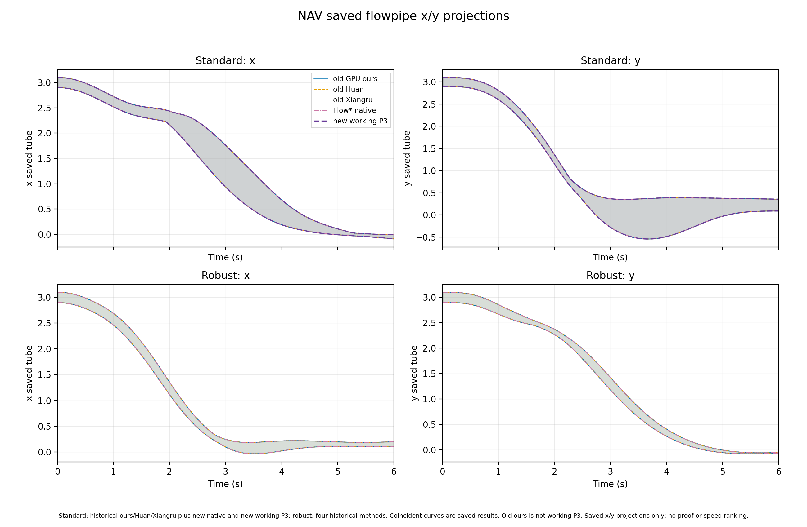
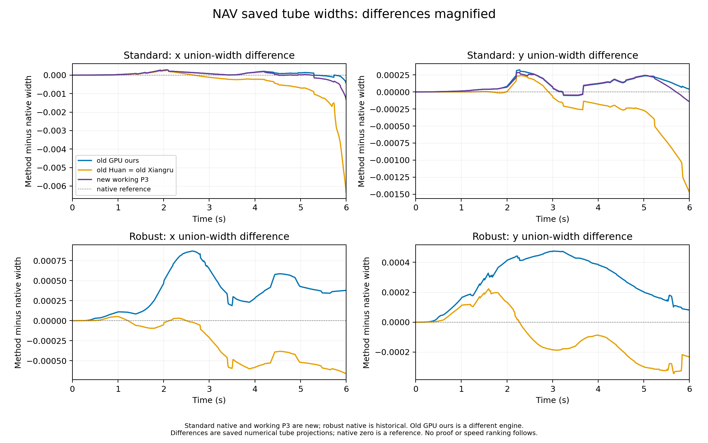

# ARCH-COMP26 非 VCAS 四方实验报告：可审阅草稿（不可作为最终成绩）

> 2026-10-03 接续修订。本稿按[200 条本轮尝试](evidence/archcomp26_nohash_attempts_20261001.json)和八格经审计历史全程重建 16 个实例小节，仍是可审阅阶段稿，不是最终四方成绩。当前覆盖与各项原始运行目录见[无哈希工作矩阵](evidence/archcomp26_nohash_work_matrix_20261001.md)、[覆盖附表](evidence/archcomp26_coverage_overlay_20261002.md)及[执行进度](GOAL_EXECUTION_PROGRESS_20261001.md)。

> 本轮按用户要求没有计算或校验内容摘要。历史结果只按已有收据和合同审计引用；新作业保留路径、配置、日志和保存范围，旧与新运行的模型、数值配置和计时资格分别标明。

> 下方 16 个逐实例小节按当前 200-attempt 截点重排，数值全程、性质、计时、图与缺件分别注明。恢复前旧基线矩阵只用于历史边界，不决定本轮状态。

## 摘要与边界

目标是在同一冻结 benchmark 合同下比较 PyTorch/GPU、Huan、Xiangru 和 Flow* native 的完整性、进程时间与绝对 flowpipe 宽度。共享驱动仅用于控制变量，不等同于三套独立 NNCS 产品。

- 报告状态：**可审阅、不可发布为完整四方成绩**。
- 执行状态：2026-10-01 已恢复；新工作索引中 DP less 四方、论文方程 QUAD 四方、Single Pendulum 两物理态四方、TORA remain P3/原生、ACC participant-order 四方、修正 unsafe 后 Attitude 四方、Docking 四方、Unicycle 论文方程四方、TORA reach-sigmoid 官方 `u=11f` 四方、新 TORA reach-tanh working P3，以及 NAV standard 当前 P3/原生、NAV robust 当前 P3，共 **38 个方法单元**有完整数值时域记录。Docking 四方性质均为 `Unknown`，Unicycle Huan/Xiangru 的终点包含判据未过；Airplane 连续版完整初盒的 P3/Huan/Xiangru/Flow* native 新入口均失败且未得可接受全时流管；DP more 四方均未完成 T=0.4，P3 最新 affine-split4 尝试在 72/80 小步后由作者 checker 输出 `Unsafe.` 而早停，旧区间控制余项尝试在第 9 小步数值拒绝；TORA remain Huan/Xiangru 全程尝试有拒绝盒与 `Unknown.`。本轮未尝试的 9 格包括缺权威离散语义的 Airplane 四格，以及已有同合同历史全程的 NAV/TORA reach-tanh 五格；另外三个短前缀格也有同合同历史全程证据。
- 覆盖：16 个实例 × 4 个方法 = 64 个 cell。
- 当前可写的实测结论：新原生 DP less 225×100、修正危险集的 Attitude 四方 1×60、论文方程 QUAD 四方 1024×1000、Single Pendulum 两物理态四方 1×100、TORA remain P3/原生 12×200、ACC participant-order 四方 1×50、Docking 四方 1×400 均有完整数值运行；DP less P3 分区仿射版本与 Huan/Xiangru 225×100 也完整；P3 仍无端到端严格证书。Docking 四方的非线性安全性质未决；原生外层 `failed/exit 2` 因 checker `UNKNOWN`，原始状态未改写。ACC、具名两物理态 Single Pendulum 与修正危险盒后的 Attitude 各有四方每法 5 次后续独立进程计时；这些完成时间不能仅凭当前数据做稳定速度排名或声称独立端到端浮点 NNCS 证明。失败前缀时间不外推为完成时间。

[16×4 新旧覆盖附表](evidence/archcomp26_coverage_overlay_20261002.md)单独核对了八格同合同历史完整时域：NAV standard/robust 共五格及 TORA reach-tanh 的 Huan/Xiangru/原生三格；TORA tanh P3 已由新 working P3 全程覆盖。故 64 格按证据来源分为 **38 格本轮新全程、8 格同合同旧全程、14 格无全程、4 格 Airplane discrete 合同阻塞**。旧结果不增记为 200 条新尝试；“全程”只指保存的数值时域，并不提升模型身份、性质或计时资格。[200 条截点完整阶段 DOCX/PDF](evidence/results/archcomp26_20261001/stage_report/README.md)与当前 Markdown 对应；187 条两页进度稿和 189 条完整阶段稿均保留为旧截点，不倒填后续证据。

TORA remain 作者两方的[只读数值拒绝审计](ARCHCOMP26_TORA_REMAIN_NUMERIC_STOP_AUDIT_20261002.md)确认：各记录 200/200 步但只接受 2357/2400 盒步；第 185 步首次保存 tube 出安全带，第 190 步首次发生数值盒拒绝，末步各仅 6/12 盒接受。`safe_unknown` 不停积分，最终 `Unknown.` 不是盒拒绝原因；关闭性质检查不能补齐原有流管。拒绝的具体数值状态子类未记录，不作猜测。

绘图新增[真实 Taylor 模型八方向导出](flowpipe_plot_nohash.md#actual-taylor-model-eight-direction-projection)：隔离三步 plant-only 谐振子 smoke 全部验证通过，并保存 tube/endpoint 的方向界、MATLAB 脚本、PNG/PDF 与[108 项有限解析采样审计](evidence/results/archcomp26_20261001/tm_octagon_harmonic_smoke_20261002_001/SUMMARY.md)。第三步 endpoint 显示多边形面积为坐标盒的 0.8488663；这只证明导出器在该短例中保留了相关性。现有 QUAD/P3/native 归档范围只含逐坐标区间，仍只能画 box，不能从中重建真实 octagon；MATLAB/Octave 尚未实跑。

**原生 Flow* 有独立数值有效性门禁失败。** [隔离 QUAD SR 首盒首小步审计](ARCHCOMP26_NATIVE_OCTAGON_PRODUCTION_GATE_20261002.md)保留冻结论文方程和控制器注入，只跑一盒、一次控制、一个 `h=0.005` 小步；原库虽返回 `COMPLETED_SAFE`，其 `x7/x8` 末态轴界却漏包 CROWN 仿射余项放松控制集内的数值样本，最大超界 `1.98259×10⁻⁶`，DOP853/Radau 参考差最多 `2.054×10⁻¹⁵`。这足以阻止将原生 accepted/`VERIFIED` 提升为独立正确性证明或接入真八方向生产图，但所选常值控制未证明是真实 NN 输出，亦不能据一个短步断言原长作业每条保存界错误。38 格本轮数值时域覆盖仍按原始完成记录统计，性质资格保持分列。

另立的[两处 VAR 截断尾项复制库短门禁](evidence/results/archcomp26_20261001/native_quad_var_tail_repair_gate_20261002_007/README.md)保留原余项细化循环，普通谐振子两种三步路径各通过 1,512 项有限解析样本检查；论文 QUAD 首盒首步 observer 开/关一致，513 条放松控制参考轨迹的 20,520 项检查没有越界。修补版 x7/x8 首步终点宽度比简单跳过细化的复制库约窄 139 倍，但明显宽于原库漏包界。它是隔离修复候选；最初独立门只覆盖旧窄 RPC 输入域，遗漏源码初盒下缘 1 ULP。下文的双侧重心化及全 1024 盒首步门补上了这处初盒边界，但仍不是 50 期 NNCS 证明。原生生产八方向门禁保持关闭；方法诊断均不计入 200 条实例尝试。

进一步的保存 RPC 域整步独立区间审计曾记录修补复制库 27/32、原库 23/32；后来[全盒方法守卫](evidence/results/archcomp26_20261001/native_quad_allbox_independent_plant_firststep_20261003_004/README.md)发现原 Decimal 脚本的一元负号与绝对值会按默认 28 位向内舍入，旧记录本身不能充当有向包含证明。[另立修正后重审](evidence/results/archcomp26_20261001/native_quad_legacy_narrow_rpc_decimal_reaudit_20261003_006/README.md)以精确变号/绝对值、1000 子步严格 Picard 和原保存 RPC/范围重新得到原库 23/32、修补复制库 27/32；同域[精确代数检查](evidence/results/archcomp26_20261001/native_quad_algebraic_gate_20261003_001/README.md)补足修补版三项合成物理态比较，达到 20/20，另两项 pre 列只作数值比较。[重心化审计](evidence/results/archcomp26_20261001/native_quad_initial_recenter_gate_20261003_001/README.md)发现该 RPC 域不含源码首盒 x1–x3 最下缘 1 ULP，不能据此宣称完整初盒资格。

另一独立[复制库双侧半径修补门](evidence/results/archcomp26_20261001/native_quad_initial_recenter_repair_gate_20261003_002/README.md)保留 VAR-tail 两处修补，并改 `toCenterForm` 使首盒新 RPC 包含源码首物理盒全部十二维。仅对这**一个盒、首个 0.005 秒步**，观察器开/关均接受且保存范围相同，513 个数值参考样本无越界；用[修正 Decimal 方法的独立重审](evidence/results/archcomp26_20261001/native_quad_allbox_independent_plant_firststep_fixed_decimal_20261003_005/README.md)重新取得 1000 子步严格 Picard 的 27/32，并核对精确代数五项与同一保存界，恢复新 RPC 域 20/20 项合成物理态包含。pre 列仍非 pre 集合证明；CROWN/NN、其余盒、后续控制期、Flow* 解析和全时性质没有被这道短门证明。冻结原库结果未改，原生生产门继续关闭。

随后[同一复制库候选的全 1,024 初盒首小步求解门](evidence/results/archcomp26_20261001/native_quad_allbox_firststep_recenter_gate_20261003_003/README.md)仅做一次 1,024 盒 CROWN 调用，各盒在首个控制调用下接受一个 `h=0.005` 小步。全部 12,288 个保存 RPC 输入坐标界覆盖相应源码初盒；1,024 条 native 范围、8,192 条方向区间行（每盒 tube、endpoint 各四条）及 12,288 条终态轴界完整有限有序，首拒为无。C++ 4.618 秒是这 1,024 个首步的时间，不能当作 0.1 秒完整控制期或五秒总时长。另立的独立 plant 门先[发现旧 Decimal 方法缺陷](evidence/results/archcomp26_20261001/native_quad_allbox_independent_plant_firststep_20261003_004/README.md)，经[精确一元运算修复及前七盒门检](evidence/results/archcomp26_20261001/native_quad_allbox_independent_plant_firststep_fixed_decimal_20261003_005/README.md)，再以[逐盒精确控制界的自适应首离开条件](evidence/results/archcomp26_20261001/native_quad_allbox_independent_plant_adaptive_bootstrap_20261003_006/README.md)完成全部 1,024 源盒首步：各盒 1000 次严格 Picard，20,480/20,480 项合成物理态界包含于复制库保存范围；[另一个只读账本审计](evidence/results/archcomp26_20261001/native_quad_allbox_firststep_ledger_audit_20261003_007/README.md)重建控制包络及七项严格条件，核实盒号连续、计数与比较。这只是在**假定保存 CROWN 仿射余项包络覆盖真实控制**下的首个 plant 小步检查；CROWN/NN、首期余下 19 小步、后续控制、Flow* 浮点解析及全时性质仍未证实。原生生产八方向门继续关闭，且这些诊断不增加主表完整时域格数。

[第一个源盒的第二小步隔离回放](evidence/results/archcomp26_20261001/native_quad_lane0_secondstep_replay_20261003_008/README.md)不用第二次 CROWN 调用，先把原首步的二进制范围、八方向和十二个终态轴直接复现，再以同一常值控制一次推进到 `t=0.010`，2/2 小步数值接受。独立 plant 检查重新证明该时窗的七项首离开条件，用连续两段各 1000 次严格 Picard 构造第二小步 tube 与终点；第二小步 20/20 个合成物理界落在保存的未扩张 binary64 界内。此结果只覆盖第一个源盒的前两小步，且仍以保存 CROWN 控制包络有效为前提。另立[保存 NN 包络合同审计](evidence/results/archcomp26_20261001/native_quad_saved_crown_nn_contract_audit_20261003_001/README.md)发现原 RPC 未保存上界斜率；首盒第一输出直接分离区间法的 `T·X` 宽 3.39016，而保存残差带宽仅 0.06710，不能用该方法补出网络证书。[首盒相关仿射 sigmoid 检查](evidence/results/archcomp26_20261001/native_quad_lane0_nn_affine_certificate_20261003_009/README.md)也仅得 `UNDECIDED`：第一输出的独立残差包络宽 0.09847，大于保存带宽 0.06710；其余两输出亦未包含。这是外包络过宽，不是网络反例；64 子盒尝试未完成，不能称覆盖。[全 1024 盒系数传输门](evidence/results/archcomp26_20261001/native_quad_crown_f32_transport_gate_20261003_001/README.md)另显示，原 CROWN 理想仿射证书在原生 `.asFloat()` 后没有自动继承的充分条件：三个输出的下界分别有 573、615、533 盒不满足，以上界同斜率为额外假设时，任一侧分别为 833、828、795 盒不满足。这也不是实际网络越界证据。[新同批控制器回放](evidence/results/archcomp26_20261001/native_quad_crown_same_slope_batch_20261003_001/README.md)补录上界斜率：新旧三组原已存系数 43,008 项逐值相同，`uA=lA` 的 36,864 项逐值相同。它只闭合首批数值回放的 same-slope 记录，仍未证明 CROWN 浮点 soundness 或原生 `float32` 包络；生产门关闭。这些诊断不增加主表格数。

## 2026-10-01 新尝试与旧冻结证据的分界

| 范围 | 已知状态 | 结果资格 |
|---|---|---|
| 新 2026 连续 Double Pendulum less-robust，Flow* native | 全 `[1,1.3]^4` 分为 225 盒；20 个控制期、100 个 `h=0.01` 子步；22,500 条唯一范围记录；作者 checker `VERIFIED`；单次全进程 1107.127423 s。见[本地原始副本与摘要](evidence/results/archcomp26_20261001/native_dp_less_full20_001/SUMMARY.md)。 | **单方法全程结果**。可报告绝对区间和单次时间；不能形成四方排名，范围记录不含 accepted/status。 |
| 新 DP less Huan / Xiangru | 与原生共用 225 盒 × 100 小步合同，各接受 22,500/22,500；进程 wall 分别 9.539174 s / 8.387790 s，保存 tube 各在全时安全带内。见[两方摘要](evidence/results/archcomp26_20261001/author_dp_less_v1/SUMMARY.md)。 | **两方单次全程数值结果**；共享控制驱动与主要数值源码，范围相同不是独立证明；没有四方排名资格。 |
| 新 DP less PyTorch/GPU P3 有向仿射分区 | 保持完整 225 初盒与 20×0.05 s 合同；同一全局控制仿射图 `T` 下，16 子盒诊断仍在第 75 步性质未决、第 84 步首拒。256 子盒新运行完成 100/100 小步、22,500/22,500 盒步接受，保存全时四态 tube 均在 `[-1.7,2]` 内，最小盒裕量 +0.093919848；外层 wall 74.274085 s。见[分区审计与原始镜像](ARCHCOMP26_DP_P3_PARTITION_DIAGNOSTIC_20261002.md)。 | **第四方完整数值时域结果**，但 `end_to_end_strict_certificate=false`；诊断时间包含逐盒观察写盘，不能与其它方法据单次 wall 排名。 |
| 新 DP more 四方前缀 | 原生保存 225×64/80 小步，checker `UNKNOWN`；Huan/Xiangru 各保存 225×72/80 小步后 checker `Unsafe.` 早停。P3 最新 affine-split4 也完整接受前 72 小步后由 checker 输出 `Unsafe.`；四方全盒保存安全的共同前缀仅到 `T=0.3`。另有严格内点 `(1.299)^4` 的独立数值轨迹，在约 `t=0.324865` 越过 `θ̇₁=-1.5`。见[原生摘要](evidence/results/archcomp26_20261001/native_dp_more_full20_001/SUMMARY.md)、[两方摘要](evidence/results/archcomp26_20261001/author_dp_more_v1/SUMMARY.md)、[新 P3 请求](evidence/results/archcomp26_20261001/dp_more_p3_affine_split4_full20_20261003_001/README.md)及[严格内点数值诊断](evidence/results/archcomp26_20261001/dp_more_interior_point_candidate_20261002/SUMMARY.md)。 | **四方均无 T=0.4 完整流管**；保存区间越界、作者 checker 标签和数值点轨迹均不构成独立严格反例或端到端证明。点诊断不是第五种 flowpipe 方法。 |
| 新 DP more P3 旧区间控制余项尝试 | 另立 225 盒×20 期/80 小步全时域入口，第 9 小步 225 盒全部 `FAILED_CONTRACTION`，首拒即停；前 8 小步 1,800/18,000 盒步接受，只到 `t=0.04`。独立重扫 7,200 个已接受四态 tube/endpoint 全部有限、有序且逐步包含；第 3 小步起部分盒跨安全带边界，保存区间对性质未决。原始外层 `failed/exit1`、wall 16.616363 s，未输出终局作者性质标签。见[原始收据、前缀扫描与逐步安全盒数](evidence/results/archcomp26_20261001/dp_more_p3_full20_interval_20261002_001/SUMMARY.md)。 | **数值早停，非 T=0.4 完整结果**；前缀 wall 不作全程速度，第 3 步区间越界不是实际不安全轨迹证明。 |
| 新 DP more P3 affine-split4 完整时域请求 | 保持独立 more ONNX、225 初盒、20 期、80 小步和 P3 数值阶数，只把控制器残差改为有向仿射四分外包络。先行三期门检 12/12 小步、2,700/2,700 盒步接受且保存 tube 全在安全盒内；另立完整请求数值接受 72/80 小步、16,200/18,000 盒步，`broken=0`，在第 18 期后作者 checker 打印 `Unsafe.` 停止。独立重扫 72×225 对 tube/endpoint 均有限有序且 endpoint 含于 tube；全盒保存安全前缀 60 步至 `t=0.30`，第 61 步首有区间跨带，第 72 步一盒的 `θ̇₁` tube 完全低于 −1.5。外层 `completed/exit0`、wall 62.360384 s 仅是早停进程时间。见[三期收据](evidence/results/archcomp26_20261001/dp_more_p3_affine_split4_threeperiod_20261003_001/README.md)与[完整请求原始结果及扫描](evidence/results/archcomp26_20261001/dp_more_p3_affine_split4_full20_20261003_001/README.md)。 | **性质早停，非 T=0.4 完整结果**；保存 tube 的带外区间和作者 `Unsafe.` 不升格为独立真实轨迹反例。旧第 9 步数值拒绝另行保留，两个前缀 wall 都不作完整时间排名。 |
| 新 Airplane continuous 完整初盒 Huan/Xiangru 入口 | 官方初盒是一个未分割 12 物理态盒，其中 `u,v,w,phi,theta,psi∈[0,1]`；旧点初盒不能复用。order-6 Huan 一周期入口在任何 ODE 步前建 19 变量六阶单项式对表，观测 RSS 超过 54,006,540 KiB 后终止该子进程组，wall 252.247 s。另立 order-3 诊断 profile，Huan/Xiangru 分别 wall 6.785/6.985 s，但唯一全初盒均在首个 `0.01 s` 小步被拒绝，0 个接受步；均未启动完整 `T=2`。见[三次原始尝试摘要](evidence/results/archcomp26_20261001/airplane_continuous_order3_fullbox_20261002/SUMMARY.md)和[入口来源审计](ARCHCOMP26_AIRPLANE_2026_ENTRY_AUDIT.md)。 | **数值入口/资源失败，无完整结果或性质结论**。Taylor 阶数不是官方强制字段，但两 profile 是不同数值配置；首步拒绝的内部细分原因未记录，不能猜成轨迹越界。P3 和原生完整初盒的独立 smoke 见下两行。 |
| 新 Airplane continuous 完整初盒 P3 入口 | 固定同一官方单盒、12→6 控制与 10×0.01 s 一周期 smoke。CPU 六输出严格注入预检通过且未初始化 GPU。第一次工作 P3/验证 P4 在首步构造表时因 `9^20 >= 2^63` 退出，wall 13.758 s、0 段；第二次另立严格 `solution_order` 工作/验证均 P3，越过表构造但首个 0.01 s 段唯一全盒 `accepted=false`，wall 12.500 s、0/10 接受。两次原始 `RESULT`、空范围和当时源码见[P3 摘要](evidence/results/archcomp26_20261001/AIRPLANE_P3_FULLBOX_SMOKES_20261002.md)。另立[回调首拒诊断](evidence/results/archcomp26_20261001/airplane_p3_first_reject_trace_smoke1_001/SUMMARY.md)在带 trace 的 eager 路径记录 `x,y,z` 自映射余项提议超出 `[-0.01,0.01]` 初猜，四次重心化仍失败，最终 `FAILED_CONTRACTION`、0/10 接受。 | **入口/首步数值失败**；未启动 T=2 full，无可用 tube 或性质结论。内部 trace 只说明另立的带回调诊断路径，不倒填原始无回调运行的逐位原因；自映射失败不是轨迹反例，耗时不可排名。 |
| Airplane P3 定向余项诊断 | 另立明确数值 profile，仅把 `x,y,z` 的 Picard 初猜扩至 `[-0.1,0.1]`，其余 16 分量和完整初盒、ONNX、ODE、步长、阶数不变。首步 trace 的自映射与细化通过，引擎返回 `accepted=true`；随后保存观察器的合并有效性检查抛 `invalid accepted interval at 1`，在写盘前退出，`ranges.bin` 与 observations 均为空。原[首份结果](evidence/results/archcomp26_20261001/airplane_p3_xyz_rem0p1_trace_smoke1_001/SUMMARY.md)没有保留四界；随后独立[observer 诊断](evidence/results/archcomp26_20261001/airplane_p3_xyz_rem0p1_observer_smoke1_001/SUMMARY.md)在同一配置、同一首步的原 guard 前保存全部原始界，定位到 `phi` 下界及 `y/z/theta/psi` 上界各相差 1–2 个 binary64 相邻值。全部 48 个值有限、endpoint 自身有序。 | **两次均为 0 个可用保存步、性质未评估**。后一次直接定位精确包含条件失败，但不能证明内部浮点差异成因；候选 tube 的 `phi/theta/psi` 上界仍超过安全阈值，不能把 observer 的向外合并当作安全证明或实际反例。回调路径耗时不可比较。 |
| 新 Airplane continuous 完整初盒 Flow* native 入口 | 同一单个完整 12 物理态盒、固定 2026 12→6 ONNX，隔离一期 smoke 三次：历史 order 6、order 3、以及 order 3 加宽余项 `[-1,1]`。各完成一次控制 RPC，首个 0.01 s Flow* 步均返回状态 4 `UNCOMPLETED_SAFE`、0/10 段接受；原始外层均为 `failed/exit2`，wall 依次 4.877421/3.925546/3.925656 s。`BOX_SAFE 1` 对零 tube 是空真，非性质结论；见[三次原始摘要和源码级停止条件](evidence/results/archcomp26_20261001/native_airplane_fullbox_smokes_20261002/SUMMARY.md)。 | **三次均首步数值不完成**；未启动 T=2 full，无可用性质样本。加宽余项是独立参数诊断；首步失败坐标和具体 Picard 余项值未记录，不能据此猜测轨迹越界或排序。 |
| Airplane native 原生首拒隔离追踪 | 固定 order-3、官方完整单盒和 12→6 控制器，两次新 1-RPC/1-小步运行均保留为真实 attempt。`_004` 把日志加在未调用的 Interval SR 重载，status 4、0 段且无新数值；`_005` 只把插桩移到实际 Real SR 重载，status 4、0 段，19 个 Picard 坐标有限有序，旧 `[-0.01,0.01]` 初猜未包含 `x/y/z/phi/theta` 的新提议；`x` 提议界 `[-0.069390255181559155,0.070282484851510674]`。两次初盒和 CROWN RPC 逐值一致，见[原始日志和独立审计](evidence/results/archcomp26_20261001/native_airplane_first_reject_trace_20261002_005/README.md)。 | **仅解释此 order-3 profile 的第一次数值自映射拒绝**；未启动 T=2，无性质结论。原旧三次 smoke 未被改写；更宽初猜的旧诊断也曾失败，不能据此声称单调放宽就能完成。 |
| Airplane native 加宽余项独立首拒追踪 | 在官方完整单盒、同一 12→6 ONNX 与 order-3 下，另立 `[-1,1]` 初猜的一次 RPC/一次 `h=0.01` 小步真实求解；原生 status 4、0 保存段、外层 exit 2。19 个第一轮 Picard 提议有限有序，但 `x/y/phi/theta/psi` 超出旧初猜，首拒 `x=[-2.52122191537212,2.5218805989602933]`；角度提议最大约 `3.05×10²⁰`。新旧初盒及 RPC 逐值相同，见[原始记录和独立审计](evidence/results/archcomp26_20261001/native_airplane_rem1_first_reject_trace_20261002_006/README.md)。 | **仍是 0 段首步数值拒绝**；宽初猜不保证收敛。极大角度界是区间计算提议，不是实际轨迹或性质反例；未启动 T=2。 |
| Airplane native 二分子盒首步 | 六个不确定初态各二分成 64 盒的规划保持原 ONNX、ODE、order 3、`h=0.01` 与余项。新 [`_007`](evidence/results/archcomp26_20261001/native_airplane_binary6_firststep_20261002_007/README.md)仅求全低角 `[0,0.5]^6`，19/19 Picard 自包含、1 RPC、1 段数值接受，status 2、exit 0。新 [`_008`](evidence/results/archcomp26_20261001/native_airplane_binary6_coverage_gate_20261002_008/README.md)仅求全高角 `[0.5,1]^6`，同样接受 1 段，但保存角度 tube 超安全上界，status 3 `COMPLETED_UNKNOWN`、exit 2。 | **仅 2/64 子盒各一步**，无完整初集首步或 T=2 结果。`_008` 是性质 Unknown，不是 Picard 拒绝或实际不安全轨迹。[官方 ONNX 高角点重放](evidence/results/archcomp26_20261001/native_airplane_highcorner_point_replay_20261002_009/README.md)的 11 个数值采样点未越带，点计算不计入四方法尝试，亦非全盒证明。 |
| 新 2026 论文方程 QUAD，P3 / Huan / Xiangru / Flow* native | 四方均覆盖全 1024 初盒、50 控制期、1000 个 `h=0.005` 小步。单次外层 wall 分别为 1357.555 / 94.583 / 108.018 / 47058.887 s。各方 `T=5` 的 `x3` endpoint union 分别为 `[0.9584732146312492,1.0256989633476477]`、`[0.967434441417146,1.015176258384569]`、同 Huan、`[0.965771839016746,1.0167484756616678]`。原生 `ranges.bin` 独立重扫有 1,024,000/1,024,000 条唯一有序盒步，均有限、有序、endpoint 含于 tube；作者日志打印 `VERIFIED`。见[P3 摘要](evidence/results/archcomp26_20261001/quad_paper_p3_nohash_v1/SUMMARY.md)、[Huan 摘要](evidence/results/archcomp26_20261001/quad_paper_huan_full50_001/SUMMARY.md)、[Xiangru 摘要](evidence/results/archcomp26_20261001/quad_paper_xiangru_v1/SUMMARY.md)、[原生扫描及原始收据](evidence/results/archcomp26_20261001/native_quad_paper_full50_001/SUMMARY.md)与[合同决策](ARCHCOMP26_QUAD_PAPER_CONTRACT_DECISION_20261001.md)。 | **四方各一次完整数值时域记录**。四条 `x3` 终点并集均在论文 `[0.94,1.06]` 目标内；P3 `end_to_end_strict_certificate=false`，其它三方亦无独立端到端浮点 NNCS 证明。原生单次进程占 GPU 1/CPU 6–9 长时运行，方法资源、阶数及观察器不同，不能据四条单次 wall 排名；作者 `VERIFIED` 不是独立证书。 |
| 新 Single Pendulum 两物理态，P3 / Huan / Xiangru / 原生 | 全初盒、20 期、100 小步均完成；单次 wall 依次为 6.583305 / 5.430762 / 5.528731 / 4.726027 s。安全性质只要求闭时间窗 `t∈[0.5,1]` 的 `x1∈[0,1]`；P3 在 50 个窗口安全事件下的保存 tube union 为 `[0.5645452654370386,0.9932406822927875]`，其它三方对应保存 tube 也在带内。见[合同与两 GPU 摘要](evidence/results/archcomp26_20261001/single_pendulum_prep_001/SUMMARY.md)、[P3 摘要](evidence/results/archcomp26_20261001/single_pendulum_two_state_p3_full20_001/SUMMARY.md)及[原生摘要](evidence/results/archcomp26_20261001/native_sp_two_state_full20_001/SUMMARY.md)。 | **四方单次全程数值结果**；配置明确把额外 `t` 当辅助时钟，不能冒充尚缺初值/执行源码的官方三态 MATLAB 运行，也不能按四条冷进程时间排名。 |
| 新 TORA remain，P3 / 原生 / Huan / Xiangru | 全初盒 12 分区、20 期、200 小步。P3 新适配 2400/2400 盒步接受、保存的全时四态 tube 在 `[-2,2]^4`，进程 wall 10.411001 s；原生 2400/2400 条范围、checker `VERIFIED`、wall 8.339151 s。Huan/Xiangru 各观察到 200 小步但仅接受 2357/2400 盒步，首次保存 tube 出安全带为步185、首次拒绝步190，checker 均 `Unknown.`，各自进程 wall 8.371523 s / 8.270158 s。见[共享合同](ARCHCOMP26_TORA_REMAIN_CONTRACT_20261001.md)、[P3 完整结果](evidence/results/archcomp26_20261001/p3_tora_remain_v1/SUMMARY.md)、[原生完整结果](evidence/results/archcomp26_20261001/native_tora_remain_full20_001/SUMMARY.md)及[两方失败尝试](evidence/results/archcomp26_20261001/author_tora_remain_v1/SUMMARY.md)。 | **P3/原生各有单次全程数值结果；两作者只有全部盒接受且保存 tube 安全的 `t≤18.4` 前缀**。Huan/Xiangru 的约 8 s 是失败进程，不能和完整时间排名；区间出带不是独立实际轨迹反例。P3/原生的保存盒安全亦非独立端到端浮点 NN 证明。 |
| 新 ACC participant-order，P3 / Huan / Xiangru / 原生 | 两份保存的参与者 C++ 源码指定 `v_rel=v_lead-v_ego`，而论文没有定义其符号；故按此明确命名的 profile 比较。四方均用完整单盒、固定 2026 ONNX、50 个 0.1 s 控制期，保存 tube 的安全半空间 `x_lead-x_ego-1.4*v_ego-10` 下界最小分别为 16.434859 / 16.165035 / 16.165035 / 16.254754，全部严格为正。最初各一次单独进程 wall 分别为 7.934 / 7.260 / 7.312 / 7.930 s；随后另开四方各 1 首轮+5 后续独立进程的轮换 campaign，均走完 50/50，详见下表。见[ACC 合同](ARCHCOMP26_ACC_PARTICIPANT_CONTRACT_20261001.md)、[四方证据汇总](evidence/results/archcomp26_20261001/ACC_PARTICIPANT_PROFILE_20261001.md)、[24 次 campaign](evidence/results/archcomp26_20261001/acc_fourway_campaign_001/SUMMARY.md)和[六态绝对端点/全时 tube CSV](evidence/results/archcomp26_20261001/acc_fourway_saved_ranges_20261001/README.md)。 | **四方全程数值结果及完整 5 次后续进程计时**；Huan/Xiangru 使用共享驱动且保存区间相同，VAR 修复只做了针对性单步验证。轮换同 GPU/CPU 的时间可描述，但另一块 GPU 同时跑 QUAD，冷定义并非重启主机，四方均缺独立端到端浮点 NN 证明，因此不宣称稳定速度排名。 |
| 新 Attitude Control P3 / Huan / Xiangru / 原生，修正 unsafe | 固定 2026 规格的 unsafe 盒要求 `-0.7≤x4≤-0.6`；旧 checker 误写成 `x4≥-0.4` 与 `x4≤-0.6`，实际是空集。四个新隔离 profile 各完成 30/30 控制期、60/60 小段。单次 wall 依次为 13.017036 / 7.094217 / 6.933376 / 6.281498 s。原生显式打印 `VERIFIED`；三 GPU 入口的修正 checker 均未打印 Unsafe/Unknown。四方各自保存的全部 60 个六维 tube 盒均与官方危险集不相交；原生 `x4` 全时上界为 `-0.710800050132425`，低于危险下界 `-0.7`。见[合同与旧错误](ARCHCOMP26_ATTITUDE_CONTROL_CONTRACT_20261001.md)、[原生扫描](evidence/results/archcomp26_20261001/native_attitude_avoid_full30_001/SCAN.json)、[P3 全程记录](evidence/results/archcomp26_20261001/p3_attitude_avoid_v1/full30_001/payload/RESULT.json)和[Huan 全程记录](evidence/results/archcomp26_20261001/author_attitude_avoid_v1/huan_full30_001/payload/RESULT.json)。 | **修正后四方单次全程数值结果**。旧 `VERIFIED` 不能证明官方性质；Huan/Xiangru 共享驱动且保存区间相同，安全结论依赖作者边界与保存盒扫描；仍缺独立端到端证明与稳定计时。 |
| 新 Docking P3 / Huan / Xiangru / Flow* native | 官方完整初盒 `[70,106]²×[-0.28,0.28]²`、原始四态输入/两力输出、40 个 1 s 控制期，四方各完成 400 个 0.1 s 数值小步；单次外层 wall 分别 17.412 / 12.699 / 12.668 / 9.139 s。非线性全时安全裕量 `q=√(vx²+vy²)-0.2-0.002054√(sx²+sy²)≤0` 的首个小步保守上界四方均约 `+0.016083`，全程 checker 均为 `UNKNOWN`。原生外层 `RESULT` 如实记录 `failed/exit 2`，同时保存 40/40 周期、400 tubes、40 RPC；末时绝对区间、原始记录和接口核对见[三方 GPU 摘要](evidence/results/archcomp26_20261001/DOCKING_FULLBOX_3METHODS_SUMMARY.md)与[原生摘要](evidence/results/archcomp26_20261001/native_docking_full40_001/SUMMARY.md)。 | **四方完整数值时域，性质未决**；q 盒与不安全侧相交不是实际轨迹反例，四条单次 wall 不能排名。原生退出码因性质未知，不能改写为作者 `VERIFIED`；没有独立端到端浮点 NNCS 证明。 |
| 新 NAV standard / robust Huan 首盒首周期 | 固定官方 point/set ONNX、作者可执行状态顺序 `[x,y,speed,heading]` 与输出顺序 `[speed_rate,heading_rate]`；分别取 640/25 初始分块的首盒，仅运行 30 期中的首个 `0.2 s` 周期。两个新 ID 各 20/20 小步接受，保存 tube 均与障碍盒分离，进程 wall 4.142439 / 4.417727 s。见[NAV 执行合同与短程证据](ARCHCOMP26_NAV_AUTHOR_EXECUTION_CONTRACT_20261002.md)。 | **仅短前缀**；未覆盖其余分块、`t=6` 终点到达或全程性质，不能给完整时间与四方宽度。论文状态文字和网络层宽与官方可执行材料仍须作为来源冲突注明。 |
| 新 NAV standard 原生首周期与独立全程作业 | 固定官方 point ONNX 和作者可执行顺序；隔离 smoke 对首盒运行一期，20/20 小步保存并独立扫描。随后另立 640 盒×30 期完整作业，原始 RESULT `completed`、exit 0、未超时，外层 wall 1478.865919 s；作者输出 `VERIFIED`。独立扫描 384,000/384,000 条保存盒步有限、有序、endpoint 含于 tube，保存 x/y tube 与闭障碍相交 0，640 个 T=6 endpoint 盒全部入闭目标。末时 x union `[-0.09175765699647812,-0.004467673970412854]`、y union `[0.08836682447943034,0.35454798657692854]`。见[全程原始收据、扫描和说明](evidence/results/archcomp26_20261001/nav_author_standard_native_full30_001/SUMMARY.md)。 | **单次完整数值时域及保存性质观察**。旧两个 300 s 超时尝试保留；原作业没有重启。作者 `VERIFIED` 不是独立端到端浮点 NNCS 证书，单次时间不参与稳定速度排名。 |
| 新 NAV standard 当前工作 P3 首周期 | 固定官方 point ONNX、作者可执行原序；工作 P3/验证 P4，strict endpoint/control injection、box same-slope CROWN。首盒 smoke 完成 20/20 小步、外层 wall 4.497773 s；另立的**全部 640 初盒首周期**门检完成 20/20 小步、12,800/12,800 盒步接受、wall 5.243638 s。独立重扫全部记录有限、有序、endpoint 含于 tube、每个初盒含于首步 tube，保存二维 x/y tube 与闭障碍相交 0。见[首盒扫描](evidence/results/archcomp26_20261001/nav_author_standard_working_p3_smoke1_001/INDEPENDENT_SAVED_RANGE_AUDIT.json)及[全盒一期扫描](evidence/results/archcomp26_20261001/nav_author_standard_working_p3_fullgrid_firstperiod_001/INDEPENDENT_SAVED_RANGE_AUDIT.json)。 | **该门检仅完整初集的 1/30 控制期**，不覆盖 `t=6` 目标；它强制 `steps=1` 且关闭目标检查。后续独立全程入口与结果见下行。旧 `ours` 全程使用不同历史引擎。 |
| 新 NAV standard 当前工作 P3 独立全程 | 新入口恢复官方 30 期、全时障碍和 `t=6` 目标 checker，并强制 640×600 盒步全接受及首拒停；原始 RESULT `completed/exit0`、600/600 小步及 384,000/384,000 盒步接受，作者输出 `VERIFIED`，单次外层 wall 28.999885 s。独立扫描 384,000 条原始范围，有限性、区间顺序、endpoint 含于同小步 tube、首步初盒包含、二维闭障碍避让和全部末端盒入闭目标均无异常。末时 x union `[-0.09058780124346533,-0.005241272342260411]`、y union `[0.08845848499512873,0.3542626232863495]`。见[原始收据、扫描与说明](evidence/results/archcomp26_20261001/nav_author_standard_working_p3_full30_001/SUMMARY.md)。 | **完整数值时域及保存区间性质观察**。旧 `ours` 的历史引擎不同；单次时间不作稳定四方速度排名，作者 `VERIFIED` 不等于独立端到端浮点 NNCS 证明。 |
| 新 NAV robust 当前工作 P3 独立全程 | 固定官方 set ONNX、作者可执行状态顺序与完整 25 盒，30 期共 600/600 小步及 15,000/15,000 盒步接受；原始 `completed/exit0`、未超时，作者 `VERIFIED`，单次外层 wall 18.703898 s。原始 2,040,000 字节范围已本地镜像并二次重读，15,000 条区间有限、有序、端点含于同小步 tube、首步含原初盒，保存二维障碍相交及终点目标遗漏均为 0。`T=6` x/y endpoint 并集为 `[0.10709245590899041,0.1982240186155469]`、`[-0.06337556479191862,-0.04827867885822918]`；见[原始收据和独立扫描](evidence/results/archcomp26_20261001/nav_author_robust_working_p3_full30_001/SUMMARY.md)。 | **完整数值时域及保存区间性质观察**。旧 robust `ours` 是另一代引擎，旧四方法图仍单列历史；新 P3 单次时间不能用于稳定四方速度排名或独立端到端浮点证明。 |
| 旧 NAV standard / robust Huan 完整运行的合同复核 | [逐项比对](ARCHCOMP26_NAV_AUTHOR_EXECUTION_CONTRACT_20261002.md#旧-huan-全程记录与当前可执行合同逐项比对)确认旧 point/set 模型与固定官方 2026 副本直接字节相同，旧方程、接口、初集 640/25 分区、0.2×30 时域与两项性质均与作者可执行 profile 相同。旧结果各 600/600 小步、384,000/15,000 盒步接受、exit 0；原始作者输出均 `VERIFIED`，driver wall 14.718815 / 11.655595 s。 | **可按原始资格引用的历史同合同全程证据**，不计为本轮新尝试索引，不重复运行。robust 本地镜像缺逐步范围，旧两条均无独立端到端浮点 NNCS 证书；历史 wall 不能当本轮同资源排名。 |
| 旧 NAV standard / robust Xiangru 完整运行的合同复核 | [独立逐字段及全量范围审计](ARCHCOMP26_NAV_XIANGRU_HISTORICAL_CONTRACT_AUDIT_20261002.md)确认旧 point/set ONNX 与固定官方副本直接字节相同，方程、状态顺序、640/25 初盒、30 期及两项性质符合作者可执行 profile。旧运行各完成 600/600 小步、384,000/15,000 盒步接受；全量保存 tube 均与障碍分离，末时 endpoint 入目标，作者输出 `VERIFIED`；driver wall 14.505592 / 12.583398 s。 | **历史同合同全程数值证据**，不新增本轮 attempt、不重跑。两条范围与旧 Huan 对应文件直接逐字节相同且共用数值核心，不能作独立正确性证明或速度排名。 |
| 旧 NAV `ours` standard / robust 与原生 robust | [历史证据审计](ARCHCOMP26_NAV_P3_NATIVE_HISTORICAL_AUDIT_20261002.md)核对旧 `ours` standard/robust 为 640/25 盒×600 步完整数值记录，原生 robust 为 25×600 完整记录；原生 15,000 条保存范围独立重读，所有 x/y tube 与障碍分离且末端盒入目标。 | **历史同合同记录，不新增本轮 attempt**。旧 `ours` 引擎为 `engine_linear_leaf_v2`，不冒充当前工作 P3；三条仍无独立端到端浮点 NNCS 证书，时间不参与新四方排名。 |
| 新 Balancing 固定仓库四输入 Huan 入口 | 单列 `balancing-fixed-repo-raw4`，使用完整初盒、原四态 ONNX、500 个 0.02 s 控制期和全时窗性质。CPU 模型预检通过；一期新 smoke 4/4 小步接受。全时域独立尝试只接受 98/2000 个计划小步，第 99 步在 `[0.49,0.495] s` 拒绝，外层 wall 8.218304 s，0 次 8–10 s 性质检查。见[原始结果与标签勘误](evidence/results/archcomp26_20261001/balancing_fixed_raw4_huan/AUDIT.md)。 | **早停，性质 UNKNOWN**；内部拒绝子因未被原始记录捕获，不猜测。此 profile 与论文五特征控制器不同，亦不提供四方时间排名。 |
| 新 Balancing 固定仓库四输入 Xiangru 入口 | 同一具名 raw4 完整初盒，order 6，一期 4/4 接受；独立 500 期配置在第 99/2000 小步首个 `FAILED_CONTRACTION`，98 步接受至 `t=0.49 s`，进程 wall 7.735129 s，性质窗 0/400 检查。独立重读发现 189 处保存 endpoint 超出同一步 tube，最大 `2.49e-14`，故引擎接受与严格可审计 tube 包含分开报告；见[原始证据与扫描](evidence/results/archcomp26_20261001/balancing_fixed_raw4_xiangru_20261002/SUMMARY.md)。 | **数值早停、性质 UNKNOWN**；保存 tube 的严格端点包含亦未通过。与 Huan 同在第 99 步首拒不构成独立正确性证明，论文五特征控制器仍缺。 |
| 新 Balancing 固定仓库四输入 P3 一期 | 同一具名 raw4 合同及完整单初盒，P3 工作三阶/验证四阶，首个 0.02 s 周期 4/4 个小步接受。原始进程 wall 5.230873 s，四条保存 tube/endpoint 独立读回均有限、有序且逐步包含。见[P3 一期摘要与原始收据](evidence/results/archcomp26_20261001/balancing_fixed_raw4_p3_smoke1_001/SUMMARY.md)。 | **仅短前缀**；8–10 秒性质窗未进入，0 次检查表示不适用；未跑 500 期、无四方速度资格或端到端浮点 NNCS 证明。 |
| 新 Balancing 固定仓库四输入 P3 全时域尝试 | 按同一 raw4 配置请求 500 期/2000 小步，保留 8–10 秒性质窗；第 87 小步首次 `FAILED_CONTRACTION`，仅前 86 小步接受至 `t=0.43`。独立扫描 87 条原始台账，86 个已接受四态 tube/endpoint 有限、有序、逐步包含；第 87 步无有效新 tube。外层 `failed/exit2`、wall 13.806936 s，性质窗 0/400 检查。见[原始结果与独立扫描](evidence/results/archcomp26_20261001/balancing_fixed_raw4_p3_full500_001/SUMMARY.md)。 | **早停、性质 Unknown/incomplete**，不是完整 500 期时间；旧 Huan raw4 第 99 步拒绝为另一条原始尝试。论文五特征控制器仍缺，不能把 raw4 前缀当论文主合同结果。 |
| 新 Balancing 固定仓库四输入 Flow* native | 首个隔离原生入口在第一个数值步前解析失败、exit 139、0 条范围，原始失败保留；修正表达式文本后的新一期入口完成 4/4 小段。独立 500 期请求完成前 20 期和第 21 期的 3/4 小段，随后 status 4 `UNCOMPLETED_SAFE` 首停，保存 83/2000 段至约 `t=0.415 s`，outer exit 2、wall 5.731613 s、8–10 秒性质窗 0/400 检查。83 条五坐标范围独立扫描有限、有序，endpoint 在同段 tube 内。见[三个原始 run 与两类独立审计](evidence/results/archcomp26_20261001/native_balancing_raw4_20261002/SUMMARY.md)。 | **数值早停、性质 Unknown/incomplete**；短前缀和失败进程的 wall 不算 500 期完成时间。原生五坐标含辅助时钟，控制器仍为固定仓库四物理态输入；论文五特征控制器尚未取得。 |
| Balancing/CartPole 来源审计 | Balancing 论文写五特征控制器而固定 ONNX/MATLAB 是四原态，论文闭窗 `[8,10]` 与实例规格 `8<t≤10` 不同。见[逐项审计](ARCHCOMP26_DOCKING_BALANCING_SOURCE_CONTRACT_20261001.md)。 | 仓库四原态 profile 已单列四方法实际早停与短程；不能冒充未解决的论文五特征执行。 |
| TORA reach-sigmoid 官方模型 `u=11f` / Huan | 与旧 sigmoid 的 `u=22(f-0.5)` 不同；新独立入口先有一次误选 Python 环境、0 小步的[失败收据](evidence/results/archcomp26_20261001/tora_reach_sigmoid_official2026_mat_u11_full500_huan_001/SUMMARY.md)，随后新 run 10 期、500/500 小步接受，wall 11.285899 s。500 条原始区间独立扫描有限、有序且 endpoint 含于同小步 tube；`T=5` 保存数值 endpoint `x1=[0.1346564224,0.1604743267]`、`x2=[-0.8762353073,-0.8507148906]`，在目标盒内。见[全程原始证据](evidence/results/archcomp26_20261001/tora_reach_sigmoid_official2026_mat_u11_full500_huan_002/SUMMARY.md)。 | **具名官方文件 profile 的完整数值时域**；性质 checker 未运行，终点包含仅是已保存数值区间的充分条件观察。论文合并文字的输出激活不同；用户已选官方 2026 模型及 `u=11f` 为新版主表合同。此行可作为主合同下的 Huan 数值结果，仍无作者性质 checker 或速度排名资格。 |
| TORA reach-sigmoid 官方模型 `u=11f` / Xiangru | 独立新 run 先有全初盒一期 50/50 接受，再有 10 期、500/500 小步完整数值运行，wall 11.335332 s。独立扫描 500 条四态 tube/endpoint 有限、有序且逐步包含，`T=5` 保存 endpoint 的 `x1/x2` 与 Huan 行相同并落目标。两方原始范围直接逐字节相同，见[一期门检](evidence/results/archcomp26_20261001/tora_reach_sigmoid_official2026_mat_u11_xiangru_firstperiod_001/SUMMARY.md)与[全程记录](evidence/results/archcomp26_20261001/tora_reach_sigmoid_official2026_mat_u11_xiangru_full500_001/SUMMARY.md)。 | **用户选定主合同下的完整数值时域**；性质 checker 未运行。与 Huan 共用作者驱动的数值一致性不提供独立正确性证明，单次 wall 也无排名资格。 |
| TORA reach-sigmoid 官方模型 `u=11f` / P3 | 完整初盒一期 50/50 通过后，独立新 run 完成 10 期、500/500 小步；外层 wall 13.741791 s。独立扫描 500 条保存 tube/endpoint 均有限、有序且逐段包含；`T=5` 的 `x1=[0.1345258159,0.1606047516]`、`x2=[-0.8764374243,-0.8505126711]` 落入目标。见[一期门检](evidence/results/archcomp26_20261001/tora_reach_sigmoid_official2026_mat_u11_p3_firstperiod_001/SUMMARY.md)与[全程原始记录](evidence/results/archcomp26_20261001/tora_reach_sigmoid_official2026_mat_u11_p3_full500_001/SUMMARY.md)。 | **用户选定主合同下的完整数值时域及保存终点充分条件观察**；性质 checker 未执行，也无独立端到端浮点 NNCS 证书。P3 数值阶数与作者入口不同，单次 wall 不用于排名。 |
| TORA reach-sigmoid 官方模型 `u=11f` / Flow* native | 独立源码把官方四层 sigmoid `.mat` 导出的图内 `11f` 控制器经 RPC 外部 `1/0` 注入原生模型，先通过 CPU 预检和一期 50/50 门检。全程新 run 完成 10 期、500/500 小段、10 次 RPC；外层 wall 8.991666 s，作者终点 checker 打印 `VERIFIED`。独立扫描 500 条四态范围有限有序、endpoint 均在同段 tube；`T=5` 的 `x1=[0.1345319317,0.1605988723]`、`x2=[-0.8763648123,-0.8505857061]` 落入目标。见[一期门检](evidence/results/archcomp26_20261001/native_tora_reach_sigmoid_u11_smoke1_001/SUMMARY.md)与[全程原始证据](evidence/results/archcomp26_20261001/native_tora_reach_sigmoid_u11_full10_001/SUMMARY.md)。 | **用户选定主合同下的完整数值时域、保存终点充分条件及作者 checker 标签**；仍无独立端到端浮点 NNCS 证书。单次 wall 不用于排名。 |
| TORA reach-tanh 官方模型 `u=11f` / 当前 working P3 | 固定官方 ReLU³/tanh 和完整初盒下，新 0.5 s 门检 50/50 接受；另立 10 期/500 步新作业全部接受，独立扫描 `T=5` 的 `x1=[0.06791520996448479,0.09301949154372924]`、`x2=[-0.8033787322621515,-0.7759834292813406]`，均在目标内。外层 wall 13.456629 s；见[门检](evidence/results/archcomp26_20261001/tora_reach_tanh_official2026_mat_u11_workingp3_firstperiod_20261002_001/SUMMARY.md)及[全程原始记录](evidence/results/archcomp26_20261001/tora_reach_tanh_official2026_mat_u11_workingp3_full500_20261002_001/SUMMARY.md)。 | **本轮新完整数值时域与终点包含观察**；性质 checker 未运行，不能补写 `VERIFIED`。新引擎是 `engine_quad_normalization_center`，旧 `engine_linear_leaf_v2` P3 只留作历史对照；单次 wall 不作排名。 |
| TORA reach-tanh 官方模型 `u=11f` / 作者历史复用 | 新 Huan 一期 50/50 小步接受，与保存的旧 Huan 全程前 50 步四态 tube/endpoint 共 800 个边界值逐值相同。旧 Huan、Xiangru、原生各有同合同 500 步全程原始记录；旧 P3 全程另存代际对照，见[一期和只读复用审计](evidence/results/archcomp26_20261001/tora_reach_tanh_official2026_mat_u11_firstperiod_diag_001/SUMMARY.md)。 | **三格以历史同合同全程覆盖**；旧实验未重启。论文合并文字写 sigmoid 隐层，和官方 ReLU 隐层冲突；原生旧 `VERIFIED` 是终点 checker 标签。 |
| 旧 QUAD 作者合同 | Huan parity 5 次完整运行、旧 P3 完整一次、native 6 小时超时仅到 600 步；另有 40 步 parity/strict 新诊断，但使用旧模型。见[速度与模式分析](HUAN_QUAD_SPEED_AND_MODES.md)。 | **历史机制/回归证据**；合同与数值保证不同，不构成 2026 四方同合同对比。 |
| 其余 2026 cell | 除上述新尝试外，更多共同合同和方法支持仍需逐项落实；旧 14 项成绩不能平移。 | **待运行或待预检**；保留全部行和变体，不用空白代替失败记录。 |

QUAD 已存逐步包络的[持续入带复核](evidence/results/archcomp26_20261001/quad_paper_fourway_saved_20261002/SUMMARY.md#保存区间的到达后持续入带诊断)显示：原生自 `t=3.87 s`、P3 自 `t=3.95 s` 起直到 5 秒的每个小步，全部初盒的 pooled `x3` 数值包络均在目标带内。P3 使用 tube 与 endpoint 的并集包络，因为逐步观察器有至多 `8.88e-16` 的端点越出 tube 差异。Huan/Xiangru 缺逐步坐标范围，不具备相同的持续入带结论；此后处理也不替代 2026 参与者全时间窗 checker 或端到端证明。

四方 `x1`–`x12` 的终点绝对上下界与宽度见[逐态 CSV](evidence/results/archcomp26_20261001/quad_paper_fourway_saved_20261002/terminal_12states_fourway.csv)。P3 的驱动终态与最后一步观察器终态分别标行，两者是同一方法的不同保存对象；在 `x5` 一个界上最大相差约 `5.69e-6`，不混用其宽度。

Docking 四方保存的 `T=40` **endpoint 绝对宽度**如下；[完整 CSV](evidence/results/archcomp26_20261001/docking_fourway_saved_widths_20261002.csv)还含每个状态的上下界与全时 tube union。它从各自保存的 400 步数值范围只读重算，四方性质仍都是 `UNKNOWN`，宽度不是安全证明。

| 方法 | sx | sy | vx | vy |
| --- | ---: | ---: | ---: | ---: |
| Huan | 254.457714 | 256.943235 | 11.837248 | 11.874525 |
| Xiangru | 254.457714 | 256.943235 | 11.837248 | 11.874525 |
| ours/P3 | 256.231859 | 258.382455 | 11.835103 | 11.872969 |
| Flow* native | 273.583676 | 273.856158 | 12.392946 | 12.389239 |

具名[Single Pendulum 两物理态正式轮换计时](evidence/results/archcomp26_20261001/sp_two_state_fourway_campaign_20261002_001/SUMMARY.md)另有四方各 1 次首轮、5 次后续独立进程；24/24 个新作业均完整接受 100 小步，闭性质窗的 50 段保存 tube 全在安全带内。全部在同一物理 GPU 2 与 CPU 10–13 顺序运行，native 每次 20 RPC。下表是后五次外层进程 wall 的描述统计，不能替代官方三态 MATLAB 合同或端到端证书。

| 方法 | 后 5 次中位数 (s) | min–max (s) |
| --- | ---: | ---: |
| Flow* native | 4.729023 | 4.728539–4.729131 |
| Huan | 5.380765 | 5.280744–5.681419 |
| Xiangru | 5.480807 | 5.380850–5.581295 |
| ours/P3 | 6.183896 | 6.133769–6.483611 |

修正危险盒后的[Attitude 四方新进程轮换计时](evidence/results/archcomp26_20261001/attitude_corrected_fourway_campaign_20261002_001/SUMMARY.md)也已完成：四方法各 1 次首轮与 5 次后续独立进程，24/24 次都接受 30 期、60 小段。独立审计扫描 1,440 条六态保存范围，全部初盒覆盖、端点包含于同段 tube，所有 tube 与修正后的闭危险盒分离；native 共 180 次 RPC/HTTP 200。物理 GPU 2、CPU 10–13 顺序运行，P3 仅把启动器的设备守卫改为 GPU 2。下表是后五次完整进程 wall 的描述统计；原始逐次数据和审计见同目录的 `RUNS.csv`、`INDEPENDENT_AUDIT.json`。

| 方法 | 后 5 次中位数 (s) | min–max (s) |
| --- | ---: | ---: |
| Flow* native | 6.181135 | 5.982561–6.182214 |
| Huan | 6.834693 | 6.833845–7.036363 |
| Xiangru | 6.884601 | 6.783011–6.986936 |
| ours/P3 | 12.952000 | 12.851353–13.154223 |

这组同资源时长只属于修正危险集的具名合同；保存盒判交与作者 checker 仍不构成独立端到端浮点 NNCS 证明，也不足以给四方稳定速度排名。

主图保留同轴比较，standard 现有旧三方加新原生/当前 working P3 共五条，robust 仍为四条历史曲线。曲线接近是数值结果本身；旧 Huan/Xiangru 的全部保存上下界完全相同，其余差异在约 0–3 的坐标尺度上也很小。新 P3 与新原生在 600 步中 x/y tube 任一上下界的最大绝对差分别为 0.001169854 / 0.000317267。辅助图放大 `tube 联合宽度 − 原生宽度`：standard `t=6` 当前 P3 比新原生 x/y 窄 0.001313132 / 0.000142738，旧 Huan/Xiangru 窄 0.006344828 / 0.001473943。robust 旧 Huan/Xiangru 对旧原生 x/y 窄 0.000661962 / 0.000232496。见[逐步来源、旧四方法附图与差值说明](evidence/results/archcomp26_20261001/nav_fourway_historical_vs_new_20261002/README.md)。旧 `ours` 不是当前工作 P3；x/y 单轴曲线不能自行证明二维闭障碍避让，逐盒二维判交另见原始扫描；图不用于时间排名或独立证明。

NAV 末时 `T=6` 的 x/y **endpoint** 联合绝对区间与宽度如下；每一步 tube/endpoint 汇总在[standard 旧四方法 CSV](evidence/results/archcomp26_20261001/nav_standard_fourway_saved_20261002/xy_saved_curves.csv)、[robust 旧四方法 CSV](evidence/results/archcomp26_20261001/nav_robust_fourway_saved_20261002/xy_saved_curves.csv)、[新 standard P3 CSV](evidence/results/archcomp26_20261001/nav_author_standard_working_p3_full30_001/xy_saved_curves.csv)和[新 robust P3 CSV](evidence/results/archcomp26_20261001/nav_author_robust_working_p3_full30_001/xy_saved_curves.csv)。Huan/Xiangru 区间相同，不能当两份独立证明；standard 的原生/当前 P3 与 robust 当前 P3 为本轮新样本，其余为历史样本。上方 robust 同轴图仍是旧四方法历史截点，未把新 P3 冒名放入旧 `ours` 曲线。

| NAV 变体 | 方法与代际 | x 终点 `[lo,hi]` / 并集宽 | y 终点 `[lo,hi]` / 并集宽 |
| --- | --- | --- | --- |
| standard | 旧 ours | `[-0.091194196,-0.004969833]` / 0.086224364 | `[0.088378909,0.354367040]` / 0.265988130 |
| standard | 旧 Huan | `[-0.088038183,-0.007714880]` / 0.080323302 | `[0.088956433,0.353429703]` / 0.264473271 |
| standard | 旧 Xiangru | `[-0.088038183,-0.007714880]` / 0.080323302 | `[0.088956433,0.353429703]` / 0.264473271 |
| standard | 新原生 | `[-0.091757657,-0.004467674]` / 0.087289983 | `[0.088366824,0.354547987]` / 0.266181162 |
| standard | 新 working P3 | `[-0.090587801,-0.005241272]` / 0.085346529 | `[0.088458485,0.354262623]` / 0.265804138 |
| robust | 旧 ours | `[0.106878780,0.198222499]` / 0.091343719 | `[-0.063394644,-0.048278311]` / 0.015116333 |
| robust | 旧 Huan | `[0.107480569,0.197783592]` / 0.090303023 | `[-0.063191890,-0.048388902]` / 0.014802987 |
| robust | 旧 Xiangru | `[0.107480569,0.197783592]` / 0.090303023 | `[-0.063191890,-0.048388902]` / 0.014802987 |
| robust | 旧原生 | `[0.107081688,0.198080186]` / 0.090998498 | `[-0.063372111,-0.048295621]` / 0.015076490 |
| robust | 新 working P3 | `[0.107092456,0.198224019]` / 0.091131563 | `[-0.063375565,-0.048278679]` / 0.015096886 |

这张[四方 Docking 图及几何数据](evidence/results/archcomp26_20261001/plots/nohash_saved_20261001/docking_fullbox_4method_q_upper.geometry.json)按相同 0.1 s 网格显示各方法保存 tube 轴对齐盒的保守 `q` 上界；首秒另有局部放大。绿色只代表 `q≤0` 的安全区域，不代表四方已证明性质。三 GPU 方法共用驱动，原生与 GPU 的 observer/包络不同；曲线重合或接近不是独立正确性证明。

各项 smoke 单独计为短程入口检查，不是全程性能样本。旧 DP native 300 s 超时记录的二进制 RPC 端口与服务端口不一致，也不作为新结果。保存区间读回确认了对应运行记录的边界、接受与性质前缀；这种读回检查和较窄区间本身不证明控制器浮点包络或完整 NNCS 链路的可靠性。

### ACC 四方绝对宽度（参与者输入顺序，单次 T=5）

下表只列第 50 期已保存的六物理态 endpoint 宽度；每个方法的绝对 `lo/hi`、全时 tube `lo/hi`、观察函数和原始来源均在[逐方法 CSV](evidence/results/archcomp26_20261001/acc_fourway_saved_ranges_20261001/acc_t5_endpoint_and_full_tube_long.csv)与[口径说明](evidence/results/archcomp26_20261001/acc_fourway_saved_ranges_20261001/README.md)。原生观察器与 GPU 观察器不同，Huan/Xiangru 共用观察代码；此表仅作保存数值描述。

| 状态 | P3 | Huan | Xiangru | Flow* native |
|---|---:|---:|---:|---:|
| `x_lead` | 20.997866 | 21.012041 | 21.012041 | 21.012051 |
| `v_lead` | 0.198483 | 0.201754 | 0.201754 | 0.201758 |
| `a_lead` | 0.000699 | 0.000741 | 0.000741 | 0.000743 |
| `x_ego` | 5.163069 | 5.497976 | 5.497976 | 5.497999 |
| `v_ego` | 1.858046 | 2.015511 | 2.015511 | 2.015528 |
| `a_ego` | 1.096897 | 1.181106 | 1.181106 | 1.181124 |

### ACC 四方重复进程时间（同一 participant-order 合同）

[24 次新运行的逐次原始表](evidence/results/archcomp26_20261001/acc_fourway_campaign_001/SUMMARY.md)按方法轮换顺序，四方各有 campaign 首个新进程 1 次和后续独立新进程 5 次；全都完成单盒 50 期，保存 tube 半空间下界均严格为正。统一外层 wall 从 `Popen` 前计到子进程回收，native 包含 RPC 服务启动；下表后五次中位数排除首轮。它们在同一物理 GPU 2 与 CPU 10–13 顺序执行，同时 GPU 1 的论文 QUAD 长作业仍占用主机，且“cold”并非重启机器后的冷机。

| 方法 | 首轮 wall (s) | 后五次 median (s) | 后五次 min–max (s) | 有效后续次数 |
|---|---:|---:|---:|---:|
| P3 | 8.589842 | 8.740510 | 8.637965–8.840520 | 5/5 |
| Huan | 8.087964 | 8.237208 | 8.138279–8.337823 | 5/5 |
| Xiangru | 7.887486 | 7.987532 | 7.937743–8.086614 | 5/5 |
| Flow* native | 7.686284 | 7.736304 | 7.636556–7.786681 | 5/5 |

这些是当前运行条件下的描述性完整进程时间。Huan 与 Xiangru 共享数值驱动，native 与 GPU 观察器不同，四方均没有独立端到端浮点 NN 证明；时间先后不升级为正式稳定速度排名。最初的四次单独运行是另一组诊断，未混进上表中位数。

论文方程 QUAD 的四方十二个物理态 T=5 endpoint `lo/hi/width` 见[48 行无哈希 CSV](evidence/archcomp26_quad_paper_endpoint_4methods_20261002.csv)。原生一列还给出 1,024 个终点盒的宽度均值与最大值；其余三方原始 metrics 只提供并集边界，该两栏保持空白，不从并集宽度臆造逐盒统计。旧[36 行三方 CSV](evidence/archcomp26_quad_paper_endpoint_3methods_20261001.csv)保留为原生结束前快照。

| T=5 `x3` endpoint | P3 | Huan | Xiangru | Flow* native |
|---|---:|---:|---:|---:|
| 下界 | 0.958473215 | 0.967434441 | 0.967434441 | 0.965771839 |
| 上界 | 1.025698963 | 1.015176258 | 1.015176258 | 1.016748476 |
| 并集宽 | 0.067225749 | 0.047741817 | 0.047741817 | 0.050976637 |

四方终点并集均位于 `[0.94,1.06]`。表中的 P3 值取其 driver `final_hull`；下方图取逐步 observer 原始保存行，末行上界约高 `1.05×10⁻⁹`，来源和差异见[出图说明](evidence/results/archcomp26_20261001/quad_paper_fourway_saved_20261002/SUMMARY.md)。阶数、包络与资源路径不同，宽度差异不等于严格性或算法优劣排序。

### Attitude Control 四方绝对宽度（修正 unsafe，单次 T=3）

下表列第 60 个已保存小段的六物理态 endpoint 宽度。每个方法的 endpoint 和全时 tube 绝对 `lo/hi/width` 均在[24 行 CSV](evidence/archcomp26_attitude_avoid_4methods_abs_bounds_20261001.csv)；原始盒、正确危险集判交及观察器差异见[四方摘要](evidence/results/archcomp26_20261001/ATTITUDE_AVOID_4METHODS_SUMMARY.md)。此处数字是保存边界描述，不能独自构成浮点 NNCS 证书。

| 状态 | P3 | Huan | Xiangru | Flow* native |
|---|---:|---:|---:|---:|
| `omega1` | 0.004079 | 0.004174 | 0.004174 | 0.004194 |
| `omega2` | 0.005800 | 0.005936 | 0.005936 | 0.005980 |
| `omega3` | 0.005993 | 0.006173 | 0.006173 | 0.006194 |
| `psi1` (`x4`) | 0.031363 | 0.032070 | 0.032070 | 0.032292 |
| `psi2` | 0.017097 | 0.017362 | 0.017362 | 0.017636 |
| `psi3` | 0.018023 | 0.018479 | 0.018479 | 0.018637 |

### TORA remain 四方共同有效前缀

四方共同满足 **12 盒均接受且保存 tube 在 `[-2,2]^4`** 的最长前缀为 184/200 小步，即 `t≤18.4`；Huan/Xiangru 从第 185 步开始不能证明保存 tube 安全，第 190 步首次拒绝盒。下表只示论文图关注的 `x4` 终点，全部四态的共同前缀与完整时域 `lo/hi/union width`、每盒 endpoint mean/max、未完成值的空值见[四方 32 行 CSV](evidence/results/archcomp26_20261001/tora_remain_fourway_common_prefix_20261002/RANGES.csv)与[逐项解释](evidence/results/archcomp26_20261001/tora_remain_fourway_common_prefix_20261002/SUMMARY.md)。

| 方法 | `t=18.4` 的 `x4` endpoint union | 宽度 | 完整 `T=20` 的 `x4` endpoint union | 完整时域资格 |
|---|---|---:|---|---|
| P3 | `[0.308899115, 0.838149984]` | 0.529250869 | `[-0.815527594, 0.417677322]` | 2400/2400 接受，保存 tube 安全 |
| Huan | `[-0.859772472, 1.933073336]` | 2.792845808 | — | 2357/2400 接受，`Unknown.` |
| Xiangru | `[-0.859772472, 1.933073336]` | 2.792845808 | — | 2357/2400 接受，`Unknown.` |
| Flow* native | `[0.347754942, 0.806234558]` | 0.458479616 | `[-0.676217170, 0.283968209]` | 2400/2400 范围，`VERIFIED` |

Huan/Xiangru 完整终点保持空值，不能以第 200 步幸存盒取代全初集；区间越界不是物理轨迹反例。各方设备与观察器不同，表中宽度仅描述已保存结果，不构成独立端到端浮点 NNCS 证明。

这张[图及 MATLAB/PDF/几何数据说明](evidence/results/archcomp26_20261001/tora_remain_fourway_common_prefix_20261002/plots/SUMMARY.md)仅从保存区间重画；绿色 Safe 是全时 `x4∈[-2,2]` 投影，Huan/Xiangru 在第 185 步以后没有合格全初集流管，图中以未知标识。

## 比较规则

- 正式目标为 1 次冷启动和 5 次独立进程 steady；冷启动不进入 steady 中位数。长任务可预先声明较少 steady 次数并写明原因，但不得据此取得稳定排名资格。
- 只报告完整请求时域且明确允许性能测量的时间；失败前缀不外推完成时间。
- 宽度始终给绝对上下界、union width 和每分区 mean/max；本报告不计算宽度比。
- 四方共同前缀由合同采样网格上的逐时刻宽度序列交集派生；不同 domain、变量顺序或单位不会合并。
- 排名资格由四方 campaign、轮换、运行资源、完整分区覆盖和证书共同派生，结果 cell 不能自行声明。
- `failed`、`timeout`、`interrupted` 与有证据的 `unsupported/skipped` 都保留。

## 当前 16×4 非 VCAS 覆盖与历史复用

[本轮工作矩阵](evidence/archcomp26_nohash_work_matrix_20261001.md)登记 200 条新尝试；[覆盖附表](evidence/archcomp26_coverage_overlay_20261002.md)另核对八格同合同旧全程。64 格互斥分为本轮完整数值时域 38、历史同合同全程 8、无完整数值时域 14、Airplane 离散合同阻塞 4。“全程”只表示请求的数值时间段已保存；性质、浮点保证和计时资格分别读各节。旧结果未计入 200 条新尝试。

| 2026 实例 | 我方 GPU | Huan | Xiangru | Flow* native |
| --- | --- | --- | --- | --- |
| ACC safe-distance | 新全程 | 新全程 | 新全程 | 新全程 |
| Airplane continuous | 无全程 | 无全程 | 无全程 | 无全程 |
| Airplane discrete | 合同阻塞 | 合同阻塞 | 合同阻塞 | 合同阻塞 |
| Attitude Control avoid | 新全程 | 新全程 | 新全程 | 新全程 |
| Balancing reach | 无全程 | 无全程 | 无全程 | 无全程 |
| Docking constraint | 新全程 | 新全程 | 新全程 | 新全程 |
| Double Pendulum less-robust | 新全程 | 新全程 | 新全程 | 新全程 |
| Double Pendulum more-robust | 无全程 | 无全程 | 无全程 | 无全程 |
| NAV standard | 新全程 | 旧全程 | 旧全程 | 新全程 |
| NAV robust | 新全程 | 旧全程 | 旧全程 | 旧全程 |
| QUAD reach | 新全程 | 新全程 | 新全程 | 新全程 |
| Single Pendulum reach | 新全程 | 新全程 | 新全程 | 新全程 |
| TORA remain | 新全程 | 无全程 | 无全程 | 新全程 |
| TORA reach-sigmoid | 新全程 | 新全程 | 新全程 | 新全程 |
| TORA reach-tanh | 新全程 | 旧全程 | 旧全程 | 旧全程 |
| Unicycle reach | 新全程 | 新全程 | 新全程 | 新全程 |

八格旧全程为 NAV 五格和 TORA reach-tanh 作者 Huan/Xiangru/原生三格，逐格原始 result 与合同审计列于[覆盖附表](evidence/archcomp26_coverage_overlay_20261002.md)。NAV 固定官方 point/set 文件与旧使用副本已直接比对；作者另一 Git LFS 仓库模型的二进制身份尚未建立。TORA tanh 的旧“我方”是 `engine_linear_leaf_v2`，当前 P3 格改用独立新全程；Huan/Xiangru 共用主要数值驱动、保存区间相同，不能视为相互独立的正确性证据。旧 14 项到 2026 的主要变化包括新增 Docking 与 Airplane discrete、修正 Attitude 危险盒、区分论文 QUAD 与作者旧动力学、分列 Balancing 五特征和仓库四输入、冻结 TORA reach 缩放与 Unicycle 扰动语义；下列执行合同逐项解释。

每节按现行合同、四方状态、时间/宽度与图、未决项陈述。精确命令、环境、失败尝试以链接中的 START/RESULT、配置和[原始尝试索引](evidence/archcomp26_nohash_attempts_20261001.json)为准。单次、短前缀或混合历史的时间不构成四方速度排名；保存区间观察不自动成为独立端到端浮点 NNCS 证明。

## 1. ACC — safe-distance

- **合同与性质：** 具名 participant-order profile 使用固定 2026 ONNX、单个完整初盒、50 个 0.1 秒控制期到 T=5。参与者源码的相对速度取 v_lead−v_ego；全时检查 x_lead−x_ego−1.4v_ego−10≥0。[合同审计](ARCHCOMP26_ACC_PARTICIPANT_CONTRACT_20261001.md)记录论文未定义该符号的差异。
- **四方状态：** 我方 P3、Huan、Xiangru、原生均有新完整数值时域；四方保存 tube 的安全裕量下界均为正。[四方运行汇总](evidence/results/archcomp26_20261001/ACC_PARTICIPANT_PROFILE_20261001.md)指向原始收据。Huan/Xiangru 共享控制驱动。
- **时间、宽度、图和复现：** [24 次轮换进程原始表](evidence/results/archcomp26_20261001/acc_fourway_campaign_001/SUMMARY.md)含首轮与各五次后续完成样本；[六态绝对上下界](evidence/results/archcomp26_20261001/acc_fourway_saved_ranges_20261001/acc_t5_endpoint_and_full_tube_long.csv)和上方宽度表给出 endpoint 与全时 tube；[四方安全裕量图](evidence/results/archcomp26_20261001/plots/nohash_saved_20261001/acc_four_method_t_safe_distance_margin_tube.png)附 PDF/MATLAB/几何数据。
- **未决：** 轮换在共享主机进行，不据描述统计宣布稳定方法排名；VAR 尾项修复仅有针对性单步证据，四方均无独立端到端证书。

## 2. Airplane — continuous

- **合同与性质：** 官方完整初集是一个未分割 12 物理态盒，六个速度/姿态分量各为 [0,1]，固定 12→6 控制器；连续方程与 0.1 秒采样到 T=2，全时要求 sy、phi、theta、psi∈[-1,1]。[来源审计](ARCHCOMP26_AIRPLANE_2026_ENTRY_AUDIT.md)将它与历史单点区分。
- **四方状态：** P3、Huan、Xiangru、原生均无完整数值时域。P3 全盒入口建表溢出或首步拒绝，定向余项诊断在观察器检查前没有可用保存段；Huan 高阶入口遇资源阻断，两作者低阶全盒首步拒绝；原生三种隔离数值 profile 首步均为 UNCOMPLETED_SAFE。[P3](evidence/results/archcomp26_20261001/AIRPLANE_P3_FULLBOX_SMOKES_20261002.md)、[两作者](evidence/results/archcomp26_20261001/airplane_continuous_order3_fullbox_20261002/SUMMARY.md)、[原生](evidence/results/archcomp26_20261001/native_airplane_fullbox_smokes_20261002/SUMMARY.md)保留原始收据。
- **时间、宽度、图和复现：** 现有 wall 只属于入口失败或短诊断；没有完整 T=2 宽度或全程图。上述摘要链接命令、配置和日志；[P3 首拒回调](evidence/results/archcomp26_20261001/airplane_p3_first_reject_trace_smoke1_001/SUMMARY.md)只定位独立诊断路径。[原生 Real 路径首拒追踪](evidence/results/archcomp26_20261001/native_airplane_first_reject_trace_20261002_005/README.md)另在一次真实 `h=0.01` 小步记录 `x/y/z/phi/theta` 五个 Picard 提议不含于原余项初猜，仍是 0 段接受。[加宽初猜的独立追踪](evidence/results/archcomp26_20261001/native_airplane_rem1_first_reject_trace_20261002_006/README.md)也在首步拒绝，超初猜的坐标改为 `x/y/phi/theta/psi`。
- **子盒首步门：** 六个不确定初态各二分的 64 盒规划只实际运行两角盒。[全低角](evidence/results/archcomp26_20261001/native_airplane_binary6_firststep_20261002_007/README.md)数值接受首个 0.01 秒且保存 tube 在安全盒内；[全高角](evidence/results/archcomp26_20261001/native_airplane_binary6_coverage_gate_20261002_008/README.md)也数值接受，但保存角度 tube 越过安全上界，性质为 Unknown。另立[全高角实际 ONNX 输出的点重放](evidence/results/archcomp26_20261001/native_airplane_highcorner_point_replay_20261002_009/README.md)的 11 个采样点未越带；它不能排除其他初点或采样间越界。62 盒未运行，不能推出完整初集首步接受或 T=2 安全。
- **未决：** 需数值入口真正接受完整初盒并通过保存区间检查，之后才能判全时性质。首步失败和候选包络越带都不是实际轨迹反例。

## 3. Airplane — discrete

- **合同与性质：** [2026 报告](https://easychair.org/publications/paper/GsKW/download)给出一般 forward Euler 规则、Airplane 的 Δt=0.1 秒与 20 次转移，在 k=0…20 检查 sy、phi、theta、psi∈[-1,1]。2026-10-03 复核的[固定官方 Airplane 目录](https://github.com/Kiguli/ARCH-COMP2026/tree/d55dcc39f6496720adbf8ffdb7ff8c6e04bb8f26/benchmarks/Airplane)只有控制器、连续 `dynamics.m` 与规格，没有离散执行程序；论文也未写参与者实际的 NN 取样及控制更新先后。初盒、网络和逐源检索见[离散执行门](ARCHCOMP26_AIRPLANE_DISCRETE_EXECUTION_GATE_20261002.md)。门内“旧状态先求 NN、同步更新 12 态”只是具名新比较约定，尚非参与者离散提交的权威顺序。
- **四方状态：** 我方、Huan、Xiangru、原生四格继续标为**合同阻塞**，均未在权威离散合同下启动。四方之外的[CPU 区间诊断](evidence/results/archcomp26_20261001/airplane_discrete_paper_euler_exactzero_prefix_001/AUDIT.md)只得到 1/20 次转移的安全端点前缀，不能填方法格。
- **时间、宽度、图和复现：** 尚无四方离散运行时间、完整 endpoint 序列、宽度或图；连续版 tube、ODE 阶数和时间不能代用。CPU 诊断保留自身命令与原始记录。
- **未决：** 具体缺 2026 参与者离散转移、控制取样与更新顺序的源码或等价权威执行记录。论文指向的[2026 重复性归档](https://gitlab.com/goranf/ARCH-COMP/-/tree/master/2026/AINNCS)在本次公开读取时尚无该目录；原始 Airplane 基准的 `odeint` 连续推进也不能代替 2026 离散程序。若用户选择 `paper-Euler-controller-first`，只能另立明确具名的四方补充比较合同。无论采用哪份合同，仍需四个真正的离散入口与完整初盒 21 个索引的证据。

## 4. Attitude Control — avoid

- **合同与性质：** 固定六态完整初盒、30 个 0.1 秒周期到 T=3；避免官方六维闭危险盒，其 x4 范围为 [-0.7,-0.6]。[合同审计](ARCHCOMP26_ATTITUDE_CONTROL_CONTRACT_20261001.md)记录历史 checker 把它误写成空集，旧 VERIFIED 不用于新性质。
- **四方状态：** 修正危险盒后，P3、Huan、Xiangru、原生新入口均完成 30/30 期与 60/60 小段；保存六维 tube 与危险盒不相交，原生 checker 打印 VERIFIED，三 GPU checker 未打印 Unsafe/Unknown。[四方汇总](evidence/results/archcomp26_20261001/ATTITUDE_AVOID_4METHODS_SUMMARY.md)给出运行目录。
- **时间、宽度、图和复现：** [24 次轮换收据](evidence/results/archcomp26_20261001/attitude_corrected_fourway_campaign_20261002_001/SUMMARY.md)和上方描述统计保留单次与后五次；[六态绝对界](evidence/archcomp26_attitude_avoid_4methods_abs_bounds_20261001.csv)及[原生 t–x4 图](evidence/results/archcomp26_20261001/native_attitude_avoid_full30_001/plots/attitude_native_t_x4_tube.png)可重读。
- **未决：** 单轴图不替代六维判交，保存盒与作者性质标签也不是独立端到端证明；描述性计时不转成稳定排名。

## 5. Balancing — reach

- **合同与性质：** 论文五特征控制器缺对应模型或权威五到四映射；另名 fixed-repo-raw4 profile 使用官方仓库四原态网络、完整四态初盒、500 个 0.02 秒周期到 T=10，在固定规格 8<t≤10 检查 x1、x3、x4∈[-0.001,0.001]。[执行门](ARCHCOMP26_BALANCING_EXECUTION_GATE_20261002.md)另列论文闭窗 [8,10]。
- **四方状态：** 对 raw4，P3 第 87 小步、Huan/Xiangru 各第 99 小步首拒；原生保存 83 段，第 84 段 UNCOMPLETED_SAFE。四方均未进入性质窗，无完整数值时域。[P3](evidence/results/archcomp26_20261001/balancing_fixed_raw4_p3_full500_001/SUMMARY.md)、[Xiangru](evidence/results/archcomp26_20261001/balancing_fixed_raw4_xiangru_20261002/SUMMARY.md)、[原生](evidence/results/archcomp26_20261001/native_balancing_raw4_20261002/SUMMARY.md)保留失败收据；Huan 见执行门。
- **时间、宽度、图和复现：** 只有拒绝前缀 wall 与区间，不能给完整 T=10 时间、8–10 秒宽度或正式全程图；上述摘要链接命令。旧小初盒一秒结果是另一合同。
- **未决：** 论文五输入控制器或权威映射、raw4 数值收缩的可行方案，以及完整时间窗性质证据；保存区间越带不是直接轨迹反例。

## 6. Docking — constraint

- **合同与性质：** 四态 (sx,sy,vx,vy)，完整初盒 [70,106]²×[-0.28,0.28]²，固定四输入两力输出，每秒更新到 T=40；全时要求 q=√(vx²+vy²)−0.2−0.002054√(sx²+sy²)≤0。[来源合同](ARCHCOMP26_DOCKING_BALANCING_SOURCE_CONTRACT_20261001.md)解释图内预/后处理。
- **四方状态：** P3、Huan、Xiangru、原生各保存 400 个 0.1 秒小段；四方性质均 UNKNOWN。原生外层为 failed/exit 2，但 40 期、400 tubes 与 40 RPC 齐全。q 的保守盒上界在首段为正，只说明包络不足以判安全。[三 GPU](evidence/results/archcomp26_20261001/DOCKING_FULLBOX_3METHODS_SUMMARY.md)和[原生](evidence/results/archcomp26_20261001/native_docking_full40_001/SUMMARY.md)保留原始状态。
- **时间、宽度、图和复现：** 单次外层 wall 按 P3/Huan/Xiangru/原生为 17.412/12.699/12.668/9.139 秒；[四态绝对界](evidence/results/archcomp26_20261001/docking_fourway_saved_widths_20261002.csv)和[四方 q 图](evidence/results/archcomp26_20261001/plots/nohash_saved_20261001/docking_fullbox_4method_q_upper.png)来自保存范围；命令见两份摘要。
- **未决：** 需要更有力的耦合性质判定或可信反例才能解决 UNKNOWN；单次时间不可排名，宽度不代表正确性。

## 7. Double Pendulum — less-robust

- **合同与性质：** 官方 less-robust 控制器，完整 [1,1.3]^4 分为 225 盒，20 个 0.05 秒控制期、100 个 0.01 秒子步到 T=1；全时要求四态在 [-1.7,2]^4。[合同审计](ARCHCOMP26_DOUBLE_PENDULUM_LESS_CONTRACT_20261001.md)记录控制器和分区。
- **四方状态：** P3 有向仿射四分、Huan、Xiangru、原生各保存 225×100 完整数值时域，tube 均在安全盒内；原生 checker 打印 VERIFIED。P3 先前失败候选仍独立保留。[P3 分区审计](ARCHCOMP26_DP_P3_PARTITION_DIAGNOSTIC_20261002.md)及[四方保存数据](evidence/results/archcomp26_20261001/dp_less_fourway_split4_20261002/SUMMARY.md)给出源 run。
- **时间、宽度、图和复现：** 单次外层 wall 按 P3/Huan/Xiangru/原生为 74.274085/9.539174/8.387790/1107.127423 秒；[绝对宽度与每盒统计](evidence/results/archcomp26_20261001/dp_less_fourway_split4_20261002/endpoint_stats.csv)、[100 步四方图](evidence/results/archcomp26_20261001/dp_less_fourway_split4_20261002/fourway_tube_union.png)和同目录 MATLAB/PDF 均来自保存范围。P3 时间包含逐盒观察写盘。
- **未决：** Huan/Xiangru 有少量保存 endpoint 末位超出同段 tube，摘要分别保留两种界；路径、资源和观察器不同，单次 wall 不可排名，均缺独立端到端证书。

## 8. Double Pendulum — more-robust

- **合同与性质：** 官方独立 more-robust 网络、完整 [1,1.3]^4、225 盒、20 个 0.02 秒控制期到 T=0.4，全时安全盒 [-1.5,1.5]^4。历史入口误用 less-robust 网络且只取角点，不能迁入本格。[来源合同](ARCHCOMP26_NEXT_CONTRACT_SOURCE_AUDIT_20261001.md)列模型与变量次序。
- **四方状态：** 均无完整 T=0.4 数值流管。原生保存 64/80 小步后性质 UNKNOWN；Huan/Xiangru 各保存 72/80 后作者 checker 早停。P3 最新 affine-split4 完整请求也数值接受 72/80、全 225 盒，随后作者 checker 输出 `Unsafe.`；旧区间控制余项入口第 9 小步数值拒绝仍保留。[新 P3](evidence/results/archcomp26_20261001/dp_more_p3_affine_split4_full20_20261003_001/README.md)、[旧 P3](evidence/results/archcomp26_20261001/dp_more_p3_full20_interval_20261002_001/SUMMARY.md)、[两作者](evidence/results/archcomp26_20261001/author_dp_more_v1/SUMMARY.md)、[原生](evidence/results/archcomp26_20261001/native_dp_more_full20_001/SUMMARY.md)保留不同停止原因。
- **时间、宽度、图和复现：** 新 P3 保存的 72×225 个 tube/endpoint 均有限有序且相互包含，全盒安全前缀 60 步止于 `t=0.30`；其后首个跨带盒出现在第 61 步，第 72 步一盒的 `θ̇₁` tube 完全在下界外。外层 62.360384 秒仅是早停进程时间；不报 T=0.4 终点和完整时间。[三周期门检](evidence/results/archcomp26_20261001/dp_more_p3_affine_split4_threeperiod_20261003_001/README.md)先通过 12/12 小步、2,700/2,700 盒步。[数值轨迹候选](evidence/results/archcomp26_20261001/dp_more_interior_point_candidate_20261002/SUMMARY.md)不是第五个 flowpipe 方法。另立的[严格内点区间见证尝试](evidence/results/archcomp26_20261001/dp_more_validated_witness_20261002_001/AUDIT.md)以向外舍入 NN/ODE 盒包络接续 1,954 个小步，到 `t=0.1954` 首次 Picard 不自包含即停；它尚未覆盖数值候选约 `t=0.325` 的越界时刻。
- **未决：** 区间跨安全带及作者 `Unsafe.` 不能独立证明真实轨迹违规；点轨迹尚非严格反例。新控制包络缓解数值收缩失败，却没有消除性质早停；需独立可核的反例或更强性质分析，不能外推前缀。

## 9. NAV — standard

- **合同与性质：** 固定官方 point ONNX，作者可执行顺序 [x,y,speed,heading]→[speed_rate,heading_rate]；640 初盒、0.2 秒×30 到 T=6，全时避开 [1,2]²，终点进入 [-0.5,0.5]²。[执行合同](ARCHCOMP26_NAV_AUTHOR_EXECUTION_CONTRACT_20261002.md)保留论文文字和网络层宽冲突。
- **四方状态：** 当前 working P3 和原生各有本轮完整 640×600 盒步；Huan/Xiangru 是经审计同合同历史全程。新 Huan 首盒首周期不替代旧全程。[新 P3](evidence/results/archcomp26_20261001/nav_author_standard_working_p3_full30_001/SUMMARY.md)、[新原生](evidence/results/archcomp26_20261001/nav_author_standard_native_full30_001/SUMMARY.md)与[历史覆盖附表](evidence/archcomp26_coverage_overlay_20261002.md)给出性质与原始收据。
- **时间、宽度、图和复现：** 新 P3/原生单次 wall 为 28.999885/1478.865919 秒；[新 P3 逐步 x/y](evidence/results/archcomp26_20261001/nav_author_standard_working_p3_full30_001/xy_saved_curves.csv)、[历史四方 x/y](evidence/results/archcomp26_20261001/nav_standard_fourway_saved_20261002/xy_saved_curves.csv)和[同轴及放大图](evidence/results/archcomp26_20261001/nav_fourway_historical_vs_new_20261002/README.md)保存绝对界与差值。历史 wall 只按原资格引用。
- **未决：** 作者另一 Git LFS 模型身份未建立；旧我方 NAV 不是当前 working P3，混合历史和新计时不能拼为同资源排名；作者 VERIFIED 及保存盒检查均非独立浮点证书。

## 10. NAV — robust

- **合同与性质：** 同一官方可执行方程，用 set ONNX 和 25 初盒，0.2 秒×30 到 T=6；全时避开 [1,2]²、终点进入 [-0.5,0.5]²。robust 指控制器训练方式，plant 不另加训练噪声。[执行合同](ARCHCOMP26_NAV_AUTHOR_EXECUTION_CONTRACT_20261002.md)给出接口。
- **四方状态：** 当前 working P3 有本轮完整 25×600 盒步；Huan、Xiangru、原生是经审计的同合同历史全程。新 Huan 首盒首周期仅作入口诊断。[新 P3 原始摘要](evidence/results/archcomp26_20261001/nav_author_robust_working_p3_full30_001/SUMMARY.md)与[历史附表](evidence/archcomp26_coverage_overlay_20261002.md)逐格追溯。
- **时间、宽度、图和复现：** 新 P3 单次 wall 18.703898 秒；[新 P3 逐步 x/y](evidence/results/archcomp26_20261001/nav_author_robust_working_p3_full30_001/xy_saved_curves.csv)、[旧四方 x/y](evidence/results/archcomp26_20261001/nav_robust_fourway_saved_20261002/xy_saved_curves.csv)和[同轴/差值图](evidence/results/archcomp26_20261001/nav_fourway_historical_vs_new_20261002/README.md)区分代际和来源，历史时间不并入本轮 campaign。
- **未决：** 作者另一 Git LFS 模型身份和部分历史逐步范围本地副本不足；旧我方与新 P3 不同代，不据混合样本排名或断言独立证明。

## 11. QUAD — reach

- **合同与性质：** 新主表按用户指定的 2026 论文十二态方程；约 80 秒研究仍按作者旧合同。[逐式对照](ARCHCOMP26_QUAD_PAPER_CONTRACT_DECISION_20261001.md)列 x2、x4、x5 差异。新运行覆盖 1024 初盒、50 个 0.1 秒期、1000 个 0.005 秒子步到 T=5；[0.94,1.06] 是 x3 终点目标带，不是起飞全程安全带。
- **四方状态：** P3、Huan、Xiangru、原生各一次完整 1024×1000 数值运行，T=5 的 x3 endpoint 并集均在目标内。原生 checker 仅核终点却打印 VERIFIED；P3/原生保存包络分别自约 T=3.95/3.87 连续入带，Huan/Xiangru 没有逐步坐标范围。[四方保存说明](evidence/results/archcomp26_20261001/quad_paper_fourway_saved_20261002/SUMMARY.md)链接源 run。
- **时间、宽度、图和复现：** 单次 wall 按 P3/Huan/Xiangru/原生为 1357.555/94.583/108.018/47058.887 秒；[十二态终点绝对界](evidence/archcomp26_quad_paper_endpoint_4methods_20261002.csv)和上方 x3 表给宽度；[四方真实保存粒度图](evidence/results/archcomp26_20261001/quad_paper_fourway_saved_20261002/quad_paper_fourway_t_x3_pooled_tube.png)仅把 Huan/Xiangru 画成终点。
- **原生短门：** [冻结库首盒/一次控制/一步 `h=0.005` 的原始失败收据](evidence/results/archcomp26_20261001/native_quad_sr_octagon_gate_20261002_005/README.md)中，observer 开/关均返回 `COMPLETED_SAFE`、1/1 接受，RPC 和终态界完全相同；但 513 个仿射余项放松控制样本的 `x7/x8` 末态数值参考有 2,048 项超出所存界，最大 `1.98259×10⁻⁶`。另立[复制库跳过 SR 余项细化诊断](evidence/results/archcomp26_20261001/native_quad_sr_refinement_fix_20261002_006/README.md)在同一有限样本中 0 项超界，但 `x7` 界扩到约 `[-5.576×10⁻⁴,5.609×10⁻⁴]`，不是生产修复。[两处 VAR 截断尾项的复制库候选](evidence/results/archcomp26_20261001/native_quad_var_tail_repair_gate_20261002_007/README.md)保留了细化收窄，普通谐振子 1512 项及 QUAD 20,520 项有限样本均无越界。当时独立检查只覆盖保存 RPC 的输入域及首个整步；下项说明后续补齐的源码初盒首步门。原库反例属于 CROWN `T·x+`余项放松集，未证明控制值为真实 NN 输出；不能把它写成真实闭环轨迹或原长作业全范围错误。
- **独立区间短门：** 历史保存 RPC 检查的 Decimal 一元运算后来发现可能向内舍入，旧计算单独不具严格资格；[修正后的同原始 RPC/范围重审](evidence/results/archcomp26_20261001/native_quad_legacy_narrow_rpc_decimal_reaudit_20261003_006/README.md)以 1000 子步严格 Picard 重新得到原库 23/32、VAR-tail 修补复制库 27/32。[精确代数五项](evidence/results/archcomp26_20261001/native_quad_algebraic_gate_20261003_001/README.md)补足修补版合成物理态的三个未决项，在**该 RPC 域**得到 20/20 个合成物理态数值包含；另外两个 pre 列只是物理态界落入所存数值列，不是 pre 集合证明。[初盒重心化核对](evidence/results/archcomp26_20261001/native_quad_initial_recenter_gate_20261003_001/README.md)发现 RPC 前三维下界比 C++ 首盒原下界高 1 个 binary64 ULP，因此该旧候选的 20/20 **不覆盖源码定义的整个首盒**。新[双侧半径复制库门](evidence/results/archcomp26_20261001/native_quad_initial_recenter_repair_gate_20261003_002/README.md)补齐首盒 RPC 边界；[修正 Decimal 的同域重审](evidence/results/archcomp26_20261001/native_quad_allbox_independent_plant_firststep_fixed_decimal_20261003_005/README.md)在新 RPC 上恢复首盒首步 20/20 比较。其后[全 1024 源盒首步的独立 plant 门](evidence/results/archcomp26_20261001/native_quad_allbox_independent_plant_adaptive_bootstrap_20261003_006/README.md)在逐盒精确控制界与自适应首离开条件下，各盒完成 1000 次严格 Picard，**20,480/20,480** 个合成物理态界包含于复制库保存范围；[只读账本复核](evidence/results/archcomp26_20261001/native_quad_allbox_firststep_ledger_audit_20261003_007/README.md)确认 0–1023 盒各一次且无缺行。这只在保存的 CROWN 控制外包络有效这一前提下覆盖首个 `0.005 s` plant 小步；CROWN/NN、首期余下 19 小步、后续控制、Flow* 内部浮点及全时性质未获独立证明，生产门保持关闭。
- **第二小步与控制包络缺口：** [源盒 lane 0 的新隔离门](evidence/results/archcomp26_20261001/native_quad_lane0_secondstep_replay_20261003_008/README.md)只用保存首控 RPC 回放，同一 `u'=0` 控制下一次 `reach(...,0.010,...)` 接受 2/2 小步；首步与旧收据逐值相同，独立 `H=0.010` plant 检查对第二步 tube、endpoint、终态轴共 20/20 项包含。其余 1023 盒的第二步、lane 0 的后 18 步、后续控制和全时性质仍未闭合。[保存 NN 包络合同审计](evidence/results/archcomp26_20261001/native_quad_saved_crown_nn_contract_audit_20261003_001/README.md)指出原 RPC 未存上界斜率，直接分离区间法对首盒第一输出过宽约 50.5 倍；[新录制的同批 1024 盒控制器回放](evidence/results/archcomp26_20261001/native_quad_crown_same_slope_batch_20261003_001/README.md)与旧 RPC 三组系数的 43,008 项逐值相同，并录得 `uA=lA` 的 36,864 项。它补齐相同数值回放的斜率记录，不认证 CROWN 的浮点不等式。[精确有理数 float32 传输审计](evidence/results/archcomp26_20261001/native_quad_crown_f32_transport_gate_20261003_001/README.md)发现把理想实数仿射界直接转入原生 `.asFloat()` 后，三输出的下界充分传递条件分别在 573/615/533 个初盒不成立；结合新斜率记录，上下任一侧分别为 833/828/795 个。该条件失败并非真实网络输出越界。[逐盒条件性修正账本](evidence/results/archcomp26_20261001/native_quad_crown_transport_correction_20261003_001/README.md)计算了在**假定原实数 CROWN 界有效**时，最邻近向外 binary32 残差端点：3072 个输出行中 2456 行、1024 个初盒中 1014 盒至少一端需调整。它尚未运行实际 C++ 控制注入或 plant。[首盒相关仿射门](evidence/results/archcomp26_20261001/native_quad_lane0_nn_affine_certificate_20261003_009/README.md)仍未判定，第一输出区间宽 0.09847，未落入宽 0.06710 的保存 residual 带。原生八方向生产门关闭。
- **未决：** 缺参与者 reach-and-remain 全时间窗 checker 源码或等价权威执行记录；后缀扫描不代替该语义。原生 SR 路径需修复并重建流管包含资格；四方均缺独立端到端浮点证书。

## 12. Single Pendulum — reach

- **合同与性质：** 当前具名两物理态 profile 用官方前两条 ODE 和固定控制器，完整初盒 [1,1.175]×[0,0.2]，20 个 0.05 秒期到 T=1；在全部 t∈[0.5,1] 检查 x1∈[0,1]。辅助时钟不进入网络。[来源审计](ARCHCOMP26_NEXT_CONTRACT_SOURCE_AUDIT_20261001.md)解释固定 MATLAB 第三导数缺初值。
- **四方状态：** P3、Huan、Xiangru、原生各有本轮完整 100 小步，保存性质窗内 x1 tube 均在闭带内；这不是尚缺执行材料的官方三态 MATLAB 身份。[P3](evidence/results/archcomp26_20261001/single_pendulum_two_state_p3_full20_001/SUMMARY.md)、[原生](evidence/results/archcomp26_20261001/native_sp_two_state_full20_001/SUMMARY.md)、[四方 campaign](evidence/results/archcomp26_20261001/sp_two_state_fourway_campaign_20261002_001/SUMMARY.md)保存命令。
- **时间、宽度、图和复现：** 各方法有首轮和五次后续独立进程，逐次见 campaign；P3 安全窗 x1 tube union 为 [0.5645452654370386,0.9932406822927875]。[四方保存界同图](evidence/results/archcomp26_20261001/sp_two_state_fourway_saved_20261002/fourway_saved_bounds.png)上排同轴叠加 `x1/x2` 全 100 步 tube，下排展示末段 endpoint 相对 Huan 的小差值；Huan/Xiangru 保存界直接一致。[逐态终点和性质窗宽度表](evidence/results/archcomp26_20261001/sp_two_state_fourway_saved_20261002/endpoint_and_window_widths.csv)及[来源、再生说明](evidence/results/archcomp26_20261001/sp_two_state_fourway_saved_20261002/README.md)保留绝对值。此图只属于具名两物理态 profile，MATLAB 示例未实跑。
- **未决：** [定点官方来源复核](ARCHCOMP26_SINGLE_PENDULUM_THIRD_STATE_SOURCE_FOLLOWUP_20261003.md)确认论文和规格定义两个物理态，而固定 `dynamics_sp.m` 另返回 `dx3=1`，没有给出第三态初值、重置或 2026 MATLAB 闭环/检查入口；原始仓库的二维 Python 示例不能代替该提交。当前两态数值结果不冒名为三态 MATLAB 复现。保存范围和计时不构成独立端到端证书或稳定跨合同排名。

## 13. TORA — remain

- **合同与性质：** 完整初盒切成 12 盒，控制输出只减一次 10；20 个 1 秒期、200 个 0.1 秒子步到 T=20，全时安全盒 [-2,2]^4。[共享合同](ARCHCOMP26_TORA_REMAIN_CONTRACT_20261001.md)记录初盒与注入。
- **四方状态：** P3/原生有完整数值流管且保存 tube 在安全盒内；Huan/Xiangru 虽观察 200 步，却各只接受 2357/2400 盒步，第 185 步起保存区间跨带、第 190 步首盒拒绝，末步仅 6/12 盒。全初集接受且保存安全的共同前缀为 184 步；Unknown 不是拒绝原因。[拒绝审计](ARCHCOMP26_TORA_REMAIN_NUMERIC_STOP_AUDIT_20261002.md)列原始限度。
- **第 190 步首拒定位：** 保持原 `h=0.1` 与统一余项初猜的新[只读插桩](evidence/results/archcomp26_20261001/author_tora_remain_h01_refusal_trace_20261002_001/README.md)复现原保存前缀，并在 Huan 第 190 步初盒 2 记录 `x2` Picard 提议 `[-0.012253595542717259,0.011665851915157245]` 超过原 `[-0.01,0.01]`。首次插桩在 189 步后因 API 不匹配异常，原始失败也保留；成功追踪于首拒即停。另立只扩大 `x2` 初猜至 `[-0.02,0.02]` 的[补充参数 profile](evidence/results/archcomp26_20261001/author_tora_remain_h01_x2rem002_20261002_001/README.md)：一期 120/120 盒步接受，但全时请求在第 192 步初盒 2 再次拒绝，2303/2304 盒步接受，保存安全前缀仍止于第 184 步。四条新运行均非完整 T=20，补充 profile 不替换冻结主表。
- **时间、宽度、图和复现：** P3/原生完整单次 wall 为 10.411001/8.339151 秒；Huan/Xiangru 约 8 秒仅为失败进程。[共同前缀与终点绝对界](evidence/results/archcomp26_20261001/tora_remain_fourway_common_prefix_20261002/RANGES.csv)把未完成终点留空，[四方 t–x4 图](evidence/results/archcomp26_20261001/tora_remain_fourway_common_prefix_20261002/plots/tora_remain_2026_fourway_t_x4_saved_tube.png)明确截断失败段；运行命令见共享合同及上方总表。
- **未决：** 固定 `h=0.1` 作者两法缺全初集接受的 T=20 流管；关闭性质 checker 无法补齐。区间越带不是实际反例，作者标签不是独立端到端证明。

**另列数值步长变体：** [四方 `h=0.05` 隔离对照](evidence/results/archcomp26_20261001/tora_remain_h005_fourway_saved_20261002/SUMMARY.md)保持上述动力学、官方 ONNX、12 初盒、1 秒控制周期及全时安全性质，仅把 ODE 小步从 `0.1` 减半。P3、Huan、Xiangru、原生各 400/400 小步、4800/4800 盒步完整保存；独立扫描的全部 tube 均在安全盒内。原生作者 checker 打印 `VERIFIED`，前三方没有明确 checker 文字输出。[16 行绝对界/宽度 CSV](evidence/results/archcomp26_20261001/tora_remain_h005_fourway_saved_20261002/terminal_and_tube_fourway.csv)与[同轴 t–x4 图](evidence/results/archcomp26_20261001/tora_remain_h005_fourway_saved_20261002/tora_remain_h005_fourway_t_x4.png)分开显示完整终点、每盒宽度和全时 tube；`T=20` 的 `x4` endpoint 并集宽按 P3/Huan/Xiangru/原生为 0.354314/0.408728/0.408728/0.346793。Huan/Xiangru 保存曲线重合。各方法只有单次完整进程，且资源/数值路径不同；这份补充对照**不改写上方固定 `h=0.1` 四方格**，也不提供稳定速度排名或独立端到端 NNCS 证明。[原生新编译与原始收据](evidence/results/archcomp26_20261001/native_tora_remain_h005_probe_20261002/SUMMARY.md)、[P3 新入口与原始收据](evidence/results/archcomp26_20261001/p3_tora_remain_h005_probe_20261002/SUMMARY.md)、[Huan/Xiangru 原始收据](evidence/results/archcomp26_20261001/author_tora_remain_h005_probe_20261002/SUMMARY.md)分别保存。

## 14. TORA — reach-sigmoid

- **合同与性质：** 用户选定官方 2026 四层 sigmoid 模型及 u=11f；四态完整初盒、0.5 秒×10 到 T=5，目标 x1∈[-0.1,0.2]、x2∈[-0.9,-0.6]。[执行门](ARCHCOMP26_TORA_REACH_EXECUTION_GATE_20261002.md)区分旧 u=22(f−0.5)；终点包含仅是“五秒内到达”的充分条件。
- **四方状态：** P3、Huan、Xiangru、原生均有本轮 500/500 小步，保存 T=5 目标坐标全盒入目标。P3/Huan/Xiangru 未执行性质 checker，只有原生作者终点 checker 打印 VERIFIED；Huan/Xiangru 共用驱动。[四方终点来源](evidence/results/archcomp26_20261001/tora_reach_sigmoid_official2026_mat_u11_terminal_fourway.csv)和执行门链接源 run。
- **时间、宽度、图和复现：** P3/原生单次 wall 为 13.741791/8.991666 秒，Huan/Xiangru 时间见各[Huan](evidence/results/archcomp26_20261001/tora_reach_sigmoid_official2026_mat_u11_full500_huan_002/SUMMARY.md)和[Xiangru](evidence/results/archcomp26_20261001/tora_reach_sigmoid_official2026_mat_u11_xiangru_full500_001/SUMMARY.md)摘要；四态终点绝对界见 CSV。[四方 x1/x2 全时域保存 tube 图](evidence/results/archcomp26_20261001/tora_reach_sigmoid_u11_fourway_saved_figure_20261002/SUMMARY.md)逐条读取各方 500 个整步轴盒，右列放大 T=5 终点上下界相对 Huan 的差异；Huan/Xiangru 保存曲线重合。图不含相关方向支持或独立证明，MATLAB 脚本尚未执行。
- **未决：** 论文合并激活文字与官方模型不同，选择已明示；除原生终点 checker 外无作者性质判定，四方均缺独立端到端证书和可排名重复计时。

## 15. TORA — reach-tanh

- **合同与性质：** 固定官方 ReLU³/tanh 网络及 u=11f；和 sigmoid 共用四态 ODE、初盒、0.5 秒×10 与终点目标。[执行门](ARCHCOMP26_TORA_REACH_EXECUTION_GATE_20261002.md)列激活和缩放。
- **四方状态：** 新[当前 working P3 首周期](evidence/results/archcomp26_20261001/tora_reach_tanh_official2026_mat_u11_workingp3_firstperiod_20261002_001/SUMMARY.md) 50/50 接受后，另立[当前 P3 完整数值作业](evidence/results/archcomp26_20261001/tora_reach_tanh_official2026_mat_u11_workingp3_full500_20261002_001/SUMMARY.md)完成 10 期/500 步；Huan、Xiangru、原生三格复用同合同历史 500 步。旧我方 `engine_linear_leaf_v2` P3 仍保留作历史对照，不能改名为当前 working P3。[历史合同审计](evidence/results/archcomp26_20261001/tora_reach_tanh_official2026_mat_u11_firstperiod_diag_001/HISTORICAL_REUSE_AUDIT.json)与[覆盖附表](evidence/archcomp26_coverage_overlay_20261002.md)列源。新 P3 与旧三方各自保存的 `T=5` `x1/x2` 完整初盒数值终点都在目标内；前三方 GPU result 无性质 verdict，原生作者终点 checker 打印 `VERIFIED`。
- **时间、宽度、图和复现：** 当前 P3 单次内层/外层 wall 为 **10.998221/13.456629 s**；逐步 500 条范围独立扫描有限、有序且 endpoint 逐段包含。[四态 T=5 主表绝对界/宽度 CSV](evidence/results/archcomp26_20261001/tora_reach_tanh_official2026_mat_u11_workingp3_full500_20261002_001/terminal_current_p3_historical_author_fourway_T5.csv)逐行标明 P3 为新、其它三方为历史；本轮没有同资源四方计时，不据旧新混合样本排名。[历史四方同轴 x1/x2 tube 图](evidence/results/archcomp26_20261001/tora_reach_tanh_historical_fourway_saved_20261002/SUMMARY.md)仍画旧 P3/Huan/Xiangru/原生，不暗换本次 P3；它的右列放大 `10⁻⁵` 级终点差异，MATLAB 脚本尚未执行。
- **未决：** 新 P3 性质 checker 未运行，终点入目标仅是论文五秒内到达的数值充分观察；原生旧作者 `VERIFIED` 与保存区间均不构成独立端到端浮点 NNCS 证书。新 P3 工作阶数 3/验证阶数 4 与旧 P3/作者方阶数不同，混合代际不能取得四方速度排名。

## 16. Unicycle — reach

- **合同与性质：** 用户指定论文方程：常值 w∈[-10⁻⁴,10⁻⁴] 只加速度导数，完整四态初盒、0.2 秒×50 到 T=10；目标 [-0.6,0.6]×[-0.2,0.2]×[-0.06,0.06]×[-0.3,0.3]。[执行门](ARCHCOMP26_UNICYCLE_EXECUTION_GATE_20261002.md)说明论文未给 w 的时间量词，旧两导数加扰动和官方 MATLAB 无扰动均单列；终点入目标仅作十秒内到达的充分证据。
- **四方状态：** P3、Huan、Xiangru、原生各有 500/500 小步。P3/原生保存 T=10 全盒终点入目标，原生作者终点 checker 打印 VERIFIED；Huan/Xiangru 的 x3/x4 终点盒未全入目标，程序 UNKNOWN。[四方全部保存终点的只读时间窗审计](evidence/results/archcomp26_20261001/unicycle_paper_speed_w_constant_v1/SAVED_ENDPOINT_WINDOW_AUDIT_20261002.md)进一步找到 P3 最早在 `t=9.72 s`、原生最早在 `t=9.80 s` 的完整初盒 endpoint 入目标；Huan/Xiangru 的 500 个已保存 endpoint 无一次四态同时全入目标，这不能推成整个窗口不可达。[四方摘要](evidence/results/archcomp26_20261001/unicycle_paper_speed_w_constant_v1/SUMMARY.md)与[原生](evidence/results/archcomp26_20261001/native_unicycle_paper_speed_full50_001/SUMMARY.md)保留来源。
- **时间、宽度、图和复现：** 单次外层 wall 按 P3/Huan/Xiangru/原生为 17.819782/9.594389/9.895126/10.397308 秒；[四态 T=10 终点绝对界](evidence/results/archcomp26_20261001/unicycle_paper_speed_w_constant_v1/terminal_fourway.csv)来自保存范围，各方法阶数不同。[本合同四方同轴保存流管图](evidence/results/archcomp26_20261001/unicycle_paper_speed_w_constant_v1/plots/fourway_saved_20261002/SUMMARY.md)叠加全部 500 步的 `x1/x3` 整步 tube，并分开展示 T=10 的 `x3/x4` endpoint 界；Huan/Xiangru 曲线重合，终点目标不冒充全时安全带。另有 PNG、PDF、几何 JSON 与尚未实跑的 MATLAB 脚本。
- **未决：** 终点充分条件与整个十秒 reach 命题须分口径；单次时间和不同阶数不能形成稳定排名，保存范围与作者 checker 也不是独立端到端证明。

## Huan QUAD 原因分析与 strict/parity 边界

原因、模式、移植技巧与历史证据见[Huan 速度与模式分析](HUAN_QUAD_SPEED_AND_MODES.md)。旧作者合同下 Huan parity 的五次完整进程中位数是 75.250099 s；strict 在第 597 步首次拒绝；修正 P3+trig 一次全程为 1533.752052 s；旧 native 六小时仅完成共同 600 步。这些运行在工作阶数、验证/舍入、保存/计时及合同上不同，不能把 `1533/75` 当同合同加速比。新论文方程下 Huan parity 单次 94.583 s 已独立列于 QUAD 节，也不能直接与旧 75.250099 s 作优化倍率。40 步 parity/strict 与阶段计时只解释早期成本，不外推 1000 步；见[原始短程摘要](evidence/results/huan_quad_stage_a_40_20261001/SUMMARY.md)。旧作者合同的另一组 P3 无 JIT 40 步 observer 开/关成对尝试在终步每盒数值数组直接一致的条件下，单对 driver 时间差仅 0.230546 s；两臂均省去旧完整运行的诊断签名，因此它不测签名净成本，也不支持删除逐步绘图记录或宣称全程加速，见[成对原始记录](evidence/results/huan_quad_stage_a_40_20261001/observer_pair_v1/SUMMARY.md)。

另立[同旧作者合同、含 trig reuse 的 P3 40 步阶段剖面](evidence/results/huan_quad_stage_a_40_20261001/post_trig_phase_profile_v1/SUMMARY.md)，在 40,960/40,960 盒步接受且终步逐盒 tube/endpoint/status、40 行观察均与先前 observer-on 记录直接相同的条件下，52.674 秒 advance CUDA 流跨度里 weighted accepted 与 ordinary validation 合计 47.753 秒（90.66%）；图逐出另计 0.090 秒。该短诊断插入每步同步，只定位早期成本，不能外推旧 1000 步或作为稳定速度成绩；首次因脚本命名冲突 0/40 的失败也保留原始收据。旧长作业未重启。

[独立的旧作者 P3 40 步两轮细化门](evidence/results/huan_quad_stage_a_40_20261001/weighted_round_gate_v1/README.md)保持最终逐盒数组和 40 行观察与参考直接相同，并逐位重构每步实际余项。第一轮 40,960/40,960 盒次接受并改变，第二轮 40,615/40,960 接受并改变；其余 345 保留第一轮余项。因此删去第二轮不是这段前缀的逐位等价实现优化。两轮插桩 CUDA 流跨度分别为 15.633/14.834 秒，含同步和复制开销，不能当可省净时间或全程预测。

[另立的一轮加权细化 40 步变体](evidence/results/huan_quad_stage_a_40_20261001/weighted_one_round40_v1/README.md)只把 `rounds=2` 改为 1，旧作者方程、1024 盒、P3/P2/P4、strict 边界与两期控制保持一致；40,960/40,960 盒步数值接受。独立保存读回发现全部 40 行比两轮参考宽，终步 tube 与 endpoint 各有 22,528 个端点向外改变、0 个向内，最大端点差 `3.836081×10⁻⁹`。单次外层 45.207353 秒与不同日期且插入同步/复制的两轮诊断不可直接作净节省；这仅是略宽、短前缀可运行的**算法变体**，无旧合同 1000 步完成时间、终点宽度或性质资格，也不进入 2026 论文 QUAD 四方主表。

[加权图分块 128→256 的独立 40 步候选](evidence/results/huan_quad_stage_a_40_20261001/weighted_chunk256_v1/README.md)保留两轮细化、普通验证 128 行和旧作者其余合同，40,960/40,960 盒步接受；加权图调用从 640 降至 320，40 条观察与既有短程参考逐字节相同，所存终态逐盒 tube/endpoint/status 亦直接一致。这是实现组织候选，单次外层 49.620295 秒与异日、不同插桩参考不可作净加速结论；其完整 1000 步结果尚未建立，不进入 2026 论文 QUAD 主表。

## 绘图功能与 MATLAB 示例

图层、tube/endpoint 语义与 MATLAB/替代渲染边界见[原绘图说明](flowpipe_plotting.md)和[保存数据验证](FLOWPIPE_PLOT_VALIDATION_20261001.md)。本轮新增[无哈希 native/geometry 绘图入口](flowpipe_plot_nohash.md)，从保存的 `ranges.bin` 输出 box 投影、初盒、按时间定义的 Safe/Target 区域、几何 JSON、MATLAB `.m`、PNG/PDF 和不含新摘要的路径/大小回执。新 DP less 三组图已嵌在第 7 节；其 `t,θ₁` tube 是 100 步全展示，`θ₁,θ₂` endpoint 仅抽样显示六步但扫描全部数值记录。旧 QUAD 根一 B2 图只作解析回归，旧 `x3` 带是 `t=5` Target。这些 benchmark 归档图均为轴对齐盒，不是 Flow* octagon；脚本生成及静态检查不代表已在 MATLAB/Octave 实跑。

入口现在可重复指定兼容的 v1 保存几何，在同一坐标轴叠加多方法，并在回执中分别记录几何验证/导出、MATLAB 生成和 PNG/PDF 渲染用时。[合成双方法验收](evidence/results/flowpipe_plot_nohash_overlay_20261003_001/README.md)验证一方缺第二步时不补画、初盒及按时刻定义的 Safe/Target 图层；它不是新的 benchmark 求解结果。现存 TORA 原生 v1 几何的无哈希重画也通过，MATLAB/Octave 尚未实跑。

本轮还从新保存记录直接生成了[ACC 四方 t–安全距离裕量](evidence/results/archcomp26_20261001/plots/nohash_saved_20261001/acc_four_method_t_safe_distance_margin_tube.png)、[论文方程 QUAD P3 单方 t–x3 合并 tube](evidence/results/archcomp26_20261001/plots/nohash_saved_20261001/quad_paper_p3_1024x1000_t_x3_pooled_tube.png)，并在原生全程完成后生成上节[QUAD 四方终点及两方逐步 tube 图](evidence/results/archcomp26_20261001/quad_paper_fourway_saved_20261002/quad_paper_fourway_t_x3_pooled_tube.png)。ACC 使用每期六态保存 tube 的保守盒像并画零阈值；QUAD 逐步层使用每小步 1,024 盒 union，不能恢复逐盒几何或八方向相关性，`[0.94,1.06]` 只标于 T=5 终点。Huan/Xiangru 未保存逐步 QUAD 范围，四方图只在终点展示其区间；图附 MATLAB `.m`、PDF 与几何数据，脚本未在 MATLAB 中执行。

[原生 Flow* 八方向生产门禁](ARCHCOMP26_NATIVE_OCTAGON_PRODUCTION_GATE_20261002.md)在隔离三步简谐振子上找到了已接受 Flowpipe 的解析样本越界：两种调用方式各 1,512 项检查有 28 项失败。因此原生真八方向观察器尚未接入 QUAD；现有 QUAD 图继续明确标为轴盒投影。该短例不直接判定 QUAD 原作业无效，CPU Python TM 八方向短例也不能替原生门禁背书。

[修正危险集的 Attitude 原生 t–x4 tube 图](evidence/results/archcomp26_20261001/native_attitude_avoid_full30_001/plots/attitude_native_t_x4_tube.png)显示 60 段保存盒与危险盒投影 `x4∈[-0.7,-0.6]` 分离；正式六维判交仍由保存盒扫描给出，不能仅靠二维图或图上的“record-complete”标签宣布性质/接受。图同时提供 PDF、MATLAB `.m`、几何 JSON 与渲染收据。

新增的[CPU Taylor 模型接受步流式方向界短例](evidence/results/archcomp26_20261001/tm_octagon_stream_harmonic_smoke_20261002_001/SUMMARY.md)在每个已验证段保存 `x,y,x+y,x−y` 的 tube 和传播终点界，三步与无观察器对照方向界逐项相同，并从 JSONL 重画 MATLAB、PNG、PDF。它只测试 plant-only CPU 路径；上述 benchmark 图仍是轴盒投影，native/P3 需要各自保留相关性的接受步观察器，不能由归档坐标盒追算 octagon。

## 统一数据包与发布

旧哈希绑定矩阵仍是单独的生成快照；本轮[无哈希 attempt 索引](evidence/archcomp26_nohash_attempts_20261001.json)保存新完成、短程 smoke 与失败预检的不同资格。[随分支发布的证据包说明](evidence/results/README.md)索引已复制的小型运行收据、范围、图和阶段报告；大多数官方第三方 ONNX/MAT 不重复发布；TORA reach 新 run 目录保留了小型输入模型副本，原生论文 QUAD 长作业的远端范围文件仍留原路径。DP less native 的[数据包](evidence/results/archcomp26_20261001/native_dp_less_full20_001/SUMMARY.md)收有 START/RESULT、原始日志、完整范围文件、复制来源与三组图；新 QUAD Huan 的[证据包](evidence/results/archcomp26_20261001/quad_paper_huan_full50_001/SUMMARY.md)收有配置、metrics、原始 stdout 与 supervisor 记录。未复制的远端资产保留远端路径。待四方共同合同、结果资格与完整图表成立后，才可从同一可审阅 Markdown 生成正式 DOCX/PDF；本草稿当前不承担正式发布。

## 最终发布门

当前[16×4 无哈希工作矩阵](evidence/archcomp26_nohash_work_matrix_20261001.md)由 **200 条新尝试**重算：64 格中 **38 格完整数值时域、3 格仅短前缀、10 格早停、4 格失败、9 格未尝试、0 格运行中**。ACC participant-order、具名两物理态 Single Pendulum、修正危险集 Attitude、Docking、DP less、论文方程 QUAD、论文方程 Unicycle，以及官方 `u=11f` TORA reach-sigmoid 各有四方完整数值运行；TORA reach-tanh 新 working P3、NAV standard 当前 P3/原生和 NAV robust 当前 P3 也有完整新作业。TORA reach 两变体的新 P3 与 sigmoid 作者 GPU 的性质 checker 未执行；sigmoid 原生及 tanh 历史原生仅记录作者终点 checker 的 `VERIFIED`。完整数值时域不自动取得性质证明或跨方法速度排名。另有 8 个本轮索引显示“未尝试/仅短前缀”的方法格具备同合同历史全程原始证据：NAV 的 Huan standard/robust、Xiangru standard/robust、原生 robust，以及 TORA reach-tanh 的 Huan/Xiangru/原生；这些沿原资格单列复用，未重复启动，也不冒充新进程成绩。旧 tanh P3 全程仍保留为不同代引擎对照。

当前未解实例有明确边界。Docking 四方的非线性性质均 `UNKNOWN`；Single Pendulum 缺官方三态 MATLAB 执行材料；DP less P3 split4 缺端到端严格证书；DP more 四方无完整 `T=0.4`；P3 新 affine-split4 完整请求接受至 72/80 小步后由作者 checker 输出 `Unsafe.`，旧区间控制余项在第 9 小步数值拒绝。Airplane continuous 四方完整初盒均无可用全时流管，已有入口、数值首拒和 observer 诊断保留原始记录；Airplane discrete 缺参与者权威离散转移和控制更新顺序。Balancing 固定仓库 raw4 四方法均在早期停止：P3 第 87 小步、Huan/Xiangru 第 99 小步、原生第 84 小步 `UNCOMPLETED_SAFE`；性质窗未进入，论文五特征控制器仍缺。TORA remain 原 `h=0.1` 两作者格不全，但单列 `h=0.05` 两方已完整接受并保存安全 tube，不改变原格。Unicycle 论文速度扰动主合同已有四方完整数值时域：Huan/Xiangru 终点判据 `UNKNOWN`，P3/原生终点盒入目标；TORA reach-sigmoid 官方 `u=11f` 有四方新完整数值时域，tanh 则为新 working P3 加三方同合同历史全程。两项 reach 的终点包含均只作所选时间窗到达语义的充分证据，未执行 checker 的方法不可补写作者 `VERIFIED`。QUAD 原生与 P3 保存区间给出数值持续入目标带后缀，Huan/Xiangru 尚无逐步数据；这些都不代替参与者 temporal checker 或独立浮点 NNCS 证明。

ACC、具名两物理态 Single Pendulum 与修正危险集 Attitude 已各做四方每法 5 次后续独立进程计时；其它多数格仍只有单次或失败前缀，算法与资源路径也有差别，所以报告不列稳定四方速度排名。MATLAB 脚本尚无实际 MATLAB 执行记录，native octagon 相关性投影未补齐。本稿继续作为可审阅执行记录，待共同合同、性质和交付门满足后再制作正式文档。
