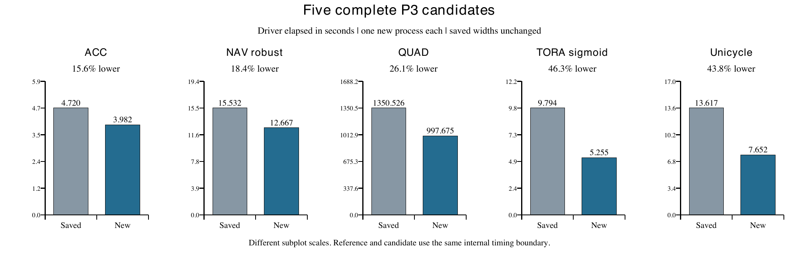
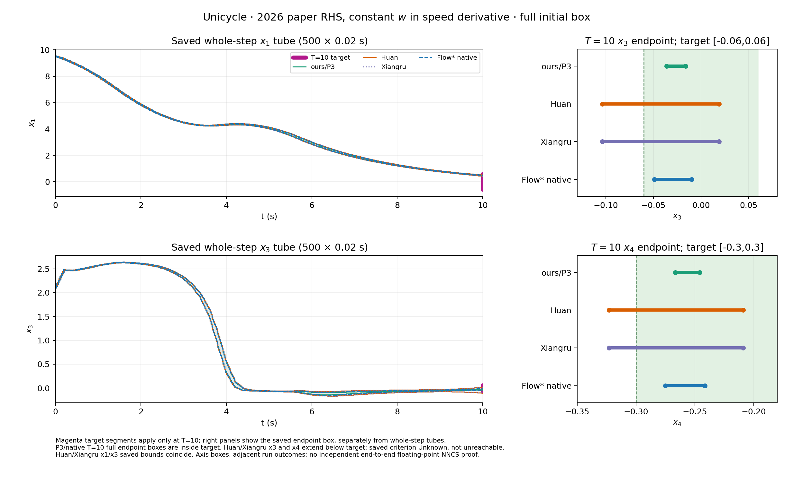

# ARCH COMP26 四方时间与区间宽度比较报告

证据截点 2026 年 10 月 5 日　编制于 2026 年 10 月 6 日北京时间　16 个 benchmark × 4 种方法

当前 P3 已在五个完整实例上记录到保持已保存输出不变的单次时间下降，但还没有做到所有 benchmark 都比 Huan、Xiangru 和原生 Flow* 更快，也没有新增全时全状态紧度优势。论文 QUAD 是最明显的速度短板：新进程 1004.197 秒，Huan / Xiangru 的既存完整进程为 94.583 / 108.018 秒；其高度终点区间也更宽。ACC、Attitude、Unicycle 有保存终点坐标较窄的结果，其他实例要逐态看，不能合成一个“整体更紧”的结论。

本版重写当前总报告、时间表、宽度表与逐方法失败说明。冻结的 289 条尝试保持原样，另列 13 个优化与资格阶段（12 个新数值候选和 1 个 GPU 资格门）。64 个方法格仍为 38 个本轮数值完整、8 个可复用的同合同历史完整、14 个没有完整数值时域、4 个 Airplane discrete 合同阻塞。五个新完整 P3 结果改进已有格，不增加覆盖格数。本次报告整理没有重跑旧实验或旧数值检查器。

读数规则：时间单位均为秒；宽度为保存上界减下界。正文按物理状态原单位列数值，不把不同单位加总。宽度保留八位有效数字，时间保留三位小数，完整 binary64 可读数、上下界、逐步范围、路径和行号见 CSV / JSON。“—”表示未保存、无有效全初集前缀或合同未执行；安全前缀不适用时另标注，原因逐节说明，不表示零。

## 全部 benchmark 的完整进程时间

下表仅列已完整覆盖具名时域且有明确外层 process wall 的所选单次进程；五个 P3 新候选使用 10 月 5 日结果，其余保持原所选进程。历史复用注明“历史”。无全程格不填失败耗时，失败进程时间仍完整列入各节和原始时间表。单次、新旧日期、硬件路径与并发不同，因此此表用于查看实际代价，不是稳定速度排行榜。

| 实例 | P3 | Huan | Xiangru | 原生 |
| --- | --- | --- | --- | --- |
| ACC safe-distance | 8.037 | 8.237 | 7.987 | 7.787 |
| Airplane continuous | 未全程 | 未全程 | 未全程 | 未全程 |
| Airplane discrete | 合同缺失 | 合同缺失 | 合同缺失 | 合同缺失 |
| Attitude Control avoid | 12.952 | 6.884 | 6.884 | 6.182 |
| Balancing reach | 未全程 | 未全程 | 未全程 | 未全程 |
| Docking constraint | 17.412 | 12.699 | 12.668 | 9.139 |
| Double Pendulum less-robust | 74.274 | 9.539 | 8.388 | 1107.127 |
| Double Pendulum more-robust | 未全程 | 未全程 | 未全程 | 未全程 |
| NAV standard | — | — | — | 1478.866 |
| NAV robust | 16.616 | — | — | 68.094 历史 |
| QUAD reach | 1004.197 | 94.583 | 108.018 | 47058.887 |
| Single Pendulum reach | 6.184 | 5.381 | 5.581 | 4.729 |
| TORA remain | 10.411 | 未全程 | 未全程 | 8.339 |
| TORA reach-sigmoid | 9.392 | 13.653 | 13.707 | 8.943 |
| TORA reach-tanh | 13.457 | — | — | 8.856 历史 |
| Unicycle reach | 11.698 | 9.594 | 9.895 | 10.397 |

NAV 旧 P3 的 28.999885 / 18.703898 是 payload wall，不能填入外层 process wall。NAV 与 TORA tanh 的部分历史作者时间是 driver call，另有内部 driver elapsed，两者也不混合。所有可读时间层级在各节展开；未知外层保持空缺。

### 四组既有重复进程计时

以下各格为原 campaign 后五个独立进程的中位数 [最小值, 最大值]，每格 n=5；不包含首进程，不混入新优化单次。原 campaign 在共享服务器轮换执行，不能推出跨机器或独占资源下的稳定排名。

| 原 campaign | P3 | Huan | Xiangru | 原生 |
| --- | --- | --- | --- | --- |
| ACC safe-distance | 8.741 [8.638, 8.841] | 8.237 [8.138, 8.338] | 7.988 [7.938, 8.087] | 7.736 [7.637, 7.787] |
| Attitude Control avoid | 12.952 [12.851, 13.154] | 6.835 [6.834, 7.036] | 6.885 [6.783, 6.987] | 6.181 [5.983, 6.182] |
| Single Pendulum reach | 6.184 [6.134, 6.484] | 5.381 [5.281, 5.681] | 5.481 [5.381, 5.581] | 4.729 [4.729, 4.729] |
| TORA reach-sigmoid | 13.905 [13.757, 14.055] | 13.653 [13.507, 13.758] | 13.607 [13.507, 13.707] | 8.943 [8.942, 8.993] |

全部首进程、后续进程、四层计时及附加 native / driver-call 时间见 [逐进程 CSV](evidence/results/archcomp26_report_20261005/timing/runs.csv) 与 [分布 CSV](evidence/results/archcomp26_report_20261005/timing/campaign_statistics.csv)。

## 五个新 P3 完整结果

下表比较同一 driver 内部计时边界的保存参考与新候选。百分比为本次单样本描述性下降，启动路径差异与共享机器负载尚未通过重复、交错实验隔离。新候选没有删除绘图所需逐步输出。

| 实例 | driver 旧 → 新 | 单次下降 | 新 process | 紧度变化 |
| --- | --- | --- | --- | --- |
| ACC safe-distance | 4.720 → 3.982 | 15.65% | 8.037 | 保存宽度相同 |
| NAV robust | 15.532 → 12.667 | 18.44% | 16.616 | 保存宽度相同 |
| QUAD reach | 1350.526 → 997.675 | 26.13% | 1004.197 | 保存宽度相同 |
| TORA reach-sigmoid | 9.794 → 5.255 | 46.34% | 9.392 | 保存宽度相同 |
| Unicycle reach | 13.617 → 7.652 | 43.80% | 11.698 | 保存宽度相同 |

ACC、QUAD、sigmoid、Unicycle 的匹配外层保存样本分别为 8.790→8.037、1357.555→1004.197、13.959→9.392、17.820→11.698 秒；NAV 没有对应旧外层记录，只比较内部 15.532→12.667 秒。新 NAV payload 把 Torch 导入移出计时，不能拿它和旧 payload 做净加速比例。QUAD 新全程与三条 GPU2 短作业在不同 GPU 上有时间重叠，资源和时间窗均在索引。

“保存宽度相同”指收据实际比过的对象。ACC、NAV、sigmoid、Unicycle 比较了完整保存范围及相应状态/配置字段；QUAD 比较 1000 条 pooled tube/endpoint 观察、接受记录与科学终态字段，未保存可供比较的逐盒全程几何，也没有证明内部 TM/SR 对象逐项相同。它们都不是新取得的独立 NNCS 浮点证书。

### 速度改进来自哪里

恢复了历史快分支中已存在的私有输出分配与 Horner 内核绑定；按小批量实际盒数使用 1 / 32 行加权图，减少无效填充；论文 QUAD 使用 256 行加权分块减少图调用。单盒 fused 候选把原本两轮映射纳入同一图，仍要求两轮条件满足并保留原路径回退；首个合格输入与原细化的直接比较耗时计入新进程。ACC fused 外层 8.089 秒没有胜过较简单的 small1 8.037 秒，因此当前 ACC 选择 small1。

已找回的旧快分支是 codex/progress-report-20260923，对应服务器 engine_linear_leaf_v2。它在当时 NAV robust、TORA tanh、旧 sigmoid、旧 Unicycle、ACC 五组保存中位数较低；Attitude 和 Single Pendulum 并非全胜。旧 sigmoid 是 22(f−0.5)，新合同是 11f；旧 Unicycle 扰动方程也不同，且旧计时不含现在的逐步几何导出。因此不能把旧数字直接替换当前主表。[历史时间和合同差异](../research/p3_speed_tightness_20261005/README.md)保留原来源。

论文 QUAD 的已知开销差异包括：Huan / Xiangru 使用 work / point / validation 阶 2/1/1 与 parity 路径，P3 使用 3/2/4、严格区间误差账本和两轮已接受路径细化。四方主配置均是 1024 盒、h=0.005、1000 小步；P3 的 K=20 是每 20 步重算完整保留历史，并非只留 20 步。尚无匹配的分阶段消融，不能给这些差异分配因果百分比。

## 宽度比较口径

每步先对同一方法的全部有效初盒取坐标并集，保存 lo、hi 和 width=hi−lo。endpoint 是传播终点，tube 是整个小步。时钟、保持控制和 Unicycle 常值扰动等辅助量不并入物理态比较，原始记录仍保留。几何源进程与所选计时进程可能不同，各自按源表追溯，不伪装为同一次实验。正文第一张表在四方均覆盖全初集的共同终点时刻比较 endpoint；第二张表取从起点至共同数值时刻各小步 tube 宽度的最大值。后者不是“全时间并集的宽度”：运动距离不被当作单步包络松弛。全时并集、每盒均值/最大值只在对应来源实际保存时另列，不能由 pooled 曲线倒推。

提前停止时共同数值时刻与性质安全时刻分开：Balancing raw4 为 0.415 秒；DP more 数值 0.32 秒、安全 0.30 秒；TORA remain h=0.1 数值 18.9 秒、安全 18.4 秒。各法自身最后记录和完整初集最后记录另外保存，不把不同时间点的宽度互相比。QUAD 作者两法只有终点，故全时 tube 栏明确缺失。

宽度较小只说明这个保存投影窄，不保证集合包含。[逐态成对差值与包含关系](evidence/results/archcomp26_report_20261005/widths/pairwise_comparisons.csv)另列 P3 对三方的绝对差、相对差和 endpoint 区间包含；没有把不同物理量汇总成一个紧度分数。

## 1 ACC safe-distance

具名 participant-order profile 使用固定 2026 ONNX、单个完整初盒、50 个 0.1 秒控制期到 T=5。参与者源码的相对速度取 v_lead−v_ego；全时检查 x_lead−x_ego−1.4v_ego−10≥0。[合同审计](ARCHCOMP26_ACC_PARTICIPANT_CONTRACT_20261001.md)记录论文未定义该符号的差异。

### 数值范围与未完成原因

| 方法 | 数值状态 | 全初集步数 | 数值前缀 t | 保存安全前缀 t |
| --- | --- | --- | --- | --- |
| P3 | 完整 | 50 / 50 | 5 | 5 |
| Huan | 完整 | 50 / 50 | 5 | 5 |
| Xiangru | 完整 | 50 / 50 | 5 | 5 |
| 原生 Flow* | 完整 | 50 / 50 | 5 | 5 |

**P3 / Huan / Xiangru / 原生 Flow*：** 四方均能完成具名 participant-order 合同。保存 tube 的安全距离半空间下界均为正；这不是数值失败。论文未明确相对速度符号，当前按参与者源码使用 v_lead-v_ego。 若要求独立安全定理，仍需 NN 浮点包络、控制注入及 plant 运算的完整包含证明；已有保存盒检查不是该证明。

保存性质观察（P3 / Huan / Xiangru / 原生 Flow*）：全部 50 段保存 tube 满足安全半空间；完整 T=5。

原始结果：[P3](../research/p3_speed_tightness_20261005/results/acc_p3_fast1_20261005_001/run_001/RESULT.json)；[Huan](evidence/results/archcomp26_20261001/acc_fourway_campaign_001/steady05_huan/RESULT.json)；[Xiangru](evidence/results/archcomp26_20261001/acc_fourway_campaign_001/steady05_xiangru/RESULT.json)；[原生 Flow*](evidence/results/archcomp26_20261001/acc_fourway_campaign_001/steady05_native/RESULT.json)。

当前 P3 使用 [acc_p3_fast1_20261005_001](../research/p3_speed_tightness_20261005/results/acc_p3_fast1_20261005_001/run_001/RESULT.json)；以下宽度继承其已直接比对相同的保存参考对象。

### 所选进程各层时间

下表为各方法所选单次；未全程方法的数值只是这次失败或早停的耗时，不能参与完整运行速度比较。缺失表示该层没有独立保存，不能从另一层代填。

| 计时层级 | P3 | Huan | Xiangru | 原生 |
| --- | --- | --- | --- | --- |
| 外层 process | 8.037 | 8.237 | 7.987 | 7.787 |
| 候选 wrapper | 7.221 | — | — | — |
| runner payload | 5.691 | 7.357 | 7.220 | — |
| 内部 driver | 3.982 | 4.016 | 4.041 | — |

保存资源：P3 CPU=10-13，GPU=2；Huan CPU=10-13，GPU=2；Xiangru CPU=10-13，GPU=2；原生 Flow* CPU=10-13，GPU=2。进程起止、同批并发窗口、字段路径详见时间索引。

### 全部物理状态宽度

四方共同数值终点 t=5 秒。若某一状态没有此共同终点，保持空白。

**共同终点 endpoint 绝对宽度**

| 状态 | P3 | Huan | Xiangru | 原生 |
| --- | --- | --- | --- | --- |
| x_lead | 20.997866 | 21.012041 | 21.012041 | 21.012051 |
| v_lead | 0.19848302 | 0.20175389 | 0.20175389 | 0.20175843 |
| a_lead | 0.00069872948 | 0.00074107635 | 0.00074107635 | 0.00074254443 |
| x_ego | 5.1630692 | 5.4979758 | 5.4979758 | 5.4979988 |
| v_ego | 1.8580463 | 2.0155107 | 2.0155107 | 2.0155283 |
| a_ego | 1.0968974 | 1.1811062 | 1.1811062 | 1.1811239 |

**截至共同数值时刻的最大单步 tube 绝对宽度**

| 状态 | P3 | Huan | Xiangru | 原生 |
| --- | --- | --- | --- | --- |
| x_lead | 23.331402 | 23.336823 | 23.336823 | 23.316537 |
| v_lead | 0.40288679 | 0.40608808 | 0.40608808 | 0.40604353 |
| a_lead | 0.45435947 | 0.45489481 | 0.45489481 | 0.41105639 |
| x_ego | 7.9907966 | 8.3251678 | 8.3251678 | 8.2228612 |
| v_ego | 1.910744 | 2.068506 | 2.068506 | 2.0202815 |
| a_ego | 1.1092374 | 1.1934503 | 1.1934503 | 1.1811991 |

共同终点 P3 对 Huan：较窄 x_lead, v_lead, a_lead, x_ego, v_ego, a_ego；逐态差值见配套 CSV。该比较不外推到其他时刻或未保存相关方向。

共同终点 P3 对 Xiangru：较窄 x_lead, v_lead, a_lead, x_ego, v_ego, a_ego；逐态差值见配套 CSV。该比较不外推到其他时刻或未保存相关方向。

共同终点 P3 对 原生 Flow*：较窄 x_lead, v_lead, a_lead, x_ego, v_ego, a_ego；逐态差值见配套 CSV。该比较不外推到其他时刻或未保存相关方向。

宽度来源编号：S033, S035, S037, S039；[来源路径与大小](evidence/results/archcomp26_report_20261005/widths/sources.json)、[上下界和全部逐步宽度](evidence/results/archcomp26_report_20261005/widths/widths_long.csv)、[缺失逐格说明](evidence/results/archcomp26_report_20261005/widths/missing_fields.csv)。

## 2 Airplane continuous

官方完整初集是一个未分割 12 物理态盒，六个速度/姿态分量各为 [0,1]，固定 12→6 控制器；连续方程与 0.1 秒采样到 T=2，全时要求 sy、phi、theta、psi∈[-1,1]。[来源审计](ARCHCOMP26_AIRPLANE_2026_ENTRY_AUDIT.md)将它与历史单点区分。

### 数值范围与未完成原因

| 方法 | 数值状态 | 全初集步数 | 数值前缀 t | 保存安全前缀 t |
| --- | --- | --- | --- | --- |
| P3 | 无全程 | 0 / 200 | 0 | — |
| Huan | 无全程 | 0 / 200 | 0 | — |
| Xiangru | 无全程 | 0 / 200 | 0 | — |
| 原生 Flow* | 无全程 | 0 / 200 | 0 | — |

**P3：** P4 验证表在首步前因 9^20 >= 2^63 编码溢出；同阶 P3 的首步 trace 为 x/y/z Picard 提议越出 ±0.01，四次重心化仍 FAILED_CONTRACTION。另扩大 xyz 余项到 ±0.1 后引擎接受，但五坐标 endpoint 超出 tube 1–2 ULP，observer 拒绝，0 个可用保存段。 需要能在完整初集覆盖上通过数值自包含与观察器一致性的明确方法；之后才可推进到 T=2 并逐段判性质。不能把分盒首步或无效候选界补成全程。

**Huan：** order6 建表资源阻断，RSS超过54,006,540 KiB后终止，未进ODE；order3全盒首步 accepted=false、0/10接受。后一拒绝未记录内部失败坐标，不能猜成控制器错误或真实越界。 需要能在完整初集覆盖上通过数值自包含与观察器一致性的明确方法；之后才可推进到 T=2 并逐段判性质。不能把分盒首步或无效候选界补成全程。

**Xiangru：** order3全盒首个 h=0.01 小步 accepted=false，0/10接受；内部失败分量未保存，不能猜成物理性质失败。Huan order6资源记录不能冒称为Xiangru实测。 需要能在完整初集覆盖上通过数值自包含与观察器一致性的明确方法；之后才可推进到 T=2 并逐段判性质。不能把分盒首步或无效候选界补成全程。

**原生 Flow*：** order6±0.01、order3±0.01、order3±1 三个全盒 profile 首步均 UNCOMPLETED_SAFE、0段。后续 Real 首拒追踪分别定位 x/y/z/phi/theta 或加宽后的 x/y/phi/theta/psi Picard 不自包含。空 safety 表上的 BOX_SAFE 1 是空集结论。 需要能在完整初集覆盖上通过数值自包含与观察器一致性的明确方法；之后才可推进到 T=2 并逐段判性质。不能把分盒首步或无效候选界补成全程。

保存性质观察（P3 / Huan / Xiangru / 原生 Flow*）：主全盒无有效接受段，性质未判定；数值拒绝不是真实轨迹反例。

原始结果：[P3](evidence/results/archcomp26_20261001/airplane_p3_xyz_rem0p1_observer_smoke1_001/RESULT.json)；[Huan](evidence/results/archcomp26_20261001/airplane_continuous_order3_huan_smoke1_001/RESULT.json)；[Xiangru](evidence/results/archcomp26_20261001/airplane_continuous_order3_xiangru_smoke1_001/RESULT.json)；[原生 Flow*](evidence/results/archcomp26_20261001/native_airplane_rem1_first_reject_trace_20261002_006/run/RESULT.json)。

### 所选进程各层时间

下表为各方法所选单次；未全程方法的数值只是这次失败或早停的耗时，不能参与完整运行速度比较。缺失表示该层没有独立保存，不能从另一层代填。

| 计时层级 | P3 | Huan | Xiangru | 原生 |
| --- | --- | --- | --- | --- |
| 外层 process | 11.651 | 6.785 | 6.985 | 3.626 |
| runner payload | 10.647 | 5.984 | 6.116 | — |

保存资源：P3 CPU=14-17，GPU=3；Huan CPU=10-13，GPU=2；Xiangru CPU=10-13，GPU=2；原生 Flow* CPU=10-13，GPU=2。进程起止、同批并发窗口、字段路径详见时间索引。

### 全部物理状态宽度

主合同不存在四方共同有效数值终点，以下空栏标明数据缺失，不借用其他合同或分盒短诊断。

全部 12 个状态 sx, sy, sz, vx, vy, vz, phi, theta, psi, r, p, q：四方法均无主合同有效 endpoint / tube 宽度，不能填终点或全时数值。逐状态缺失格仍全部列在 summary.csv 和 missing_fields.csv。

64 个二分子盒各完成首个 0.01 秒 plant 步，其中 8 盒保存安全、56 盒 Unknown；高角子盒随后只完成 4/10 小步到 0.04 秒，第 5 步 x/y 自包含失败。这是另列数值诊断，不填主合同的 T=2 格，也不是实际不安全轨迹。

宽度来源编号：无有效主合同范围；[来源路径与大小](evidence/results/archcomp26_report_20261005/widths/sources.json)、[上下界和全部逐步宽度](evidence/results/archcomp26_report_20261005/widths/widths_long.csv)、[缺失逐格说明](evidence/results/archcomp26_report_20261005/widths/missing_fields.csv)。

## 3 Airplane discrete

[2026 报告](https://easychair.org/publications/paper/GsKW/download)给出一般 forward Euler 规则、Airplane 的 Δt=0.1 秒与 20 次转移，在 k=0…20 检查 sy、phi、theta、psi∈[-1,1]。2026-10-03 复核的[固定官方 Airplane 目录](https://github.com/Kiguli/ARCH-COMP2026/tree/d55dcc39f6496720adbf8ffdb7ff8c6e04bb8f26/benchmarks/Airplane)只有控制器、连续 `dynamics.m` 与规格，没有离散执行程序；论文也未写参与者实际的 NN 取样及控制更新先后。初盒、网络和逐源检索见[离散执行门](ARCHCOMP26_AIRPLANE_DISCRETE_EXECUTION_GATE_20261002.md)。门内“旧状态先求 NN、同步更新 12 态”只是具名新比较约定，尚非参与者离散提交的权威顺序。

### 数值范围与未完成原因

| 方法 | 数值状态 | 全初集步数 | 数值前缀 t | 保存安全前缀 t |
| --- | --- | --- | --- | --- |
| P3 | 合同缺失 | — / 20 | — | — |
| Huan | 合同缺失 | — / 20 | — | — |
| Xiangru | 合同缺失 | — / 20 | — | — |
| 原生 Flow* | 合同缺失 | — / 20 | — | — |

**P3 / Huan / Xiangru / 原生 Flow*：** 四方法均因执行合同材料不足而未在权威离散合同下运行，非算法已经失败。论文给 Euler 规则、0.1 秒和 20 次转移，但固定官方目录只有连续 dynamics.m，缺参与者实际 NN 采样与状态更新顺序。 取得参与者离散转移及控制更新源码/等价权威执行记录，再建立四个离散入口并覆盖完整初盒 k=0…20；或用户明确另立 paper-Euler-controller-first 补充合同。

保存性质观察（P3 / Huan / Xiangru / 原生 Flow*）：无四方离散性质结果；独立 CPU 的 1/20 安全端点诊断不能填四方法格。

原始结果：P3未启动；Huan未启动；Xiangru未启动；原生 Flow*未启动。

### 所选进程各层时间

下表为各方法所选单次；未全程方法的数值只是这次失败或早停的耗时，不能参与完整运行速度比较。缺失表示该层没有独立保存，不能从另一层代填。

四方法均未在权威离散合同下启动，因此没有运行耗时或资源记录；另立的 CPU 诊断不填方法格。

### 全部物理状态宽度

主合同不存在四方共同有效数值终点，以下空栏标明数据缺失，不借用其他合同或分盒短诊断。

全部 12 个状态 sx, sy, sz, vx, vy, vz, phi, theta, psi, r, p, q：四方法均无主合同有效 endpoint / tube 宽度，不能填终点或全时数值。逐状态缺失格仍全部列在 summary.csv 和 missing_fields.csv。

宽度来源编号：无有效主合同范围；[来源路径与大小](evidence/results/archcomp26_report_20261005/widths/sources.json)、[上下界和全部逐步宽度](evidence/results/archcomp26_report_20261005/widths/widths_long.csv)、[缺失逐格说明](evidence/results/archcomp26_report_20261005/widths/missing_fields.csv)。

## 4 Attitude Control avoid

固定六态完整初盒、30 个 0.1 秒周期到 T=3；避免官方六维闭危险盒，其 x4 范围为 [-0.7,-0.6]。[合同审计](ARCHCOMP26_ATTITUDE_CONTROL_CONTRACT_20261001.md)记录历史 checker 把它误写成空集，旧 VERIFIED 不用于新性质。

### 数值范围与未完成原因

| 方法 | 数值状态 | 全初集步数 | 数值前缀 t | 保存安全前缀 t |
| --- | --- | --- | --- | --- |
| P3 | 完整 | 60 / 60 | 3 | 3 |
| Huan | 完整 | 60 / 60 | 3 | 3 |
| Xiangru | 完整 | 60 / 60 | 3 | 3 |
| 原生 Flow* | 完整 | 60 / 60 | 3 | 3 |

**P3 / Huan / Xiangru / 原生 Flow*：** 四方均能完成修正危险盒后的数值合同，六维保存 tube 与闭危险盒不相交。旧 checker 把 x4 危险区间写成空集，其旧 VERIFIED 不作为本轮证据。 已有六维保存盒判交可支持数值描述；独立 NNCS 证明仍须补浮点 NN、注入和 plant 包含链。单轴危险投影图不能代替六维判交。

保存性质观察（P3 / Huan / Xiangru / 原生 Flow*）：全部 60 段六维保存 tube 避开修正后的闭危险盒。

原始结果：[P3](evidence/results/archcomp26_20261001/attitude_corrected_fourway_campaign_20261002_001/later05_ours_p3/RESULT.json)；[Huan](evidence/results/archcomp26_20261001/attitude_corrected_fourway_campaign_20261002_001/later05_huan/RESULT.json)；[Xiangru](evidence/results/archcomp26_20261001/attitude_corrected_fourway_campaign_20261002_001/later05_xiangru/RESULT.json)；[原生 Flow*](evidence/results/archcomp26_20261001/attitude_corrected_fourway_campaign_20261002_001/later05_native/RESULT.json)。

### 所选进程各层时间

下表为各方法所选单次；未全程方法的数值只是这次失败或早停的耗时，不能参与完整运行速度比较。缺失表示该层没有独立保存，不能从另一层代填。

| 计时层级 | P3 | Huan | Xiangru | 原生 |
| --- | --- | --- | --- | --- |
| 外层 process | 12.952 | 6.884 | 6.884 | 6.182 |
| runner payload | 12.109 | 4.601 | 4.609 | — |
| 内部 driver | 8.804 | 2.826 | 2.829 | — |

保存资源：P3 CPU=10-13，GPU=2；Huan CPU=10-13，GPU=2；Xiangru CPU=10-13，GPU=2；原生 Flow* CPU=10-13，GPU=2。进程起止、同批并发窗口、字段路径详见时间索引。

### 全部物理状态宽度

四方共同数值终点 t=3 秒。若某一状态没有此共同终点，保持空白。

**共同终点 endpoint 绝对宽度**

| 状态 | P3 | Huan | Xiangru | 原生 |
| --- | --- | --- | --- | --- |
| x1 | 0.0040788908 | 0.004174214 | 0.004174214 | 0.0041941345 |
| x2 | 0.0058003086 | 0.0059356588 | 0.0059356588 | 0.0059801537 |
| x3 | 0.0059925623 | 0.0061729133 | 0.0061729133 | 0.0061939769 |
| x4 | 0.031363064 | 0.032070326 | 0.032070326 | 0.032292131 |
| x5 | 0.017096771 | 0.017361516 | 0.017361516 | 0.017635943 |
| x6 | 0.018023016 | 0.018479364 | 0.018479364 | 0.018637404 |

**截至共同数值时刻的最大单步 tube 绝对宽度**

| 状态 | P3 | Huan | Xiangru | 原生 |
| --- | --- | --- | --- | --- |
| x1 | 0.04440757 | 0.044415065 | 0.044415065 | 0.043826029 |
| x2 | 0.048553713 | 0.04856765 | 0.04856765 | 0.046649174 |
| x3 | 0.031515365 | 0.031672694 | 0.031672694 | 0.030807531 |
| x4 | 0.034766246 | 0.034896547 | 0.034896547 | 0.033456038 |
| x5 | 0.033040735 | 0.033753544 | 0.033753544 | 0.033164941 |
| x6 | 0.040750882 | 0.041435257 | 0.041435257 | 0.040010416 |

共同终点 P3 对 Huan：较窄 x1, x2, x3, x4, x5, x6；逐态差值见配套 CSV。该比较不外推到其他时刻或未保存相关方向。

共同终点 P3 对 Xiangru：较窄 x1, x2, x3, x4, x5, x6；逐态差值见配套 CSV。该比较不外推到其他时刻或未保存相关方向。

共同终点 P3 对 原生 Flow*：较窄 x1, x2, x3, x4, x5, x6；逐态差值见配套 CSV。该比较不外推到其他时刻或未保存相关方向。

宽度来源编号：S001, S002, S003, S004；[来源路径与大小](evidence/results/archcomp26_report_20261005/widths/sources.json)、[上下界和全部逐步宽度](evidence/results/archcomp26_report_20261005/widths/widths_long.csv)、[缺失逐格说明](evidence/results/archcomp26_report_20261005/widths/missing_fields.csv)。

## 5 Balancing reach

论文五特征控制器缺对应模型或权威五到四映射；另名 fixed-repo-raw4 profile 使用官方仓库四原态网络、完整四态初盒、500 个 0.02 秒周期到 T=10，在固定规格 8<t≤10 检查 x1、x3、x4∈[-0.001,0.001]。[执行门](ARCHCOMP26_BALANCING_EXECUTION_GATE_20261002.md)另列论文闭窗 [8,10]。

### 数值范围与未完成原因

| 方法 | 数值状态 | 全初集步数 | 数值前缀 t | 保存安全前缀 t |
| --- | --- | --- | --- | --- |
| P3 | 无全程 | 86 / 2000 | 0.43 | — |
| Huan | 无全程 | 98 / 2000 | 0.49 | — |
| Xiangru | 无全程 | 98 / 2000 | 0.49 | — |
| 原生 Flow* | 无全程 | 83 / 2000 | 0.415 | — |

**P3：** raw4 第 87 小步数值拒绝；仅 86/2000 个有效小步，未到8秒性质窗；不是性质反例。论文 feature5 模型/权威映射另缺。 论文合同需五输入模型及尺度/顺序，或权威五特征到四输入映射。raw4 需明确的新数值方案通过拒绝并覆盖 T=10；不得把旧小初盒 T=1 或拒绝前缀代填。

**Huan / Xiangru：** raw4 第 99 小步数值拒绝；仅 98/2000 个有效小步，未到8秒性质窗；不是性质反例。论文 feature5 模型/权威映射另缺。 论文合同需五输入模型及尺度/顺序，或权威五特征到四输入映射。raw4 需明确的新数值方案通过拒绝并覆盖 T=10；不得把旧小初盒 T=1 或拒绝前缀代填。

**原生 Flow*：** raw4 第 84 小步数值拒绝；仅 83/2000 个有效小步，未到8秒性质窗；不是性质反例。论文 feature5 模型/权威映射另缺。 原生此前解析失败已修正；这里报告修正入口的数值首拒，不继续把旧语法错误当当前阻断。 论文合同需五输入模型及尺度/顺序，或权威五特征到四输入映射。raw4 需明确的新数值方案通过拒绝并覆盖 T=10；不得把旧小初盒 T=1 或拒绝前缀代填。

保存性质观察（P3 / Huan / Xiangru / 原生 Flow*）：性质窗尚未到达，0/400 个目标窗小步检查；UNKNOWN/incomplete。

原始结果：[P3](evidence/results/archcomp26_20261001/balancing_fixed_raw4_p3_full500_001/RESULT.json)；[Huan](evidence/results/archcomp26_20261001/balancing_fixed_raw4_huan/balancing_fixed_raw4_huan_full500_001/RESULT.json)；[Xiangru](evidence/results/archcomp26_20261001/balancing_fixed_raw4_xiangru_20261002/balancing_fixed_raw4_xiangru_full500_001/RESULT.json)；[原生 Flow*](evidence/results/archcomp26_20261001/native_balancing_raw4_20261002/native_balancing_raw4_full500_001/RESULT.json)。

### 所选进程各层时间

下表为各方法所选单次；未全程方法的数值只是这次失败或早停的耗时，不能参与完整运行速度比较。缺失表示该层没有独立保存，不能从另一层代填。

| 计时层级 | P3 | Huan | Xiangru | 原生 |
| --- | --- | --- | --- | --- |
| 外层 process | 13.807 | — | — | 5.732 |
| runner payload | 12.875 | 8.218 | 7.735 | — |
| 内部 driver | 9.638 | 4.189 | 3.894 | — |

保存资源：P3 CPU=14-17，GPU=3；Huan CPU=[10, 11, 12, 13]，GPU=2；Xiangru CPU=[24, 25, 26, 27]，GPU=1；原生 Flow* CPU=24-27，GPU=1。进程起止、同批并发窗口、字段路径详见时间索引。

### 全部物理状态宽度

四方共同数值终点 t=0.415 秒。若某一状态没有此共同终点，保持空白。

**共同终点 endpoint 绝对宽度**

| 状态 | P3 | Huan | Xiangru | 原生 |
| --- | --- | --- | --- | --- |
| x1 | 0.67617278 | 0.67554765 | 0.67554765 | 0.67971294 |
| x2 | 2.1826994 | 2.179091 | 2.179091 | 2.2047091 |
| x3 | 2.1255595 | 2.1176584 | 2.1176584 | 2.1845433 |
| x4 | 14.633784 | 14.555957 | 14.555957 | 16.092615 |

**截至共同数值时刻的最大单步 tube 绝对宽度**

| 状态 | P3 | Huan | Xiangru | 原生 |
| --- | --- | --- | --- | --- |
| x1 | 0.67621605 | 0.67559085 | 0.67559085 | 0.67971294 |
| x2 | 2.1828002 | 2.1791915 | 2.1791915 | 2.2047091 |
| x3 | 2.1258402 | 2.1179399 | 2.1179399 | 2.1845433 |
| x4 | 14.635335 | 14.557512 | 14.557512 | 16.092615 |

共同终点 P3 对 Huan：较宽 x1, x2, x3, x4；逐态差值见配套 CSV。该比较不外推到其他时刻或未保存相关方向。

共同终点 P3 对 Xiangru：较宽 x1, x2, x3, x4；逐态差值见配套 CSV。该比较不外推到其他时刻或未保存相关方向。

共同终点 P3 对 原生 Flow*：较窄 x1, x2, x3, x4；逐态差值见配套 CSV。该比较不外推到其他时刻或未保存相关方向。

**各法自身最后完整初集终点宽度**（时刻不同，仅记录，不横向排名）

| 状态 | P3 | Huan | Xiangru | 原生 |
| --- | --- | --- | --- | --- |
| x1 | 0.70933799 @0.43 | 0.85405257 @0.49 | 0.85405257 @0.49 | 0.67971294 @0.415 |
| x2 | 2.2667273 @0.43 | 2.614629 @0.49 | 2.614629 @0.49 | 2.2047091 @0.415 |
| x3 | 2.356281 @0.43 | 3.5934836 @0.49 | 3.5934836 @0.49 | 2.1845433 @0.415 |
| x4 | 16.346639 @0.43 | 26.704665 @0.49 | 26.704665 @0.49 | 16.092615 @0.415 |

宽度来源编号：S009, S010, S011, S012；[来源路径与大小](evidence/results/archcomp26_report_20261005/widths/sources.json)、[上下界和全部逐步宽度](evidence/results/archcomp26_report_20261005/widths/widths_long.csv)、[缺失逐格说明](evidence/results/archcomp26_report_20261005/widths/missing_fields.csv)。

## 6 Docking constraint

四态 (sx,sy,vx,vy)，完整初盒 [70,106]²×[-0.28,0.28]²，固定四输入两力输出，每秒更新到 T=40；全时要求 q=√(vx²+vy²)−0.2−0.002054√(sx²+sy²)≤0。[来源合同](ARCHCOMP26_DOCKING_BALANCING_SOURCE_CONTRACT_20261001.md)解释图内预/后处理。

### 数值范围与未完成原因

| 方法 | 数值状态 | 全初集步数 | 数值前缀 t | 保存安全前缀 t |
| --- | --- | --- | --- | --- |
| P3 | 完整 | 400 / 400 | 40 | — |
| Huan | 完整 | 400 / 400 | 40 | — |
| Xiangru | 完整 | 400 / 400 | 40 | — |
| 原生 Flow* | 完整 | 400 / 400 | 40 | — |

**P3 / Huan / Xiangru / 原生 Flow*：** 四方数值时域均完成，未解决的是性质：轴对齐 tube 对 q 的保守上界从首段就跨过 0，因此不能判全时 q<=0。原生外层 failed/exit2 对应 UNKNOWN，不能据此删除其完整 400 段。 需要更强的相关性/耦合性质判定、明示合法精化或可信反例来解决 UNKNOWN；不能由 q 上界为正断言真实轨迹违规。

保存性质观察（P3 / Huan / Xiangru / 原生 Flow*）：完整 T=40 数值流管；四方法性质 UNKNOWN。

原始结果：[P3](evidence/results/archcomp26_20261001/docking_p3_full40_001/RESULT.json)；[Huan](evidence/results/archcomp26_20261001/docking_huan_full40_001/RESULT.json)；[Xiangru](evidence/results/archcomp26_20261001/docking_xiangru_full40_001/RESULT.json)；[原生 Flow*](evidence/results/archcomp26_20261001/native_docking_full40_001/RESULT.json)。

### 所选进程各层时间

下表为各方法所选单次；未全程方法的数值只是这次失败或早停的耗时，不能参与完整运行速度比较。缺失表示该层没有独立保存，不能从另一层代填。

| 计时层级 | P3 | Huan | Xiangru | 原生 |
| --- | --- | --- | --- | --- |
| 外层 process | 17.412 | 12.699 | 12.668 | 9.139 |
| runner payload | 16.601 | 11.852 | 11.858 | — |
| 内部 driver | 13.239 | 8.552 | 8.516 | — |

保存资源：P3 CPU=[14, 15, 16, 17]，GPU=3；Huan CPU=[14, 15, 16, 17]，GPU=3；Xiangru CPU=[14, 15, 16, 17]，GPU=3；原生 Flow* CPU=10-13，GPU=2。进程起止、同批并发窗口、字段路径详见时间索引。

### 全部物理状态宽度

四方共同数值终点 t=40 秒。若某一状态没有此共同终点，保持空白。

**共同终点 endpoint 绝对宽度**

| 状态 | P3 | Huan | Xiangru | 原生 |
| --- | --- | --- | --- | --- |
| sx | 256.23186 | 254.45771 | 254.45771 | 273.58368 |
| sy | 258.38246 | 256.94323 | 256.94323 | 273.85616 |
| vx | 11.835103 | 11.837248 | 11.837248 | 12.392946 |
| vy | 11.872969 | 11.874525 | 11.874525 | 12.389239 |

**截至共同数值时刻的最大单步 tube 绝对宽度**

| 状态 | P3 | Huan | Xiangru | 原生 |
| --- | --- | --- | --- | --- |
| sx | 256.28024 | 254.50616 | 254.50616 | 273.58368 |
| sy | 258.42228 | 256.98312 | 256.98312 | 273.85616 |
| vx | 11.835498 | 11.837645 | 11.837645 | 12.392946 |
| vy | 11.873187 | 11.874744 | 11.874744 | 12.389239 |

共同终点 P3 对 Huan：较窄 vx, vy；较宽 sx, sy；逐态差值见配套 CSV。该比较不外推到其他时刻或未保存相关方向。

共同终点 P3 对 Xiangru：较窄 vx, vy；较宽 sx, sy；逐态差值见配套 CSV。该比较不外推到其他时刻或未保存相关方向。

共同终点 P3 对 原生 Flow*：较窄 sx, sy, vx, vy；逐态差值见配套 CSV。该比较不外推到其他时刻或未保存相关方向。

宽度来源编号：S005, S006, S007, S008；[来源路径与大小](evidence/results/archcomp26_report_20261005/widths/sources.json)、[上下界和全部逐步宽度](evidence/results/archcomp26_report_20261005/widths/widths_long.csv)、[缺失逐格说明](evidence/results/archcomp26_report_20261005/widths/missing_fields.csv)。

## 7 Double Pendulum less-robust

官方 less-robust 控制器，完整 [1,1.3]^4 分为 225 盒，20 个 0.05 秒控制期、100 个 0.01 秒子步到 T=1；全时要求四态在 [-1.7,2]^4。[合同审计](ARCHCOMP26_DOUBLE_PENDULUM_LESS_CONTRACT_20261001.md)记录控制器和分区。

### 数值范围与未完成原因

| 方法 | 数值状态 | 全初集步数 | 数值前缀 t | 保存安全前缀 t |
| --- | --- | --- | --- | --- |
| P3 | 完整 | 100 / 100 | 1 | 1 |
| Huan | 完整 | 100 / 100 | 1 | 1 |
| Xiangru | 完整 | 100 / 100 | 1 | 1 |
| 原生 Flow* | 完整 | 100 / 100 | 1 | 1 |

**P3 / Huan / Xiangru / 原生 Flow*：** 四方能完成 225 盒×100 步。P3 主选是 affine-split4 控制残差入口；旧失败候选另存。保存 tube 都在安全盒内。 Huan/Xiangru 少量 endpoint 末位超出同段 tube，须继续区分两种界并保留原值；独立浮点 NNCS 包含链仍未闭合，不能凭窄界确认正确性。

保存性质观察（P3 / Huan / Xiangru / 原生 Flow*）：完整 T=1；保存 tube 全在 [-1.7,2]^4。

原始结果：[P3](evidence/results/archcomp26_20261001/dp_p3_affine_split4_v1/full225_smoke_001/attempt/RESULT.json)；[Huan](evidence/results/archcomp26_20261001/author_dp_less_v1/huan_full20_001/RESULT.json)；[Xiangru](evidence/results/archcomp26_20261001/author_dp_less_v1/xiangru_full20_001/RESULT.json)；[原生 Flow*](evidence/results/archcomp26_20261001/native_dp_less_full20_001/RESULT.json)。

### 所选进程各层时间

下表为各方法所选单次；未全程方法的数值只是这次失败或早停的耗时，不能参与完整运行速度比较。缺失表示该层没有独立保存，不能从另一层代填。

| 计时层级 | P3 | Huan | Xiangru | 原生 |
| --- | --- | --- | --- | --- |
| 外层 process | 74.274 | 9.539 | 8.388 | 1107.127 |
| runner payload | 73.304 | 8.669 | 7.488 | — |
| 内部 driver | 70.196 | 5.278 | 4.095 | — |
| 调用 driver | — | 8.669 | 7.488 | — |

保存资源：P3 CPU=14-17，GPU=3；Huan CPU=[10, 11, 12, 13]，GPU=2；Xiangru CPU=[10, 11, 12, 13]，GPU=2；原生 Flow* CPU=6-9，GPU=1。进程起止、同批并发窗口、字段路径详见时间索引。

### 全部物理状态宽度

四方共同数值终点 t=1 秒。若某一状态没有此共同终点，保持空白。

**共同终点 endpoint 绝对宽度**

| 状态 | P3 | Huan | Xiangru | 原生 |
| --- | --- | --- | --- | --- |
| theta1 | 0.49858988 | 0.48603065 | 0.48603065 | 0.48400035 |
| theta2 | 0.56888338 | 0.56868338 | 0.56868338 | 0.56651597 |
| theta1_dot | 0.67144259 | 0.85297937 | 0.85297937 | 0.7960341 |
| theta2_dot | 0.79909001 | 1.1097879 | 1.1097879 | 1.0165849 |

**截至共同数值时刻的最大单步 tube 绝对宽度**

| 状态 | P3 | Huan | Xiangru | 原生 |
| --- | --- | --- | --- | --- |
| theta1 | 0.50446369 | 0.49164758 | 0.49164758 | 0.48872689 |
| theta2 | 0.57978884 | 0.5796163 | 0.5796163 | 0.5729646 |
| theta1_dot | 0.69972068 | 0.86002343 | 0.86002343 | 0.79603411 |
| theta2_dot | 0.93967424 | 1.113475 | 1.113475 | 1.0165849 |

共同终点 P3 对 Huan：较窄 theta1_dot, theta2_dot；较宽 theta1, theta2；逐态差值见配套 CSV。该比较不外推到其他时刻或未保存相关方向。

共同终点 P3 对 Xiangru：较窄 theta1_dot, theta2_dot；较宽 theta1, theta2；逐态差值见配套 CSV。该比较不外推到其他时刻或未保存相关方向。

共同终点 P3 对 原生 Flow*：较窄 theta1_dot, theta2_dot；较宽 theta1, theta2；逐态差值见配套 CSV。该比较不外推到其他时刻或未保存相关方向。

宽度来源编号：S041, S044, S047, S050；[来源路径与大小](evidence/results/archcomp26_report_20261005/widths/sources.json)、[上下界和全部逐步宽度](evidence/results/archcomp26_report_20261005/widths/widths_long.csv)、[缺失逐格说明](evidence/results/archcomp26_report_20261005/widths/missing_fields.csv)。

## 8 Double Pendulum more-robust

官方独立 more-robust 网络、完整 [1,1.3]^4、225 盒、20 个 0.02 秒控制期到 T=0.4，全时安全盒 [-1.5,1.5]^4。历史入口误用 less-robust 网络且只取角点，不能迁入本格。[来源合同](ARCHCOMP26_NEXT_CONTRACT_SOURCE_AUDIT_20261001.md)列模型与变量次序。

### 数值范围与未完成原因

| 方法 | 数值状态 | 全初集步数 | 数值前缀 t | 保存安全前缀 t |
| --- | --- | --- | --- | --- |
| P3 | 无全程 | 72 / 80 | 0.36 | 0.3 |
| Huan | 无全程 | 72 / 80 | 0.36 | 0.3 |
| Xiangru | 无全程 | 72 / 80 | 0.36 | 0.3 |
| 原生 Flow* | 无全程 | 64 / 80 | 0.32 | 0.3 |

**P3：** 全部225盒在已保存 72/80 步数值接受，作者 Unsafe. 后停止；保存安全前缀仅60步。第61步开始跨带；第72步发生作者 Unsafe.，不是数值拒绝。 P3外层也completed/exit0而payload为incomplete；旧interval残差入口的第9步FAILED_CONTRACTION另存。 需要独立可核的反例或更强性质分析以解释早停；若另做不因性质停止的数值诊断须单独命名，不追认现有前缀为完整结果。旧 P3 第9步数值拒绝与新主选应分开。 当前P3未保存单独 lane→initial-subbox ledger；配置分区/225条观察与pooled首步覆盖不等于独立重建该映射。

**Huan / Xiangru：** 全部225盒在已保存 72/80 步数值接受，作者 Unsafe. 后停止；保存安全前缀仅60步。第61步开始跨带；第72步发生作者 Unsafe.，不是数值拒绝。 需要独立可核的反例或更强性质分析以解释早停；若另做不因性质停止的数值诊断须单独命名，不追认现有前缀为完整结果。旧 P3 第9步数值拒绝与新主选应分开。

**原生 Flow*：** 全部225盒在已保存 64/80 步数值接受，作者 UNKNOWN 后停止；保存安全前缀仅60步。原生外层 completed/exit0 只表示进程结束。 需要独立可核的反例或更强性质分析以解释早停；若另做不因性质停止的数值诊断须单独命名，不追认现有前缀为完整结果。旧 P3 第9步数值拒绝与新主选应分开。

保存性质观察（P3 / Huan / Xiangru / 原生 Flow*）：共同数值保存前缀 64 步到 t=0.32；共同保存 Safe 前缀仅 60 步到 t=0.30。作者 Unsafe. 不升级为独立真实轨迹反例。

原始结果：[P3](evidence/results/archcomp26_20261001/dp_more_p3_affine_split4_full20_20261003_001/attempt/RESULT.json)；[Huan](evidence/results/archcomp26_20261001/author_dp_more_v1/huan_full20_001/RESULT.json)；[Xiangru](evidence/results/archcomp26_20261001/author_dp_more_v1/xiangru_full20_001/RESULT.json)；[原生 Flow*](evidence/results/archcomp26_20261001/native_dp_more_full20_001/RESULT.json)。

### 所选进程各层时间

下表为各方法所选单次；未全程方法的数值只是这次失败或早停的耗时，不能参与完整运行速度比较。缺失表示该层没有独立保存，不能从另一层代填。

| 计时层级 | P3 | Huan | Xiangru | 原生 |
| --- | --- | --- | --- | --- |
| 外层 process | 62.360 | 11.686 | 11.724 | 715.978 |
| runner payload | 61.331 | 10.524 | 10.833 | — |
| 内部 driver | 58.336 | 4.958 | 4.911 | — |
| 调用 driver | — | 10.524 | 10.833 | — |

保存资源：P3 CPU=14-17，GPU=3；Huan CPU=[10, 11, 12, 13]，GPU=2；Xiangru CPU=[10, 11, 12, 13]，GPU=2；原生 Flow* CPU=6-9，GPU=1。进程起止、同批并发窗口、字段路径详见时间索引。

### 全部物理状态宽度

四方共同数值终点 t=0.32 秒。若某一状态没有此共同终点，保持空白。

**共同终点 endpoint 绝对宽度**

| 状态 | P3 | Huan | Xiangru | 原生 |
| --- | --- | --- | --- | --- |
| theta1 | 0.30037111 | 0.29873519 | 0.29873519 | 0.29928302 |
| theta2 | 0.27191634 | 0.27064073 | 0.27064073 | 0.27108436 |
| theta1_dot | 0.46118531 | 0.45249037 | 0.45249037 | 0.45677816 |
| theta2_dot | 0.46141535 | 0.4654023 | 0.4654023 | 0.46958845 |

**截至共同数值时刻的最大单步 tube 绝对宽度**

| 状态 | P3 | Huan | Xiangru | 原生 |
| --- | --- | --- | --- | --- |
| theta1 | 0.33297553 | 0.33226025 | 0.33226025 | 0.33199565 |
| theta2 | 0.31297832 | 0.31272801 | 0.31272801 | 0.31214626 |
| theta1_dot | 0.8072575 | 0.80659999 | 0.80659999 | 0.79452532 |
| theta2_dot | 1.0129153 | 1.011245 | 1.011245 | 0.99415962 |

共同终点 P3 对 Huan：较窄 theta2_dot；较宽 theta1, theta2, theta1_dot；逐态差值见配套 CSV。该比较不外推到其他时刻或未保存相关方向。

共同终点 P3 对 Xiangru：较窄 theta2_dot；较宽 theta1, theta2, theta1_dot；逐态差值见配套 CSV。该比较不外推到其他时刻或未保存相关方向。

共同终点 P3 对 原生 Flow*：较窄 theta2_dot；较宽 theta1, theta2, theta1_dot；逐态差值见配套 CSV。该比较不外推到其他时刻或未保存相关方向。

**各法自身最后完整初集终点宽度**（时刻不同，仅记录，不横向排名）

| 状态 | P3 | Huan | Xiangru | 原生 |
| --- | --- | --- | --- | --- |
| theta1 | 0.28830014 @0.36 | 0.28636806 @0.36 | 0.28636806 @0.36 | 0.29928302 @0.32 |
| theta2 | 0.2649206 @0.36 | 0.26336273 @0.36 | 0.26336273 @0.36 | 0.27108436 @0.32 |
| theta1_dot | 0.45966961 @0.36 | 0.45398218 @0.36 | 0.45398218 @0.36 | 0.45677816 @0.32 |
| theta2_dot | 0.42804178 @0.36 | 0.41904608 @0.36 | 0.41904608 @0.36 | 0.46958845 @0.32 |

宽度来源编号：S013, S014, S015, S016；[来源路径与大小](evidence/results/archcomp26_report_20261005/widths/sources.json)、[上下界和全部逐步宽度](evidence/results/archcomp26_report_20261005/widths/widths_long.csv)、[缺失逐格说明](evidence/results/archcomp26_report_20261005/widths/missing_fields.csv)。

## 9 NAV standard

固定官方 point ONNX，作者可执行顺序 [x,y,speed,heading]→[speed_rate,heading_rate]；640 初盒、0.2 秒×30 到 T=6，全时避开 [1,2]²，终点进入 [-0.5,0.5]²。[执行合同](ARCHCOMP26_NAV_AUTHOR_EXECUTION_CONTRACT_20261002.md)保留论文文字和网络层宽冲突。

### 数值范围与未完成原因

| 方法 | 数值状态 | 全初集步数 | 数值前缀 t | 保存安全前缀 t |
| --- | --- | --- | --- | --- |
| P3 | 完整 | 600 / 600 | 6 | 6 |
| Huan | 完整 | 600 / 600 | 6 | 6 |
| Xiangru | 完整 | 600 / 600 | 6 | 6 |
| 原生 Flow* | 完整 | 600 / 600 | 6 | 6 |

**P3 / Huan / Xiangru / 原生 Flow*：** 新 P3/原生和经合同审计的历史 Huan/Xiangru 均有完整 640×600 盒步；不是未完成实例。固定官方 point 模型有同合同记录，另一作者 Git LFS 仓库的模型身份尚未建立。 如需声称复现另一 Git LFS 提交，需其可读取模型及明确映射；当前官方模型具名结果不因此作废。新旧混合时间不可拼为同资源 campaign，独立 NNCS 证明另缺。

保存性质观察（P3 / Huan / Xiangru / 原生 Flow*）：保存逐盒二维 tube 避开闭障碍，T=6 所有终点盒进入目标；x/y 单轴图本身不能证明二维避障。

原始结果：[P3](evidence/results/archcomp26_20261001/nav_author_standard_working_p3_full30_001/RESULT.json)；[Huan](../../../../results/archcomp_review_20260923/evidence_v1/suite_v1/nav_standard_huan/result.json)；[Xiangru](../../../../results/archcomp_review_20260923/evidence_v1/suite_v1/nav_standard_xiangru/result.json)；[原生 Flow*](evidence/results/archcomp26_20261001/nav_author_standard_native_full30_001/RESULT.json)。

### 所选进程各层时间

下表为各方法所选单次；未全程方法的数值只是这次失败或早停的耗时，不能参与完整运行速度比较。缺失表示该层没有独立保存，不能从另一层代填。

| 计时层级 | P3 | Huan | Xiangru | 原生 |
| --- | --- | --- | --- | --- |
| 外层 process | — | — | — | 1478.866 |
| runner payload | 29.000 | — | — | — |
| 内部 driver | 25.865 | 13.174 | 13.072 | — |
| 调用 driver | — | 14.719 | 14.506 | — |

保存资源：P3 CPU=[6, 7, 8, 9]，GPU=1；Huan CPU=[14, 15, 16, 17]，GPU=3；Xiangru CPU=[14, 15, 16, 17]，GPU=3；原生 Flow* CPU=6-9，GPU=1。进程起止、同批并发窗口、字段路径详见时间索引。

### 全部物理状态宽度

四方共同数值终点 t=6 秒。若某一状态没有此共同终点，保持空白。

**共同终点 endpoint 绝对宽度**

| 状态 | P3 | Huan | Xiangru | 原生 |
| --- | --- | --- | --- | --- |
| x | 0.085346529 | 0.080323302 | 0.080323302 | 0.087289983 |
| y | 0.26580414 | 0.26447327 | 0.26447327 | 0.26618116 |
| speed | 0.15935377 | 0.14613811 | 0.14613811 | 0.16700954 |
| heading | 0.70883874 | 0.70726806 | 0.70726806 | 0.70894587 |

**截至共同数值时刻的最大单步 tube 绝对宽度**

| 状态 | P3 | Huan | Xiangru | 原生 |
| --- | --- | --- | --- | --- |
| x | 0.8250249 | 0.82482726 | 0.82482726 | 0.82495641 |
| y | 0.91553567 | 0.91529213 | 0.91529213 | 0.9154349 |
| speed | 0.64319428 | 0.64287949 | 0.64287949 | 0.64299555 |
| heading | 1.1005418 | 1.099379 | 1.099379 | 1.1002279 |

共同终点 P3 对 Huan：较宽 x, y, speed, heading；逐态差值见配套 CSV。该比较不外推到其他时刻或未保存相关方向。

共同终点 P3 对 Xiangru：较宽 x, y, speed, heading；逐态差值见配套 CSV。该比较不外推到其他时刻或未保存相关方向。

共同终点 P3 对 原生 Flow*：较窄 x, y, speed, heading；逐态差值见配套 CSV。该比较不外推到其他时刻或未保存相关方向。

宽度来源编号：S017, S018, S019, S020；[来源路径与大小](evidence/results/archcomp26_report_20261005/widths/sources.json)、[上下界和全部逐步宽度](evidence/results/archcomp26_report_20261005/widths/widths_long.csv)、[缺失逐格说明](evidence/results/archcomp26_report_20261005/widths/missing_fields.csv)。

## 10 NAV robust

同一官方可执行方程，用 set ONNX 和 25 初盒，0.2 秒×30 到 T=6；全时避开 [1,2]²、终点进入 [-0.5,0.5]²。robust 指控制器训练方式，plant 不另加训练噪声。[执行合同](ARCHCOMP26_NAV_AUTHOR_EXECUTION_CONTRACT_20261002.md)给出接口。

### 数值范围与未完成原因

| 方法 | 数值状态 | 全初集步数 | 数值前缀 t | 保存安全前缀 t |
| --- | --- | --- | --- | --- |
| P3 | 完整 | 600 / 600 | 6 | 6 |
| Huan | 完整 | 600 / 600 | 6 | 6 |
| Xiangru | 完整 | 600 / 600 | 6 | 6 |
| 原生 Flow* | 完整 | 600 / 600 | 6 | 6 |

**P3 / Huan / Xiangru / 原生 Flow*：** 新 P3 和经合同审计的历史 Huan/Xiangru/原生均有完整 25×600 盒步。robust 是控制器训练方式，不向当前 plant 擅加训练噪声。 另一 Git LFS 模型身份仍需外部材料；历史结果保留历史身份。四态保存统计已经补齐，不能再写成四态宽度缺失；独立 NNCS 证明及同资源重复比较另缺。

保存性质观察（P3 / Huan / Xiangru / 原生 Flow*）：保存逐盒二维 tube 避障且 T=6 终点入目标。

原始结果：[P3](../research/p3_speed_tightness_20261005/results/nav_robust_p3_fast32_20261005_001/run_001/RESULT.json)；[Huan](../../../../results/archcomp_review_20260923/evidence_v2/timing_v1/nav_robust_r2_huan/result.json)；[Xiangru](../../../../results/archcomp_review_20260923/evidence_v1/suite_v1/nav_robust_xiangru/result.json)；[原生 Flow*](evidence/results/archcomp26_20261001/nav_robust_native_historical_20260923/result.json)。

当前 P3 使用 [nav_robust_p3_fast32_20261005_001](../research/p3_speed_tightness_20261005/results/nav_robust_p3_fast32_20261005_001/run_001/RESULT.json)；以下宽度继承其已直接比对相同的保存参考对象。

### 所选进程各层时间

下表为各方法所选单次；未全程方法的数值只是这次失败或早停的耗时，不能参与完整运行速度比较。缺失表示该层没有独立保存，不能从另一层代填。

| 计时层级 | P3 | Huan | Xiangru | 原生 |
| --- | --- | --- | --- | --- |
| 外层 process | 16.616 | — | — | 68.094 |
| 候选 wrapper | 15.781 | — | — | — |
| runner payload | 14.280 | — | — | — |
| 内部 driver | 12.667 | — | 11.217 | — |
| 调用 driver | — | 11.656 | 12.583 | — |
| 原生子进程 | — | — | — | 64.868 |
| 控制器启动 | — | — | — | 3.011 |

保存资源：P3 CPU=6-9，GPU=1；Huan CPU=[14, 15, 16, 17]，GPU=3；Xiangru CPU=[14, 15, 16, 17]，GPU=3；原生 Flow* CPU=[14, 15, 16, 17]，GPU=3。进程起止、同批并发窗口、字段路径详见时间索引。

### 全部物理状态宽度

四方共同数值终点 t=6 秒。若某一状态没有此共同终点，保持空白。

**共同终点 endpoint 绝对宽度**

| 状态 | P3 | Huan | Xiangru | 原生 |
| --- | --- | --- | --- | --- |
| x | 0.091131563 | 0.090303023 | 0.090303023 | 0.090998498 |
| y | 0.015096886 | 0.014802987 | 0.014802987 | 0.01507649 |
| speed | 0.024915824 | 0.024614578 | 0.024614578 | 0.02489178 |
| heading | 0.29458177 | 0.29241407 | 0.29241407 | 0.29410886 |

**截至共同数值时刻的最大单步 tube 绝对宽度**

| 状态 | P3 | Huan | Xiangru | 原生 |
| --- | --- | --- | --- | --- |
| x | 0.26244224 | 0.26225113 | 0.26225113 | 0.2623359 |
| y | 0.24640913 | 0.24594773 | 0.24594773 | 0.24612907 |
| speed | 0.1318157 | 0.13153219 | 0.13153219 | 0.13176269 |
| heading | 0.34652673 | 0.34526296 | 0.34526296 | 0.34615908 |

共同终点 P3 对 Huan：较宽 x, y, speed, heading；逐态差值见配套 CSV。该比较不外推到其他时刻或未保存相关方向。

共同终点 P3 对 Xiangru：较宽 x, y, speed, heading；逐态差值见配套 CSV。该比较不外推到其他时刻或未保存相关方向。

共同终点 P3 对 原生 Flow*：较宽 x, y, speed, heading；逐态差值见配套 CSV。该比较不外推到其他时刻或未保存相关方向。

宽度来源编号：S021, S022, S023, S024；[来源路径与大小](evidence/results/archcomp26_report_20261005/widths/sources.json)、[上下界和全部逐步宽度](evidence/results/archcomp26_report_20261005/widths/widths_long.csv)、[缺失逐格说明](evidence/results/archcomp26_report_20261005/widths/missing_fields.csv)。

## 11 QUAD reach

新主表按用户指定的 2026 论文十二态方程；约 80 秒研究仍按作者旧合同。[逐式对照](ARCHCOMP26_QUAD_PAPER_CONTRACT_DECISION_20261001.md)列 x2、x4、x5 差异。新运行覆盖 1024 初盒、50 个 0.1 秒期、1000 个 0.005 秒子步到 T=5；[0.94,1.06] 是 x3 目标高度带，图中在 T=5 标出其终点几何；这不替代尚缺的全时 reach-and-remain checker。

### 数值范围与未完成原因

| 方法 | 数值状态 | 全初集步数 | 数值前缀 t | 保存安全前缀 t |
| --- | --- | --- | --- | --- |
| P3 | 完整 | 1000 / 1000 | 5 | 不适用 |
| Huan | 完整 | 1000 / 1000 | 5 | 不适用 |
| Xiangru | 完整 | 1000 / 1000 | 5 | 不适用 |
| 原生 Flow* | 完整 | 1000 / 1000 | 5 | 不适用 |

**P3：** 四方均完成论文 ODE 的 1024×1000 盒步；T=5 x3 并集均入 [0.94,1.06]。尚未完成的是权威 reach-and-remain 全时间窗语义/检查、独立 NNCS 证明及 native octagon 生产资格。 取得参与者 reach-and-remain checker 或等价权威记录；Huan/Xiangru 若要画全时曲线需新的逐步坐标记录。原生须在控制构造修正后重新建立 plant、多期与全时包含资格，不能由条件性首批构造门外推。 当前论文P3每步逐盒计算tube/endpoint后保存pooled投影、accepted_count及状态；没有逐盒范围档案，不能从pooled并集恢复逐盒mean/max或声称全逐盒等值。

**Huan / Xiangru / 原生 Flow*：** 四方均完成论文 ODE 的 1024×1000 盒步；T=5 x3 并集均入 [0.94,1.06]。尚未完成的是权威 reach-and-remain 全时间窗语义/检查、独立 NNCS 证明及 native octagon 生产资格。 取得参与者 reach-and-remain checker 或等价权威记录；Huan/Xiangru 若要画全时曲线需新的逐步坐标记录。原生须在控制构造修正后重新建立 plant、多期与全时包含资格，不能由条件性首批构造门外推。

保存性质观察（P3 / Huan / Xiangru / 原生 Flow*）：四方仅有共同终点入带观察。P3/原生保存包络分别约自 3.95/3.87 秒持续入带；Huan/Xiangru 未保存逐步坐标，无法同样扫描。

原始结果：[P3](../research/p3_speed_tightness_20261005/results/quad_paper_p3_private256_full1000_20261005_001/run_001/RESULT.json)；[Huan](evidence/results/archcomp26_20261001/quad_paper_huan_full50_001/supervisor/RESULT.json)；[Xiangru](evidence/results/archcomp26_20261001/quad_paper_xiangru_v1/full50_001/RESULT.json)；[原生 Flow*](evidence/results/archcomp26_20261001/native_quad_paper_full50_001/RESULT.json)。

当前 P3 使用 [quad_paper_p3_private256_full1000_20261005_001](../research/p3_speed_tightness_20261005/results/quad_paper_p3_private256_full1000_20261005_001/run_001/RESULT.json)；以下宽度继承其已直接比对相同的保存参考对象。

### 所选进程各层时间

下表为各方法所选单次；未全程方法的数值只是这次失败或早停的耗时，不能参与完整运行速度比较。缺失表示该层没有独立保存，不能从另一层代填。

| 计时层级 | P3 | Huan | Xiangru | 原生 |
| --- | --- | --- | --- | --- |
| 外层 process | 1004.197 | 94.583 | 108.018 | 47058.887 |
| 候选 wrapper | 1003.063 | — | — | — |
| runner payload | 1002.996 | — | 107.221 | — |
| 内部 driver | 997.675 | 90.471 | 103.686 | — |
| 调用 driver | — | 91.841 | — | — |

保存资源：P3 CPU=14-17，GPU=3；Huan CPU=10-13，GPU=2；Xiangru CPU=14-17，GPU=3；原生 Flow* CPU=6-9，GPU=1。进程起止、同批并发窗口、字段路径详见时间索引。

### 全部物理状态宽度

四方共同数值终点 t=5 秒。若某一状态没有此共同终点，保持空白。

**共同终点 endpoint 绝对宽度**

| 状态 | P3 | Huan | Xiangru | 原生 |
| --- | --- | --- | --- | --- |
| x1 | 6.8056716 | 6.6448508 | 6.6448508 | 6.7357008 |
| x2 | 6.9957243 | 6.8063304 | 6.8063304 | 6.9001884 |
| x3 | 0.06722575 | 0.047741817 | 0.047741817 | 0.050976637 |
| x4 | 1.570269 | 1.4706231 | 1.4706231 | 1.5035763 |
| x5 | 1.6597892 | 1.5462885 | 1.5462885 | 1.5799757 |
| x6 | 0.17203815 | 0.12013578 | 0.12013578 | 0.12869737 |
| x7 | 0.011294408 | 0.0075654838 | 0.0075654838 | 0.0081613657 |
| x8 | 0.0095594515 | 0.0059472759 | 0.0059472759 | 0.0065107337 |
| x9 | 0.0061435404 | 0.004464788 | 0.004464788 | 0.0046944377 |
| x10 | 0.15319852 | 0.084982699 | 0.084982699 | 0.094184143 |
| x11 | 0.12864285 | 0.070101346 | 0.070101346 | 0.077992662 |
| x12 | 4.4501477e-308 | 0 | 0 | 0 |

**截至共同数值时刻的最大单步 tube 绝对宽度**

| 状态 | P3 | Huan | Xiangru | 原生 |
| --- | --- | --- | --- | --- |
| x1 | 6.8056717 | — | — | 6.7357009 |
| x2 | 6.9960996 | — | — | 6.9001886 |
| x3 | 0.84963751 | — | — | 0.84953307 |
| x4 | 1.5703142 | — | — | 1.5035763 |
| x5 | 1.6598746 | — | — | 1.5799757 |
| x6 | 1.5946517 | — | — | 1.5888224 |
| x7 | 0.022972991 | — | — | 0.0228027 |
| x8 | 0.022121318 | — | — | 0.02194992 |
| x9 | 0.0061435404 | — | — | 0.0046944377 |
| x10 | 0.42057242 | — | — | 0.41310917 |
| x11 | 0.38612086 | — | — | 0.3811292 |
| x12 | 4.4501477e-308 | — | — | 0 |

共同终点 P3 对 Huan：较宽 x1, x2, x3, x4, x5, x6, x7, x8, x9, x10, x11, x12；逐态差值见配套 CSV。该比较不外推到其他时刻或未保存相关方向。

共同终点 P3 对 Xiangru：较宽 x1, x2, x3, x4, x5, x6, x7, x8, x9, x10, x11, x12；逐态差值见配套 CSV。该比较不外推到其他时刻或未保存相关方向。

共同终点 P3 对 原生 Flow*：较宽 x1, x2, x3, x4, x5, x6, x7, x8, x9, x10, x11, x12；逐态差值见配套 CSV。该比较不外推到其他时刻或未保存相关方向。

P3 主表使用观察器最后 endpoint；另存 driver final_hull，二者 x5 宽度相差约 5.69×10⁻⁶，不能互换。Huan / Xiangru 只有 driver 终态坐标范围，逐步 tube 未保存，因此不能比较其全时紧度。原生已有 SCAN.json 保存了完整 1000 步 × 12 态 pooled 界，本版直接读取该保存扫描补齐；没有重新扫描远端大文件，来源和记录数在补充回执。

原生历史终点 VERIFIED 不是参与者 reach-and-remain 全时 checker。保存数值包络的连续入高度带后缀：native 约 3.87 秒，P3 约 3.95 秒；P3 需联合 tube 与 endpoint，不能忽略末位舍入差。它们不补齐 Huan / Xiangru 的逐步数据或独立全时证书。

原生八方向生产门仍关闭。已保存的修补版全 1024 盒首个 h=0.005 plant 条件性门覆盖 20,480 个合成物理态界；lane 0 第二步门只涉及一盒。10 月 4 日控制余项构造回放已检查 1024 盒、3072 输出、196608 个精确仿射顶点，四个阶段 exit 0，但依赖原实数 CROWN 包络有效，未调用 NN/CROWN 或 ODE。它不认证后续控制或整个时域。[已完成回放与限制](evidence/results/archcomp26_20261001/native_quad_allbox_adaptive_remainder_replay_20261004_001/README.md)。

宽度来源编号：S053, S054, S055, S058；[来源路径与大小](evidence/results/archcomp26_report_20261005/widths/sources.json)、[上下界和全部逐步宽度](evidence/results/archcomp26_report_20261005/widths/widths_long.csv)、[缺失逐格说明](evidence/results/archcomp26_report_20261005/widths/missing_fields.csv)。

## 12 Single Pendulum reach

当前具名两物理态 profile 用官方前两条 ODE 和固定控制器，完整初盒 [1,1.175]×[0,0.2]，20 个 0.05 秒期到 T=1；在全部 t∈[0.5,1] 检查 x1∈[0,1]。辅助时钟不进入网络。[来源审计](ARCHCOMP26_NEXT_CONTRACT_SOURCE_AUDIT_20261001.md)解释固定 MATLAB 第三导数缺初值。

### 数值范围与未完成原因

| 方法 | 数值状态 | 全初集步数 | 数值前缀 t | 保存安全前缀 t |
| --- | --- | --- | --- | --- |
| P3 | 完整 | 100 / 100 | 1 | 性质窗见正文 |
| Huan | 完整 | 100 / 100 | 1 | 性质窗见正文 |
| Xiangru | 完整 | 100 / 100 | 1 | 性质窗见正文 |
| 原生 Flow* | 完整 | 100 / 100 | 1 | 性质窗见正文 |

**P3 / Huan / Xiangru / 原生 Flow*：** 具名两物理态合同四方均完成且保存性质窗安全。它不能冒名为官方 MATLAB 三返回量执行：dynamics_sp.m 另有 dx3=1，却未给第三态初值、重置和该 MATLAB 闭环/checker 入口。 若要复现官方三返回量 MATLAB 提交，需第三态初始化/重置语义及实际闭环检查源码；不得擅自把该态当当前辅助时钟。具名两态数值结论可保留，独立证明另缺。

保存性质观察（P3 / Huan / Xiangru / 原生 Flow*）：具名两态 T=1 完整，t∈[0.5,1] 的保存 x1 tube 在 [0,1] 内；不覆盖未定义的三态执行身份。

原始结果：[P3](evidence/results/archcomp26_20261001/sp_two_state_fourway_campaign_20261002_001/later05_ours_p3/RESULT.json)；[Huan](evidence/results/archcomp26_20261001/sp_two_state_fourway_campaign_20261002_001/later05_huan/RESULT.json)；[Xiangru](evidence/results/archcomp26_20261001/sp_two_state_fourway_campaign_20261002_001/later05_xiangru/RESULT.json)；[原生 Flow*](evidence/results/archcomp26_20261001/sp_two_state_fourway_campaign_20261002_001/later05_native/RESULT.json)。

### 所选进程各层时间

下表为各方法所选单次；未全程方法的数值只是这次失败或早停的耗时，不能参与完整运行速度比较。缺失表示该层没有独立保存，不能从另一层代填。

| 计时层级 | P3 | Huan | Xiangru | 原生 |
| --- | --- | --- | --- | --- |
| 外层 process | 6.184 | 5.381 | 5.581 | 4.729 |
| runner payload | 5.416 | 4.570 | 4.622 | — |
| 内部 driver | 2.334 | 1.475 | 1.469 | — |

保存资源：P3 CPU=10-13，GPU=2；Huan CPU=10-13，GPU=2；Xiangru CPU=10-13，GPU=2；原生 Flow* CPU=10-13，GPU=2。进程起止、同批并发窗口、字段路径详见时间索引。

### 全部物理状态宽度

四方共同数值终点 t=1 秒。若某一状态没有此共同终点，保持空白。

**共同终点 endpoint 绝对宽度**

| 状态 | P3 | Huan | Xiangru | 原生 |
| --- | --- | --- | --- | --- |
| x1 | 0.14167187 | 0.13913935 | 0.13913935 | 0.13913935 |
| x2 | 0.14697364 | 0.14443555 | 0.14443555 | 0.14443555 |
| x3 | — | — | — | — |

**截至共同数值时刻的最大单步 tube 绝对宽度**

| 状态 | P3 | Huan | Xiangru | 原生 |
| --- | --- | --- | --- | --- |
| x1 | 0.19759502 | 0.19618219 | 0.19618219 | 0.19545083 |
| x2 | 0.25441889 | 0.2544075 | 0.2544075 | 0.24460204 |
| x3 | — | — | — | — |

共同终点 P3 对 Huan：较宽 x1, x2；逐态差值见配套 CSV。该比较不外推到其他时刻或未保存相关方向。

共同终点 P3 对 Xiangru：较宽 x1, x2；逐态差值见配套 CSV。该比较不外推到其他时刻或未保存相关方向。

共同终点 P3 对 原生 Flow*：较宽 x1, x2；逐态差值见配套 CSV。该比较不外推到其他时刻或未保存相关方向。

x3 空栏专门保留固定 MATLAB 第三返回量的来源缺口；论文的两个物理态结果仅为具名两态 profile，不能凭 dx3=1 自行补第三初值和执行入口。

宽度来源编号：S029, S030, S031, S032；[来源路径与大小](evidence/results/archcomp26_report_20261005/widths/sources.json)、[上下界和全部逐步宽度](evidence/results/archcomp26_report_20261005/widths/widths_long.csv)、[缺失逐格说明](evidence/results/archcomp26_report_20261005/widths/missing_fields.csv)。

## 13 TORA remain

完整初盒切成 12 盒，控制输出只减一次 10；20 个 1 秒期、200 个 0.1 秒子步到 T=20，全时安全盒 [-2,2]^4。[共享合同](ARCHCOMP26_TORA_REMAIN_CONTRACT_20261001.md)记录初盒与注入。

### 数值范围与未完成原因

| 方法 | 数值状态 | 全初集步数 | 数值前缀 t | 保存安全前缀 t |
| --- | --- | --- | --- | --- |
| P3 | 完整 | 200 / 200 | 20 | 20 |
| Huan | 无全程 | 189 / 200 | 18.9 | 18.4 |
| Xiangru | 无全程 | 189 / 200 | 18.9 | 18.4 |
| 原生 Flow* | 完整 | 200 / 200 | 20 | 20 |

**P3 / 原生 Flow*：** 固定 h=0.1 全部12盒×200步完整，保存 tube 全在安全盒内；不是未完成方法。 固定 h=0.1 两作者需明确通过自包含的新方法/参数资格；原源码没有可直接启用的自映射重试开关。另列 h=0.05 已四方完整，但不能暗换冻结 h=0.1 主格。

**Huan / Xiangru：** 固定h=0.1第190步首次拒绝初盒；全盒接受前缀189步、安全前缀184步。仍观察200步，但总计2357/2400盒步接受、末步仅6/12，不能给全初集T=20终点。Huan首拒trace是盒2的x2 Picard提议越出±0.01；Xiangru未独立记录该内部坐标，不能冒称已逐内部trace验证。 固定 h=0.1 两作者需明确通过自包含的新方法/参数资格；原源码没有可直接启用的自映射重试开关。另列 h=0.05 已四方完整，但不能暗换冻结 h=0.1 主格。

保存性质观察（P3 / Huan / Xiangru / 原生 Flow*）：h=0.1 共同全盒接受且保存安全前缀为184步；H/X第185步跨带，第190步首拒，第200步仅6/12盒接受。

原始结果：[P3](evidence/results/archcomp26_20261001/p3_tora_remain_v1/full20_001/RESULT.json)；[Huan](evidence/results/archcomp26_20261001/author_tora_remain_v1/huan_full20_001/RESULT.json)；[Xiangru](evidence/results/archcomp26_20261001/author_tora_remain_v1/xiangru_full20_001/RESULT.json)；[原生 Flow*](evidence/results/archcomp26_20261001/native_tora_remain_full20_001/RESULT.json)。

### 所选进程各层时间

下表为各方法所选单次；未全程方法的数值只是这次失败或早停的耗时，不能参与完整运行速度比较。缺失表示该层没有独立保存，不能从另一层代填。

| 计时层级 | P3 | Huan | Xiangru | 原生 |
| --- | --- | --- | --- | --- |
| 外层 process | 10.411 | 8.372 | 8.270 | 8.339 |
| runner payload | 9.544 | 5.980 | 5.908 | — |
| 内部 driver | 6.217 | 4.239 | 4.197 | — |

保存资源：P3 CPU=[14, 15, 16, 17]，GPU=3；Huan CPU=[10, 11, 12, 13]，GPU=2；Xiangru CPU=[10, 11, 12, 13]，GPU=2；原生 Flow* CPU=10-13，GPU=2。进程起止、同批并发窗口、字段路径详见时间索引。

### 全部物理状态宽度

四方共同数值终点 t=18.9 秒。若某一状态没有此共同终点，保持空白。

**共同终点 endpoint 绝对宽度**

| 状态 | P3 | Huan | Xiangru | 原生 |
| --- | --- | --- | --- | --- |
| x1 | 0.14919817 | 0.28700196 | 0.28700196 | 0.14165345 |
| x2 | 0.14388631 | 0.37149161 | 0.37149161 | 0.13587583 |
| x3 | 0.67223731 | 3.1240875 | 3.1240875 | 0.5933792 |
| x4 | 0.68993092 | 4.148935 | 4.148935 | 0.59063563 |

**截至共同数值时刻的最大单步 tube 绝对宽度**

| 状态 | P3 | Huan | Xiangru | 原生 |
| --- | --- | --- | --- | --- |
| x1 | 0.24383752 | 0.30330679 | 0.30330679 | 0.23992615 |
| x2 | 0.24483658 | 0.38627965 | 0.38627965 | 0.23973424 |
| x3 | 0.71558714 | 3.1643231 | 3.1643231 | 0.6064219 |
| x4 | 0.7286286 | 4.1873047 | 4.1873047 | 0.66809373 |

共同终点 P3 对 Huan：较窄 x1, x2, x3, x4；逐态差值见配套 CSV。该比较不外推到其他时刻或未保存相关方向。

共同终点 P3 对 Xiangru：较窄 x1, x2, x3, x4；逐态差值见配套 CSV。该比较不外推到其他时刻或未保存相关方向。

共同终点 P3 对 原生 Flow*：较宽 x1, x2, x3, x4；逐态差值见配套 CSV。该比较不外推到其他时刻或未保存相关方向。

**各法自身最后完整初集终点宽度**（时刻不同，仅记录，不横向排名）

| 状态 | P3 | Huan | Xiangru | 原生 |
| --- | --- | --- | --- | --- |
| x1 | 0.13735614 @20 | 0.28700196 @18.9 | 0.28700196 @18.9 | 0.12225587 @20 |
| x2 | 0.17675735 @20 | 0.37149161 @18.9 | 0.37149161 @18.9 | 0.1633144 @20 |
| x3 | 1.0986593 @20 | 3.1240875 @18.9 | 3.1240875 @18.9 | 0.878857 @20 |
| x4 | 1.2332049 @20 | 4.148935 @18.9 | 4.148935 @18.9 | 0.96018538 @20 |

另有 h=0.05 四方全程补充合同，4800/4800 盒步均保存；T=20 的 x4 endpoint 并集宽度 P3/H/X/原生为 0.354314/0.408728/0.408728/0.346793。该步长变体不替换 h=0.1 主格。[独立合同完整四态宽度与时间来源](evidence/results/archcomp26_20261001/tora_remain_h005_fourway_saved_20261002/SUMMARY.md)。

宽度来源编号：S043, S046, S049, S052；[来源路径与大小](evidence/results/archcomp26_report_20261005/widths/sources.json)、[上下界和全部逐步宽度](evidence/results/archcomp26_report_20261005/widths/widths_long.csv)、[缺失逐格说明](evidence/results/archcomp26_report_20261005/widths/missing_fields.csv)。

## 14 TORA reach-sigmoid

用户选定官方 2026 四层 sigmoid 模型及 u=11f；四态完整初盒、0.5 秒×10 到 T=5，目标 x1∈[-0.1,0.2]、x2∈[-0.9,-0.6]。[执行门](ARCHCOMP26_TORA_REACH_EXECUTION_GATE_20261002.md)区分旧 u=22(f−0.5)；终点包含仅是“五秒内到达”的充分条件。

### 数值范围与未完成原因

| 方法 | 数值状态 | 全初集步数 | 数值前缀 t | 保存安全前缀 t |
| --- | --- | --- | --- | --- |
| P3 | 完整 | 500 / 500 | 5 | 不适用 |
| Huan | 完整 | 500 / 500 | 5 | 不适用 |
| Xiangru | 完整 | 500 / 500 | 5 | 不适用 |
| 原生 Flow* | 完整 | 500 / 500 | 5 | 不适用 |

**P3 / Huan / Xiangru / 原生 Flow*：** 四方均完成官方 sigmoid、u=11f 的 500 步，保存 T=5 目标坐标入目标。三 GPU 明确没有执行性质 checker；不能给它们补写作者 VERIFIED。 若需作者性质标签，需与选定到达语义一致的 checker；终点包含是五秒内到达的充分数值观察。原生终点 VERIFIED 仍不是独立端到端证明。

保存性质观察（P3 / Huan / Xiangru / 原生 Flow*）：T=5 保存 x1/x2 终点全盒入目标；三 GPU property_evaluated=false，原生仅终点 VERIFIED。

原始结果：[P3](../research/p3_speed_tightness_20261005/results/tora_sigmoid_official_u11_p3_fused1_20261005_001/run_001/RESULT.json)；[Huan](evidence/results/archcomp26_20261001/tora_reach_sigmoid_official2026_u11_fourway_campaign_20261003_002/later05_huan/outer/RESULT.json)；[Xiangru](evidence/results/archcomp26_20261001/tora_reach_sigmoid_official2026_u11_fourway_campaign_20261003_002/later05_xiangru/outer/RESULT.json)；[原生 Flow*](evidence/results/archcomp26_20261001/tora_reach_sigmoid_official2026_u11_fourway_campaign_20261003_002/later05_native/RESULT.json)。

当前 P3 使用 [tora_sigmoid_official_u11_p3_fused1_20261005_001](../research/p3_speed_tightness_20261005/results/tora_sigmoid_official_u11_p3_fused1_20261005_001/run_001/RESULT.json)；以下宽度继承其已直接比对相同的保存参考对象。

### 所选进程各层时间

下表为各方法所选单次；未全程方法的数值只是这次失败或早停的耗时，不能参与完整运行速度比较。缺失表示该层没有独立保存，不能从另一层代填。

| 计时层级 | P3 | Huan | Xiangru | 原生 |
| --- | --- | --- | --- | --- |
| 外层 process | 9.392 | 13.653 | 13.707 | 8.943 |
| 候选 wrapper | 8.514 | — | — | — |
| runner payload | 6.997 | 11.159 | 11.393 | — |
| 内部 driver | 5.255 | 8.845 | 8.973 | — |

保存资源：P3 CPU=10-13，GPU=2；Huan CPU=10-13，GPU=2；Xiangru CPU=10-13，GPU=2；原生 Flow* CPU=10-13，GPU=2。进程起止、同批并发窗口、字段路径详见时间索引。

### 全部物理状态宽度

四方共同数值终点 t=5 秒。若某一状态没有此共同终点，保持空白。

**共同终点 endpoint 绝对宽度**

| 状态 | P3 | Huan | Xiangru | 原生 |
| --- | --- | --- | --- | --- |
| x1 | 0.026078936 | 0.025817904 | 0.025817904 | 0.026066941 |
| x2 | 0.025924753 | 0.025520417 | 0.025520417 | 0.025779106 |
| x3 | 0.10109829 | 0.10103302 | 0.10103302 | 0.10103932 |
| x4 | 0.026654968 | 0.026648277 | 0.026648277 | 0.026649947 |

**截至共同数值时刻的最大单步 tube 绝对宽度**

| 状态 | P3 | Huan | Xiangru | 原生 |
| --- | --- | --- | --- | --- |
| x1 | 0.037731774 | 0.037674169 | 0.037674169 | 0.037569798 |
| x2 | 0.039388185 | 0.039371718 | 0.039371718 | 0.039231633 |
| x3 | 0.26573041 | 0.26566514 | 0.26566514 | 0.26553819 |
| x4 | 0.075925002 | 0.075925002 | 0.075925002 | 0.075770625 |

共同终点 P3 对 Huan：较宽 x1, x2, x3, x4；逐态差值见配套 CSV。该比较不外推到其他时刻或未保存相关方向。

共同终点 P3 对 Xiangru：较宽 x1, x2, x3, x4；逐态差值见配套 CSV。该比较不外推到其他时刻或未保存相关方向。

共同终点 P3 对 原生 Flow*：较宽 x1, x2, x3, x4；逐态差值见配套 CSV。该比较不外推到其他时刻或未保存相关方向。

宽度来源编号：S034, S036, S038, S040；[来源路径与大小](evidence/results/archcomp26_report_20261005/widths/sources.json)、[上下界和全部逐步宽度](evidence/results/archcomp26_report_20261005/widths/widths_long.csv)、[缺失逐格说明](evidence/results/archcomp26_report_20261005/widths/missing_fields.csv)。

## 15 TORA reach-tanh

固定官方 ReLU³/tanh 网络及 u=11f；和 sigmoid 共用四态 ODE、初盒、0.5 秒×10 与终点目标。[执行门](ARCHCOMP26_TORA_REACH_EXECUTION_GATE_20261002.md)列激活和缩放。

### 数值范围与未完成原因

| 方法 | 数值状态 | 全初集步数 | 数值前缀 t | 保存安全前缀 t |
| --- | --- | --- | --- | --- |
| P3 | 完整 | 500 / 500 | 5 | 不适用 |
| Huan | 完整 | 500 / 500 | 5 | 不适用 |
| Xiangru | 完整 | 500 / 500 | 5 | 不适用 |
| 原生 Flow* | 完整 | 500 / 500 | 5 | 不适用 |

**P3 / Huan / Xiangru / 原生 Flow*：** 新 working P3 与三历史作者方法均完成同合同500步，目标终点入带。旧 engine_linear_leaf_v2 我方记录另列，不能当最新 P3。 当前 P3 与历史 GPU 无作者性质 verdict；需按选定到达语义补相应判定才可声称作者检查通过。历史原生仅终点 VERIFIED；混代不作稳定速度排名。

保存性质观察（P3 / Huan / Xiangru / 原生 Flow*）：保存 T=5 x1/x2 终点入目标，是五秒内到达的充分数值观察；非独立证书。

原始结果：[P3](evidence/results/archcomp26_20261001/tora_reach_tanh_official2026_mat_u11_workingp3_full500_20261002_001/RESULT.json)；[Huan](../../../../results/archcomp_review_20260923/evidence_v1/suite_v1/tora_relu_tanh_huan/result.json)；[Xiangru](../../../../results/archcomp_review_20260923/evidence_v1/suite_v1/tora_relu_tanh_xiangru/result.json)；[原生 Flow*](../../../../results/archcomp_review_20260923/evidence_v2/native_matched/tora_relu_tanh/result.json)。

### 所选进程各层时间

下表为各方法所选单次；未全程方法的数值只是这次失败或早停的耗时，不能参与完整运行速度比较。缺失表示该层没有独立保存，不能从另一层代填。

| 计时层级 | P3 | Huan | Xiangru | 原生 |
| --- | --- | --- | --- | --- |
| 外层 process | 13.457 | — | — | 8.856 |
| runner payload | 10.998 | — | — | — |
| 内部 driver | 9.305 | 8.656 | 8.700 | — |
| 调用 driver | — | 10.536 | 10.582 | — |
| 原生子进程 | — | — | — | 5.580 |
| 控制器启动 | — | — | — | 3.112 |

保存资源：P3 CPU=18,19，GPU=3；Huan CPU=[14, 15, 16, 17]，GPU=3；Xiangru CPU=[14, 15, 16, 17]，GPU=3；原生 Flow* CPU=[14, 15, 16, 17]，GPU=3。进程起止、同批并发窗口、字段路径详见时间索引。

### 全部物理状态宽度

四方共同数值终点 t=5 秒。若某一状态没有此共同终点，保持空白。

**共同终点 endpoint 绝对宽度**

| 状态 | P3 | Huan | Xiangru | 原生 |
| --- | --- | --- | --- | --- |
| x1 | 0.025104282 | 0.025079509 | 0.025079509 | 0.025128069 |
| x2 | 0.027395303 | 0.02741052 | 0.02741052 | 0.027457535 |
| x3 | 0.02201493 | 0.021992924 | 0.021992924 | 0.022034824 |
| x4 | 0.021653477 | 0.021591111 | 0.021591111 | 0.02161695 |

**截至共同数值时刻的最大单步 tube 绝对宽度**

| 状态 | P3 | Huan | Xiangru | 原生 |
| --- | --- | --- | --- | --- |
| x1 | 0.042046469 | 0.042029268 | 0.042029268 | 0.04188865 |
| x2 | 0.039451952 | 0.039450551 | 0.039450551 | 0.039275053 |
| x3 | 0.053019096 | 0.052987402 | 0.052987402 | 0.052848802 |
| x4 | 0.030401402 | 0.030401402 | 0.030401402 | 0.030205694 |

共同终点 P3 对 Huan：较窄 x2；较宽 x1, x3, x4；逐态差值见配套 CSV。该比较不外推到其他时刻或未保存相关方向。

共同终点 P3 对 Xiangru：较窄 x2；较宽 x1, x3, x4；逐态差值见配套 CSV。该比较不外推到其他时刻或未保存相关方向。

共同终点 P3 对 原生 Flow*：较窄 x1, x2, x3；较宽 x4；逐态差值见配套 CSV。该比较不外推到其他时刻或未保存相关方向。

宽度来源编号：S025, S026, S027, S028；[来源路径与大小](evidence/results/archcomp26_report_20261005/widths/sources.json)、[上下界和全部逐步宽度](evidence/results/archcomp26_report_20261005/widths/widths_long.csv)、[缺失逐格说明](evidence/results/archcomp26_report_20261005/widths/missing_fields.csv)。

## 16 Unicycle reach

用户指定论文方程：常值 w∈[-10⁻⁴,10⁻⁴] 只加速度导数，完整四态初盒、0.2 秒×50 到 T=10；目标 [-0.6,0.6]×[-0.2,0.2]×[-0.06,0.06]×[-0.3,0.3]。[执行门](ARCHCOMP26_UNICYCLE_EXECUTION_GATE_20261002.md)说明论文未给 w 的时间量词，旧两导数加扰动和官方 MATLAB 无扰动均单列；终点入目标仅作十秒内到达的充分证据。

### 数值范围与未完成原因

| 方法 | 数值状态 | 全初集步数 | 数值前缀 t | 保存安全前缀 t |
| --- | --- | --- | --- | --- |
| P3 | 完整 | 500 / 500 | 10 | 不适用 |
| Huan | 完整 | 500 / 500 | 10 | 不适用 |
| Xiangru | 完整 | 500 / 500 | 10 | 不适用 |
| 原生 Flow* | 完整 | 500 / 500 | 10 | 不适用 |

**P3 / Huan / Xiangru / 原生 Flow*：** 四方均完成用户选定的论文速度导数加常值扰动合同。P3/原生保存终点入目标；Huan/Xiangru 的保存 endpoint 不能整体落入目标，性质仍 UNKNOWN。 H/X 需更强到达性分析或可信反例；500个保存 endpoint 都未全入目标不能推出连续窗口不可达。常值 w 是具名选择，不覆盖论文未明确的任意时变扰动。

保存性质观察（P3 / Huan / Xiangru / 原生 Flow*）：P3/原生最早保存全盒 endpoint 入目标分别约 t=9.72/9.80；H/X 的全部500保存 endpoint 无一次四态同时全入目标。

原始结果：[P3](../research/p3_speed_tightness_20261005/results/unicycle_p3_fused1_20261005_001/run_001/RESULT.json)；[Huan](evidence/results/archcomp26_20261001/unicycle_paper_speed_w_constant_v1/huan_full50_001/RESULT.json)；[Xiangru](evidence/results/archcomp26_20261001/unicycle_paper_speed_w_constant_v1/xiangru_full50_001/RESULT.json)；[原生 Flow*](evidence/results/archcomp26_20261001/native_unicycle_paper_speed_full50_001/RESULT.json)。

当前 P3 使用 [unicycle_p3_fused1_20261005_001](../research/p3_speed_tightness_20261005/results/unicycle_p3_fused1_20261005_001/run_001/RESULT.json)；以下宽度继承其已直接比对相同的保存参考对象。

### 所选进程各层时间

下表为各方法所选单次；未全程方法的数值只是这次失败或早停的耗时，不能参与完整运行速度比较。缺失表示该层没有独立保存，不能从另一层代填。

| 计时层级 | P3 | Huan | Xiangru | 原生 |
| --- | --- | --- | --- | --- |
| 外层 process | 11.698 | 9.594 | 9.895 | 10.397 |
| 候选 wrapper | 10.820 | — | — | — |
| runner payload | 9.329 | 8.757 | 8.991 | — |
| 内部 driver | 7.652 | 5.532 | 5.725 | — |

保存资源：P3 CPU=32-35，GPU=3；Huan CPU=24-27，GPU=1；Xiangru CPU=24-27，GPU=1；原生 Flow* CPU=36-39，GPU=2。进程起止、同批并发窗口、字段路径详见时间索引。

### 全部物理状态宽度

四方共同数值终点 t=10 秒。若某一状态没有此共同终点，保持空白。

**共同终点 endpoint 绝对宽度**

| 状态 | P3 | Huan | Xiangru | 原生 |
| --- | --- | --- | --- | --- |
| x1 | 0.027683264 | 0.091241968 | 0.091241968 | 0.03933946 |
| x2 | 0.033982995 | 0.13515685 | 0.13515685 | 0.058586694 |
| x3 | 0.019887128 | 0.12249729 | 0.12249729 | 0.039264218 |
| x4 | 0.020601368 | 0.11389631 | 0.11389631 | 0.03374137 |

**截至共同数值时刻的最大单步 tube 绝对宽度**

| 状态 | P3 | Huan | Xiangru | 原生 |
| --- | --- | --- | --- | --- |
| x1 | 0.12954947 | 0.1841501 | 0.1841501 | 0.14913215 |
| x2 | 0.085385784 | 0.13538548 | 0.13538548 | 0.086126136 |
| x3 | 0.26087352 | 0.29103847 | 0.29103847 | 0.26809375 |
| x4 | 0.093651508 | 0.1216046 | 0.1216046 | 0.10164549 |

共同终点 P3 对 Huan：较窄 x1, x2, x3, x4；逐态差值见配套 CSV。该比较不外推到其他时刻或未保存相关方向。

共同终点 P3 对 Xiangru：较窄 x1, x2, x3, x4；逐态差值见配套 CSV。该比较不外推到其他时刻或未保存相关方向。

共同终点 P3 对 原生 Flow*：较窄 x1, x2, x3, x4；逐态差值见配套 CSV。该比较不外推到其他时刻或未保存相关方向。

宽度来源编号：S042, S045, S048, S051；[来源路径与大小](evidence/results/archcomp26_report_20261005/widths/sources.json)、[上下界和全部逐步宽度](evidence/results/archcomp26_report_20261005/widths/widths_long.csv)、[缺失逐格说明](evidence/results/archcomp26_report_20261005/widths/missing_fields.csv)。

## 附录 A 新候选全记录与紧度尝试

13 个新阶段全部保留，不只展示选中的最快值。以下 driver 与 process 是每阶段单次；短前缀不能估成全程。

| 新阶段 | 小步数 | driver | process |
| --- | --- | --- | --- |
| acc_p3_fast1/run_001 | 50 | 3.982 | 8.037 |
| acc_p3_fused1/run_001 | 50 | 3.961 | 8.089 |
| nav_robust_p3_fast32/run_001 | 600 | 12.667 | 16.616 |
| nav_robust_p3_fast_bindings/run_001 | 600 | 13.689 | 18.064 |
| quad_paper_p3_private256/run_001 | 40 | 39.289 | 45.708 |
| quad_paper_p3_private256_full1000/run_001 | 1000 | 997.675 | 1004.197 |
| quad_paper_p3_private_output/gate_001 | 资格门 无 ODE | — | 20.028 |
| quad_paper_p3_private_output/run_001 | 40 | 49.709 | 60.936 |
| quad_paper_p3_two_slope256/run_001 | 40 | 39.435 | 46.007 |
| tora_sigmoid_official_u11_p3_fast1/run_001 | 500 | 7.759 | 11.952 |
| tora_sigmoid_official_u11_p3_fused1/run_001 | 500 | 5.255 | 9.392 |
| unicycle_p3_fast1/run_001 | 500 | 10.016 | 15.864 |
| unicycle_p3_fused1/run_001 | 500 | 7.652 | 11.698 |

QUAD two-slope 仅完成 40 步，不是完整 1000 步结果。x5 在 40 步 tube 和 endpoint 均较窄，但 x9 的 tube 有 37/40 步、endpoint 有 39/40 步更宽；最后一步 x1–x6 窄、x7–x11 宽、x12 相等。960 个不同状态/时刻/几何比较只有 392 项区间包含，不把“667 窄、80 相等、213 宽”跨单位求和当作总体优势。当前没有推广为默认，也没有宣称更紧的全程结果。[候选与原始比较](../research/p3_speed_tightness_20261005/README.md)。

## 附录 B 图形功能与未闭合证据

所有当前出图使用 Python；正式 CLI 能从已有 ranges.bin 或兼容几何导出初盒、tube/endpoint、按时间定义的 Safe/Target、同轴多方法 PNG/PDF 和 JSON/CSV。历史 MATLAB 文件只保留归档身份。本版表格与逐步数据没有删减这些接口所需字段。归档坐标盒只能画轴对齐投影，不能从中恢复相关八方向包络。

数值完整、作者标签、保存几何观察、独立端到端证书分别报告。Docking 数值全程但性质 UNKNOWN；SP 官方执行材料、Balancing 五特征网络和 Airplane discrete 转移顺序的缺口不能靠猜测补齐。Airplane continuous、Balancing raw4、DP more 和 TORA remain 两作者 h=0.1 的实际停点与原因见各节。当前四方均不据这些保存结果宣称获得独立端到端 NNCS 浮点证明。

## 附录 C 数据与报告入口

本版正文是唯一当前总报告。[前一版正文快照](ARCHCOMP26_REPORT_HISTORY_20261004.md)及旧日期 DOCX/PDF 保留历史身份，原始 START/RESULT 和旧 289 条索引没有被重写。报告数据、现有数值尝试与保存资格门分别列账，没有启动旧求解或旧检查器。

- [完整报告包及可编辑 Word](evidence/results/archcomp26_report_20261005/README.md)

- [64 方法格状态与具体阻断](evidence/results/archcomp26_report_20261005/blockers/README.zh.md)

- [全部逐进程时间](evidence/results/archcomp26_report_20261005/timing/runs.csv)；[完整结构和来源字段](evidence/results/archcomp26_report_20261005/timing/timing_index.json)

- [364 行逐态宽度概要](evidence/results/archcomp26_report_20261005/widths/summary.csv)；[全部逐步上下界与宽度](evidence/results/archcomp26_report_20261005/widths/widths_long.csv)；[P3 对三方差值](evidence/results/archcomp26_report_20261005/widths/pairwise_comparisons.csv)
