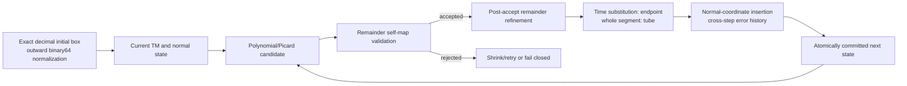

# Method and current code map

This note describes the current plant-only polynomial ODE flowpipe that the review CLI actually delegates to. The original-box VDP equations are `x' = y`, `y' = y - x - x²y`; the Brusselator equations are `x' = 1 + x(xy - 4)`, `y' = x(3 - xy)`. Their ordered system specifications and exact decimal boxes are checked in [the frozen review profile](../benchmarks/review/fixed_profiles.json) against the original execution contracts and [canonical benchmark](../benchmarks/canonical.yaml). This branch has no neural controller or hybrid transition in its main comparison.

A Taylor model is a retained polynomial `P` plus an interval remainder `R` over a specified domain. `P` keeps dependence on normalized initial coordinates and local time; `R` encloses truncation, cutoff, validation and charged arithmetic error that the retained polynomial cannot express. A flowpipe segment gives an enclosure for every local time in its step interval. Its **tube** is the range of that entire accepted segment; its **endpoint** is the time-substituted range at the step end. They need not have the same width. Physical x/y bounds, normalized right maps and internal Picard boxes are different objects, so the main figures use only physical endpoint and tube enclosures.

| Stage | Actual source path and function | Execution boundary |
|---|---|---|
| Initial set and frozen contracts | `plant_reference.py::FlowstarLikePolynomialPlantConfig`; `flowpipe.py::FlowstarNormalFlowpipeState.from_exact_decimal_box`; `endpoint_roundoff_repair/frozen.py::setup` | CPU binary64, exact decimal endpoints rounded outward; VDP order 4 and Brusselator order 6 |
| Polynomial candidate and Picard step | `flowpipe.py::flowpipe_step_flowstar_style_adaptive` delegates to `flowpipe_step_from_tm`; dense operations use `batched_dense_tm.py` and the ordered `PolynomialODE`/Brusselator RHS | CPU reference solver; no resident block by default |
| Validation and retry | `flowpipe.py` builds a validated interval Picard image, tests whether its remainder image lies in the candidate remainder, and the adaptive wrapper retries at smaller h where allowed | A failed self-map is a mathematical acceptance failure, not a crash; no endpoint is published or state committed |
| Accepted remainder refinement | The frozen modes `flowstar_raw_remainder_compat_factorized_joint_closure_refined` (VDP) and `flowstar_raw_remainder_compat_refined` (Brusselator) replay the remainder image after first acceptance, keeping the polynomial candidate and first acceptance decision | CPU; at most the frozen 491 replay calls and 0.99 width stop rule |
| Endpoint and tube | `TMVector.substitute_const_with_roundoff` calls `TaylorModel.substitute_const_with_roundoff` and `endpoint_substitution.py`; `flowpipe.py` applies endpoint cutoff with remainder; `TMVector.range_box` observes accepted model ranges | Endpoint time substitution has a scoped roundoff repair; the tube is the whole accepted segment `segment.tm`, not a center trajectory |
| Coordinate and history update | `flowpipe.py::_flowstar_normalized_insertion_transition` uses `accepted_boundary_sr.py::prepare_accepted_boundary_sr` and `commit_accepted_boundary_sr`; `symbolic_remainder.py` propagates linear history and owner metadata | CPU-authoritative atomic accepted-only commit; VDP's C3 and Brusselator's generic queue modes have different frozen capacities |
| Online GPU range option | `live_range_service.py::LiveRangeService` and `range_requests.py::evaluate_range_requests` dispatch current requests; `packed_boundary_range.py` groups ordered work; `range_cuda_kernel.cu` and `range_packet_cuda_kernel.cu` return range results | GPU results are consumed by the CPU-led live solver in the packet route; CPU scheduler, validation and committed state remain |
| Resident composition option | `resident_tm_block.py` owns each composition request/response and `resident_tm_cuda_kernel.cu` keeps the finite Horner block intermediates on device | Explicit Gr route only, default off; surrounding Picard, validation and history remain CPU |

The normal-coordinate right map expresses the accepted endpoint in a fresh local coordinate box; it is not a replacement for the physical flowpipe. The symbolic history queue keeps each step's error increment `J` and its linear propagation maps `Phi` so old errors are carried through a related linear expression instead of being reboxed as unrelated intervals at every step. Nonlinear remainder contributions still require enclosure; queue capacity/reset is a tightness choice and not the sole cause of every early rejection. The VDP cross-step-history evidence and Brusselator post-accept-refinement evidence are separate historical controlled tests.

An attempted step may fail validation and be retried with a smaller h in the native adaptive contract. Fixed 1000-step runs use their frozen h; a rejected step cannot be silently counted as accepted. The run records actual binary64 h and exact rational accumulated time. B1 means the one original unpartitioned initial box; B32 means 32 distinct outward subboxes from an 8×4 split; B32×20 is 20 accepted steps per subbox, not full T10/T20.

The main [curve file](../results/review/bounds/curves.csv.gz) has lower and upper physical bounds for endpoint-x/y and tube-x/y at every accepted step. `summarize` re-observes complete saved CPU and Flow* model objects under the current strict CPU range path; GPU-range bounds come from each accepted live solver state. This makes the observation operator comparable while preserving the fact that Flow*'s internal validator, refinement and historical propagation are not identical. `strict` names an operator or request mode, not an end-to-end formal theorem for this branch. See [numerical scope](NUMERICAL_SCOPE_AND_EXTERNAL_CODE.md) for the retained-coefficient and external-code assumptions.
