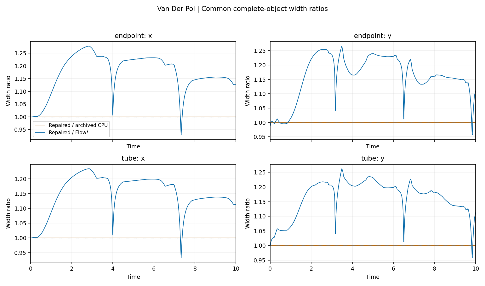
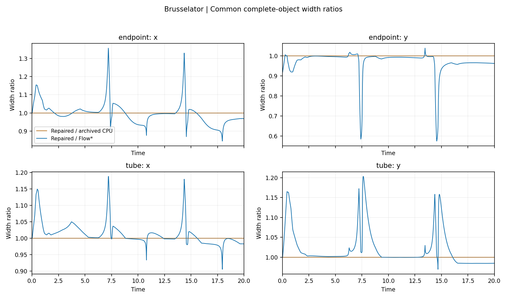

端点代入缺陷已经修复，并完成原设置下的两套固定长跑和 VDP 自适应 T10。最终状态为 `ENDPOINT_REPAIR_CLOSED__FULL_HORIZONS_REVALIDATED`。补上误差以后，这三次运行仍能算到原目标；全程范围与旧 CPU 极接近，与 Flow* 的原有宽度关系也基本保留。这个结论属于修复后的新实验，不能追溯性证明旧轨迹安全。

**错在哪里。** 程序原来先用浮点数求时间幂、乘系数、合并同类项，然后把结果当作没有额外误差的多项式。`-1+100*t` 在机器实际保存的 `0.01` 处，精确值是 `3/144115188075855872`，约 `2.0817e-17`；旧点计算却相消成零。最后仅把零往外移到约 `5e-324`，补不回此前丢掉的误差。修复前两条原始安全测试正常失败；修复后原文件、输入和包含断言原封不动，两条都正常通过。

**改了什么。** 保留点系数计算，同时独立用向外舍入的基本乘法和加法包住时间幂、系数乘积和同类项合并，再把“精确系数区间减去保留系数”形成的误差多项式，放到真实剩余变量 domain 上取范围。返回的普通余项为原余项加这笔误差。稀疏与稠密使用同一数学合同；生产不使用 Fraction，Fraction 专门用于独立 oracle。测试覆盖实际 order 4/6、1/2/3 个剩余变量、非对称域、多分量、B1/B2、严重相消、零和合法负时间、subnormal、cutoff、非有限数和溢出。不合法输入明确失败，没有经验性加宽常数。

**如何交给下一步。** 发布端点与稠密内部端点分别产生自己的误差，二者不会再相加。normal 左/右映射消费完整发布余项；本步新误差进入 current owner，已传播历史继续走原历史队列。G1/G2/S1 原本从验证器分解重建余项，现在使用加入本次代入误差与 endpoint cutoff 的派生分解，原验证账本保持不变。稠密余项与账本总和一致，分量拆开再合并也保留新增类别。七条真实路径都做了两步检查；重复报告不追加 owner，失败尝试不改接受状态。VDP 的第 99/100/101 步队列长度是 99/0/1；Brusselator 的第 999/1000 步是 999/0。两系统第 120 步 checkpoint 恢复后，第 121 步的完整对象与队列均逐位一致。[传递证据](../../artifacts/runs/endpoint_roundoff_repair_20260908/two_step_carry_checks.json)、[误差归属](../../artifacts/runs/endpoint_roundoff_repair_20260908/error_ownership.json)。

**算到了多远。** VDP 固定 h=0.01、order 4、容量 100：1000 接受、0 拒绝，实际时间 `720575940379279375/72057594037927936`，名义 T10。Brusselator 固定 h=0.02、order 6、容量 1000：1000 接受、0 拒绝，实际时间 `720575940379279375/36028797018963968`，名义 T20。最后一步没有为命中十进制终点而缩短。VDP 原自适应规则仍为 h_min=0.002、h_max=0.1，得到 246 接受、35 拒绝；调度浮点时钟到 10，而实际步长之和为 `5764607523034236731/576460752303423488`，约 10.000000000000004。拒绝数没有被强制锁成旧值。

方程、初始十进制盒子、普通余项预算、cutoff、validation epsilon、refinement 和调度规则均与旧 MATCHED_CONTRACTS 一致。额外 endpoint ad-hoc tightening 仍关闭；本轮必需的舍入修正始终启用。三次长跑的 post-accept replay 分别为 4386、8806、1014 次，均实际提交，无失败或 replay cap。旧固定长跑未记录同一口径的 refinement 次数，因此不编造新旧差额。

**全程四项宽度。** 下表为共同完整对象测量器的结果，分位数按小段持续时间加权。完整发布视角也保存并重算，没有强行对齐两种实现的内部变量。两系统四项新/旧最大相对增幅分别不超过 6.71e-10、6.73e-9；所有 1% 工程警报均为零，近零分母计数也为零。

| 系统 / 范围 | 新/旧最大相对增幅 | 新/Flow* P50 | P95 | 最大值（时刻） |
|---|---:|---:|---:|---:|
| VDP 端点 x | 6.660e-10 | 1.1976 | 1.2679 | 1.2781（2.85） |
| VDP 端点 y | 6.703e-10 | 1.1654 | 1.2514 | 1.2662（3.49） |
| VDP 整段 x | 6.586e-10 | 1.1741 | 1.2271 | 1.2348（2.85） |
| VDP 整段 y | 6.619e-10 | 1.1836 | 1.2312 | 1.2623（3.49） |
| Brusselator 端点 x | 6.259e-09 | 0.9958 | 1.1101 | 1.3567（7.20） |
| Brusselator 端点 y | 6.721e-09 | 0.9911 | 1.0061 | 1.0385（13.46） |
| Brusselator 整段 x | 4.229e-09 | 1.0059 | 1.0888 | 1.1880（7.22） |
| Brusselator 整段 y | 5.537e-09 | 1.0020 | 1.1377 | 1.2032（7.64） |

上下界和中心也分别比较了。四项宽度相对旧 CPU 的最大绝对差，VDP 不超过 7.65e-11，Brusselator 不超过 3.50e-10；最大中心偏移分别不超过 8.40e-14、5.32e-13。与 Flow* 的中心不同仍然存在，因此“宽度接近”不等于内部表示或区间位置完全相同。[全部分位数、最大值及发生时刻](../../artifacts/runs/endpoint_roundoff_repair_20260908/width_summary.csv)；[逐步上下界、绝对差和中心偏移](../../artifacts/runs/endpoint_roundoff_repair_20260908/widths_full_prefix.csv)。

图按每个小段的结束时刻索引；整段数据针对该小段的完整时间域。完整上下界图见 [VDP](../../artifacts/runs/endpoint_roundoff_repair_20260908/figures/vdp_common_bounds.png)、[Brusselator](../../artifacts/runs/endpoint_roundoff_repair_20260908/figures/brusselator_common_bounds.png)，发布视角和 PDF 也在 figures 中。固定两系统的新增端点误差均从第一步非零，最大绝对量分别为 2.30735e-15（VDP y，第 670 步）和 6.22224e-15（Brusselator y，第 687 步）。每个分量的首个非零与最大值时间见 [误差摘要](../../artifacts/runs/endpoint_roundoff_repair_20260908/endpoint_error_summary.csv)，逐步上下端点保存在 endpoint_audit.jsonl。

**实际时间。** 必需的误差计算计入求解时间；导出另计，包含本轮新增的逐步队列指纹、拥有者记录和 checkpoint。下表均为一次观测，不能据此宣称稳定性能倍率。

| 系统 / 数据身份 | 求解秒 | 导出秒 |
|---|---:|---:|
| VDP / 旧 CPU 归档 | 681.249 | 13.374 |
| VDP / 新 CPU | 687.521 | 18.744 |
| VDP / Flow* 复用 | 1.488 | 2.892 |
| Brusselator / 旧 CPU 归档 | 1990.779 | 34.171 |
| Brusselator / 新 CPU | 2004.428 | 90.527 |
| Brusselator / Flow* 复用 | 13.570 | 10.304 |
| VDP / 新 CPU 自适应 | 188.943 | 4.768 |

新旧固定 CPU 求解时间在这次观测中分别增加约 0.92% 和 0.69%；本轮没有性能实现。旧 VDP 自适应记录只有约 218.93 秒的总体 runtime，缺少相同的求解/导出拆分，不与新 188.94 秒求解时间直接算倍率。Flow* 是旧同合同结果复用，未重新运行或编译。

**旧结论与剩余限制。** 旧 T10/T20 和结构消融是真实计算记录，原始数据、时间和 SHA256 保持不变，标为 OLD_UNREPAIRED_ARCHIVE；但旧版本不再作为无条件正确的独立 oracle。局部反例尚未证明这两条旧轨迹漏掉真实 ODE 解，也不能用“大余项”或“零采样违规”替它们补证明。新长跑标为 FRESH_ENDPOINT_REPAIRED，Flow* 标为 REUSED_MATCHED_REFERENCE。端点操作、所检查使用链与这些新完整运行已经闭合；整个求解器仍没有完成形式化证明，GPU 算术和完整 batch 求解器不在本轮验证范围内。

完整回归中只更新了两处受影响的旧预期：C2 两步状态 hash，以及关闭归一化的 S1/C3 实验控制的域门槛首次失败位置 11→3。先在干净运行版本上对这些接受端点做独立 Fraction 包含检查，再更新预期；域门槛和拒绝断言没有放宽。旧 CUDA smoke 的混合设备输入兼容问题也已修复，最后的稠密重组账本遗漏由新反例检查闭合。这些过程及首次失败日志均保留。[预期变化的原始依据](../../artifacts/runs/endpoint_roundoff_repair_20260908/raw_minimal/affected_golden_audit.json)、[处理记录](../../artifacts/runs/endpoint_roundoff_repair_20260908/raw_minimal/initial_regression_resolution.json)。正式三项合同没有剩余安全阻碍。

**测试与独立复核。** 最终完整矩阵 1066 passed / 11 skipped / 0 failed，其中旧停止验证器的 6 项只在旧固定快照执行。另有 7 项范围有限的篡改测试通过：即使重新计算外层 SHA256，删去新增误差、十进制替换实际时间、改变 h、把 reused 标 fresh、篡改宽度、完成时间或结果状态，都会被拒绝。去重合计 **1073 passed / 11 skipped / 0 failed**。独立 clone 使用不共享对象硬链接的克隆，证据验证器通过，并正常运行依赖完备的 124 项局部测试；这些重复测试不再加总。验证器重算 40402 个精确系数、4812 个分量端点、2406 个保存小段和 16000 行宽度，包含短前缀，两个正式固定长跑合计 4000 个分量端点。这是证据重算与小型传递回放，独立 clone 没有重新长跑。[去重计数](../../artifacts/runs/endpoint_roundoff_repair_20260908/tests/FINAL_TEST_ACCOUNTING.json)、[克隆复核日志和命令](../../artifacts/runs/endpoint_roundoff_repair_20260908/tests/independent_clone/independent_clone_commands.json)。

**版本与复现。** 初始操作修复为 `ca330de4ac46e823fb8e36e8982762f0437f71be`；正式运行提交为 `196a50e9131336d68df07ad0af353deca0092d19`；交付运行时为 `0714e475ed9e73bec31619c9c690d1fd63de3d36`。后两者差别限于无损设备/精度对齐和稠密端点类别重组。CPU binary64 输入的运算顺序不变；冻结路径在内部 endpoint 返回后不再进行稠密组合，下一步从完整稀疏状态重新建立账本。所有保存端点逐位回放、七条真实传递路径及两系统 checkpoint 恢复均验证了版本衔接。长跑始终归属 196a50e，不把封装或交付 SHA 冒充长跑版本。[版本衔接说明](../../artifacts/runs/endpoint_roundoff_repair_20260908/raw_minimal/runtime_bridge.json)、[源码与旧资料摘要](../../artifacts/runs/endpoint_roundoff_repair_20260908/SOURCE_MAP.json)、[操作合同](ENDPOINT_CONTRACT.md)、[复现命令](../../experiments/endpoint_roundoff_repair/README.md)。

接下来可以恢复以修复后版本为基线的语义不变优化研究，再要求与新基线逐位一致。应分别测量自身重复计算优化的收益、旧严格 GPU 引擎受控复用的成本与可用性；本轮没有进行第二轮性能实现，也没有永久排除 Huan/Xiangru。GPU 路线仍未决定，不能再用“我们的参考必然更正确”作理由。交付只推送用户的新分支 `codex/endpoint-roundoff-repair-and-revalidation-20260908`，不合并 main。
