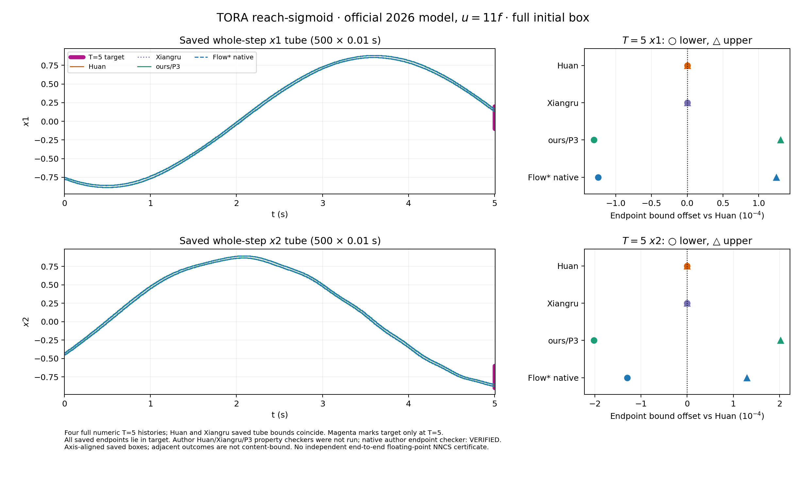

# TORA reach-sigmoid：四方保存全时域图（2026 官方 `u=11f` 合同）

此图直接读取四个**已完成**运行各自的 `ranges.bin`：Huan、Xiangru、ours/P3 和 Flow* native 都有完整初盒、`0.01 s × 500` 小步至 `T=5 s`，每条记录含四态的整步 tube 和终点区间。图左分别画保存的 `x1`、`x2` 轴向整步 tube；紫线只表示 **T=5** 的目标区间 `x1∈[-0.1,0.2]`、`x2∈[-0.9,-0.6]`，不是全时目标。右列把四方终点区间的下界（圆点）和上界（三角）减去 Huan 相应边界，单位 `10⁻⁴`，方便辨认全程曲线几乎重合时的实际差异。Huan 与 Xiangru 保存的两条 tube 曲线逐边界一致。

| 方法 | 原始范围 | 数值/性质口径 |
| --- | --- | --- |
| Huan | [500 条范围](../tora_reach_sigmoid_official2026_mat_u11_full500_huan_002/ranges.bin)、[运行结果](../tora_reach_sigmoid_official2026_mat_u11_full500_huan_002/RESULT.json)、[独立扫描](../tora_reach_sigmoid_official2026_mat_u11_full500_huan_002/INDEPENDENT_INTERVAL_SCAN.json) | 500 步全部接受；性质 checker 未运行。 |
| Xiangru | [500 条范围](../tora_reach_sigmoid_official2026_mat_u11_xiangru_full500_001/ranges.bin)、[运行结果](../tora_reach_sigmoid_official2026_mat_u11_xiangru_full500_001/RESULT.json)、[独立扫描](../tora_reach_sigmoid_official2026_mat_u11_xiangru_full500_001/INDEPENDENT_INTERVAL_SCAN.json) | 500 步全部接受；性质 checker 未运行。 |
| ours/P3 | [500 条范围](../tora_reach_sigmoid_official2026_mat_u11_p3_full500_001/ranges.bin)、[运行结果](../tora_reach_sigmoid_official2026_mat_u11_p3_full500_001/RESULT.json)、[独立扫描](../tora_reach_sigmoid_official2026_mat_u11_p3_full500_001/INDEPENDENT_INTERVAL_SCAN.json) | 500 步全部接受；性质 checker 未运行。 |
| Flow* native | [500 条范围](../native_tora_reach_sigmoid_u11_full10_001/ranges.bin)、[运行结果](../native_tora_reach_sigmoid_u11_full10_001/RESULT.json)、[独立扫描](../native_tora_reach_sigmoid_u11_full10_001/RANGE_SCAN.json)、[原生日志](../native_tora_reach_sigmoid_u11_full10_001/native.log) | 原生范围为完整 500 条网格，二进制范围不带 `accepted` 字段；进程 exit 0，作者终点 checker 打印 `VERIFIED`。 |

绘图器逐条检查固定记录格式、步号、步长、有限有序区间，以及每步终点处于同段 tube；对照已保存扫描的最终四态终点。前三方还核对逐步 `accepted=true` 和 `interval_valid=true`。**四方保存的 T=5 终点盒均包含于目标盒**，这是“5 秒内到达”的充分数值观察。前三方未运行性质 checker；原生 `VERIFIED` 只按作者终点 checker 口径记录。轴向盒不含坐标相关性或 octagon 支持，原始范围与相邻运行收据没有内容绑定；本图不构成独立端到端浮点 NNCS 证明或速度排名。

产物：[PNG](tora_reach_sigmoid_u11_fourway_saved.png)、[PDF](tora_reach_sigmoid_u11_fourway_saved.pdf)、[几何 JSON](tora_reach_sigmoid_u11_fourway_saved.geometry.json)、[MATLAB 绘图脚本](tora_reach_sigmoid_u11_fourway_saved.m)、[无哈希重建脚本](plot_nohash.py)。MATLAB 脚本读取相邻几何 JSON；当前没有 MATLAB 执行记录。
