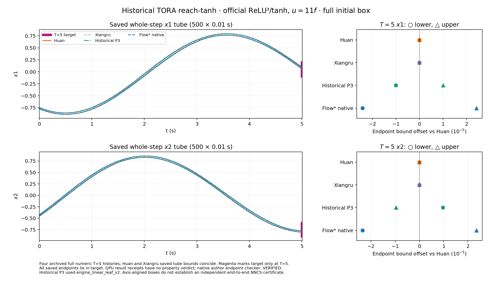

# TORA reach-tanh：同合同历史四方保存流管与终点

此图复用 **2026 官方 ReLU³/tanh 网络、`u=11f`、四态完整初盒**合同下四条已结束的历史运行，没有启动新实验。每方有 `0.01 s × 500` 条完整四态记录，到 `T=5 s`。左列把四方 `x1`、`x2` 的整步保存 tube 放在相同时间和状态坐标轴；紫色短线仅为 **T=5** 目标区间。右列把终点下界（圆点）与上界（三角）相对 Huan 的偏移放大到 `10⁻⁵` 单位。Huan 与 Xiangru 保存的全部 500 步、四态 tube 和 endpoint 边界完全相同，因此全时曲线重叠；其它两方也很接近，但右列与 [四态绝对终点 CSV](terminal_fourway_absolute_T5.csv)显示其数值差异。

| 历史方法 | T=5 `x1` endpoint | T=5 `x2` endpoint | 数值时域与性质标签 |
| --- | --- | --- | --- |
| Huan | `[0.06792767387470561, 0.0930071824700373]` | `[-0.8033863592142395, -0.7759758394288576]` | 500/500 接受；原始 result 无性质 verdict。 |
| Xiangru | 同 Huan | 同 Huan | 500/500 接受；原始 result 无性质 verdict。 |
| 历史 P3 | `[0.06791759970731215, 0.09301725680051268]` | `[-0.8033766729281789, -0.775985525892157]` | 500/500 接受；引擎为 `engine_linear_leaf_v2`，**不是当前 working P3**。 |
| Flow* native | `[0.0679033920600035, 0.09303146155725531]` | `[-0.803409868422367, -0.7759523331619449]` | 500 条完整网格、10 期、exit 0；作者终点 checker 日志打印 `VERIFIED`。二进制范围没有 GPU 式 `accepted` 字段。 |

目标是 `x1∈[-0.1,0.2]`、`x2∈[-0.9,-0.6]`。四方保存的完整初盒 T=5 endpoint 均落入此盒，给出“五秒内到达”的充分**数值观察**。历史 GPU result 没有性质 verdict，原生 `VERIFIED` 只归于作者终点 checker。坐标轴盒不保留跨坐标相关性，也不构成独立端到端浮点 NNCS 证明；历史单次耗时未据此排名。

## 证据与复制范围

四个 [`ranges.bin` 副本](raw/)分别为 `old_p3_ranges.bin`、`huan_ranges.bin`、`xiangru_ranges.bin`、`native_ranges.bin`。原始文件均来自服务器 `/srv/local/shengenli/flowstar_acceleration_20260921T153643Z/runs/archcomp_review_20260923/` 下 `suite_v1/tora_relu_tanh_{ours,huan,xiangru}/ranges.bin` 与 `native_matched/tora_relu_tanh/ranges.bin`；对应历史 [原始 result 链接与同合同资格](../../../archcomp26_coverage_overlay_20261002.md)和[本轮 Huan 首周期一致性审计](../tora_reach_tanh_official2026_mat_u11_firstperiod_diag_001/HISTORICAL_REUSE_AUDIT.json)保留在案。

[只读区间审计](AUDIT.json)对每个副本核对 500 个连续步号、`h=0.01`、四态有限有序范围及每步 endpoint 包含于本段 tube；历史三方 GPU result 的 500 个接受记录和原生 10 期/exit 0/`VERIFIED` 逐项核对。另与已保存的历史数值轨迹 `results/archcomp_review_20260923/evidence_v2/width_trajectory_tora_relu_tanh_matched.csv.gz` 对照 12,000 行、48,000 个上下边界数值，误差阈值 `10⁻¹²`；此次未证明原始范围副本和相邻 result 的内容绑定。

产物：[PNG](tora_reach_tanh_u11_historical_fourway_saved.png)、[PDF](tora_reach_tanh_u11_historical_fourway_saved.pdf)、[四态绝对终点 CSV](terminal_fourway_absolute_T5.csv)、[几何 JSON](tora_reach_tanh_u11_historical_fourway_saved.geometry.json)、[MATLAB 绘图脚本](tora_reach_tanh_u11_historical_fourway_saved.m)、[只读重建脚本](plot_saved_ranges.py)。MATLAB 脚本读取相邻几何 JSON，尚未在 MATLAB 中执行。
