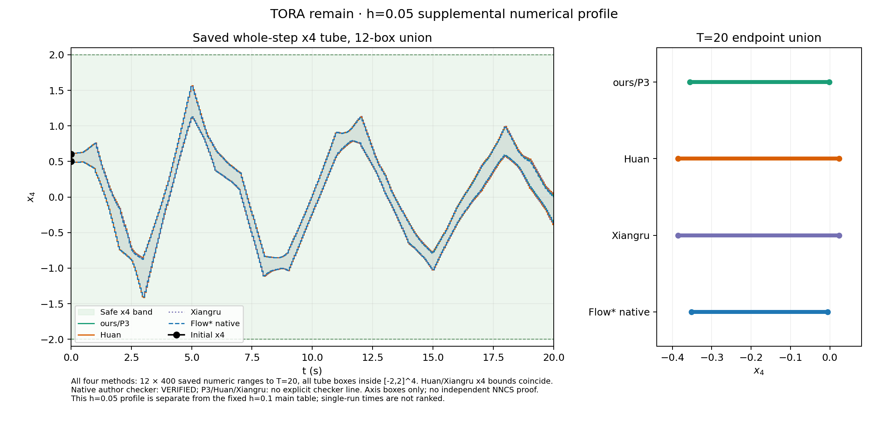

# TORA remain `h=0.05`：四方保存范围补充对照

此**单列数值 profile**使用 2026 TORA remain 四态合同、12 个完整初盒分区、1 秒控制保持、20 秒时域和全时 `[-2,2]^4` 安全盒，仅将固定主表的 ODE 步长 `h=0.1` 减为 `0.05`。四方新作业来源：[ours/P3](../p3_tora_remain_h005_probe_20261002/SUMMARY.md)、[Huan/Xiangru](../author_tora_remain_h005_probe_20261002/SUMMARY.md)、[Flow* native](../native_tora_remain_h005_probe_20261002/SUMMARY.md)。旧 `h=0.1` 主表结果未替换，旧实验没有重启。

[逐态 CSV](terminal_and_tube_fourway.csv)给出四方法各 `x1`–`x4` 的 **T=20 endpoint 并集绝对下/上界及宽度**、12 个终点分盒宽度的均值/最大值、以及 **0–20 秒全部 12×400 整步 tube 的轴向并集绝对下/上界及宽度**。这三种宽度的统计对象不同，不把端点并集当作单盒宽度。图左以共同时间轴画各步 12 盒 `x4` tube 并集；右侧独立画 T=20 endpoint 并集，避免重合曲线掩盖差别。Huan/Xiangru 的保存 `x4` 曲线逐步一致。

| 方法 | `T=20` 的 `x4` endpoint 并集 | 并集宽度 | 终点每盒平均 / 最大宽度 | 全时 `x4` tube 并集 |
| --- | --- | ---: | ---: | --- |
| ours/P3 | `[-0.355925,-0.001610]` | 0.354314 | 0.251177 / 0.339974 | `[-1.410323,1.564666]` |
| Huan | `[-0.385197,0.023532]` | 0.408728 | 0.286243 / 0.392388 | `[-1.410581,1.565374]` |
| Xiangru | `[-0.385197,0.023532]` | 0.408728 | 0.286243 / 0.392388 | `[-1.410581,1.565374]` |
| Flow* native | `[-0.352053,-0.005260]` | 0.346793 | 0.245971 / 0.333152 | `[-1.398792,1.555643]` |

[只读构造脚本](build_fourway_nohash.py)逐条解码四份原始 `ranges.bin`，核对 `12×400` 唯一盒步、`h=0.05`、四态区间有限有序、终点在同一步 tube 内，以及所有保存 tube 在安全盒内。作者三方还逐步核对 `accepted_count=12`、无拒绝，并与既有扫描/RESULT 的四态绝对界一致；原生核对完整 20 期日志、其独立扫描和进程 exit 0。来源路径、文件大小、逐步 `x4` 数据及性质口径在[几何 JSON](tora_remain_h005_fourway_t_x4.geometry.json)。原生作者 checker 打印 `VERIFIED`；P3/Huan/Xiangru 没有明确 checker 文字输出，其已保存 tube 的安全观察独立表述。原生二进制范围本身没有逐步 accepted 字段。

这只是**保存轴向盒**的数值比较；相关几何和控制器端到端浮点误差证明均不在这些原始范围中。四方法各为单次独立进程，图及 CSV 不提供稳定速度排名或独立 NNCS 证明。另有[PDF](tora_remain_h005_fourway_t_x4.pdf)和[MATLAB `.m`](tora_remain_h005_fourway_t_x4.m)；MATLAB/Octave 未执行。
