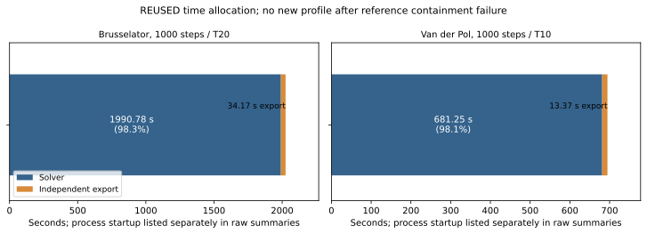

# 本轮没有实施提速：我们自己的端点安全检查先失败了

指定的小例子揭示了当前 CPU 参考路径的一处漏包。按照目标第 2.2 节，本轮在性能测量和实现之前停止。没有新增优化模式，也没有修补数值算法。这个结果是一次明确的参考正确性发现，不能写成已定位性能瓶颈或实现提速。

把时间多项式 `-1 + 100*t` 在机器实际表示的 `0.01` 处代入，精确值为 `3/144115188075855872`，约 `2.0816681711721685e-17`。输入普通余项为零。我们检查了代入后的整个多项式加完整余项，再检查生产范围函数返回的范围，结果都不包含精确值。

| 实际入口 | 返回的多项式 | 完整普通余项 | 生产范围函数返回的范围 | 包含精确值 |
|---|---|---|---|---|
| 发布端点所用的代入、删时间变量及 cutoff | 零多项式 | ±4.9406564584124654e-324 | ±9.8813129168249309e-324 | 否 |
| dense 验证器内部端点代入 | 零多项式 | [0,0] | ±4.9406564584124654e-324 | 否 |

原因可以直接从这次调用解释：`100*binary64(0.01)` 的精确值比 1 大一点，点浮点乘法将它舍入成 1，再减 1 得到零。代入接口没有把失去的系数舍入误差加入余项；随后对零附近作很小的向外扩展不能补回该误差。这是实际生产方法上的局部反例，不是已经观察到 T20/T10 动力学轨迹漏包，也不是全求解器错误范围的界定。

**实际时间与是否提速。** 下表全部旧时间来自同一批冻结的完整单次运行，标为 REUSED。本轮没有新 reference/optimized 配对，没有早期或晚期前缀的三次统计，没有峰值内存比率，也没有速度承诺。

| 系统与相同工作量 | 旧 CPU 求解秒数（REUSED） | 本轮优化后秒数 | 原生 Flow* 秒数（REUSED） | 旧 CPU / Flow* 时间比 |
|---|---:|---|---:|---:|
| Brusselator，1000 步，T20 | 1990.778946 | 未运行 | 13.569828 | 146.71× |
| Van der Pol，1000 步，T10 | 681.249270 | 未运行 | 1.488466 | 457.69× |

求解和独立导出分开：CPU 两系统导出分别为 34.171422、13.374196 秒，没有把导出时间当作优化分母。旧运行亲和性为 CPU 2；本轮局部反例和项目测试为 CPU 5，都是原 py11 / float64 / 单线程。本轮未声称独占机器。

图仅显示旧求解与独立导出的互斥时间。本轮尚无优化后的剩余时间分布或当前函数热点图，原因是安全前提先失败。旧性能报告中的细分占比来自历史队列张量优化之前，不能代作当前占比。

**原来可能重复什么，哪些必须重算。** 原计划要检验同一步固定候选多项式的乘法、截断和独立范围是否被反复准备。候选系数固定，才可能复用其数值工作；当前余项、交叉项、proposal、包含检查、停止判断和最终提交的误差必须逐轮计算和记账。现在没有新的四个 profile 窗口，也没有得到被优化占比 f 或局部速度 s。`1 / ((1-f) + f/s)` 的预测及是否可达 1.5× 均未建立，因此没有授权实现 prepared plan，第二候选也未启动。

**四项范围是否保持。** 旧两系统各 1000 步的终点 x/y、小段 x/y 上下界均保留，与起点提交逐行相同。[机器表](../../artifacts/runs/our_solver_replay_performance_20260907T074937Z/full_width_equivalence.csv) 共 8,000 行，`archive_equal_to_base=True`；新版本上下界和 `fresh_pair_equal` 列为空，状态明确为未运行。它证明档案没有被改写，不是一次新的全程数值保持检查，也不把有局部缺陷的参考提升为普遍安全真值。

| 旧终点范围（REUSED，第 1000 步） | x | y |
|---|---|---|
| Brusselator | [0.4969343127635595, 0.5003400875795633] | [4.592612161756297, 4.60094827675281] |
| Van der Pol | [-1.4420557660996902, -1.21541797852865] | [-2.528819718261065, -2.2231328509703183] |

全程小段和终点上下界见机器表，不只保留最后一行。旧精确结束时间分别为 `720575940379279375/36028797018963968`、`720575940379279375/72057594037927936`，未把 binary64 累积时域裁成十进制整数。

**相对 Flow* 还差多少。** 上面的旧时间差距仍然存在。旧发布范围的全时域宽度比统计如下；各格为“按时长加权 P95 / 最大值”，均为 REUSED，不能由宽度接近推出包含正确。

| 我们的宽度 / Flow* 宽度 | Brusselator | Van der Pol |
|---|---:|---:|
| 终点 x | 1.1101 / 1.3567 | 1.2679 / 1.2781 |
| 终点 y | 1.0061 / 1.0385 | 1.2514 / 1.2662 |
| 小段 x | 1.0888 / 1.1880 | 1.2271 / 1.2348 |
| 小段 y | 1.1377 / 1.2032 | 1.2312 / 1.2623 |

**测试是否全过。** 根目录 **960 passed / 2 skipped / 2 failed**，451.25 秒；七组隔离测试最终 **60 passed / 9 skipped / 0 failed**。不同项目用例去重合计 **1020 passed / 11 skipped / 2 failed**，不能称为当前数值回归全过或全项目全绿。 历史资料缺失问题已恢复：只从指定旧工作树读取精确目录，25 个文件的原始清单摘要与测试固定值 `3da0feed…567a1c3f02` 完全一致，再复制到新测试环境。没有修改历史断言或期望，资料仍按原规则留在忽略目录；独立克隆只验证已提交的清单和测试日志，不假装恢复了它的本机测试环境。

两项端点包含断言保留为正常失败，没有 skip、xfail 或把“应当漏包”当成安全期望。旧历史传播和归一化回归按完整矩阵复用；旧静态 verifier 单独执行一次通过，没有重跑第三方生产函数或 GPU 反例。新的证据校验及五类重算外层摘要后的篡改测试都在根目录总数内（其中 replay 检查防止把未运行重标为已接受，不是逐轮回放等价证明），不重复相加。[测试原始记录](../../artifacts/runs/our_solver_replay_performance_20260907T074937Z/test_results.json) 列出八组命令、日志、JUnit 与退出码。未运行项目为四个新 profile 窗口、重复前缀、两系统各 reference/optimized 的四次完整固定步长运行和优化版本自适应回归；原自适应 T10、246 accepted / 35 rejected 要求保留，但本轮没有重新验证。

两个 DiffReach 隔离组首次收集出现 3 个导入错误：新 worktree 的默认相邻路径不存在，启动环境遗漏了上一轮明确设置的 `DIFFREACH_ROOT` 和 `JAX_PLATFORMS=cpu`。补齐原环境后仅重跑这两组，分别 8、2 项通过；源码和断言没变。首次日志及退出码 2 保留在 `tests/initial_collection_errors.json` 所列路径，未借历史资料例外掩盖它们，亦未把重跑次数加到 passed 总数。

**未来批量与 GPU。** 本轮没有新布局，不能声称它已经利于 GPU。单步不可变多项式与动态余项分离仍是一个有意义的待测方向：如其数据流和收益得到证明，才可能把多次 Python 小操作变成能批量执行的张量计划。这不是这轮已经完成的能力。

**下一步边界。** 应先另行授权闭合我们自己的端点系数舍入误差合同，确定余项的归属及传播，再回到同一步固定多项式重复准备这一条性能假设。当前没有新 profile 支持指定另一个执行瓶颈。没有恢复第三方接纳、控制器任务或 CUDA 重写。

版本与复核附录：

- 结果：`OUR_REFERENCE_DEFECT_FOUND__PERFORMANCE_STOP`。这是目标明定的提前停止分支；没有性能实现 SHA。
- 数值起点保持 `f23c375f7935dc2f85a37a0ad69814ab052168bb`；与 `4939fb288c941a67f55cc191f4d75f8594692f47` 的既有数值模块逐字节相同，差别仅为新增 CPU 独立任务包装及其导出。入口函数、历史合同和导入路径证据见 `SOURCE_MAP.json`、`raw_minimal/reference_continuity.json`。
- 反例驱动：`f37fd212e530bffc9518262970df8d5892f07d8a`；证据校验和完整测试源码：`f5e7e78883adb3b1b7f5f7410fe5eeb69f18649c`。证据封装提交单独由最终交付记录列出，不伪装成算法版本。
- 实际入口：`BatchedTaylorModel.endpoint`；以及 `dense_to_sparse_tmvector` 后的 `TMVector.substitute_const(...).drop_variable(...).apply_cutoff(...)`，与 `flowpipe.py:6090` 发布入口相同。没有注入替代数学实现。
- 远端分支：`codex/our-solver-prepared-replay-performance-20260907T074937Z`，仅用户自己的仓库新分支；不合并 main。
- 结果：`artifacts/runs/our_solver_replay_performance_20260907T074937Z/`。工作树：`/srv/local/shengenli/our_solver_replay_performance_20260907T074937Z/repo`。
- 独立克隆只复算已提交反例、档案保留、计时表、身份及停止决定；没有再次跑长实验。最终验证的具体提交和退出码由 ROOT 下的 final_delivery.json 记录。
- 复核命令：在该分支根目录用原 py11 执行 `PYTHONPATH=src:. python -m experiments.our_solver_performance.verify_evidence artifacts/runs/our_solver_replay_performance_20260907T074937Z`。
