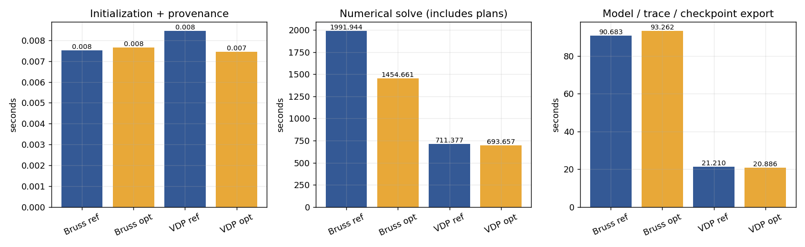
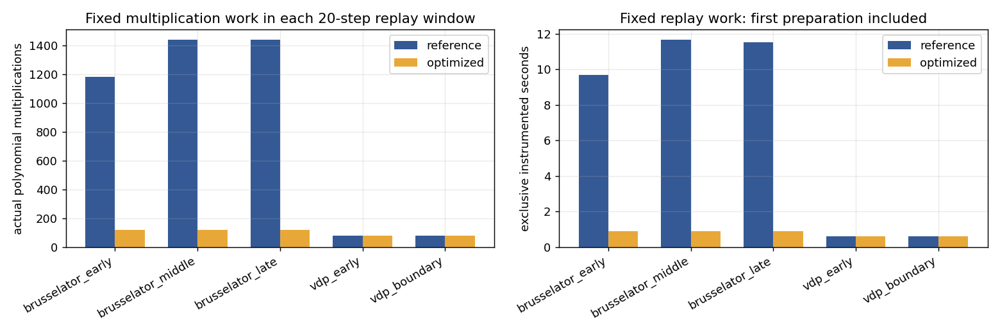
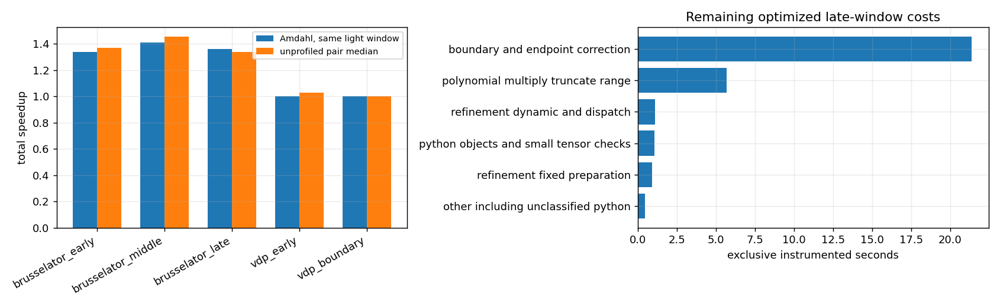
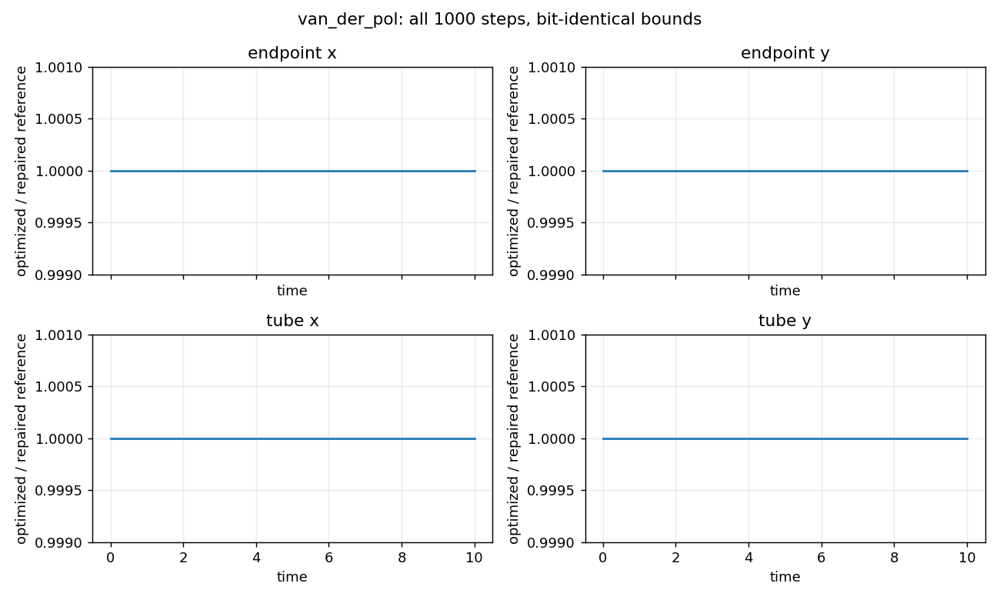
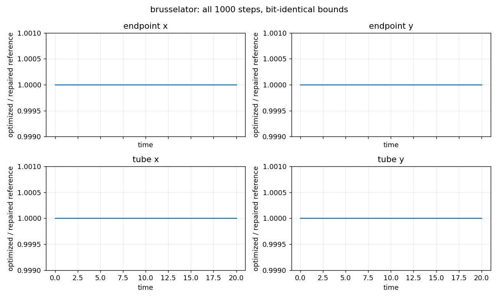
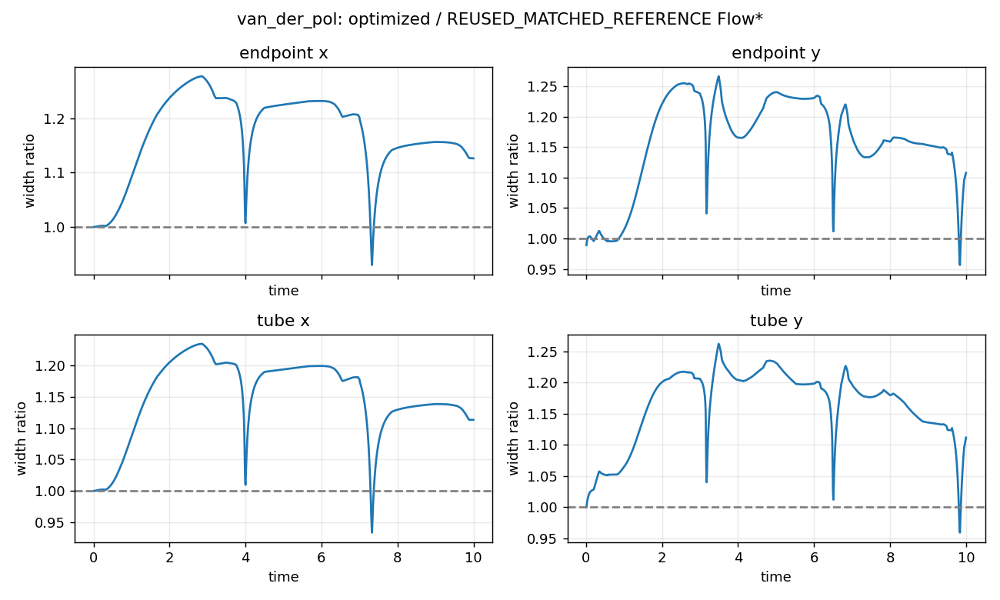
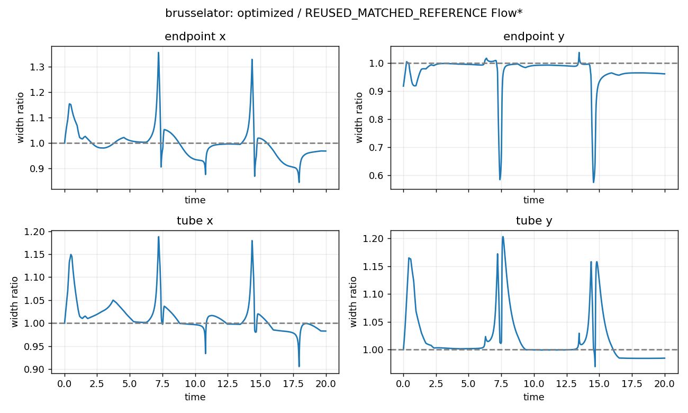

有实际提速，但未达到本轮完整性能目标。Brusselator 完整 1000 步求解加速 **1.369×**，VDP 为 **1.026×**。两系统每一步端点和整段的 x/y 上下界均逐位一致，完整余项、端点 E、normal state、历史队列摘要和收紧计数也一致。状态为 `REPAIRED_REFERENCE_PRESERVED__USEFUL_SPEEDUP_BELOW_TARGET`。

本轮只实现一个机制：接受步骤内的 prepared polynomial replay。默认 reference 仍关闭新开关；端点修复始终保留。没有改变方程顺序、h、阶数、cutoff、余项预算、491 次上限、0.99 停止比率、范围算法或历史队列规则。

**原来重复了什么。** generic raw-compat 收紧每一轮都用相同候选点系数执行 raw 与 regular 两套 RHS 的多项式乘法、截断、cutoff、积分与 polynomial-only range。新的私有计划按实际算术图记录这些固定结果，第一次真实 proposal 正常计算，随后读取它们。regular RHS 的临时余项账本仍依赖本轮 R，不能缓存；原余项乘法、交叉项、向外舍入、账本装配和包含检查仍每轮执行。

计划在每次接受 attempt 内建立，不跨步或 retry 共享数值；深拷贝静态输入，绑定对象/结构/参数和 tensor version，读取前检查固定存储未被修改。原地修改和不同 R 回放有直接测试，计划退出时立即释放。函数准入按纯算术依赖检查，没有写死 Brusselator 方程。细节见 [依赖与生命周期表](REPLAY_DEPENDENCIES.md)。

**完整时域与时间。** 下表全部是本轮 CPU float64、单线程、CPU affinity 2、原 py11/torch 环境的 fresh 运行。reference 和 optimized 都从初始完整状态实际求解。初始化包含配置、初始状态和来源记录；solve 包含每步计划构造、命中检查、全部数值验证和端点修正；模型/trace/checkpoint 导出单列。整个进程时间还包含 Python 导入和最终元数据。所有主要时间可由原始起止事件重算，没有把新计划放到计时之外。

| 运行 | 接受/拒绝 | 初始化秒 | 求解秒 | 导出秒 | 整个进程秒 | 峰值 RSS MiB |
|---|---:|---:|---:|---:|---:|---:|
| Brusselator reference | 1000/0 | 0.008 | 1991.944 | 90.683 | 2087.202 | 460.3 |
| Brusselator optimized | 1000/0 | 0.008 | 1454.661 | 93.262 | 1552.659 | 459.5 |
| VDP reference | 1000/0 | 0.008 | 711.377 | 21.210 | 735.004 | 444.7 |
| VDP optimized | 1000/0 | 0.007 | 693.657 | 20.886 | 716.971 | 444.8 |
| VDP adaptive optimized | 246/35 | 0.008 | 179.552 | 4.951 | 186.729 | 442.3 |

初始化加求解的总时间为：Brusselator reference 1991.951 秒、optimized 1454.669 秒，倍率 1.369×；VDP reference 711.386 秒、optimized 693.665 秒，倍率 1.026×。导出另见上表，完整进程列还包括导入与最终元数据。

固定 VDP 实际 sum(h) 为 `720575940379279375/72057594037927936`；Brusselator 为 `720575940379279375/36028797018963968`。两者分别完成固定 1000 步的名义 T10/T20，末步未裁剪来凑十进制终点。自适应的实际 sum(h) 为 `5764607523034236731/576460752303423488`，调度时钟为 `0x1.4000000000000p+3`。自适应 h/接受拒绝/状态序列与修复档案逐项相同，没有手写目标接受数；本轮不主张自适应速度倍率。

**重复值与接纳边界。** 每个 20 步窗口及每个 100 步 prefix 都进行了至少三对交替顺序测量。完整每模式各一次，不能把这一对称作稳定完整倍率。

| 100 步 prefix | 三个 reference/optimized 求解倍率 | median | min–max |
|---|---|---:|---:|
| brusselator | 1.3392, 1.3324, 1.3145 | 1.3324 | 1.3145–1.3392 |
| van_der_pol | 0.9837, 0.9861, 1.0161 | 0.9861 | 0.9837–1.0161 |

完整计时证据等级是 `borderline_single_pair`。Brusselator 目标仍为 1.5×；VDP 的本次完整与重复 prefix 10% 减速门槛检查通过。峰值 RSS optimized/reference 分别为 Brusselator 0.9983、VDP 1.0001。两系统峰值 RSS 均未超过 reference 的 1.5 倍。原始重复值、median/min/max 见 [timings_raw.csv](../../artifacts/runs/repaired_solver_performance_20260908T034636Z/timings_raw.csv) 与 [timing_summary.csv](../../artifacts/runs/repaired_solver_performance_20260908T034636Z/timing_summary.csv)。

**因果与剩余成本。** 下表固定工作时间来自独立嵌套函数计时。每个计时区间减去子区间，每个时间片只进入一个互斥分类，未相加 inclusive percentages。Python 对象/小张量检查是被测的一类，不把全部剩余成本归为 Python。阶段分类对候选构造、初次余项等扣除了已单列的多项式工作。

| 20 步窗口 | ref/opt 固定多项式乘法次数 | ref/opt 固定工作秒 | ref/opt 收紧轮数 |
|---|---:|---:|---:|
| brusselator_early | 1184/120 | 9.694/0.890 | 148/148 |
| brusselator_middle | 1440/120 | 11.653/0.901 | 180/180 |
| brusselator_late | 1440/120 | 11.539/0.899 | 180/180 |
| vdp_early | 80/80 | 0.607/0.603 | 80/80 |
| vdp_boundary | 80/80 | 0.600/0.586 | 80/80 |

计数减少来自固定工作复用，收紧轮数和每轮动态检查保留。VDP 继续使用已有的专用 canonical closure 缓存，新机制的主要作用在通用路径。缓存命中、绑定与存储检查、第一次准备和动态图执行都计入所测成本。

| 同一轻量计时窗口 | 收紧占比 f | 含准备/检查的局部 s | Amdahl 整体预测 | 理论上限 | 同窗口实测 | 无 profiler 三对 median |
|---|---:|---:|---:|---:|---:|---:|
| brusselator_early | 0.320 | 4.791 | 1.339 | 1.470 | 1.344 | 1.370 |
| brusselator_middle | 0.363 | 5.040 | 1.410 | 1.569 | 1.432 | 1.453 |
| brusselator_late | 0.326 | 5.305 | 1.360 | 1.484 | 1.359 | 1.338 |
| vdp_early | 0.170 | 0.994 | 0.999 | 1.205 | 0.989 | 1.027 |
| vdp_boundary | 0.156 | 0.997 | 1.000 | 1.185 | 0.993 | 1.003 |

Amdahl 预测使用同一窗口的互斥收紧份额和包含准备/检查的局部时间，公式为 `1/((1-f)+f/s)`，上限为 `1/(1-f)`。它不是把某一步局部倍率直接当完整 T20 的预测。每个窗口的历史长度、收紧轮数和非收紧成本不同，加上计时器开销与运行波动，完整实测不会简单等于一个早期窗口的预测。

Brusselator 优化后晚期窗口的主要剩余分类为：`boundary_and_endpoint_correction` 21.387 秒（68.9%）；`polynomial_multiply_truncate_range` 5.682 秒（18.3%）；`refinement_dynamic_and_dispatch` 1.103 秒（3.6%）。没有继续叠加第二个优化机制。

原始 cProfile 数据是每个窗口之后一个额外步骤的独立诊断，self time 可相加，inclusive time 不可相加；不用于正式计时分母。上述剩余成本表与图来自窗口本身的互斥计时，覆盖要求的 1–20、101–120、981–1000、91–110。缺少的 VDP90 从合法20步完整 checkpoint 推进一次；Brusselator980 在一次新 reference1000 长跑中捕获。没有从发布盒子重新初始化。

**全程范围与 Flow*。** 新旧全程普通发布与 common observer 两个视角均相同：4000 个端点分量、4000 个 tube 分量，每个上下界都逐位比较。逐轮证据从真实候选出发独立运行两套完整 replay loop，再在相同 R 上比较 proposal、保留系数、所有账本类别和总和、提交/停止决定。验证器重新执行这些局部循环；原端点 Fraction/两步传递证明直接复用，未把这次性能工作包装为整个 solver 的形式化证明。

Flow* 原完整模型只读复用，标记 `REUSED_MATCHED_REFERENCE`，共同 observer 对新优化结果重新计算全程宽度关系。优化没有缩窄数学输出，VDP 原来约一至两成的典型宽度差和 Brusselator 个别时刻较大的差距仍在。

| 系统/范围 | opt/Flow* P50 | P95 | 最大值 |
|---|---:|---:|---:|
| brusselator endpoint x | 0.9958 | 1.1101 | 1.3567 |
| brusselator endpoint y | 0.9911 | 1.0061 | 1.0385 |
| brusselator tube x | 1.0059 | 1.0888 | 1.1880 |
| brusselator tube y | 1.0020 | 1.1377 | 1.2032 |
| van_der_pol endpoint x | 1.1977 | 1.2679 | 1.2781 |
| van_der_pol endpoint y | 1.1654 | 1.2514 | 1.2662 |
| van_der_pol tube x | 1.1744 | 1.2271 | 1.2348 |
| van_der_pol tube y | 1.1836 | 1.2312 | 1.2623 |

Flow* 历史同合同求解时间是 VDP 约 1.488 秒、Brusselator 约 13.570 秒。本次自研 CPU 完整运行仍明显更慢；本轮没有新 Flow* 配对计时，因此不提供本轮 Flow* 速度倍率。旧缺陷 CPU 和旧修复耗时都没有进入新性能分母。

**测试、版本与局限。** 去重完整测试记录为 1108 passed / 11 skipped / 0 failed。新证据验证器独立重算 695 个 proposal 回合、全程范围/时间和最终状态；六种语义篡改即使重算外层 hash 仍被拒绝。重复局部检查与独立 clone 检查不再加总。原始命令、退出码、XML 和日志均在 [tests](../../artifacts/runs/repaired_solver_performance_20260908T034636Z/tests/commands.json)。

父提交为 `7e41f33`，未优化数学语义来自最终修复 `0714e475`。本轮最终数值实现与干净科学提交均为 `1551ab57aef7324f91882beeba9d368f36b3cdd5`。最终 package 提交单独记录，不能冒充长跑来源。独立 clone 实际运行相关局部测试并验证新证据，不声称重复全部长实验。

首次预检曾只记录导出总时间，随后补充逐步起止事件再开始正式矩阵，旧短跑与未完成片段保留为预检，不混入正式重复计时。最终正式速度计时不带 profiler；profile、分析与导出成本单列。

随后新增准入测试发现，原过滤器会忽略删除外部对象的 del 语句，可能错误接纳带副作用的函数。修正为仅允许解绑未使用的本地参数，并排除 async 函数；冻结方程的算术路径未变。此前矩阵在任何完整 1000 步运行开始前停止，原记录保留；最终计时全部在修正后的干净提交重新测量。新入口失败没有被当成端点基线缺陷，也未改变数学期望。

函数接口复核还发现，原路径允许 rhs(x, u) 的第二参数无默认值，新计划曾漏掉传入 None 的回退调用。用相同 Brusselator 算术复现后，恢复了原来先单参数、遇到 TypeError 再双参数的调用顺序，并验证完整收紧序列一致。最终提交先通过 targeted 与现有完整矩阵，再启动所报告的正式计时；之前的短窗口记录未混入分母，没有重复任何完整 1000 步长跑。

完整矩阵首次运行有一项历史测试因 PATH 找不到裸 python 子进程而失败，同轮其余 1028 passed、2 skipped。修复测试进程 PATH，指向所选原有解释器目录后，先重验该项，再完整重跑矩阵；没有安装新依赖、改数值代码或削弱断言。原失败日志和 XML 保留在 raw_minimal/test_environment_failure，最终去重计数只采用环境修正后的完整矩阵。

六项证据篡改测试首次在 fixture 阶段遇到跨文件系统硬链接错误，断言尚未执行。改用独立文件复制后只重跑这六项；已通过的完整矩阵日志逐字复用，没有重跑长实验或削弱篡改断言。原始六项 setup errors 及退出码保留在 raw_minimal/tamper_fixture_environment_failure，最终通过记录与它们分开。

GPU 后端选择仍未决定。CPU 执行计划的局部成功或目标未达，都不能自动接纳或否定已保存的 Huan/Xiangru 路线。本轮没有新 tightness 算子、第三系统、完整 CUDA 后端或第三方重新审计。下一轮只建议一个主方向，见 [一页路线决定](ROUTE_DECISION.md)。
