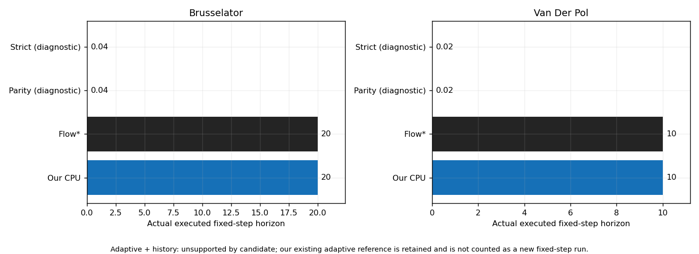
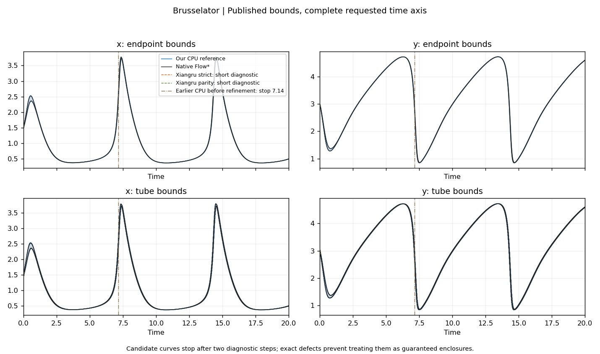
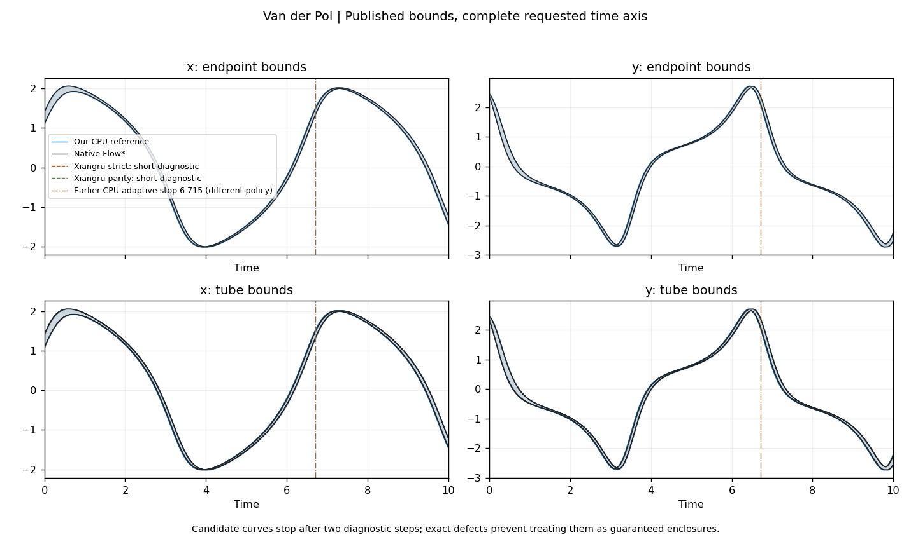
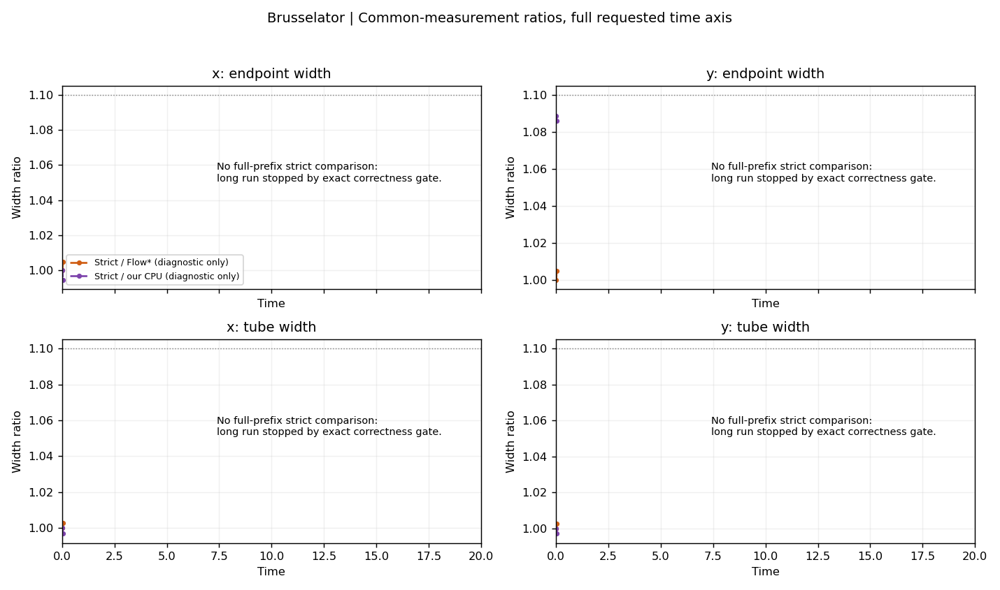
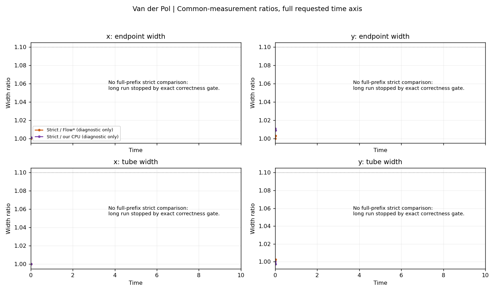

当前选择是暂不采用 Xiangru 的可选 GPU 后端，决定为 `DO_NOT_ADOPT_YET__CONFIRMED_CORRECTNESS_DEFECT`。指定远端与 V100 均可用，阻碍是两处精确集合包含性失败。没有修改我们的数值 src、默认后端或旧工作树，也没有恢复从零 GPU 开发。

新目录为 `/srv/local/shengenli/xiangru_adoption_20260907T032448Z/xiangru_upstream`，远端分支 `2026_experiment` 在 2026-09-07 03:25:55 UTC 取得的完整 SHA 为 `1c16d4ef2cb91cc94b1c784f7383e1eba135d8d3`，实际 detached 运行。旧 Xiangru 的 `84184de6c2b3f1ff2da6755f732d91925037025d` 没有本轮新增的仓库内 GPU 引擎。源码、完整对照 SHA、许可、环境和实际导入位置见 [SOURCE_AND_ENVIRONMENT.md](SOURCE_AND_ENVIRONMENT.md)；旧副本盘点见 [OLD_CLONES_INVENTORY.md](OLD_CLONES_INVENTORY.md)。

| 系统 | 我们实际完成 | Flow* 实际完成 | 我们求解秒 | Flow* 求解秒 |
|---|---:|---:|---:|---:|
| Brusselator | 20（1000 步） | 20（1000 步） | 1990.778946 | 13.569828 |
| Van der Pol | 10（1000 步） | 10（1000 步） | 681.249270 | 1.488466 |

上述两组都是本轮连续固定步长请求。VDP 的 T1、T3、T6.32 从同一次运行读取；自适应 T10 仅列为我们已有的能力。候选当前仍不支持自适应与历史保存同时开启，因此未新做配对自适应跑法。

候选普通、严格模式的两步数值诊断均被算法接受，但不能据此称为保证范围：历史矩阵连乘在两种模式、两种设备上均遗漏精确分量 `-4503599627370497/38685626227668133590597632`。独立归一化反例是两个仿射 Taylor model `1.1*u_i + [-2^-52,2^-52]`，各 u_i∈[-1,1]；多项式常数项为零，余项对称且包含零，符合生产调用链的约束，返回的缩放表示没有包含原精确像集。后者不使用历史矩阵，所有数值均为有限正常量级。反例只证明相应局部包含关系失败，不声称这些操作数已出现在两条冻结长轨迹中。

密集与默认稀疏步进均调用同一历史传播函数；新 clone 的 CUDA profiler 确认矩阵与区间 kernel 确实在 GPU 执行。稀疏缩放使用默认 eager helper，B1/B8/B32 都低于编译胶合路径的 B64 门槛。这些检查排除了旧 editable 包和 CPU fallback 冒充新严格生产路径的可能。早期常数单点帮助函数诊断未强制上述零常数项约束，保留为辅助数据；最终归一化结论只采用满足生产约束的仿射反例。完整误差记账仍未闭合，局部测试数量和与其他工具的接近程度不能替代包含关系依据。[反例数据](../../artifacts/runs/xiangru_adoption_20260907T032448Z/known_witness_replay.json)、[独立缩放反例](../../artifacts/runs/xiangru_adoption_20260907T032448Z/preconditioning_centered_exact.json)、[不修补的理由](CONDITIONAL_PATCH.md)。

每条已接受时间小段分别保存终点 x/y 与整段 x/y 的上下界，整段范围包含步内轨迹移动。发布视角保存各工具实际返回范围；共同视角复用我们的 canonical exporter，并对已经组合完整左右映射的数学对象作精确 Fraction 区间单项式求值，最后向外转为 binary64。它不增加 cutoff、不额外收紧 endpoint、不把不同工具的内部变量强行认作同一变量。Flow* 只增加 const term 只读访问器；普通误差和历史误差按各对象原本的归属导出一次。候选自带 io.metrics 测 tmvPre，故另外保留真正组合后的导出，不混用两类对象。

固定步长以实际 binary64 h 的精确有理数累加对齐时间，四条路线的行按真实时间区间关联，没有插值。完整导出仍可能因各自内部表示和区间依赖不同而得到不同宽度；我们的 CPU 参考和 Flow* 都不是其他实现的数学真值机。比率分母不大于 1e-12 时保留绝对差而不计算倍率。本轮阈值未改。

| 系统 | 范围 | 我们 / Flow* 时间加权中位数 | P95 | 最大比率 | 最差时刻 |
|---|---|---:|---:|---:|---:|
| Brusselator | 终点 x | 0.995778 | 1.110088 | 1.356684 | 7.2 |
| Brusselator | 终点 y | 0.991124 | 1.006144 | 1.038455 | 13.46 |
| Brusselator | 整段 x | 1.005926 | 1.088762 | 1.188031 | 7.22 |
| Brusselator | 整段 y | 1.002041 | 1.137651 | 1.203184 | 7.64 |
| Van der Pol | 终点 x | 1.197575 | 1.267866 | 1.278145 | 2.85 |
| Van der Pol | 终点 y | 1.165368 | 1.251391 | 1.266182 | 3.49 |
| Van der Pol | 整段 x | 1.174051 | 1.227078 | 1.234767 | 2.85 |
| Van der Pol | 整段 y | 1.183551 | 1.231182 | 1.262273 | 3.49 |

这是我们 / Flow* 的完整共同前缀摘要。候选的全程四项宽度和严格 / 普通代价没有建立；表中的候选两步行统一标为 DIAGNOSTIC_ONLY。完整请求时域一直显示到 T20/T10，空白尾段保留。[逐步双视角表](../../artifacts/runs/xiangru_adoption_20260907T032448Z/widths_full_prefix.csv)、[时间加权全程摘要](../../artifacts/runs/xiangru_adoption_20260907T032448Z/width_summary.csv)、[指定及最差时刻表](../../artifacts/runs/xiangru_adoption_20260907T032448Z/width_at_checkpoints.csv)。

图中旧停止点仅作历史说明：Brusselator 是加入接受后收紧之前、容量 1000 的 CPU 版本停止于 T7.14；VDP 是更早 CPU 版本的自适应停止点 T6.714914669607182，步长策略不同。这些标线不是本轮固定步长失败，也不是旧 Xiangru 的匹配实验。其原始来源与摘要见 [历史标线记录](../../artifacts/runs/xiangru_adoption_20260907T032448Z/raw_minimal/historical_plot_markers.json)。

| 系统 | 时刻 | 范围 | 我们宽度 | Flow* 宽度 | 我们 / Flow* |
|---|---:|---|---:|---:|---:|
| Brusselator | 1 | 终点 x | 0.0341749449 | 0.0321503516 | 1.06297266 |
| Brusselator | 5 | 终点 x | 0.00149503463 | 0.00148004998 | 1.01012442 |
| Brusselator | 10 | 终点 x | 0.00311871365 | 0.00333405061 | 0.935412809 |
| Brusselator | 15 | 终点 x | 0.0589439012 | 0.0578874474 | 1.01825014 |
| Brusselator | 20 | 终点 x | 0.00340577482 | 0.00351605569 | 0.96863506 |
| Brusselator | 1 | 终点 y | 0.0483384031 | 0.052357038 | 0.923245566 |
| Brusselator | 5 | 终点 y | 0.0102782589 | 0.0103194613 | 0.99600731 |
| Brusselator | 10 | 终点 y | 0.0152562183 | 0.01537981 | 0.991964026 |
| Brusselator | 15 | 终点 y | 0.0167456425 | 0.0179426614 | 0.933286435 |
| Brusselator | 20 | 终点 y | 0.008336115 | 0.00866325235 | 0.962238506 |
| Brusselator | 1 | 整段 x | 0.0645652278 | 0.0620961131 | 1.03976279 |
| Brusselator | 5 | 整段 x | 0.00300545688 | 0.0029694967 | 1.01210985 |
| Brusselator | 10 | 整段 x | 0.00638594619 | 0.00640616531 | 0.996843804 |
| Brusselator | 15 | 整段 x | 0.10879315 | 0.106971011 | 1.01703395 |
| Brusselator | 20 | 整段 x | 0.00633912037 | 0.00644940125 | 0.982900602 |
| Brusselator | 1 | 整段 y | 0.0668321482 | 0.0626280244 | 1.06712848 |
| Brusselator | 5 | 整段 y | 0.0203975663 | 0.0203636358 | 1.00166623 |
| Brusselator | 10 | 整段 y | 0.0300748856 | 0.0300916721 | 0.999442157 |
| Brusselator | 15 | 整段 y | 0.0365203262 | 0.0325056301 | 1.12350771 |
| Brusselator | 20 | 整段 y | 0.0156688515 | 0.0159131173 | 0.984650031 |
| Van der Pol | 1 | 终点 x | 0.086791822 | 0.0795264327 | 1.09135817 |
| Van der Pol | 3 | 终点 x | 0.175660993 | 0.138548507 | 1.26786637 |
| Van der Pol | 6.32 | 终点 x | 0.18809351 | 0.153253776 | 1.22733361 |
| Van der Pol | 10 | 终点 x | 0.226637788 | 0.201251933 | 1.12613968 |
| Van der Pol | 1 | 终点 y | 0.113194216 | 0.111582705 | 1.01444229 |
| Van der Pol | 3 | 终点 y | 0.134751734 | 0.108888722 | 1.23751782 |
| Van der Pol | 6.32 | 终点 y | 0.148209233 | 0.122559396 | 1.20928495 |
| Van der Pol | 10 | 终点 y | 0.305686867 | 0.275949126 | 1.1077653 |
| Van der Pol | 1 | 整段 x | 0.0910571252 | 0.0837611763 | 1.08710418 |
| Van der Pol | 3 | 整段 x | 0.201132752 | 0.163964056 | 1.22668808 |
| Van der Pol | 6.32 | 整段 x | 0.213402513 | 0.17850552 | 1.19549531 |
| Van der Pol | 10 | 整段 x | 0.251043202 | 0.225472713 | 1.11340835 |
| Van der Pol | 1 | 整段 y | 0.127408821 | 0.119672783 | 1.06464326 |
| Van der Pol | 3 | 整段 y | 0.151645393 | 0.125720843 | 1.20620725 |
| Van der Pol | 6.32 | 整段 y | 0.165797844 | 0.140085077 | 1.18355108 |
| Van der Pol | 10 | 整段 y | 0.340960361 | 0.306685074 | 1.11176053 |

表内采用共同测量的未取整数据计算；此处仅展示有限位数。全程每项最大比率及发生时间在前表，原始 CSV 还包含两端偏移、中心偏移、不相交时间与超出工程阈值的持续时间。更窄不代表更正确。

| 系统 | 工具 | 完整进程秒（含导出） | 纯导出秒 | 峰值 CPU MiB |
|---|---|---:|---:|---:|
| Brusselator | 我们的 CPU 参考版 | 2029.61 | 34.171422 | 484.45 |
| Brusselator | 原生 Flow* | 23.89 | 10.303770 | 22.18 |
| Van der Pol | 我们的 CPU 参考版 | 697.03 | 13.374196 | 475.44 |
| Van der Pol | 原生 Flow* | 4.39 | 2.892356 | 14.57 |

主要 CPU 测量为单线程、CPU 2；相关测试在其他核运行，因此不声称整机独占。求解时间包含原求解器安全验证和接受后收紧，纯导出另列；完整进程时间含 Python/程序启动和导出。没有重复实测中位数或波动可报告，不能把单次结果称为预热稳定吞吐。新 segment CUDA 扩展首次构建 43.218453059 秒，tape 的编译混在有明确标记的短诊断冷启动中，没有作为单独编译计时捏造数值。

| 系统 | 路线 | B1 完整 warm / fresh | B8 完整 warm / fresh | B32 完整 warm / fresh |
|---|---|---|---|---|
| Brusselator | Xiangru 普通对齐版 | 未测 / 未测 | 未测 / 未测 | 未测 / 未测 |
| Brusselator | Xiangru 严格误差版 | 未测 / 未测 | 未测 / 未测 | 未测 / 未测 |
| Van der Pol | Xiangru 普通对齐版 | 未测 / 未测 | 未测 / 未测 | 未测 / 未测 |
| Van der Pol | Xiangru 严格误差版 | 未测 / 未测 | 未测 / 未测 | 未测 / 未测 |

性能阶段按正确性前提停止。我们的 CPU 与 Flow* 的 B8/B32 配对串行批次、20 步五次预筛和严格 B32 完整三次重复均未开启；没有用 B×B1 估计跨过速度门槛。未发生 B32 OOM，未降为 B16。主批量 GPU 显存峰值和端到端适配器开销也没有测量，因为候选未接入。[全部时间行与缺失原因](../../artifacts/runs/xiangru_adoption_20260907T032448Z/timings_raw.csv)、[计时摘要](../../artifacts/runs/xiangru_adoption_20260907T032448Z/timing_summary.csv)。

两步重复盒子 B2/B8 与 B1 的 40 次逐任务比较均逐位一致；预注册不同盒子的前两个任务另有 8 次逐位一致比较。局部失败任务的已发布状态冻结，仍活动任务与独立运行一致；内部全局历史队列会继续为失败 lane 写入废弃槽位，所以没有宣称可恢复暂停状态。NaN 输入没有发布成功结果，状态维度错配被拒绝；没有发现公开的 checkpoint/resume 承诺，未新增该功能。既有小容量队列测试通过，但候选容量 100/1000 的完整生产长前缀和长期隔离仍因正确性门槛而未执行。[批量表](../../artifacts/runs/xiangru_adoption_20260907T032448Z/batch_equivalence.csv)、[状态原始记录](../../artifacts/runs/xiangru_adoption_20260907T032448Z/candidate_state_checks_with_distinct.json)、[缺失清单](../../artifacts/runs/xiangru_adoption_20260907T032448Z/missing_items.md)。

[最终路线图](ADOPTION_DECISION.md)保留 CPU 独立检验与原生自适应能力，本轮只采用合同、导出、反例和复核工具。将来须先闭合历史矩阵与缩放两处误差，再按原门槛执行完整严格宽度和 B32 速度测试。当前没有授权、源码或 GPU 硬件缺失，也没有向 Xiangru/Huan 推送代码。

证据校验从原始完整对象和逐步记录重新计算时域、四项宽度、P95、最差时刻、mode、设备和计时。另有四项直接篡改测试：修改宽度、完成时域、mode 或运行时间，重新生成外层哈希后仍必须拒绝。哈希只提供可追溯性。[测试结果与复核范围](VALIDATION.md)。fresh clone 检查仅重新验证已提交证据，没有重跑长时间数值实验。
