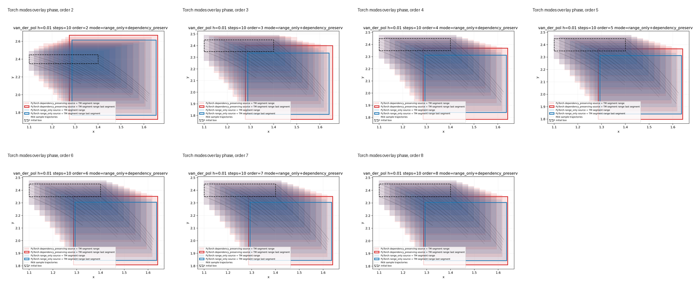
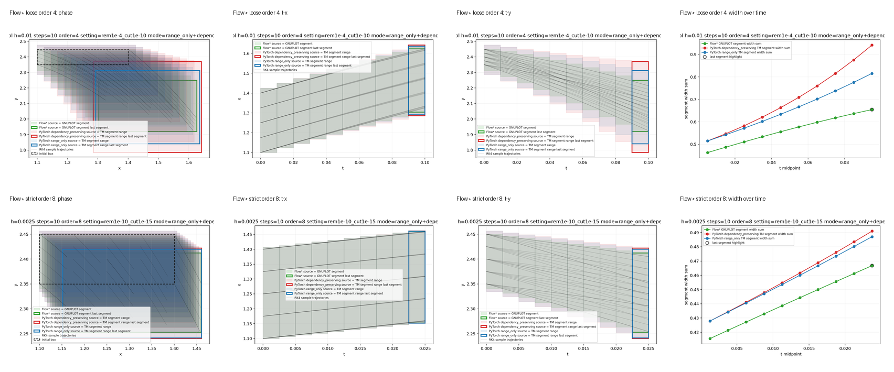
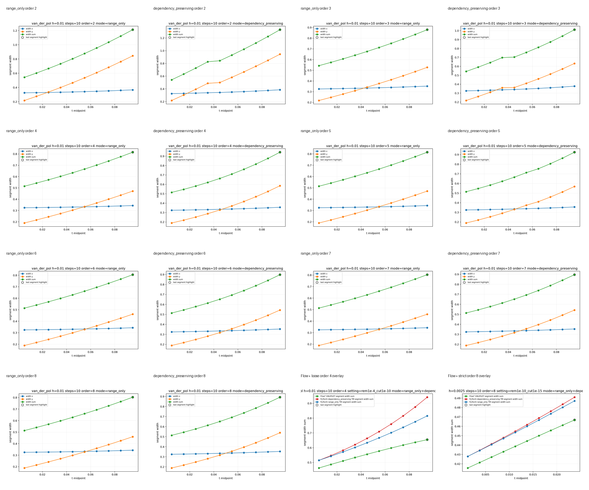
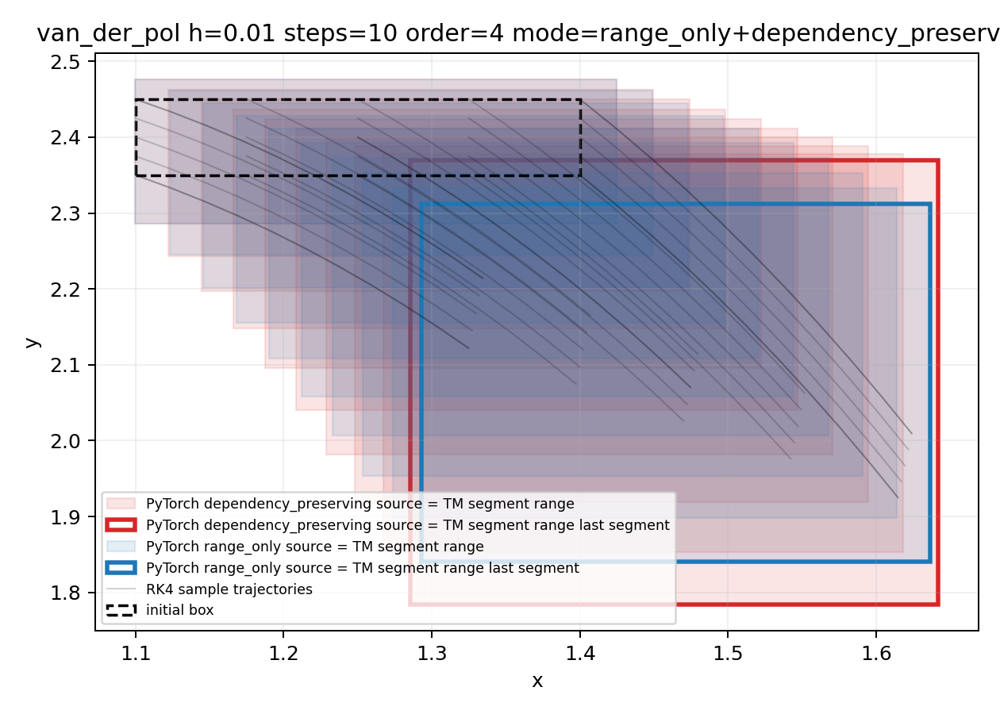
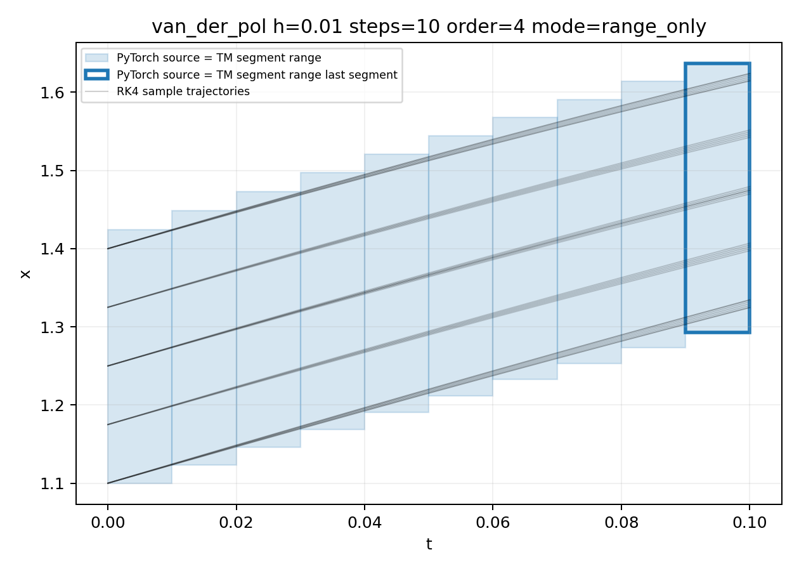
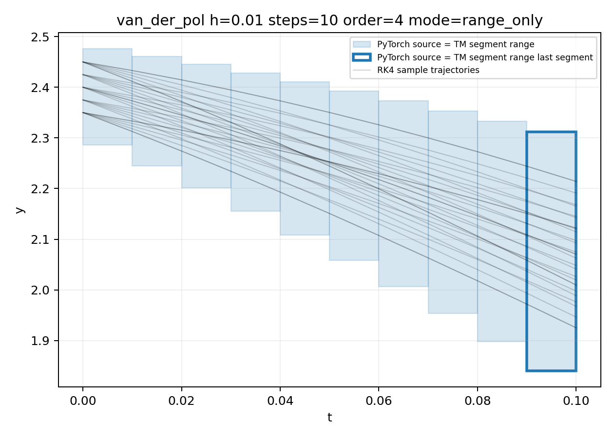
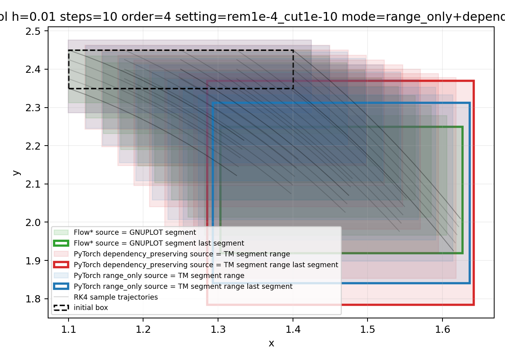
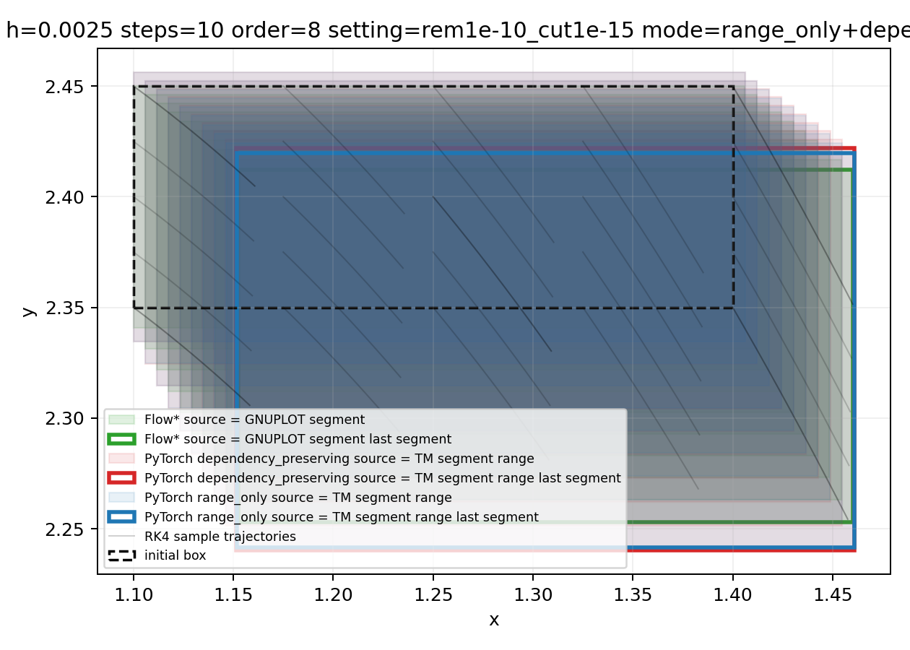

# Trajectory Visual Audit Report

This report is generated from the existing trajectory audit CSV and PNG artifacts. It is a visual QA report for fixed-step/fixed-order Van der Pol trajectories, not a new reachability algorithm.

## Contact Sheets

## Visual QA Summary

- PyTorch order 2..8 phase trend: the mode overlay phase plots follow the same Van der Pol direction across orders. The range_only endpoint width sum drops from 1.12149 at order 2 to 0.718028 at order 8; dependency_preserving drops from 1.10854 to 0.767345.
- range_only vs dependency_preserving overlay: the phase overlays share the same sampled trajectory trend. dependency_preserving keeps original-variable dependence and is usually wider in segment/tube views; range_only is narrower at higher orders but collapses dependency after each step.
- Flow* order 4 loose completed vs torch overlay: status=completed; Flow* last segment width sum is 0.654422. The range_only last-segment ratio torch/Flow* is 1.2463.
- Flow* order 8 strict completed vs torch overlay: status=completed; Flow* last segment width sum is 0.466777. The range_only last-segment ratio torch/Flow* is 1.04356.
- Flow* order 2 loose failed: status=failed; failure_reason=Flowpipe computation is terminated due to the large overestimation.
- t-x, t-y, phase, and width-over-time views are included in the individual figures and in the contact sheets above.
- Sampling uses corners, center, and a 5x5 grid with RK4 trajectories. Sampling is diagnostic only, not proof.

## Key Figures

## Scope Guard

This report is not CROWN, not auto_LiRPA, not a Jacobian-bound experiment, not sin/cos support, not hybrid automata, not a Flow* Python binding, not an NN controller workflow, and not a new algorithm.
